# Gameplay Loop Deep Research (May 2026)

> **⚠️ RECONCILIATION NOTE (2026-06-02):**
> **Major Pivot — Sci-Fi GPS RPG.** The roguelite gameplay loop documented below has been superseded by a persistent-world GPS-based loop inspired by Orna/Hero of Aethric. See `Orna_Research.md` for the new loop design. Key changes:
> - **Old**: Hub → ClassSelect → RunMap → Battle → RewardResolution (30-stage run)
> - **New**: WorldMap (GPS + joystick) → tap spawn → Battle (CT+Turn) → return to WorldMap → repeat (persistent)
> - Daily quests, persistent character leveling, and Tech Point class unlocks replace run-based progression.
>
> The original 16-game research and loop diagrams remain valuable as genre reference but no longer describe the active gameplay loop.

## Scope and method

This document delivers:

1. Deep gameplay-loop research for 12 popular successful text-based or simple-graphics RPGs.
2. One Mermaid gameplay-loop flowchart per researched game.
3. One Mermaid flowchart for the currently implemented gameplay loop in this app.
4. A second diagram layer for economy-only loops and combat-only loops.
5. Prioritized improvement points for the current app.

Selection direction used:

- Mostly similar games (browser/mobile text or low-fi turn-based).
- Mandatory includes: Agonia Lands, Knights of Pen and Paper, Kingdom of Loathing, Slay the Spire.
- Deep format per game (loop steps, retention drivers, practical takeaways, and sources).

Confidence legend:

- High: Loop and success signals are widely documented by official pages and major references.
- Medium: Loop is clear, but quantitative success signals are less consistently published.

---

## Comparative matrix

| Game | Platform profile | Loop archetype | Success signal | Primary retention lever | Confidence |
| --- | --- | --- | --- | --- | --- |
| Agonia Lands | Browser text MMORPG | Sandbox grind and social economy | Long-running indie browser RPG with persistent community | Open-ended role identity and social rivalry | Medium |
| Knights of Pen and Paper | Mobile and PC and console | Session-based turn combat plus meta upgrades | Multi-platform releases and sequelized franchise | Meta-layer fantasy of playing tabletop party and DM | High |
| Kingdom of Loathing | Browser RPG | Daily energy and quest and ascension | Long-lived cult browser RPG and stable player culture | Adventure-point pacing plus New Game Plus ascension | High |
| Slay the Spire | PC and console and mobile | Run-based deckbuilder roguelike | Multi-million sales and genre-defining impact | High variance runs plus ascension difficulty ladder | High |
| Soda Dungeon | Mobile and PC | Idle auto-battle dungeon push | Multi-platform release and long-tail audience | Low-friction repeat runs plus town progression | High |
| Soda Dungeon 2 | Mobile and PC and console | Idle run with deeper meta systems | Sequel longevity and broad platform spread | Automation plus compounding town and class unlocks | High |
| Shattered Pixel Dungeon | Mobile and PC | Turn-based roguelike permadeath loop | Sustained active development and strong user ratings | Procedural mastery and challenge mode depth | High |
| Orna | Mobile GPS RPG | Real-world exploration plus turn battles | Large mobile install base and active live ops | Location-based discovery plus class and kingdom progression | High |
| SimpleMMO | Mobile and web text MMO | Short interaction loops with social systems | Long-running lightweight MMO with active guild ecosystem | Micro-session play plus social and guild stickiness | Medium |
| A Dark Room | Browser and mobile text game | Multi-phase survival and exploration narrative loop | Influential minimalist indie title with cross-platform acclaim | Mystery and phase shifts that reframe player goals | High |
| Bit Heroes | Mobile and web | Turn-based-lite grind and collection loop | Long-running live-service pixel RPG across platforms | Familiar collection and guild raid participation | Medium |
| Darkest Dungeon series | PC and console tactical RPG | Expedition stress management and permadeath attrition | Multi-million sales and strong critical reception across both titles | Stress/affliction management plus persistent meta upgrades | High |
| Peglin | PC and mobile and Switch | Pachinko roguelike with orb deck-building | 400k early access sales, 1.0 release 2024, v2.0 in 2026 | Orb+relic synergy discovery and 20-level Cruciball ascension | High |
| Dicey Dungeons | PC and mobile and Switch and Xbox | Dice-allocation deck-building roguelike | 87% OpenCritic recommend, mobile scored 98 Metacritic | Equipment-as-deck with dice slot constraints, 6 distinct characters | High |
| Wildfrost | PC and Switch | Card-based tactical roguelike with countdown timers | Strong critical reception for innovative timeline combat | Visible countdown timers, charm attachment system, daily voyage | Medium |
| Luck be a Landlord | PC and mobile | Slot-machine roguelike with symbol synergies | Cult hit, spawned "Luck be a Landlord-like" subgenre | Tag-adjacency synergy discovery, rent-pressure escalation | Medium |

---

## 1) Agonia Lands

### Why this loop works

- The game anchors itself in role freedom: fighter, trader, crafter, mercenary, social climber.
- It blends economy and conflict so progression is not only combat power.
- Browser-first friction is low, so frequent check-ins become habit-forming.

### Core gameplay loop

1. Create character and tribe identity.
2. Choose a progression focus (combat, trade, crafting, or hybrid).
3. Explore zones and interact with events, players, and resources.
4. Resolve combat or economic actions.
5. Gain currency, items, stat growth, and social standing.
6. Reinvest into gear, profession capability, and alliances.
7. Re-enter higher-risk activities or political/social competition.

### Retention design pattern

- Long horizon identity building: reputation and social position can matter as much as stats.

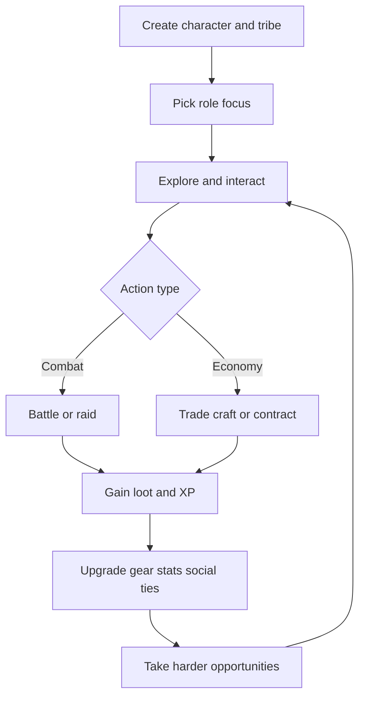

### Sources

- Official: https://www.agonialands.com/
- Guide page: https://www.agonialands.com/hydre/guide/tenthings.php

---

## 2) Knights of Pen and Paper

### Why this loop works

- The tabletop framing makes each loop feel like a playful campaign session.
- Turn-based combat is simple enough for mobile sessions but layered enough for build decisions.
- Progression cadence is clear: fight, loot, level, optimize, repeat.

### Core gameplay loop

1. Assemble party and class composition at the table.
2. Pick quest or encounter route.
3. Enter turn-based battle.
4. Spend resources and execute tactical actions.
5. Earn gold, XP, and item rewards.
6. Upgrade characters and equipment.
7. Push campaign progression into stronger encounters.

### Retention design pattern

- Sessionized progression with nostalgic framing keeps short loops emotionally sticky.

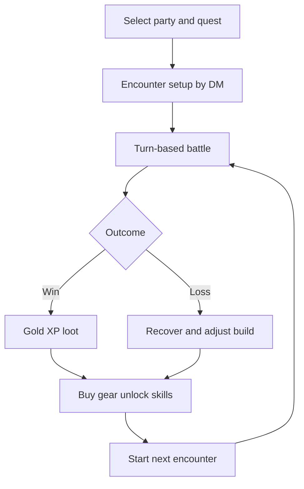

### Sources

- Game page: https://www.paradoxinteractive.com/games/knights-of-pen-and-paper
- Overview and reception: https://en.wikipedia.org/wiki/Knights_of_Pen_%26_Paper
- Review context: https://www.eurogamer.net/knights-of-pen-and-paper-review

---

## 3) Kingdom of Loathing

### Why this loop works

- Adventure-point pacing caps runaway play and encourages daily return.
- Humor-rich text encounters make repetition more content-like than grind-like.
- Ascension creates intentional loop resets with long-term mastery goals.

### Core gameplay loop

1. Log in and receive daily adventure budget.
2. Choose zone or quest objective.
3. Resolve turn-based text encounters and non-combat events.
4. Collect meat, items, and stat gains.
5. Optimize inventory, crafting, and skill usage.
6. Complete questline milestones and unlock progression gates.
7. Ascend (New Game Plus) for long-term account progression.

### Retention design pattern

- Energy-gated loop plus prestige reset creates sustainable long-term habit without content exhaustion.

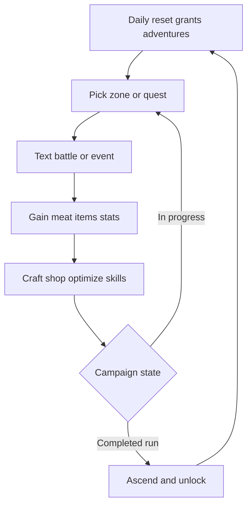

### Sources

- Official: https://www.kingdomofloathing.com/
- Overview: https://en.wikipedia.org/wiki/Kingdom_of_Loathing

---

## 4) Slay the Spire

### Why this loop works

- Every run feels distinct due to pathing and card/relic variance.
- Failure teaches deck construction and route risk management.
- Ascension ladder extends mastery without requiring new content each day.

### Core gameplay loop

1. Choose character and starting deck.
2. Choose a branching path node.
3. Resolve battle or event or merchant interaction.
4. Gain card and relic and potion rewards.
5. Tune deck and remove weak cards.
6. Beat elite and act bosses or die.
7. Unlock progression and run again.

### Retention design pattern

- High replayability through combinatorial build space and difficulty scaling.

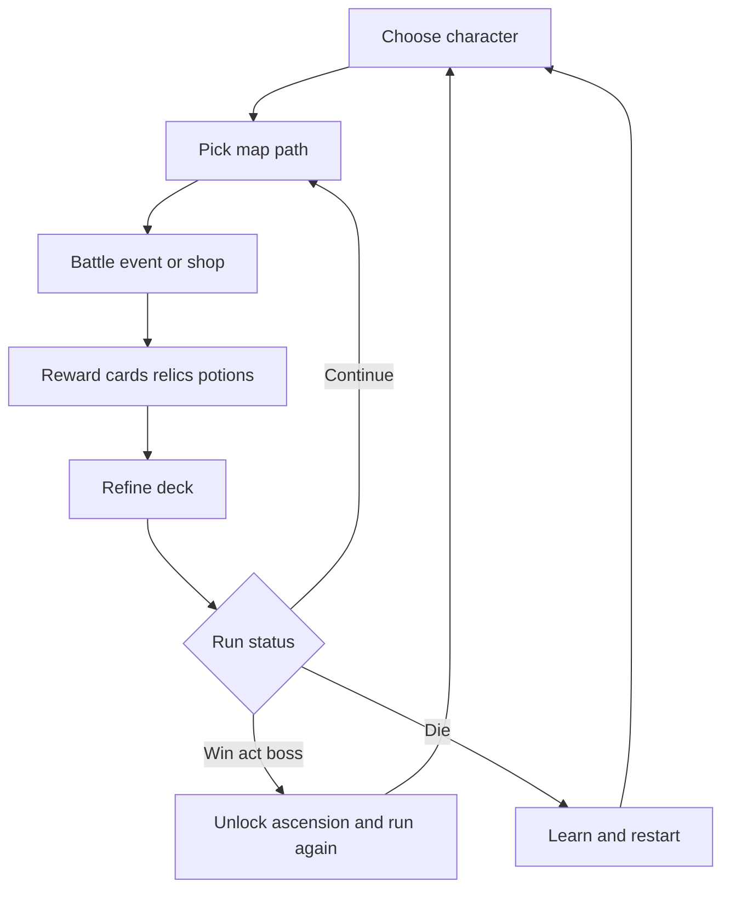

### Sources

- Official studio: https://www.megacrit.com/
- Overview: https://en.wikipedia.org/wiki/Slay_the_Spire

---

## 5) Soda Dungeon

### Why this loop works

- Almost zero friction run start and run repeat.
- Auto-battle allows idle-friendly progression.
- Town and roster upgrades produce visible compounding growth.

### Core gameplay loop

1. Recruit party members in tavern.
2. Equip available gear and consumables.
3. Launch dungeon run (auto or semi-auto).
4. Earn loot and currency from cleared floors.
5. Return or fail and retain partial progression.
6. Spend resources on upgrades and better loadouts.
7. Attempt deeper run.

### Retention design pattern

- Compounding meta loop (economy and party quality) creates constant short-cycle dopamine.

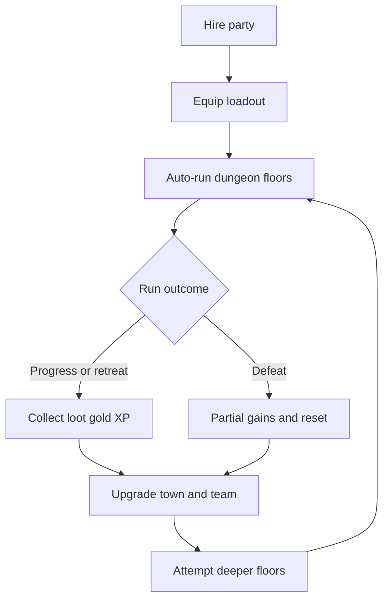

### Sources

- Official: https://www.sodadungeon.com/
- Studio/publisher references: https://armorgamesstudios.com/

---

## 6) Soda Dungeon 2

### Why this loop works

- Keeps the quick idle loop but adds stronger meta systems and team expression.
- Better automation lowers mechanical fatigue.
- Sequel refinement preserves familiarity for returning players.

### Core gameplay loop

1. Build initial roster and class composition.
2. Configure gear and skill usage preferences.
3. Run auto-combat dungeon pushes.
4. Collect resources, class unlocks, and crafting materials.
5. Improve town facilities and production.
6. Optimize automation and strategy scripts.
7. Re-enter deeper and harder layers.

### Retention design pattern

- Automation progression becomes a meta-game itself, turning optimization into long-term mastery.

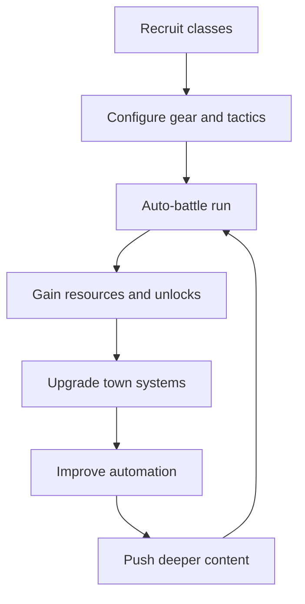

### Sources

- Official: https://www.sodadungeon.com/
- Platform listings (Steam/App stores): Soda Dungeon 2 product pages

---

## 7) Shattered Pixel Dungeon

### Why this loop works

- Dense tactical decisions in very small turn windows.
- Permadeath creates real stakes.
- Continuous updates keep strategy meta fresh.

### Core gameplay loop

1. Select hero class and challenge setup.
2. Explore procedurally generated floor.
3. Resolve turn-based grid combat and traps.
4. Gather and identify items and gear.
5. Manage scarce resources (health, utility, positioning).
6. Defeat floor boss and descend or die.
7. Start a new run with learned mastery.

### Retention design pattern

- Skill-based replayability where player knowledge is the strongest permanent progression.

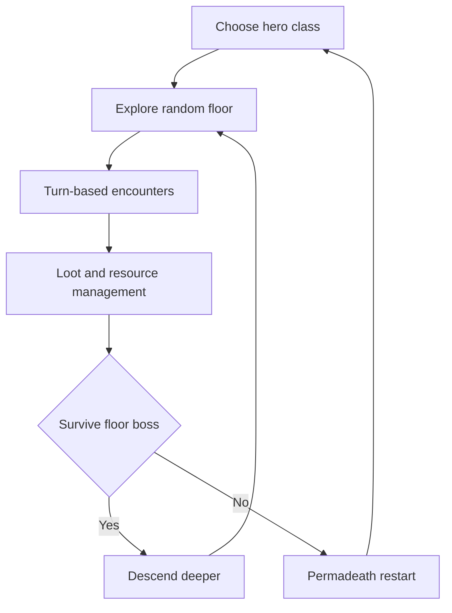

### Sources

- Official: https://shatteredpixel.com/shatteredpd/
- GitHub (active development): https://github.com/00-Evan/shattered-pixel-dungeon

---

## 8) Orna: The GPS RPG

### Why this loop works

- It ties RPG progression to real-world movement.
- Session variety (world map, gauntlets, raids, PvP) reduces monotony.
- Class specialization and kingdom systems provide social midgame and endgame goals.

### Core gameplay loop

1. Move physically to discover map content.
2. Trigger monster or dungeon encounters.
3. Execute turn-based combat.
4. Gain XP, currency, materials, and gear.
5. Upgrade class path, skills, and equipment.
6. Participate in kingdom and raid content.
7. Return to exploration for stronger encounters.

### Retention design pattern

- Location-driven content discovery plus social competition sustains long-term engagement.

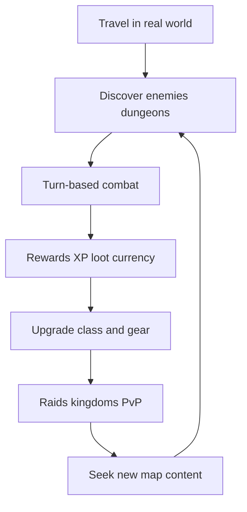

### Sources

- Official: https://playorna.com/
- Company and game listings: https://northernforge.com/

---

## 9) SimpleMMO

### Why this loop works

- Extremely short action loops make it compatible with micro-sessions.
- Text-forward design keeps cognitive load low.
- Guild and social activity adds persistent motivation beyond solo grind.

### Core gameplay loop

1. Perform quick world travel steps.
2. Trigger random event, battle, or reward node.
3. Resolve interaction and collect gains.
4. Improve gear, professions, and stats.
5. Complete quests and community tasks.
6. Join guild activities and events.
7. Re-enter step loop for incremental growth.

### Retention design pattern

- Very low time-to-reward creates repeated daily engagement and low churn for busy users.

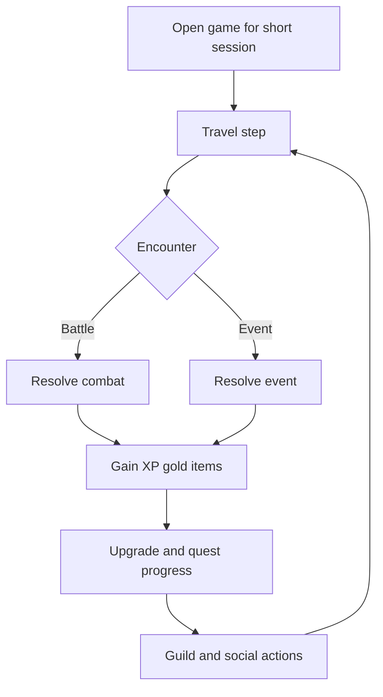

### Sources

- Official: https://www.simplemmo.com/
- Community documentation: https://simplemmo.fandom.com/wiki/SimpleMMO_Wiki

---

## 10) A Dark Room

### Why this loop works

- The game repeatedly reframes goals while preserving core resource tension.
- Minimal text UI amplifies mystery and player imagination.
- Progression transforms from idle survival to exploration and narrative revelation.

### Core gameplay loop

1. Start with a minimal survival interaction loop.
2. Gather resources and expand settlement actions.
3. Unlock expeditions and map exploration.
4. Enter risky encounters for rare materials.
5. Return and reinvest into infrastructure.
6. Discover new system layer and objective.
7. Push into late-game narrative climax.

### Retention design pattern

- Structural surprise: each unlocked layer renews curiosity and resets player motivation.

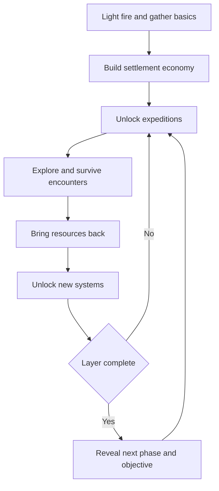

### Sources

- Official web version: https://adarkroom.doublespeakgames.com/
- Overview: https://en.wikipedia.org/wiki/A_Dark_Room

---

## 11) Bit Heroes

### Why this loop works

- Pixel style plus broad platform support keeps barrier to entry low.
- Familiar collection and gear chase provide continuous goals.
- Guild raids and PvP extend endgame stickiness.

### Core gameplay loop

1. Select objective zone and party setup.
2. Run turn-based-lite battles.
3. Collect gear, crafting items, and familiars.
4. Upgrade build and team composition.
5. Progress dungeon tiers and challenge content.
6. Engage in guild raids and PvP cycles.
7. Repeat with stronger targets and seasonal updates.

### Retention design pattern

- Collection loop layered onto progression loop increases reasons to keep running content.

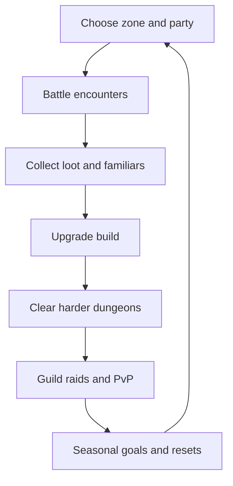

### Sources

- Official: https://www.bitheroes.com/
- Overview: https://en.wikipedia.org/wiki/Bit_Heroes

---

## 12) Darkest Dungeon series

### Why this loop works

- The series fuses tactical turn-based combat with psychological pressure management.
- Resource economics and hero attrition make every expedition decision meaningful.
- Repetition stays engaging because stress and relationship states reshape future runs.

### Darkest Dungeon (2016) core gameplay loop

1. Recruit and roster heroes in the Hamlet.
2. Upgrade town services, gear, and hero readiness.
3. Provision a four-hero expedition.
4. Delve dungeons, fight encounters, and manage stress.
5. Extract with loot or lose heroes to permadeath.
6. Spend rewards on treatment, upgrades, and new recruits.
7. Re-enter harder expeditions and boss objectives.

### Darkest Dungeon II (2023) core gameplay loop

1. Assemble party and route through stagecoach map choices.
2. Resolve road encounters and node events.
3. Fight turn-based battles with rank positioning.
4. Manage stress, meltdowns, and inter-hero relationships.
5. Recover and tune party at inns.
6. Push toward the mountain confession objective.
7. Convert run progression into profile/meta unlocks.
8. Start next run with stronger strategic options.

### Retention design pattern

- Layered tension loop: combat risk, stress risk, and long-horizon roster/meta progression.
- Failure remains productive because losses produce future strategic adaptation.

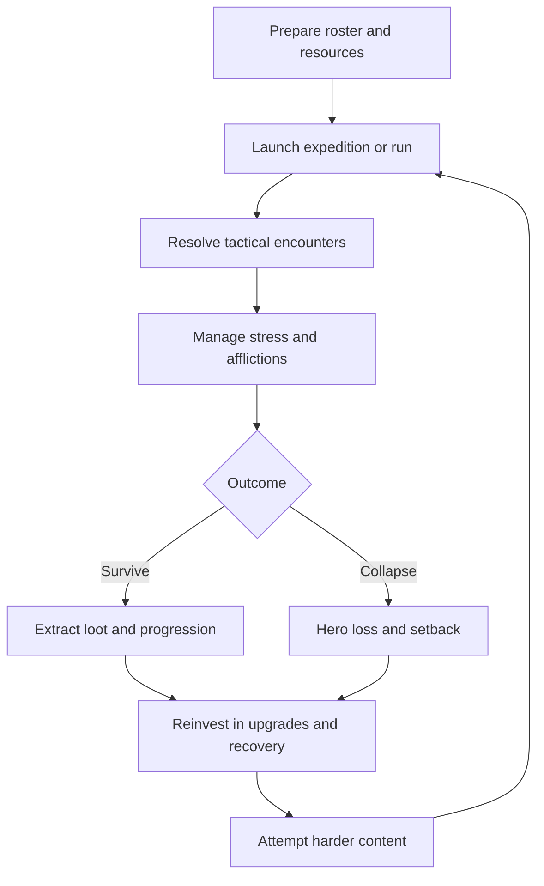

### Sources

- Darkest Dungeon overview: https://en.wikipedia.org/wiki/Darkest_Dungeon
- Darkest Dungeon II overview: https://en.wikipedia.org/wiki/Darkest_Dungeon_II
- Darkest Dungeon store page: https://store.steampowered.com/app/262060/
- Darkest Dungeon II store page: https://store.steampowered.com/app/1940340/

---

## 13) Peglin

### Why this loop works

- Pachinko-style orb drops replace traditional attack commands, making every action feel like a mini-game rather than a menu selection.
- Orb deck-building plus relic collection creates layered combinatorial discovery — the same orb behaves differently depending on which relics are active.
- Cruciball (ascension) system provides 20 escalating difficulty levels, each adding a negative modifier, ensuring expert players always have a harder challenge.
- The map is a simple branching path (similar to Slay the Spire), keeping navigation trivial while focusing cognitive load on build decisions.

### Core gameplay loop

1. Select goblin class (Peglin, Balladin, Roundrel, Spinventor).
2. Navigate a branching map with fight, loot, event, and shop nodes.
3. Enter pachinko battle: aim and fire an orb; it bounces through pegs, dealing damage per peg hit.
4. Collect gold from popped pegs; spend at shops to upgrade or remove orbs.
5. Earn new orbs (deck) and relics (permanent passives) as rewards.
6. Face a boss at the end of each act; defeat progresses to the next act.
7. Upon winning or dying, unlock new Cruciball difficulty levels and return.

### Retention design pattern

- Pachinko physics inject skill expression into a genre normally dominated by pure math. Every shot feels personal.
- Relic synergies create "build lottery" excitement: finding the right relic transforms an average orb deck into a powerhouse.
- Cruciball provides long-horizon mastery without requiring new content per level.

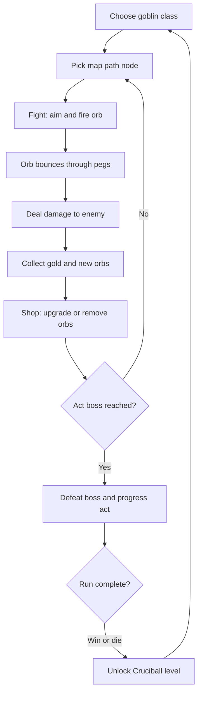

### Sources

- Official: https://peglin.com/
- Wikipedia: https://en.wikipedia.org/wiki/Peglin
- PC Gamer overview: https://www.pcgamer.com/be-a-little-pachinko-playing-goblin-in-peglin/

---

## 14) Dicey Dungeons

### Why this loop works

- Dice-as-input turns randomness from a frustration source into a puzzle. Each turn, the player allocates dice rolls to equipment slots — a bad roll is a constraint to solve, not a punishment.
- Six distinct characters each have entirely different equipment sets and rules, making character selection a meaningful strategic choice rather than cosmetic.
- Episodes introduce rule variants (e.g., "you start with 1 HP", "enemies have double health") that remix the base game without new content authoring.

### Core gameplay loop

1. Choose character (Warrior, Thief, Robot, Inventor, Witch, Jester) and episode ruleset.
2. Navigate dungeon floors with fight, treasure, shop, and upgrade nodes.
3. Enter turn-based combat: roll dice, allocate to equipment slots based on slot requirements.
4. Equipment produces effects: damage, shields, healing, status, dice manipulation.
5. Earn gold and new equipment from victories; spend at shops and upgrade stations.
6. Level up to gain more dice per turn and higher max HP.
7. Defeat floor boss to advance; defeat final boss to complete the run.

### Retention design pattern

- Equipment-as-deck: acquiring new equipment mid-run changes which dice values are "good", creating constant re-evaluation.
- Character diversity: switching characters feels like playing a different game, multiplying replayability.
- Episode system: rule variants are cheap to author but dramatically change run feel — a model for low-cost replay content.

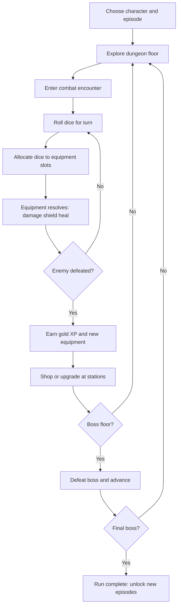

### Sources

- Official: http://diceydungeons.com/
- Wikipedia: https://en.wikipedia.org/wiki/Dicey_Dungeons
- Ars Technica review: https://arstechnica.com/gaming/2019/08/dicey-dungeons-review-well-there-goes-another-100-hours-of-my-life/

---

## 15) Wildfrost

### Why this loop works

- Countdown timers replace traditional turn order — every unit (ally and enemy) has a visible countdown ticking toward zero, creating perfect information and tense anticipation.
- Charm system lets players attach modifiers to cards (e.g., "+2 attack", "apply snow on hit"), creating layered customization without deck bloat.
- Companions persist through the run and can be positioned, creating positional strategy within a simple card battle framework.
- The daily voyage provides a fixed-seed leaderboard challenge, adding competitive replay without real-time multiplayer.

### Core gameplay loop

1. Choose a leader and starting companion deck.
2. Navigate a branching map with battle, treasure, and shop nodes.
3. Enter battle: play companion and item cards; each unit has a countdown timer.
4. When a countdown reaches zero, the unit acts (attacks, heals, applies status).
5. Apply charms to cards to permanently modify them for the run.
6. Earn new companions and charms as rewards.
7. Defeat area boss to progress; defeat final boss to win the run.

### Retention design pattern

- Countdown timers create a visible, shared timeline — exactly analogous to this project's CT system. Proof that visible turn-order mechanics are highly engaging.
- Charm attachment creates "item-on-card" customization, a lighter alternative to full deck-building that fits mobile constraints.
- Daily voyage with fixed seed creates low-cost competitive replay.

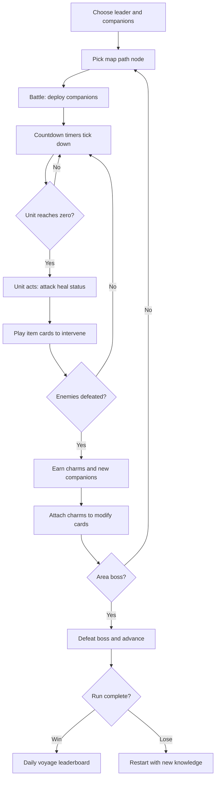

### Sources

- Official: https://wildfrostgame.com/
- Wikipedia: https://en.wikipedia.org/wiki/Wildfrost
- Rock Paper Shotgun: https://www.rockpapershotgun.com/wildfrost-review

---

## 16) Luck be a Landlord

### Why this loop works

- Symbol-based synergy discovery: adding a "cat" symbol to the reels does nothing alone, but with "milk" it produces massive value. The loop of discovering symbol combinations creates constant "aha" moments.
- Extremely low input complexity: the player simply picks one of three symbols each round. The depth comes entirely from combinatorial planning.
- Rent payments create escalating tension: every few spins, rent is due. If you can't pay, you lose. This is a pure "push your luck" mechanic that drives every decision.

### Core gameplay loop

1. Start with a basic set of reel symbols (e.g., coin, cherry).
2. Spin the reels; symbols interact and produce resources (coins, damage, removal).
3. After each spin, choose one of three new symbols to add to the reel.
4. Symbols have tags — placing matching tags adjacent creates synergy bonuses (×2, ×3, etc.).
5. Every N spins, rent is due; pay rent to survive, or lose the run.
6. Between runs, unlock new symbols and starting decks via meta-progression.

### Retention design pattern

- Symbol adjacency and tag matching create a spatial puzzle layered on top of deck-building — this is the direct inspiration for the Synergy Tag system proposed in Phase 4.
- The rent mechanic creates a hard timer: you must scale faster than costs escalate. This is analogous to the Anomaly Corruption gauge.
- Meta-progression unlocks expand the symbol pool, ensuring later runs have more combinatorial depth.

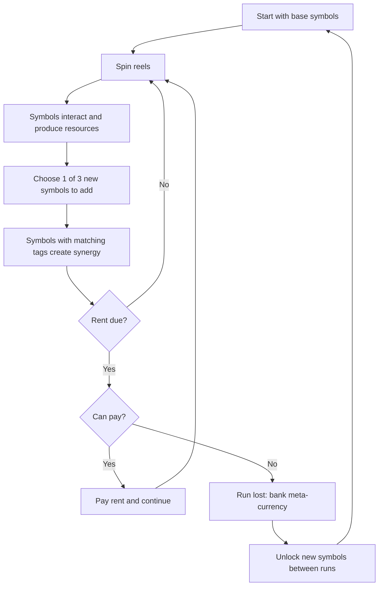

### Sources

- Official: https://trampolinetales.com/
- Wikipedia: https://en.wikipedia.org/wiki/Luck_be_a_Landlord
- PC Gamer: https://www.pcgamer.com/luck-be-a-landlord-review/

---

## Cross-game loop patterns relevant to this project

Across the researched set, the most repeatable high-performance loop patterns are:

1. Fast re-entry loop: run restart or next objective in 1-3 taps.
2. Strong risk/reward branch: safer banking path vs greed path.
3. Meta progression outside combat: town, class unlocks, economy, social status.
4. Controlled session pacing: daily energy, short runs, or capped complexity per session.
5. Build expression: meaningful choices in class/deck/loadout that alter strategy, not just numbers.
6. **Tag-based synergy discovery** (Peglin, Luck be a Landlord): items/skills carry elemental or archetype tags; collecting 3+ of the same tag unlocks a power spike. Turns every acquisition into a potential combo piece.
7. **Visible timeline tension** (Wildfrost, Into the Breach): showing exactly when each unit will act transforms turn order from hidden math into a readable puzzle. Directly validates this project's CT forecast system.
8. **Slot-based equipment with constraints** (Dicey Dungeons): equipment has dice slots with value requirements — the puzzle is fitting random input into constrained slots. Demonstrates that input randomness + player allocation = satisfying tactical depth.
9. **Escalating difficulty through mid-run choices** (Augment System): Instead of a pre-run difficulty toggle, augments let players self-select their risk/reward at fixed stage intervals — Neutral for safety, Positive for power, Sacrificial for high-risk scaling. Tier progression (Bronze→Silver→Gold→Prismatic) unlocks more powerful augments as the player accumulates total picks across all runs. This creates a dual progression: per-run identity curve + account-level tier climb.
10. **Mid-run build expansion** (all four new games): acquiring new orbs/cards/charms/symbols DURING a run creates a compounding identity curve — the player at stage 10 feels fundamentally different from the player at stage 1.

---

## Current app gameplay loop (implemented)

This section reflects currently implemented flow in code (not aspirational docs).

### Evidence anchors in code

- Navigation and route graph: `src/navigation/AppNavigator.tsx`
- Hub run entry and resume: `src/screens/Hub/HubScreen.tsx`
- Prologue to class flow: `src/screens/OnboardingNarrative/OnboardingNarrativeScreen.tsx`
- Class start flow: `src/screens/ClassSelect/ClassSelectScreen.tsx`
- Risk contract selection (pre-run modifiers): `src/screens/ClassSelect/ClassSelectScreen.tsx`
- Branching run map with room selection: `src/screens/RunMap/RunMapScreen.tsx`, `src/domain/run/map.ts`
- Combat execution and submit transition: `src/screens/Battle/BattleScreen.tsx`
- Reward, vault, and run settlement: `src/screens/RewardResolution/RewardResolutionScreen.tsx`
- Authoritative run state machine: `src/stores/runStore.ts`
- Contract enforcement pipeline: `src/features/run/orchestrator.ts`, `src/stores/combatStore.ts`
- Server-side contract validation: `firebase/functions/src/startRun.ts`, `firebase/functions/src/endRun.ts`

### Current loop narrative

1. App opens and passes through auth gate.
2. Player lands in Hub.
3. If no active run: Start New Run -> Onboarding Narrative -> Class Select.
4. Class Select: player picks a class and optionally selects up to 2 risk contracts.
5. startRun persists class + contracts; navigates to Run Map.
6. Run Map presents branching one-way room graph; player must choose a reachable room.
7. Enter Battle with the selected room's encounter (normal, elite, event, treasure, rest, merchant, anomaly, or boss).
8. Battle executes CT-based combat with turn forecast, intent icons, and contract-applied modifiers.
9. Stage outcome is submitted to run store/backend.
10. Reward Resolution shows banked and vaulted rewards, narrative milestone, and contract status.
11. If checkpoint decision is active (stages 10, 20, 30), player chooses Vault Now or Press On.
12. Press On redirects to Run Map for next room selection; Vault Now returns to Hub.
13. Player can voluntarily end run from Reward Resolution, Battle, or Hub (unless blocked by No Retreat Oath contract).
14. Progression delta applies, then Play Again returns to Hub.

### Current loop flowchart

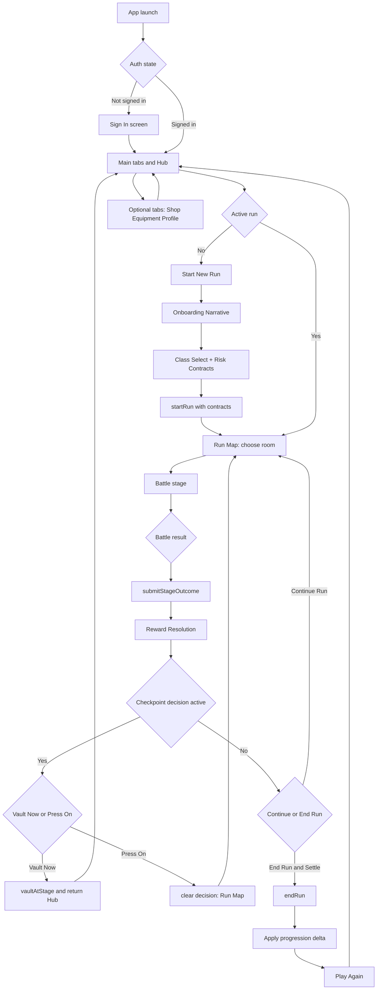

	D --> V[Optional tabs: Shop Equipment Profile]
	V --> D
```

### Current app economy-only loop

```mermaid
flowchart TD
	A[Start run] --> B[Clear stage]
	B --> C[Split rewards into banked and vaulted]
	C --> D{Checkpoint decision?}
	D -->|Vault Now| E[Bank vaulted rewards and reset streak]
	D -->|Press On| F[Increase vault streak risk multiplier]
	E --> G[Continue run or end run]
	F --> G
	G --> H{How run ended?}
	H -->|Voluntary settle (fled or won)| I[Bank vault into banked rewards]
	H -->|Defeat or loss| J[Forfeit current vaulted rewards]
	I --> K[Settle progression delta]
	J --> K
	K --> L[Reinvest in equipment and upgrades]
	L --> A
```

### Current app combat-only loop

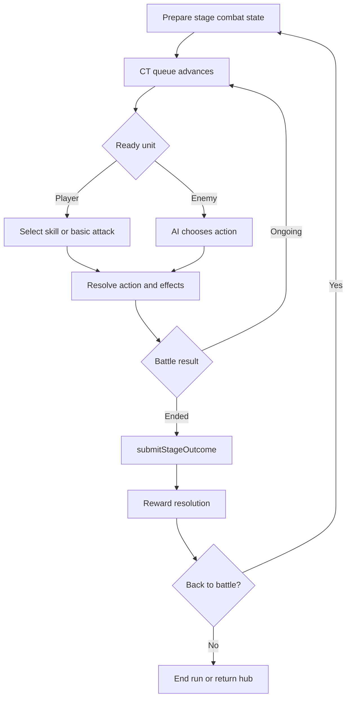

### Current loop strengths

- Clear run-state lifecycle (`startRun`, `submitStageOutcome`, `vaultAtStage`, `endRun`).
- Risk banking model already present and legible in Reward Resolution.
- Branching one-way Run Map with room type variety (battle, elite, event, treasure, rest, merchant, anomaly, boss).
- Risk contract system fully enforced end-to-end (3 contracts: no forfeit, no merchant routes, enemy barrier pulse).
- Turn forecast with intent icons provides tactical readability.
- Server-authoritative reward settlement and contract validation.

### Current loop friction points

- No mid-run build expansion: player identity at stage 1 is nearly identical to stage 25. Missing the "compounding identity curve" seen in all researched roguelikes.
- Room selection is type-only: the Run Map shows room categories but no per-room modifiers, reducing decision depth.
- No daily engagement hook: players have no reason to return on a specific cadence.
- Vault semantics (banked vs vaulted vs streak multiplier) remain cognitively heavy for new players.
- No self-directed difficulty scaling for expert players who want harder challenges with commensurate rewards.

---

## Economy-only diagram layer (all researched games)

### Agonia Lands economy-only loop

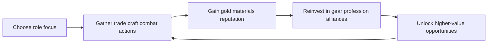

### Knights of Pen and Paper economy-only loop

```mermaid
flowchart LR
	A[Choose quest] --> B[Complete encounters]
	B --> C[Earn gold and loot]
	C --> D[Spend on gear and upgrades]
	D --> E[Raise party power]
	E --> A
```

### Kingdom of Loathing economy-only loop

```mermaid
flowchart LR
	A[Daily adventure budget] --> B[Spend adventures in zones]
	B --> C[Gain meat items stats]
	C --> D[Craft shop optimize]
	D --> E[Progress quest and ascend unlocks]
	E --> A
```

### Slay the Spire economy-only loop

```mermaid
flowchart LR
	A[Pick route nodes] --> B[Earn gold cards relics]
	B --> C[Shop remove or invest]
	C --> D[Improve deck economy]
	D --> E[Boss result and meta unlocks]
	E --> A
```

### Soda Dungeon economy-only loop

```mermaid
flowchart LR
	A[Hire party] --> B[Run auto dungeon]
	B --> C[Collect loot and gold]
	C --> D[Upgrade town and equipment]
	D --> E[Push deeper floors]
	E --> B
```

### Soda Dungeon 2 economy-only loop

```mermaid
flowchart LR
	A[Recruit classes] --> B[Automated dungeon runs]
	B --> C[Gain resources and materials]
	C --> D[Upgrade town and automation]
	D --> E[Access harder content]
	E --> B
```

### Shattered Pixel Dungeon economy-only loop

```mermaid
flowchart LR
	A[Start run inventory] --> B[Acquire loot and consumables]
	B --> C[Allocate scarce resources]
	C --> D[Descend for higher value loot]
	D --> E{Run survives}
	E -->|Yes| B
	E -->|No| F[Permadeath reset with player knowledge]
	F --> A
```

### Orna economy-only loop

```mermaid
flowchart LR
	A[Explore map] --> B[Complete encounters]
	B --> C[Gain gold orns gear]
	C --> D[Upgrade class and equipment]
	D --> E[Unlock stronger regions raids]
	E --> B
```

### SimpleMMO economy-only loop

```mermaid
flowchart LR
	A[Take micro action] --> B[Receive event rewards]
	B --> C[Gain gold XP items]
	C --> D[Invest in gear professions guild]
	D --> E[Unlock better tasks]
	E --> B
```

### A Dark Room economy-only loop

```mermaid
flowchart LR
	A[Gather basic resources] --> B[Build settlement structures]
	B --> C[Unlock expeditions]
	C --> D[Return with rare resources]
	D --> E[Expand production and systems]
	E --> C
```

### Bit Heroes economy-only loop

```mermaid
flowchart LR
	A[Choose dungeon tier] --> B[Clear encounters]
	B --> C[Collect gear and familiars]
	C --> D[Upgrade enchant and optimize]
	D --> E[Enter harder dungeons and raids]
	E --> B
```

### Darkest Dungeon series economy-only loop

```mermaid
flowchart LR
	A[Provision roster and supplies] --> B[Run expedition]
	B --> C[Extract loot and heirlooms]
	C --> D[Pay treatment and upgrades]
	D --> E[Strengthen roster and town]
	E --> B
```

---

## Combat-only diagram layer (all researched games)

### Agonia Lands combat-only loop

```mermaid
flowchart LR
	A[Encounter begins] --> B[Choose combat action]
	B --> C[Resolve attack or defense]
	C --> D[Update HP and status]
	D --> E{Fight ends}
	E -->|No| B
	E -->|Yes| F[Loot retreat or defeat]
```

### Knights of Pen and Paper combat-only loop

```mermaid
flowchart LR
	A[Turn-based encounter] --> B[Party turn ability use]
	B --> C[Enemy turn response]
	C --> D[Apply damage and status]
	D --> E{Victory or loss}
	E -->|Continue| B
	E -->|End| F[Resolve rewards or recovery]
```

### Kingdom of Loathing combat-only loop

```mermaid
flowchart LR
	A[Text encounter starts] --> B[Select fight skill item]
	B --> C[Text combat resolution]
	C --> D[HP and resource update]
	D --> E{Encounter complete}
	E -->|No| B
	E -->|Yes| F[Gain rewards or retreat]
```

### Slay the Spire combat-only loop

```mermaid
flowchart LR
	A[Draw hand] --> B[Spend energy on cards]
	B --> C[Enemy intent resolves]
	C --> D[Block damage status update]
	D --> E{Combat outcome}
	E -->|Ongoing| A
	E -->|Ended| F[Rewards or run loss]
```

### Soda Dungeon combat-only loop

```mermaid
flowchart LR
	A[Auto battle tick] --> B[Party actions resolve]
	B --> C[Enemy actions resolve]
	C --> D[HP checks]
	D --> E{Floor cleared}
	E -->|No| A
	E -->|Yes| F[Advance or exit]
```

### Soda Dungeon 2 combat-only loop

```mermaid
flowchart LR
	A[Scripted auto combat] --> B[Class actions trigger]
	B --> C[Enemy phase]
	C --> D[Status and HP update]
	D --> E{Run continues}
	E -->|Yes| A
	E -->|No| F[Rewards and reset]
```

### Shattered Pixel Dungeon combat-only loop

```mermaid
flowchart LR
	A[Turn starts on grid] --> B[Move attack or item]
	B --> C[Enemy turn executes]
	C --> D[Health and utility update]
	D --> E{Encounter state}
	E -->|Ongoing| A
	E -->|Ended| F[Loot or death]
```

### Orna combat-only loop

```mermaid
flowchart LR
	A[Encounter trigger] --> B[Choose skill spell item]
	B --> C[Enemy action]
	C --> D[Resolve damage and effects]
	D --> E{Battle complete}
	E -->|No| B
	E -->|Yes| F[Rewards defeat or flee]
```

### SimpleMMO combat-only loop

```mermaid
flowchart LR
	A[Quick encounter] --> B[Choose attack or action]
	B --> C[Resolve lightweight combat]
	C --> D[Update HP and rewards]
	D --> E{Continue encounter}
	E -->|Yes| B
	E -->|No| F[Return to world step]
```

### A Dark Room combat-only loop

```mermaid
flowchart LR
	A[Expedition encounter] --> B[Pick action and resource use]
	B --> C[Resolve damage and loot]
	C --> D{Survival check}
	D -->|Survive| E[Continue expedition]
	D -->|Fail| F[Collapse or retreat]
	E --> A
```

### Bit Heroes combat-only loop

```mermaid
flowchart LR
	A[Party battle starts] --> B[Team abilities resolve]
	B --> C[Enemy wave actions]
	C --> D[HP status and turn update]
	D --> E{Wave complete}
	E -->|No| B
	E -->|Yes| F[Next wave or rewards]
```

### Darkest Dungeon series combat-only loop

```mermaid
flowchart LR
	A[Battle with rank positions] --> B[Choose skill with rank constraints]
	B --> C[Enemy action and stress effects]
	C --> D[Damage stress affliction checks]
	D --> E{Combat state}
	E -->|Ongoing| B
	E -->|Ended| F[Victory retreat or wipe]
```

---

---

## Completed Improvements (May 2026)

The following items from the original roadmap have been shipped:

| Item | Status |
| --- | --- |
| One-tap Continue from Reward Resolution → Run Map | ✅ Shipped — map-gated flow preserved |
| First-run interactive economy tutorial (Banked/Vaulted/Streak) | ✅ Shipped — step-by-step cards with persistence |
| Lightweight CT forecast strip (3 default, expand to 5) | ✅ Shipped — with intent icons |
| Contextual first-time tips (vault, forfeit, checkpoint) | ✅ Shipped — reusable UI hint service |
| Risk contracts (3 contracts, full enforcement) | ✅ Shipped — allowlist, server guard, client UI blocks, combat/map effects |
| Run Map with branching one-way graph + visual edges | ✅ Shipped — with room type variety |
| Battle UI declutter (action dock, collapsible log, compact enemy rows) | ✅ Shipped |
| Reward Resolution declutter (action-first ordering, collapsible ledger) | ✅ Shipped |
| Encounter composition templates (data-driven, tag-based) | ✅ Shipped |
| Run director room-type awareness (elite pressure, anomaly chance) | ✅ Shipped |
| Run passives content catalog + state scaffolding | ✅ Scaffolded — content exists, not yet wired into combat |
| Inn decisions content catalog + state scaffolding | ✅ Scaffolded — content exists, not yet wired into node flow |

---

## Phase 4: Build Identity & Replay Depth (Revised — May 2026)

> **Revision note:** Original P4.4 (Momentum Streak) has been replaced with the Augment System (P4.5), and a new P4.3 (Skill Draft) has been added to address the "no mid-run action-set expansion" gap identified across all 16 researched games. Original P4.3 (Room Conditions) and P4.5 (Anomaly Corruption) are renumbered. The Augment System was further redesigned in May 2026 from a pre-run Cruciball-style difficulty ladder to a mid-run 1-of-3 draft system with Neutral/Positive/Sacrificial categories and Bronze→Silver→Gold→Prismatic tiers, inspired by League of Legends Arena augments.

Prioritization scale: Impact: High / Medium / Low · Effort: S / M / L

### Priority table

| # | Addition | Inspiration | Impact | Effort | Depends on |
| --- | --- | --- | --- | --- | --- |
| P4.1 | Run Passives (complete scaffold) | Hades boons, Slay the Spire relics | High | M | Nothing — scaffold exists |
| P4.2 | Synergy Tags | Peglin relics, Luck be a Landlord symbols | High | M | P4.1 (passives carry tags) |
| **P4.3** | **Skill Draft at boss stages** ✨ | Peglin orb draft, Dicey Dungeons equipment, Hades boons | **High** | **M** | P4.1 (choice-UI pattern) |
| P4.4 | Room Conditions (simplified) | Into the Breach telegraphed threats | Medium | M | Run Map stable |
| P4.5 | Augment System ✨ | Peglin Cruciball, LoL Arena augments | High | M | P4.1 (choice-UI pattern) |
| P4.6 | Anomaly Corruption Gauge (deferred) | Darkest Dungeon stress, Loop Hero boss meter | Medium | L | P4.4 (room conditions precedent) |

---

### P4.1 — Run Passives (Complete Scaffold → Functional)

**What exists:** Content catalog (`runPassiveIds` field, 3 authored passives), Firestore persistence, state fields in runStore. Nothing consumes them in gameplay.

**What to build:** Every 3 stages (3, 6, 9, 12, 15, 18, 21, 24, 27), after Reward Resolution and before Run Map, present a 3-option passive pick. The player chooses one; it persists to `runPassiveIds` and applies combat effects at battle start.

**Why this matters:** Directly addresses the "no mid-run build expansion" friction point. Creates the compounding identity curve observed in Peglin (relic collection) and Hades (boon stacking). A player at stage 15 with 5 passives feels fundamentally different from stage 1.

```mermaid
flowchart TD
	A[Reward Resolution: stage complete] --> B{Stage multiple of 3?}
	B -->|Yes| C[Passive Draft: pick 1 of 3]
	B -->|No| D[Run Map: choose next room]
	C --> E[Persist choice to runPassiveIds]
	E --> F[Apply passive effects at next battle start]
	F --> D
	
	subgraph "Passive Catalog (3 authored)"
		G1["Vanguard Heart: +10% maxHP, heal 5% post-win"]
		G2["Arc Flux: +8% CT gain"]
		G3["Greedy Ledger: +vault pressure conversion"]
	end
	
	C --> G1
	C --> G2
	C --> G3
```

---

### P4.2 — Synergy Tags

**What:** Skills and gear gain elemental/archetype tags (`fire`, `frost`, `shadow`, `light`, `physical`, `arcane`). Tags are auto-derived from damage type and skill name keywords, with manual overrides for key items. When the player equips or uses 3+ items with the same tag, a synergy bonus activates for that run.

**Bonuses per tag (deterministic, not random):**

| Tag | ≥3 bonus |
| --- | --- |
| Fire | +15% fire damage, burn applied on critical hit |
| Frost | +10% chill/slow duration, +1 frost stack on hit |
| Shadow | 8% lifesteal on shadow damage, +5% crit chance in darkness |
| Light | +10% healing received, cleanse 1 debuff at battle start |
| Physical | +12% physical damage, +5% crit multiplier |
| Arcane | +10% MP regen rate, -5% enemy magic defense |

**Why this matters:** Peglin and Luck be a Landlord prove that tag-based synergy discovery creates "aha" moments. Finding a third fire-tag item completes a set and transforms damage output. This turns every gear drop and passive pick into a potential combo piece. Drafted skills (P4.3) also carry tags, creating cross-system synergy.

```mermaid
flowchart TD
	A[Battle starts] --> B[Collect all tags from equipped gear + active passives + drafted skills]
	B --> C[Count occurrences per tag]
	C --> D{Any tag count ≥ 3?}
	D -->|Yes| E[Apply synergy bonus for each qualifying tag]
	D -->|No| F[No synergy active]
	E --> G[Combat proceeds with bonuses]
	F --> G
	
	subgraph "Tag Sources"
		S1["Gear: Firebrand Sword → fire, physical"]
		S2["Gear: Inferno Plate → fire, fire"]
		S3["Passive: Arc Flux → arcane"]
		S4["Drafted Skill: Inferno Wave → fire, aoe"]
	end
	
	B --> S1
	B --> S2
	B --> S3
	B --> S4
```

---

### P4.3 — Skill Draft at Boss Stages ✨ NEW

**What:** At boss/checkpoint stages (5, 10, 15, 20, 25), after Reward Resolution and before Run Map, the player drafts 1 temporary skill from a pool of 3 to add to their action bar for the rest of the run. Drafted skills are run-only — lost on run end, vault, or defeat.

**Draft pool structure (3 options per draft):**

| Slot | What it offers | Example (Ember Initiate, stage 5) |
| --- | --- | --- |
| **Lineage option** | A skill from the player's lineage, same tier or +1 tier. Safe, thematic. | "Inferno Wave" — Drakehorn T2, AoE fire damage |
| **Synergy option** | A skill that shares ≥1 tag with the player's current loadout. Builds toward P4.2 synergy bonuses. | "Heat Sink" — fire-tagged, HP→MP conversion |
| **Wildcard option** | A skill from any lineage, gated by stage tier band. High-risk, high-reward. | "Void Step" — Umbral lineage, CT-teleport |

**Pool constraints:**
- Lineage option: always from player's lineage, tier ≤ current stage tier band
- Synergy option: weighted toward skills whose tags overlap with player's gear, passives, and previously drafted skills
- Wildcard option: any skill from any lineage, gated by stage tier band
- No duplicates: a skill already in the action bar won't appear
- Max 5 drafted skills per run (one per draft stage: 5, 10, 15, 20, 25)

**Integration:** In `prepareStage`, the orchestrator merges `classData.skillIds` + `runStore.draftedSkillIds` into the player unit's `skillIds` array. The CT queue, cooldowns, resource costs, and skill validation (`canCast`) all work identically for drafted skills — no new combat engine code needed.

**Why this matters:** This is the single most important missing piece. All 16 researched games have mid-run action-set modification. The current app has zero. A player at stage 25 with 5 class skills + 5 drafted skills + 8 passives + active synergies feels fundamentally different from stage 1 — and different from any other run with the same class. This is the Peglin/Dicey Dungeons/Hades pattern: class defines starting identity, drafts build unique expression.

```mermaid
flowchart TD
	A[Reward Resolution: boss stage won] --> B{Stage in 5,10,15,20,25?}
	B -->|Yes| C[Skill Draft Screen: pick 1 of 3]
	B -->|No| D[Run Map: choose next room]
	C --> E[Persist to runStore.draftedSkillIds]
	E --> F[Merge into playerUnit.skillIds at next prepareStage]
	F --> D
	
	subgraph "Draft Pool per Stage"
		G1["Lineage: thematic skill from your class family"]
		G2["Synergy: shares tags with your current build"]
		G3["Wildcard: unexpected option from any lineage"]
	end
	
	subgraph "Concrete Trace: Ember Initiate"
		H1["Stage 5: +Inferno Wave (6 skills)"]
		H2["Stage 10: +Heat Sink (7 skills) → Fire synergy active"]
		H3["Stage 15: +Void Step (8 skills)"]
		H4["Stage 20: +Ember Shield (9 skills)"]
		H5["Stage 25: +Dragon's Breath (10 skills)"]
	end
```

---

### P4.4 — Room Conditions (Simplified)

**What:** Each room on the Run Map displays a deterministic modifier chip visible before committing. Simplified from the original design: start with 3-4 conditions on elite and boss rooms only, expand after player feedback confirms the mechanic is legible.

**Initial conditions:**

| Condition | Effect |
| --- | --- |
| Fortified (+25% gold) | Enemy HP +15%, but gold reward +25% |
| Exposed (+20% damage) | Player damage taken +20%, player damage dealt +20% |
| Treasure Cache | Guaranteed rare gear drop; enemy count +1 |
| Cursed | -10% all stats; +40% ascension cells on win |

**Why this matters:** Into the Breach's brilliance is perfect information creating meaningful micro-decisions. Starting simple (3-4 conditions, elite/boss only) keeps the feature legible on mobile screens. Combined with risk contracts (Sealed Purse removes merchant-favorable conditions) and Augments (certain augments interact with conditions, e.g., Scavenger doubles elite rewards), this creates deep routing strategy without overwhelming new players.

```mermaid
flowchart TD
	A[Run Map: stage N reached] --> B[Generate conditions deterministically from seed + stage]
	B --> C[Elite and boss rooms get a condition chip]
	C --> D[Player sees conditions before committing]
	D --> E{Evaluate risk/reward}
	E --> F[Choose room + condition]
	F --> G[Enter Battle with condition applied]
	G --> H[Condition effects active throughout battle]
```

---

### P4.5 — Augment System ✨ NEW (Replaces Cruciball)

**What:** Every 4 stages (4, 8, 12, 16, 20, 24, 28), after Reward Resolution and before Run Map, the player drafts 1 augment from 3 options: one Neutral, one Positive, one Sacrificial. Augments are drawn from tiered pools — Bronze, Silver, Gold, Prismatic — that unlock progressively via total augments picked across all runs. Each augment applies its effect immediately for the rest of the run.

**Design inspiration:** League of Legends Arena augment system — three categories per draft, escalating tiers, sacrificial augments that trade power for cost. Unlike Cruciball (pre-run toggle), augments are mid-run choices that build a unique identity curve organically.

**Draft cadence (7 augments per full 30-stage run):**

```
Stage  1  2  3  4  5  6  7  8  9 10 11 12 13 14 15 16 17 18 19 20 21 22 23 24 25 26 27 28 29 30
Passive:       P     P     P        P        P        P        P        P        P        P
Skill:                S           S            S            S            S
Augment:          A        A        A        A        A        A        A
```

**Tier system:**

| Tier | Unlock condition | Pool size | Stage weight bias |
|---|---|---|---|
| Bronze | Available from start | 9 augments (3N + 3P + 3S) | Stages 1-12: 70% chance |
| Silver | After 6 total augment picks across all runs | 9 augments | Stages 8-20: 50% chance |
| Gold | After 18 total augment picks | 9 augments | Stages 16-28: 40% chance |
| Prismatic | After 36 total augment picks | 9 augments | Stages 24-30: 30% chance |

At each draft, tier is randomly selected from unlocked pools, weighted by stage. A stage-20 draft might roll Bronze (10%), Silver (30%), Gold (40%), or Prismatic (20%). Higher stages favor higher tiers but don't guarantee them.

**Augment Catalog:**

**Bronze Tier:**

| Category | Name | Effect | Cost |
|---|---|---|---|
| Neutral | Lucky Find | 2× rare gear drop rate for rest of run | — |
| Neutral | Well Connected | Merchant rooms appear 2× more often on map | — |
| Neutral | Scavenger | Elite room rewards include +1 bonus gear | — |
| Positive | Hardy | +8% max HP | — |
| Positive | Swift | +5% CT speed | — |
| Positive | Focused | +8% crit chance | — |
| Sacrificial | Glass Cannon | +20% damage dealt | −15% max HP |
| Sacrificial | Last Stand | Revive once at 1 HP on death | −1 gear slot |
| Sacrificial | Berserker's Gambit | +15% crit damage | −10% all resistances |

**Silver Tier:**

| Category | Name | Effect | Cost |
|---|---|---|---|
| Neutral | Master Trader | Shops have +2 items, prices −20% | — |
| Neutral | Treasure Map | Treasure rooms always appear on map when possible | — |
| Neutral | Recycler | Sell unwanted gear for 50% of purchase price at any rest node | — |
| Positive | Fortified | +15% max HP, +10% defense | — |
| Positive | Accelerated | +10% CT speed, −5 CT on basic attacks | — |
| Positive | Lifestealer | 5% lifesteal on all damage | — |
| Sacrificial | Blood Magic | Skills cost HP instead of MP, +25% spell damage | −20% healing received |
| Sacrificial | Unstable Power | +30% damage for first 3 turns of each battle | −10% damage after turn 3 |
| Sacrificial | Cursed Athame | +25% crit chance | −15% max HP, −10% defense |

**Gold Tier:**

| Category | Name | Effect | Cost |
|---|---|---|---|
| Neutral | Dragon's Hoard | All gold rewards ×2 | — |
| Neutral | Vault Master | Vault multiplier starts at 1.5× instead of 1.0× | — |
| Neutral | Forgemaster | Free gear upgrade at every rest node | — |
| Positive | Ascendant | +20% all stats | — |
| Positive | Dual Wielder | +1 gear slot, +10% damage | — |
| Positive | Untouchable | +15% dodge chance (10% chance to avoid all damage from an attack) | — |
| Sacrificial | Soul Bond | Double all synergy bonuses | −2 gear slots |
| Sacrificial | Phoenix Pact | Revive at 50% HP on first death each battle | −25% max HP |
| Sacrificial | Overload | +40% damage for 5 turns, then stunned for 2 turns | After buff ends, CT cost ×2 for 10s |

**Prismatic Tier:**

| Category | Name | Effect | Cost |
|---|---|---|---|
| Neutral | Fortune's Favorite | All room rewards doubled | — |
| Neutral | Infinite Pockets | No gear slot limit | — |
| Neutral | Fate Weaver | Re-roll one augment or passive choice per draft (one-time) | — |
| Positive | Godlike | +30% all stats, +15% CT speed | — |
| Positive | Second Wind | Full heal + cleanse all debuffs at 0 HP once per battle | — |
| Positive | Perfect Form | All passives have double effect | — |
| Sacrificial | Double-Edged | All damage ×2 dealt AND received | (symmetrical — pure chaos) |
| Sacrificial | Forbidden Knowledge | +1 draft pick at every future draft (2 picks instead of 1) | −30% max HP, −20% all stats |
| Sacrificial | Apocalypse Engine | All enemies start at 50% HP, bosses at 75% | You start each battle at 50% HP |

**Account persistence:** `playerStore.augmentsPicked: number` (total across all runs). On each augment pick, increment. Tier unlocks: Bronze (0), Silver (≥6), Gold (≥18), Prismatic (≥36). Stored in player doc (Firestore).

**Combat application:** `prepareStage → applyAugmentEffects(engine, augmentIds)` patches engine state per augment: stat modifiers, status effects, gear slot changes, revive states.

**Why this replaces Cruciball:** The Augment system is:
- **More expressive**: 3-category choice creates strategic tension (safety vs power vs sacrifice)
- **Proven in live games**: LoL Arena's augment system drives its entire replay loop
- **Mid-run identity curve**: Each augment pick changes how the run feels, compounding with passives and drafted skills
- **Tier progression**: Account-level unlocks reward long-term play without requiring win-streaks
- **Same architecture footprint**: Draft screen, runStore array, orchestrator patch — identical pattern to P4.1 and P4.3

```mermaid
flowchart TD
    A[Reward Resolution: stage won] --> B{Stage in 4,8,12,16,20,24,28?}
    B -->|Yes| C[Augment Draft: pick 1 of 3]
    B -->|No| D[Run Map: choose next room]
    C --> E[Select tier from unlocked pools]
    E --> F[Draw 1 Neutral + 1 Positive + 1 Sacrificial from tier]
    F --> G[Player picks one]
    G --> H[Persist to runStore.augmentIds]
    H --> I[Increment playerStore.augmentsPicked]
    I --> J[Apply augment effects at next prepareStage]
    J --> D
    
    subgraph "Tier Unlock Gates"
        T1["Bronze: always available"]
        T2["Silver: 6 total picks"]
        T3["Gold: 18 total picks"]
        T4["Prismatic: 36 total picks"]
    end
    
    E --> T1
    E --> T2
    E --> T3
    E --> T4
    
    subgraph "UI Sketch (Augment Draft)"
        U1["Neutral: Well Connected [BRONZE]"]
        U2["Positive: Hardy +8% HP [BRONZE]"]
        U3["Sacrificial: Glass Cannon +20% dmg / -15% HP [BRONZE]"]
    end
```

**Files to create:**

| File | Purpose |
|---|---|
| `src/content/types/augment.ts` | `AugmentDef`, `AugmentCategory`, `AugmentTier` types |
| `src/content/augments.ts` | 36 augment definitions catalog |
| `src/screens/AugmentDraft/AugmentDraftScreen.tsx` | 1-of-3 pick screen |

**Files to modify:**

| File | Change |
|---|---|
| `src/navigation/AppNavigator.tsx` | Add `AugmentDraft` route |
| `src/stores/runStore.ts` | Add `augmentIds: string[]`, `selectAugment()` |
| `src/stores/playerStore.ts` | Add `augmentsPicked: number` for tier unlocking |
| `src/features/run/types.ts` | Add `augmentIds` to `RunSnapshot` |
| `src/features/run/orchestrator.ts` | Add `applyAugmentEffects()` |
| `src/screens/RewardResolution/RewardResolutionScreen.tsx` | Route to AugmentDraft at stages 4,8,12,16,20,24,28 |
| `firebase/functions/src/shared/types.ts` | Add `augmentsPicked` to `PlayerDoc` |

---

### P4.6 — Anomaly Corruption Gauge (Deferred)

**What:** A visible gauge fills as the player progresses through stages. At 25/50/75/100% thresholds, the player must choose: accept a negative anomaly modifier for the rest of the run (with bonus cells on settle), or spend ascension cells to cleanse the gauge.

**Deferred rationale:** This is the largest-effort item (new gauge UI, cleanse decision flow, anomaly room probability scaling). Ship after P4.1-P4.5 validate the mid-run choice pattern. The Luck be a Landlord rent mechanic and Darkest Dungeon stress meter prove this concept works — but the foundation should be solid first.

```mermaid
flowchart TD
	A[Stage completed] --> B[Corruption gauge fills by stage-based amount]
	B --> C{Gauge crosses threshold?}
	C -->|Yes| D[Player must choose]
	C -->|No| E[Continue to Run Map]
	D --> F{Accept or Cleanse?}
	F -->|Accept| G[Apply penalty for rest of run + bonus cells on settle]
	F -->|Cleanse| H[Spend ascension cells to reset gauge]
	G --> E
	H --> E
```

---

## Recommended Build Order

| Phase | Item | Rationale |
| --- | --- | --- |
| **Now** | P4.1 Run Passives | Scaffold exists — lowest activation energy. Proves the "mid-run choice → combat effect" pattern. |
| **Next** | P4.2 Synergy Tags | Tags on existing content — no new screens needed. Reuses `applyContractBarriers` pattern. |
| **Then** | P4.3 Skill Draft | Addresses the #1 research gap (no mid-run action-set expansion). Reuses P4.1 choice-UI pattern and P4.2 tag system. |
| **After** | P4.5 Augment System | Mid-run 1-of-3 draft every 4 stages. Neutral/Positive/Sacrificial categories, Bronze→Silver→Gold→Prismatic tiers. Account-level tier unlocking. |
| **Then** | P4.4 Room Conditions | Simplified scope (3-4 conditions, elite/boss only). Converts Run Map into risk/reward decisions. |
| **Stretch** | P4.6 Anomaly Corruption | Largest effort. Ship after above systems prove the mid-run choice + pre-run difficulty patterns work. |

**Interleave strategy:** Scaffolded inn decisions should be completed alongside P4.4 (Room Conditions), since rest nodes with visible conditions naturally lead into inn-style recovery choices.

**Cross-system synergy summary:**

```
PRE-RUN (2 choices):
  Class → starting toolkit (5 skills, 1 basic attack)
  Risk Contracts → rule changes (no forfeit, no merchants, enemy barriers)

MID-RUN (recurring choices):
  Stage 3,6,9,12,15,18,21,24,27 → Passive Draft (permanent stat/mechanic modifier)
  Stage 5,10,15,20,25 → Skill Draft (new action added to bar)
  Stage 4,8,12,16,20,24,28 → Augment Draft (Neutral/Positive/Sacrificial, tiered)
  
  Every gear drop contributes tags toward synergy bonuses
  Every room choice evaluates condition modifiers

POST-RUN (settlement):
  Base rewards × Contract bonus
  AugmentsPicked increments → unlocks higher augment tiers
```

---

## KPI suggestions tied to improvements

---

## KPI suggestions tied to improvements

Track these before and after rollout:

1. First-session completion rate (start run -> finish stage 3).
2. Time-to-second-run (from first run end to next run start).
3. Checkpoint decision distribution (Vault vs Press On).
4. Forfeit rate by stage band.
5. D1 and D7 retention.
6. Mean run depth and run restart interval.

---

## Source appendix

Primary sources used for gameplay loop research:

- Agonia Lands: https://www.agonialands.com/ , https://www.agonialands.com/hydre/guide/tenthings.php
- Knights of Pen and Paper: https://www.paradoxinteractive.com/games/knights-of-pen-and-paper , https://en.wikipedia.org/wiki/Knights_of_Pen_%26_Paper
- Kingdom of Loathing: https://www.kingdomofloathing.com/ , https://en.wikipedia.org/wiki/Kingdom_of_Loathing
- Slay the Spire: https://www.megacrit.com/ , https://en.wikipedia.org/wiki/Slay_the_Spire
- Soda Dungeon: https://www.sodadungeon.com/ , https://armorgamesstudios.com/
- Soda Dungeon 2: https://www.sodadungeon.com/
- Shattered Pixel Dungeon: https://shatteredpixel.com/shatteredpd/ , https://github.com/00-Evan/shattered-pixel-dungeon
- Orna: https://playorna.com/ , https://northernforge.com/
- SimpleMMO: https://www.simplemmo.com/ , https://simplemmo.fandom.com/wiki/SimpleMMO_Wiki
- A Dark Room: https://adarkroom.doublespeakgames.com/ , https://en.wikipedia.org/wiki/A_Dark_Room
- Bit Heroes: https://www.bitheroes.com/ , https://en.wikipedia.org/wiki/Bit_Heroes
- Darkest Dungeon: https://en.wikipedia.org/wiki/Darkest_Dungeon , https://store.steampowered.com/app/262060/
- Darkest Dungeon II: https://en.wikipedia.org/wiki/Darkest_Dungeon_II , https://store.steampowered.com/app/1940340/

Implementation evidence sources for current app loop:

- `src/navigation/AppNavigator.tsx`
- `src/screens/Hub/HubScreen.tsx`
- `src/screens/OnboardingNarrative/OnboardingNarrativeScreen.tsx`
- `src/screens/ClassSelect/ClassSelectScreen.tsx`
- `src/screens/Battle/BattleScreen.tsx`
- `src/screens/RewardResolution/RewardResolutionScreen.tsx`
- `src/stores/runStore.ts`
- `src/screens/RunMap/RunMapScreen.tsx`

