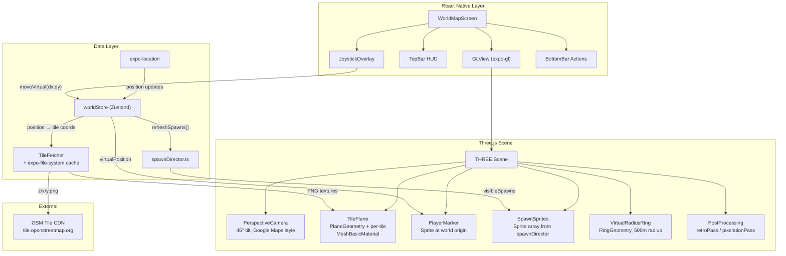
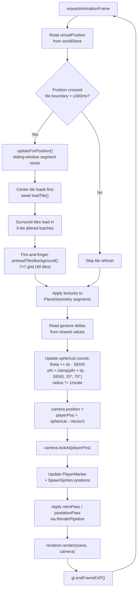
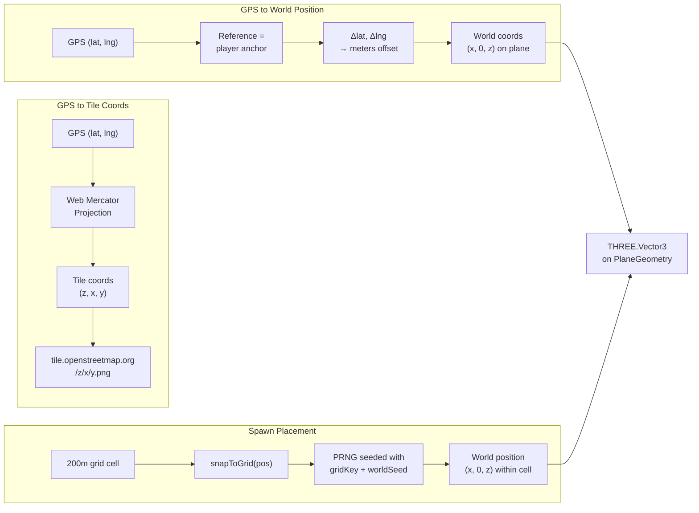
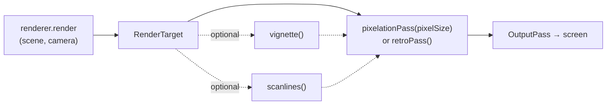
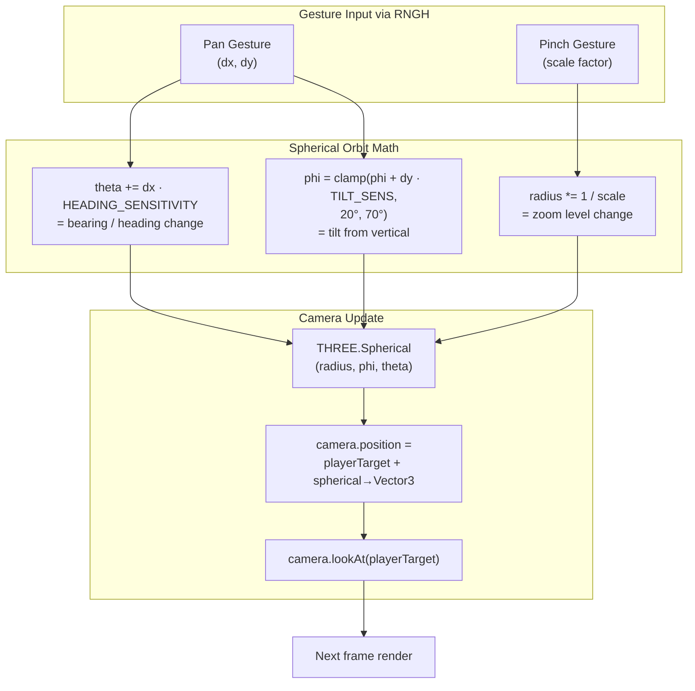
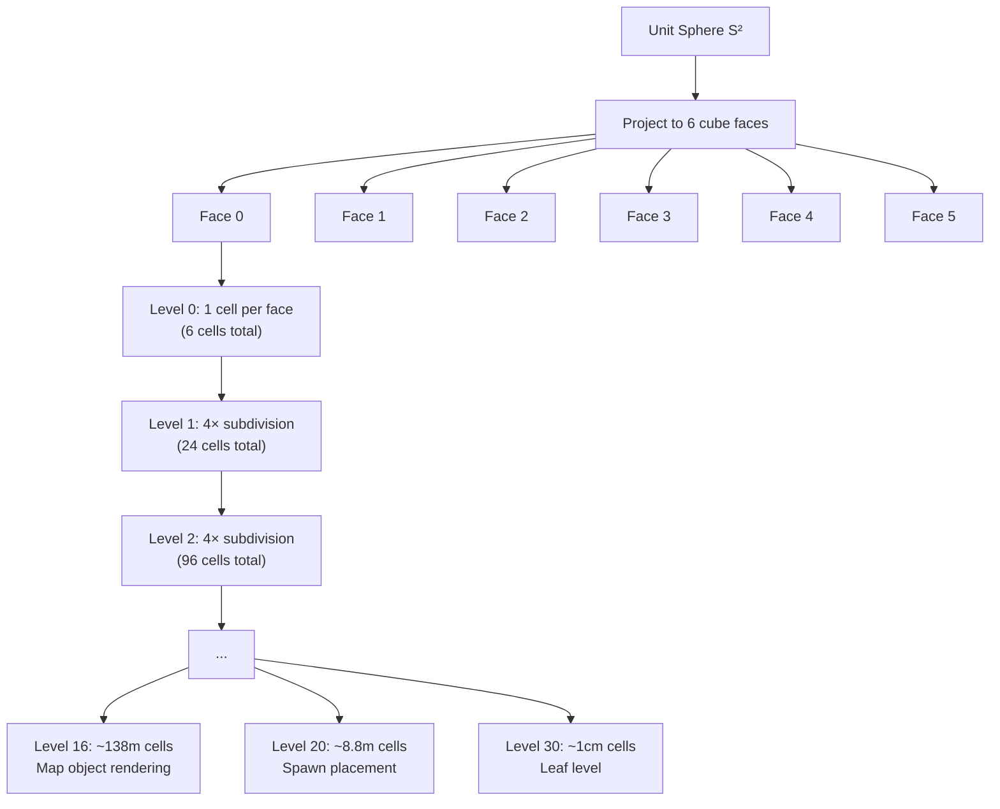
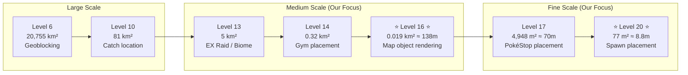

# Custom Map Rendering Engine

> **Date**: June 3, 2026 | **Status**: Architecture Decision | **Replaces**: MapLibre experiment

---

## 1. Decision

**We will build a custom OpenGL map rendering engine** using `expo-gl` + Three.js (direct bridge, **no `expo-three`**), because no existing React Native map SDK can replicate the Orna/Pokémon GO visual experience.

MapLibre, Leaflet, Google Maps, and similar SDKs are **geospatial data viewers** — they render tiles accurately on a Mercator projection. Orna uses map tiles as a **texture** in a custom game rendering pipeline with pixelation shaders, orthographic/oblique projection, player-centered orbit camera, and game-entity spawning — all of which are outside the scope of any map SDK.

> **Revised June 4, 2026**: Based on implementation experience, the following updates have been made:
> - **Skip `expo-three`** — unmaintained. Custom ~50-line `ExpoWebGLRenderer` bridge on `expo-gl` context.
> - **Pixelation via EffectComposer** — `RenderPixelatedPass` (r182+) with try/catch fallback to direct `renderer.render()`.
> - **PerspectiveCamera at 45° tilt** — Google Maps vector map camera model (heading orbit, pinch zoom).
> - **OSM raster tiles** — `tile.openstreetmap.org`, zoom 18, 3×3 grid, `fetch()` + base64 cache with ≥2KB size validation.
> - **MapLibre removed** — `@maplibre/maplibre-react-native` dependency and `app.json` plugin cleaned up.
> - **Gesture handling** — module-level worklet callbacks via `runOnJS`; `Gesture.Simultaneous(pan, pinch, tap)`.
> - **Joystick sensitivity** — 1 meter per pixel drag (was 5).
>
> **Revised June 4, 2026 (performance + compliance batch)**:
> - **`downloadAsync` replaces fetch→base64** — native streaming download eliminates the byte-by-byte base64 conversion bottleneck (~100-300ms per tile).
> - **Sliding-window tile segment reuse** — `TilePlane` maintains a `Map<key, TileSegment>` for O(1) reuse; only creates/disposes tiles entering/leaving the 3×3 grid (typically 1-3 changed vs 9 full rebuild).
> - **Center-tile-first loading** — prioritizes the tile directly under the player for instant perceived response.
> - **Tile-boundary debounce + 300ms throttle** — `WorldMapScreen` only triggers `updateForPosition` when the GPS center tile actually changes AND ≥300ms since last refresh.
> - **5×5 pre-warm on map ready** — background preload of surrounding tiles so adjacent areas render instantly on scroll.
> - **OSM-compliant User-Agent** — `MyRPGGame/0.1.0 (+https://github.com/...; contact: dev@myrpggame.app)` per OSM Tile Usage Policy §3.1/§3.4 (was non-compliant `(React Native)` suffix causing 403 blocks).
> - **Versioned cache purge** — `AsyncStorage`-backed `CACHE_VERSION` bumps force one-time purge of all poisoned 403-error cache entries.
> - **7-day TTL eviction** — replaces arbitrary 200-tile LRU cap with time-based eviction per OSM policy §3.2.
> - **Jittered batch delays** — 100-250ms random jitter instead of fixed 100ms (avoids automated-traffic detection per OSM policy §4).
> - **5s download timeout** — `Promise.race` wrapper prevents hung requests from stalling the batch pipeline.
> - **OSM attribution overlay** — `© OpenStreetMap contributors` text at bottom of map screen per OSM policy §2.
>
> **Revised June 4, 2026 (continuous pre-caching batch)**:
> - **Continuous background pre-caching** — `TilePlane.updateForPosition()` fires `preloadTilesBackground(center, 3)` (fire-and-forget) on every tile change, downloading a 7×7 grid (49 tiles) in background. Tiles ahead of the player are on disk before they scroll into view.
> - **Configurable-radius pre-warm** — `getExpandedTiles(center, radius)` replaces hardcoded `getPreWarmTiles`. `radius=1` = 3×3 visible, `radius=3` = 7×7 pre-cache (49 tiles), `radius=4` = 9×9 (81 tiles, available for future use).
> - **Session-level confirmed-good tile tracking** — `_confirmedGoodTiles: Set<string>` avoids redundant `getInfoAsync` filesystem checks for tiles already validated this session. First-time load validates size; subsequent loads skip straight to `createTextureFromLocalUri`.
> - **7×7 initial pre-warm** — `preloadTiles(center, expanded=true)` now pre-caches 49 tiles (was 25). Expanded area covers 3 tiles in every direction beyond the visible 3×3.
> - **Deduplicated preloads** — `lastPreloadKey` in `TilePlane` prevents redundant background preloads when the center tile hasn't changed.

---

## 2. Orna's Visual Pipeline (Target)

```
┌──────────────┐    ┌──────────────┐    ┌──────────────┐    ┌──────────────┐
│  Download     │ → │  Apply       │ → │  Render on   │ → │  Overlay     │
│  OSM tiles    │    │  Pixelation  │    │  oblique     │    │  game        │
│  (within      │    │  shader      │    │  plane       │    │  entities    │
│   radius)     │    │              │    │  (3D tilt)   │    │              │
└──────────────┘    └──────────────┘    └──────────────┘    └──────────────┘
```

| Step | Orna Behavior | Our Implementation |
|---|---|---|
| 1. Tile fetch | Download OSM raster tiles within ~300m of player GPS | `FileSystem.downloadAsync()` OSM `{z}/{x}/{y}.png` tiles; cache to `expo-file-system/legacy` with ≥2KB size validation + 7-day TTL; continuous 7×7 background pre-caching on every tile change |
| 2. Pixelation | Apply retro pixel-art filter via shader | Three.js `EffectComposer` + `RenderPixelatedPass` (r182+); falls back to direct `renderer.render()` on expo-gl |
| 3. Oblique view | Render flat tiles onto a tilted 3D plane, centered on player | Three.js `PerspectiveCamera` at 45° tilt, textured `PlaneGeometry` |
| 4. Entity spawn | Game buildings, enemies, player ring on the oblique plane | Three.js `Sprite` with procedural `DataTexture` circles (color-coded by spawn type) |
| 5. Orbit camera | Swipe revolves camera around player (player always centered) | Module-level worklet callbacks → `runOnJS` → manual spherical orbit; `Gesture.Simultaneous(pan, pinch, tap)` |

---

## 3. Technology Stack

| Layer | Technology | Purpose |
|---|---|---|
| OpenGL surface | `expo-gl` (`GLView`) | Native OpenGL ES render target in React Native view tree |
| 3D engine | `three` (r184, **direct import**, no `expo-three`) | Scene graph, camera, materials, sprites |
| GL bridge | Custom `ExpoWebGLRenderer` (~50-line adapter) | Bridges `expo-gl` context to `THREE.WebGLRenderer` |
| Pixelation | `EffectComposer` + `RenderPixelatedPass` (r182+) | Retro pixel-art post-processing with expo-gl fallback |
| Tile fetching | Custom fetcher + `expo-file-system/legacy` | Download OSM raster tiles, base64 cache, size validation |
| GPS integration | `expo-location` + `worldStore` (existing) | Player position → camera anchor |
| UI overlays | React Native `View` (existing) | HUD, joystick, action bar — positioned absolutely over GLView |
| Gestures | `react-native-gesture-handler` + Reanimated (existing) | Module-level worklet callbacks → `runOnJS` → spherical orbit |

### Why Three.js (not raw WebGL)

- Scene graph abstracts object management (no manual matrix math)
- Built-in `PerspectiveCamera`, `Sprite`, `PlaneGeometry`, `RingGeometry`
- Built-in `retroPass()` / `pixelationPass()` for pixelation post-processing (r183+)
- `RenderPipeline` for post-processing chain management
- Large ecosystem of loaders, utilities, and examples
- Custom `ExpoWebGLRenderer` bridge (~50 lines) replaces unmaintained `expo-three`

### Why not `expo-three`

- Last meaningful commit ~2 years ago (Three.js 0.166.0 vs current r184)
- 86 open issues, many about SDK 53/54 incompatibility
- The bridge is thin and stable — a custom adapter is ~50 lines and stays in our control

### Why not MapLibre / Leaflet / Google Maps

- Cannot apply pixelation shaders to map tiles
- Cannot render in orthographic/oblique projection
- Cannot orbit camera around an arbitrary world point (player)
- Cannot seamlessly blend game entities (sprites) with map geometry
- These are map SDKs, not game engines

---

## 4. Architecture

### System Overview



### Rendering Pipeline (Per-Frame Loop)



### Component Tree

```
WorldMapScreen
├── GLView (fills screen, behind everything)
│   └── Three.js Scene (managed by useGameMap hook)
│       ├── ObliqueMapPlane (TilePlane with per-tile MeshBasicMaterial)
│       ├── PlayerMarker (Sprite at world origin)
│       ├── SpawnSprites[] (ported from MapLibre MarkerView)
│       ├── VirtualRadiusRing (RingGeometry, 500m radius)
│       ├── Camera (PerspectiveCamera, 45° tilt, player-centered orbit)
│       └── PostProcessing (retroPass / pixelationPass via RenderPipeline)
├── TopBar (absolute position, top)
├── JoystickOverlay (absolute position, bottom-left)
└── BottomBar (absolute position, bottom)
```

The GLView renders the 3D map. React Native views (HUD, joystick, action bar) sit on top via absolute positioning — same as current architecture.

---

## 5. Rendering Pipeline Detail

### 5.1 Tile Fetching & Caching Architecture

```
GPS position → tile coordinates (all zoom 18)
    → in-memory Map cache hit? → instant return (0 I/O)
    → session-confirmed-good Set hit? → skip validation, create texture directly from disk
    → filesystem cache hit? → validate size (≥2KB guard) → create texture → add to confirmed set
    → cache miss → FileSystem.downloadAsync() from tile.openstreetmap.org → validate → create texture → add to confirmed set
    → map onto PlaneGeometry segments (MeshBasicMaterial per tile)
```

- Tile URL: `https://tile.openstreetmap.org/{z}/{x}/{y}.png`
- User-Agent: `MyRPGGame/0.1.0 (+https://github.com/MyRPGGame/app; contact: dev@myrpggame.app)` — OSM-compliant §3.1/§3.4
- **In-memory cache**: `Map<key, TileEntry>` with 7-day TTL eviction (OSM policy §3.2). Instant hit — zero I/O.
- **Session confirmed-good Set**: `_confirmedGoodTiles: Set<string>` tracks tiles validated this session. Subsequent loads skip the async `getInfoAsync` size check — direct `createTextureFromLocalUri()`. Saves ~5-50ms per cached tile.
- **Disk cache**: `expo-file-system/legacy` cache directory. Tiles persist for 7 days minimum per OSM policy §3.2. Versioned purge (`AsyncStorage`-backed `CACHE_VERSION`) clears all tiles on format/provider changes.
- **Download**: `FileSystem.downloadAsync()` — native streaming directly to disk, zero JS CPU overhead. Replaces the old `fetch()` + byte-by-byte base64 conversion bottleneck.
- **Rate limiting**: Concurrent batches of 3 tiles with 100-250ms jittered inter-batch pause (OSM policy §4 — avoids automated-looking traffic patterns).
- **Timeout**: 5s per-tile `Promise.race` prevents hung downloads from stalling the batch pipeline.
- All tiles at zoom 18 (no LOD — simplicity and OSM coverage reliability)
- Texture: expo-gl native `{ localUri, width: 256, height: 256 }` passed through `THREE.Texture` constructor — no `TextureLoader` (requires DOM)
- Fallback: `loadTile` returns `null` on failure; debug HSL colors persist for unavailable tiles
- Attribution: `© OpenStreetMap contributors` overlay on map screen (OSM policy §2)

### 5.1a Continuous Background Pre-Caching Strategy

The core performance challenge: OSM's volunteer-run tile servers have 500ms-2s latency. Downloading tiles on-demand during movement causes visible lag. The solution is **continuous background pre-caching** — download tiles before the player scrolls into them.

**How it works:**

```
Player moves → center tile changes
  ↓
TilePlane.updateForPosition(center)
  ├── Sliding-window: reposition existing segments, create new ones for entering tiles
  ├── Center tile loads first (await loadTile) → instant perceived response
  ├── Surround tiles load in 3-tile batches with jitter
  └── Fire-and-forget: preloadTilesBackground(center, radius=3)
        └── Promise.allSettled on 49 tile coords (7×7 grid)
              ├── Already-cached tiles → _confirmedGoodTiles fast path → instant
              └── New tiles → downloadAsync → cached on disk → added to confirmed set
```

**Pre-caching tiers:**

| Tier | Radius | Grid | Tile Count | Trigger |
|---|---|---|---|---|
| Visible | 1 | 3×3 | 9 | `updateForPosition()` — immediate, awaited |
| Pre-warm | 3 | 7×7 | 49 | `preloadTilesBackground()` — fire-and-forget on every tile change |
| Initial warm | 3 | 7×7 | 49 | `preloadTiles(center, expanded=true)` — awaited on map ready |

**Key design decisions:**

- **Fire-and-forget, never blocking**: `preloadTilesBackground()` returns `void` immediately. The visible 3×3 grid renders first; background downloads never delay the player's view.
- **Deduplicated per tile**: `lastPreloadKey` in `TilePlane` tracks which center tile was last preloaded. Same-tile re-renders don't trigger redundant downloads.
- **O(1) filesystem skip**: Once a tile is confirmed-good this session, `tryLoadCachedTexture` creates the texture directly from the file URI — no `getInfoAsync` stat call. This matters at scale: 49 pre-cached tiles × skipping one async I/O each = significant cumulative savings.
- **OSM policy compliant**: "Modest, short-range look-ahead typical of browsers" (§4) is explicitly permitted. 7×7 (extending 3 tiles beyond the visible 3×3) with jittered downloads qualifies as modest look-ahead.

**Performance characteristic after warm-up:**

After the first ~30 seconds of exploration in an area, **all visible tiles load from local disk with zero network requests**. The in-memory cache + confirmed-good fast path means tile textures appear on the PlaneGeometry in under one frame.

**GPS → Tile → World Coordinate Pipeline:**


### 5.2 Pixelation (Three.js EffectComposer + RenderPixelatedPass)

Three.js r182+ provides `RenderPixelatedPass` for the traditional `EffectComposer` pipeline:

```ts
import { EffectComposer } from 'three/examples/jsm/postprocessing/EffectComposer.js';
import { RenderPass } from 'three/examples/jsm/postprocessing/RenderPass.js';
import { RenderPixelatedPass } from 'three/examples/jsm/postprocessing/RenderPixelatedPass.js';

// Set up post-processing chain
const composer = new EffectComposer(renderer);
composer.addPass(new RenderPass(scene, camera));
composer.addPass(new RenderPixelatedPass(pixelSize, scene, camera));

// Render each frame via composer instead of renderer
composer.render();
```

`pixelSize` controls blockiness (higher = more pixelated, recommended 2-8). This approach uses the traditional `EffectComposer` rather than TSL, ensuring compatibility with `expo-gl`'s OpenGL ES context.

**Post-Processing Chain:**


### 5.3 Perspective Camera (Google Maps Vector Style)

Following the Google Maps vector map camera model:
- **Tilt**: 45° from nadir (straight down = 0°, horizon = 90°)
- **Heading/Bearing**: Compass direction of top-of-screen
- **Target**: Player world position (always centered)

```ts
// PerspectiveCamera: FOV, aspect, near, far
const camera = new THREE.PerspectiveCamera(
  60,           // FOV — wider for more peripheral vision
  width/height, // aspect ratio from GLView dimensions
  0.1,          // near plane
  1000          // far plane
);

// Position camera at 45° tilt (phi = π/4 from vertical)
const spherical = new THREE.Spherical(radius, Math.PI / 4, heading);
camera.position.copy(playerWorldPosition).add(
  new THREE.Vector3().setFromSpherical(spherical)
);
camera.lookAt(playerWorldPosition);
```

For a Pokémon GO-like perspective, use `PerspectiveCamera` at 45-60° tilt. For a flatter Orna look, reduce FOV and increase camera distance.

### 5.4 Player-Centered Orbit (Manual Spherical Math)

`OrbitControls` from Three.js requires DOM events (`mousedown`, `mousemove`, `wheel`) and does **not** work in React Native. We implement orbit manually via gesture handlers:

```ts
// On pan gesture → rotate camera heading (theta) around player
// On pinch gesture → adjust radius (zoom level)
// Player marker stays at screen center at all times

const spherical = new THREE.Spherical();
spherical.setFromVector3(camera.position.clone().sub(playerPos));

// Pan horizontal → change heading/bearing
spherical.theta += gestureDelta.x * HEADING_SENSITIVITY;

// Pan vertical → change tilt (constrained 20°–70° from vertical)
spherical.phi = clamp(
  spherical.phi + gestureDelta.y * TILT_SENSITIVITY,
  Math.PI * 20/180,   // 20° min — almost overhead
  Math.PI * 70/180    // 70° max — near horizon
);

// Pinch → change zoom (radius)
spherical.radius *= (1 / pinchScale);
spherical.radius = clamp(spherical.radius, MIN_ZOOM_RADIUS, MAX_ZOOM_RADIUS);

camera.position.copy(playerPos).add(new THREE.Vector3().setFromSpherical(spherical));
camera.lookAt(playerPos);
```

**Gesture → Camera Transform Pipeline:**


### 5.5 Entity Spawning

Game entities (enemies, buildings, resources) are Three.js `Sprite` objects positioned on the map plane at their GPS-derived world coordinates. Each sprite uses an emoji or pre-rendered icon texture.

```
GPS (lat, lng) → world position (x, z on the plane) → Sprite.position.set(x, 0, z)
```

### 5.6 S2 Spatial Indexing (Research Complete — Temporarily Deferred)

> **Status**: Research completed June 3, 2026. Adoption deferred to a future iteration after the core rendering engine is stable.

#### What is S2?

[S2 Geometry](https://s2geometry.io/) is Google's open-source library for spatial indexing on the sphere. It partitions the Earth into a hierarchy of cells using a **Hilbert space-filling curve**, enabling constant-time spatial queries without latitude/longitude distortion. Pokémon GO and Ingress use S2 cells as their core spatial primitive.

#### S2 Cell Hierarchy

| S2 Level | Area | Approx Side | Pokémon GO Usage |
|----------|------|-------------|-------------------|
| 6 | 20,755 km² | ~144 km | Geoblocking regions |
| 10 | 81 km² | ~9 km | Pokémon caught location |
| 13 | 5.07 km² | ~2.25 km | EX Raid triggers, biomes |
| 14 | 0.32 km² | ~566 m | Gym placement / creation |
| **16** | **0.019 km²** | **~138 m** | **🔑 Map object rendering** |
| 17 | 4,948 m² | ~70 m | PokéStop placement |
| **20** | **77 m²** | **~8.8 m** | **🔑 Spawn placement** |

#### Why S2 Matters for This Engine

1. **Spawn placement at Level 20** (77 m² cells) would give ~500× more granularity than our current 200m grid (40,000 m²). Pokémon GO places spawns at the center of each L20 cell.
2. **Map object organization at Level 16** (~138m) roughly corresponds to one OSM zoom-18 tile (~153m), making it a natural bridge between our tile system and entity system.
3. **Spatial queries become O(1)**: Finding all spawns within 300m is a native S2 region coverer operation — no haversine scan needed.
4. **Hilbert curve ordering** means nearby cells have numerically close 64-bit IDs, enabling cache-friendly iteration and database indexing.
5. **Deterministic seeding**: S2 cell IDs provide inherent deterministic seeds (no need for our custom `gridKey` hash).

#### Current vs. Future S2-Based System

| Aspect | Current (Flat Grid) | Future (S2-Based) |
|--------|---------------------|--------------------|
| Spawn cell size | 200m × 200m (40,000 m²) | ~8.8m × 8.8m (77 m²) |
| Grid system | Flat lat/lng offset | Sphere-aware Hilbert curve |
| Cell ID | String hash (`gridKey`) | 64-bit integer (`S2CellId`) |
| Neighbor lookup | Manual Δlat/Δlng math | Native `.next()` / `.prev()` |
| Spatial query | Haversine distance scan | S2 region coverer |
| LOD | Manual (our code) | Built-in parent/child hierarchy |

#### Deferral Rationale

S2 integration touches every spatial component (`worldStore`, `spawnDirector`, `TilePlane`, `TileFetcher`). Implementing it now would delay the core rendering engine. The current flat-grid system works correctly for Phase 1–4. S2 adoption is planned as a **post-Phase-4 enhancement** with a clear migration path.

#### Migration Path (Future)

1. Install `s2-geometry` (~50KB pure JS port)
2. Add `s2CellId` field to `WorldSpawn` and `WorldPosition` types
3. Replace `gridKey()` with `S2CellId.fromLatLng(lat, lng, level=20).id()`
4. Replace `getGridCellsInRadius()` with `S2RegionCoverer.getCovering(center, radius)`
5. Remove `latPerMeter`/`lngPerMeter` flat-earth approximations

#### Key Diagrams

**S2 Cell Hierarchy — Hilbert Curve Subdivision:**


**Pokémon GO's S2 Usage by Level:**


---

## 6. Implementation Plan

### Phase 0 — Dependency Setup

| Step | Task |
|---|---|
| 0.1 | `npx expo install expo-gl@~56.0.5` |
| 0.2 | `npm install three@~0.170.0` |
| 0.3 | Verify `expo-file-system` already available |

### Phase 1 — Foundation (est. 2-3 days)

| Step | Task | Dependencies |
|---|---|---|
| 1.1 | Create `ExpoWebGLBridge` — custom ~50-line `WebGLRenderer` adapter on `expo-gl` context | 0.1, 0.2 |
| 1.2 | Create `useGameMap` hook — GLView `onContextCreate`, init Scene/Renderer/Camera, animation loop | 1.1 |
| 1.3 | Create `GameMapGL` component — `<GLView>` wrapper | 1.2 |
| 1.4 | Render a textured plane with a single hardcoded OSM tile (verify `file://` URI loading) | 1.3 |
| 1.5 | Position PerspectiveCamera at 45° tilt (Google Maps style), verify perspective | 1.4 |
| 1.6 | Integrate GPS position → place player marker sprite on plane | 1.5 |
| 1.7 | Wire up pan gesture → heading orbit (theta), pinch gesture → zoom (radius) | 1.6 |

### Phase 2 — Tile System ✅ COMPLETE

| Step | Task | Implementation |
|---|---|---|
| 2.1 | Build `TileFetcher` | `fetch()` + base64 via `btoa()` + `FileSystem.writeAsStringAsync` + size validation |
| 2.2 | Build `TilePlane` | HSL debug-color immediate render → batch texture swap via `pendingMaterials` queue |
| 2.3 | Tile loading | All zoom 18 (no LOD); concurrent batches of 3 with 100ms pause |
| 2.4 | Loading states | Debug-colored tiles appear instantly; OSM textures replace them as they load |

### Phase 3 — Visual Polish (est. 2 days) ✅ COMPLETE

| Step | Task | Status |
|---|---|---|
| 3.1 | Add pixelation via `EffectComposer` + `RenderPixelatedPass` (r182+ built-in) | ✅ |
| 3.2 | Add virtual radius ring (`RingGeometry`, 500m world radius) | ✅ |
| 3.3 | Port spawn markers from MapLibre `MarkerView` → Three.js `Sprite` system with procedural `DataTexture` circles | ✅ |
| 3.4 | Handle spawn press → `Raycaster` screen-coordinate hit testing with parent-chain walk | ✅ |
| 3.5 | Wire pan/pinch gestures → `orbitCamera()` via `Gesture.Pan()` + `Gesture.Pinch()` + `runOnJS` | ✅ |

### Phase 4 — Cleanup (est. 1 day) ✅ COMPLETE

| Step | Task | Status |
|---|---|---|
| 4.1 | Remove `@maplibre/maplibre-react-native` dependency | ✅ |
| 4.2 | Remove MapLibre plugin from `app.json` | ✅ |
| 4.3 | Verify all existing functionality (HUD, joystick, spawn interaction) | ✅ |

---

## 7. Risks & Mitigations

| Risk | Mitigation |
|---|---|
| Three.js + emulator performance | Test on physical device early; use `Stats.js` for FPS monitoring |
| OSM tile download latency (500ms-2s) | Aggressive local caching (7-day TTL + session confirmed-good fast path); native `downloadAsync`; center-tile-first loading; **continuous 7×7 background pre-caching** on every tile change |
| OSM blocking (403 "Access blocked") | **Resolved**: Compliant `User-Agent` with contact info (§3.1); versioned cache purge clears old poisoned entries; jittered rate limiting (§4); attribution overlay (§2) |
| Cold-start tile load delay | 7×7 initial pre-warm on map ready (49 tiles); most tiles cached from previous sessions |
| Gesture conflict (GLView vs RN views) | GLView is full-screen behind RN views; RN views handle gestures via absolute positioning |
| Platform-specific GL bugs | Test on both iOS simulator + physical Android device during Phase 1 |
| ~~expo-three maintenance~~ | **Resolved**: Using direct `expo-gl` + `three` bridge (~50 lines), no external dependency risk |
| retroPass/pixelationPass on mobile GL | Test TSL post-processing early on physical device; fall back to `RenderPixelatedPass` (traditional `EffectComposer`) if needed |
| OrbitControls unavailable (no DOM) | Implemented manually via `react-native-gesture-handler` + spherical math — fully in our control |
| Tile grid rebuild cost on position change | **Resolved**: Sliding-window segment reuse + tile-boundary debounce + 300ms throttle |
| Large cache I/O on every tile load | **Resolved**: Session `_confirmedGoodTiles` Set skips redundant `getInfoAsync` filesystem checks for previously-validated tiles |

---

## 8. Key Dependencies

```json
{
  "expo-gl": "~55.0.14",
  "three": "~0.184.0",
  "expo-file-system": "~55.0.22",
  "expo-location": "~55.1.10",
  "@react-native-async-storage/async-storage": "^2.1.0"
}
```

> **Removed**: `expo-three` — replaced by custom `ExpoWebGLRenderer` bridge (~50 lines).
> **Removed**: `@maplibre/maplibre-react-native` — replaced by custom OpenGL map engine.
> **Updated**: `three` upgraded to `~0.184.0` (r184) for `EffectComposer` + `RenderPixelatedPass`.
> **Updated**: `expo-file-system` imports use `/legacy` path for SDK 55 compatibility.
> **Updated (June 4)**: Tile download now uses `FileSystem.downloadAsync` (native streaming) instead of `fetch()` + byte-by-byte base64 conversion.
> **Updated (June 4)**: `AsyncStorage` added for cache version tracking (one-time poisoned-cache purge on version bump).
> **Updated (June 4)**: Continuous 7×7 background pre-caching via `preloadTilesBackground()` + session `_confirmedGoodTiles` Set for O(1) filesystem-skip on cached tiles.
> **Tile source**: `tile.openstreetmap.org` (standard OSM raster tiles, zoom 18).
> **Joystick**: sensitivity reduced from 5 to 1 meter per pixel drag.

Existing dependencies (unchanged): `react-native-gesture-handler`, `react-native-reanimated`, `zustand`

---

## 9. References

- [expo-gl documentation](https://docs.expo.dev/versions/latest/sdk/gl-view/)
- [Three.js documentation](https://threejs.org/docs/)
- [Three.js TSL — retroPass / pixelationPass](https://threejs.org/docs/#api/en/postprocessing/RetroPass)
- [Google Maps Vector Map — Camera Model](https://developers.google.com/maps/documentation/javascript/vector-map) — tilt, heading, target model
- [OSM Slippy Map Tilenames](https://wiki.openstreetmap.org/wiki/Slippy_map_tilenames) — tile coordinate math
- [OSM Tile Usage Policy](https://operations.osmfoundation.org/policies/tiles/)
- [S2 Geometry Library](https://s2geometry.io/) — spatial indexing on the sphere (Hilbert curve, cell hierarchy)
- [S2 Cell Statistics](https://s2geometry.io/resources/s2cell_statistics) — cell sizes per level
- [Pokémon GO S2 Cells Guide](https://pokemongohub.net/post/guide/s2-cells-pokemon-go/) — how Pokémon GO uses S2 levels 10–20
- [s2-geometry (npm)](https://www.npmjs.com/package/s2-geometry) — lightweight pure-JS S2 port (~50KB)
- [Orna Research](./Orna_Research.md) — spawn system, grid cells, world model
- Current implementation: `src/screens/WorldMap/WorldMapScreen.tsx`, `src/stores/worldStore.ts`, `src/services/locationService.ts`
