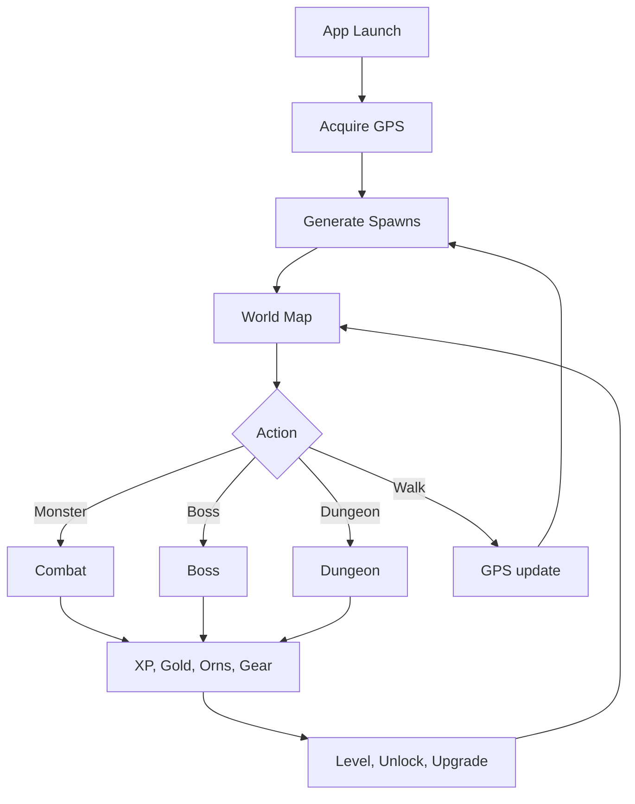
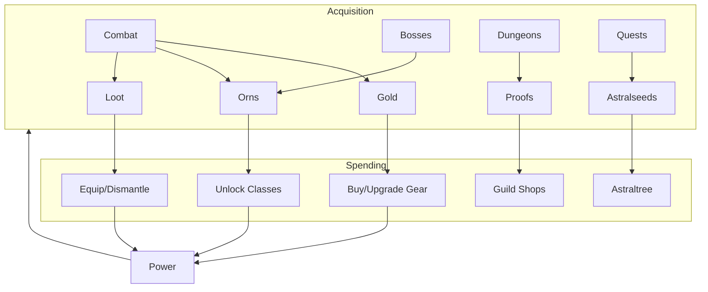
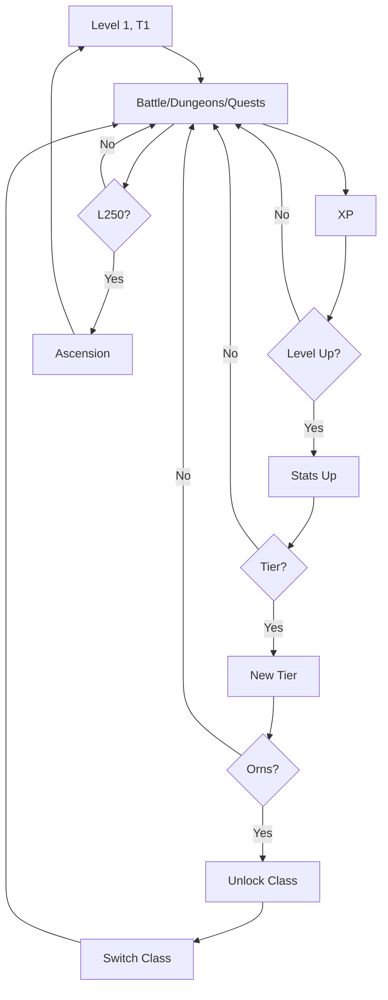
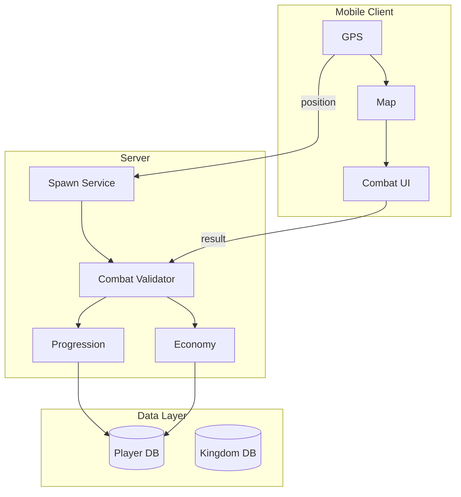
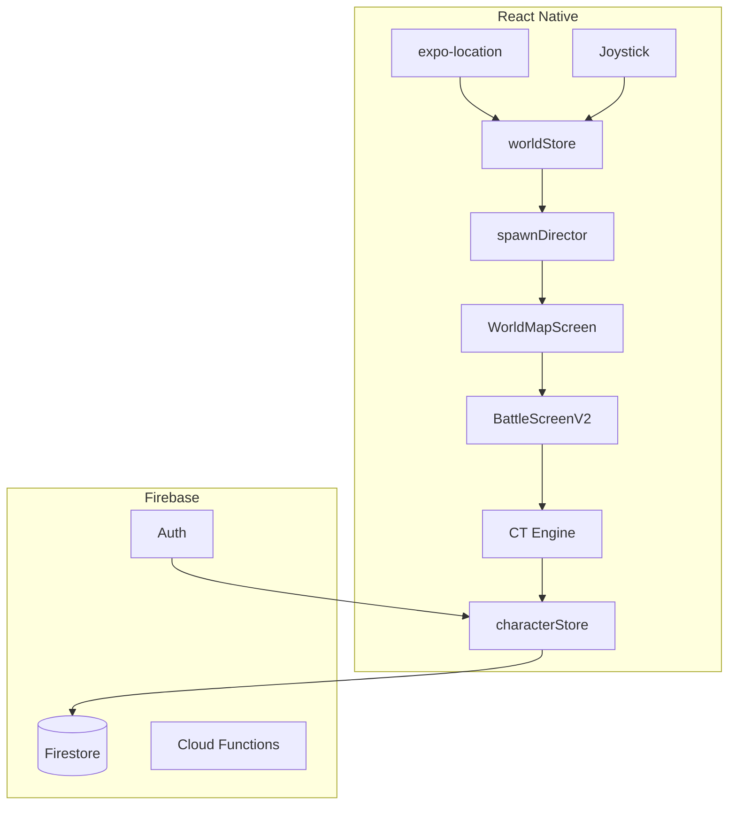

# Orna & Hero of Aethric — Deep Research Report

> **Date**: June 2, 2026 | **Purpose**: Blueprint for pivoting MyRPGGame from fantasy roguelite to a sci-fi GPS-based RPG

---

## 1. Executive Summary

**Orna: The GPS RPG** (2018) and **Hero of Aethric** (2022) by Northern Forge Studios share the same RPG engine but differ in world model:

| | Orna | Hero of Aethric |
|---|---|---|
| World Map | Real GPS (OpenStreetMap) | Handcrafted pixel-art continent |
| Movement | Physical walking | Virtual D-pad / tap-to-move |
| Monster Spawns | Around player location | Fixed zones by level tier |
| Social | Territory control, kingdoms | Same kingdoms, no GPS territory |

**Why study both**: Orna proves GPS RPG at scale. Hero of Aethric proves same engine works without GPS — validating our GPS + joystick overlay hybrid.

---

## 2. Orna: Complete Mechanic Breakdown

### 2.1 World Map & Geolocation

GPS snaps to ~200m grid cells. Grid key hashed with world seed for deterministic spawns via seeded PRNG. Filtered by ~300m visible radius, 5-min TTL cache. Our implementation: `src/domain/world/spawnDirector.ts`.

| Parameter | Value |
|---|---|
| Spawn radius | ~200m |
| Spawn pool | By player tier (1-10) |
| Respawn | ~5 min |
| Boss cooldown | 1-4 hours |

**Dungeons**: Fixed at POIs, cooldowns. Types: Normal, Elemental, Monuments, Towers, Deep Dungeons. Buildings: Shop, Blacksmith, Bestiary, Herbalist, Monumental Guild, Conqueror Guild.

**Territory**: Claim Settlements for daily rewards. Others challenge. Leaderboards. Exploration: Memory Hunts, Traveler Guild (step tracking), fog of war.

### 2.2 Class & Progression

Tiered classlines (1-10), not branching lineages:

| Tier | Levels | Classes |
|---|---|---|
| 1 | 1-24 | Warrior, Mage, Thief |
| 2 | 25-49 | Archmage, Frost Mage, Legionnaire, Royal Guard |
| 3 | 50-74 | Spellweaver, Druid, Knight, Rogue |
| 4 | 75-99 | Omnimancer, Nekromancer, Paladin, Realmshifter |
| 5 | 100-124 | Heretic, Beowulf, Gilgamesh, Deity |
| 6-10 | 125-250 | Advanced prestige classes |

**Key**: Orns currency unlocks classes permanently. Free switching. Passives define identity (Flasks, Apex, Bloodshift). Ascension at 250. 4 factions (restrictions removed Nov 2025).

### 2.3 Combat

Traditional turn-based (NOT CT). Our CT+Turn hybrid is our differentiator.

Turn: Player action -> Resolve -> Enemy action -> Resolve -> Follower -> Status ticks -> Repeat.

**Mechanics**: Ward (damage absorption), 8+ elements (weakness exploitation), Followers (pets), separate PvP balance.

### 2.4 Economy

| Currency | Source | Use |
|---|---|---|
| Gold | Monsters, selling | Gear, buildings |
| Orns | Achievements, bosses | Class unlocks |
| Proofs | Activities | Guild shops |
| Astralseeds | Daily login | Astraltree |
| Event | Seasonal | Limited items |

Gear rarities: Broken -> Ornate (7 tiers).

### 2.5 Multiplayer

Kingdoms (50 members): Phase 1 removed factions. Phase 2 Crusades co-op. Phase 3 social hub. PvP: Arena, Territory Wars, Live.

### 2.6 Live Ops

Daily: 3 quests + Astraltree (4 Constellations). Weekly: 2 quests. Monthly themed events. December Wild Hunt: 4 weekly rotating waves.

---

## 3. Hero of Aethric

| | Orna | HoA |
|---|---|---|
| Map | GPS | Handcrafted continent |
| Movement | Walking | D-pad/tap |
| Battery | High | Lower |
| Access | Outdoor | Anywhere |

Everything else identical. **Proves engine is world-model independent and virtual movement is viable.**

---

## 4. Game Loop Diagrams

### 4.1 Orna Core Loop

### 4.2 Economy Loop

### 4.3 Progression Loop

---

## 5. Architecture

### 5.1 Inferred Orna Architecture

Client-authoritative combat + server validation. Deterministic spawns. Offline-capable.

### 5.2 Our Adapted Architecture

---

## 6. Adaptation Blueprint

| Orna | Our Version | Why |
|---|---|---|
| GPS-only | GPS + Joystick (500m) | Accessibility |
| Turn-based | CT + Turn hybrid | Differentiator |
| Fantasy classlines | Sci-Fi corporations | Theme |
| Orns | Tech Points | Same function |
| Kingdoms | Corps (async) | Solo-first |
| Origin Town | Home Terminal | Upgradeable |

**Innovations**: CT Timeline (dynamic tempo), Joystick overlay (couch play), Deterministic combat (async validation), Corp mechanics (deeper identity).

**Theme Map**: Lineages->Corps(8), Classes->Specs(16), Skills->Abilities, Magic->Psionics, Gear->Cyberware, Gold->Credits, Orns->Tech Points, Dungeons->Data Vaults.

---

## 7. Implementation Trace

**World Map**: world/types.ts, spawnDirector.ts, locationService.ts, worldStore.ts, WorldMapScreen.tsx, JoystickOverlay.tsx

**Combat**: types.ts (defend/use_item), step.ts (defendInternal/useItemInternal), factory.ts (isCompanion/defendStance), BattleScreenV2.tsx

**Content**: corporations.ts (8), specializations.ts (16), abilities.ts (30+), cyberware.ts (20+), damageTypes.ts, dailyQuests.ts

**Services**: worldApi.ts, submitEncounter.ts, updatePlayerLocation.ts, syncCharacter.ts

**Stores**: characterStore.ts, questStore.ts

**Navigation**: AppNavigator.tsx (WorldMap primary tab + BattleV2 modal)

---

## 8. Sources

**Official**: playorna.com, playorna.com/gps/, playorna.com/aethric/, northernforge.com, playorna.com/codex/, blog.ornarpg.com/

**Key Posts**: Wild Hunts (Dec 2025), Fellowship (Nov 2025), Astraltrees (Oct 2025), Flasks (Feb 2025), Conqueror Guild (Aug 2024), Terra Day (Apr 2024), Thronemakers (Mar 2024), Patch 3.9/1.4 (Nov 2023)

**Community**: r/OrnaRPG, r/HeroOfAethric, orna.guide

**Press**: Digital Trends, Pocket Tactics, The Gamer, Mobile Syrup
