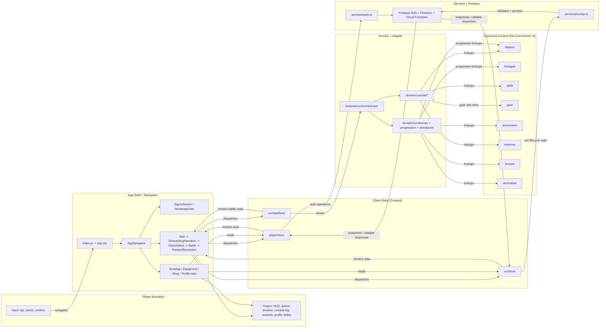
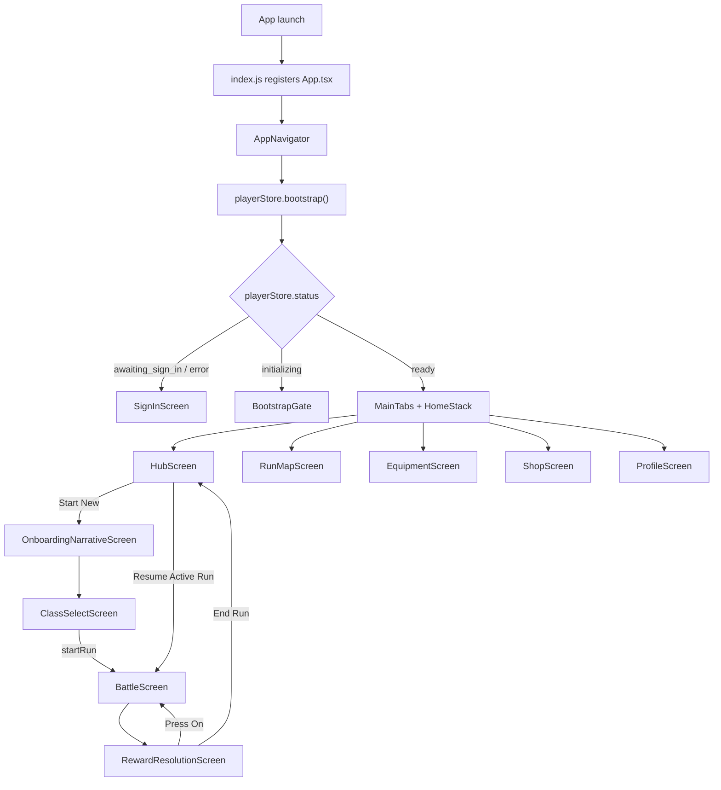
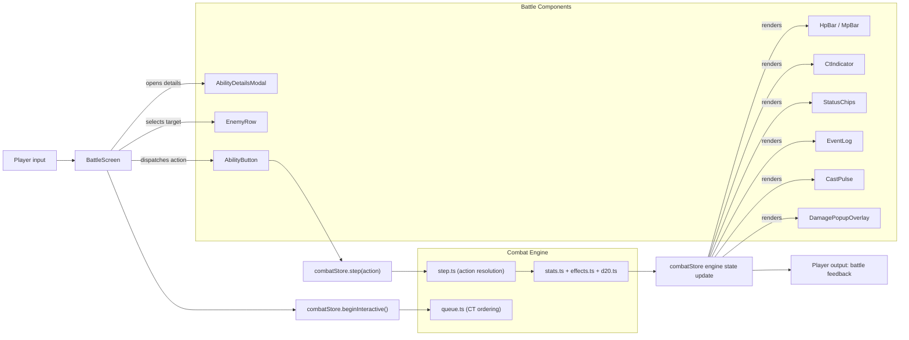
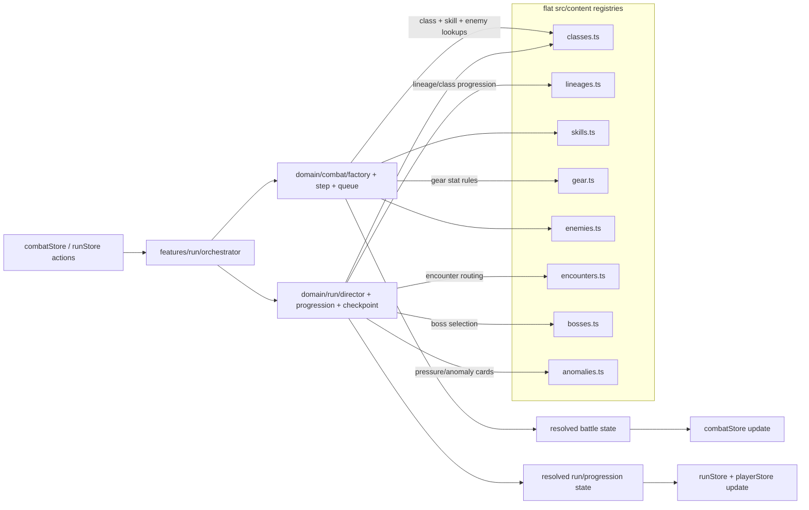
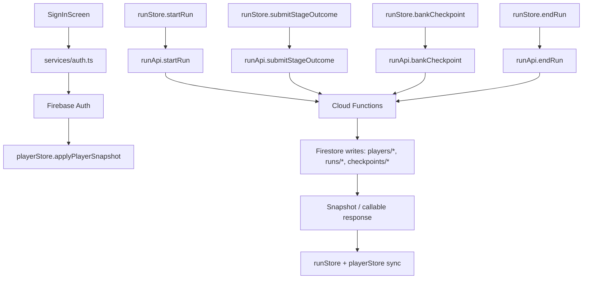
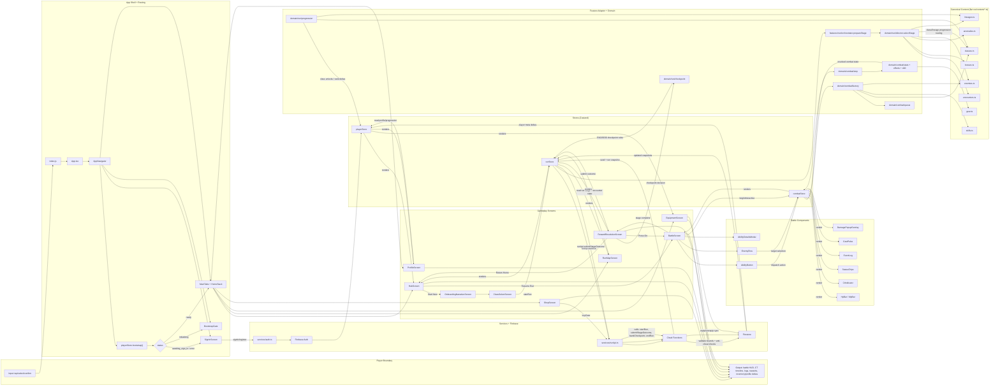

> **⚠️ RECONCILIATION NOTE (2026-04-22):**  
> **Current Canonical Layout:** The actual codebase uses **flat registries** in `src/content/` (e.g., `src/content/lineages.ts`, `src/content/classes.ts`, `src/content/skills.ts`) **NOT the nested folder structure shown in Section 2 below**.
> The nested structure described in this document is an **aspirational future refactoring**. See [INTEGRATION_REPORT.md](../INTEGRATION_REPORT.md) **§3 (C8 decision)** for confirmation that current flat layout is authoritative.
>
> **Content Source:** All game data is **TS-authored in `src/content/*.ts` files** (TypeScript modules as canonical source). Firestore export is optional for operational workflows. See [INTEGRATION_REPORT.md](../INTEGRATION_REPORT.md) **§3 (C7 decision)**.
>
> **What's Stable:** `src/domain/combat/*` decomposition, `src/domain/` engines, and `src/features/` UI screens remain stable canonical layers. Only aspirational reorg of `content/` folder structure is deferred.
>
> **Status:** Contains both current-stable sections and aspirational-future sections. Clarifications in this note take precedence. See [../INTEGRATION_REPORT.md](../INTEGRATION_REPORT.md) for locked decisions.

---

# Single-Page Developer Execution Plan (Mixed: Current + Aspirational)

## Mobile RPG Roguelite — Class Lineages, CT Combat, Raid Bosses

## Goal

Build the game as a **mobile-first roguelite RPG** with:

* 12 lineages
* 60 classes
* CT-based combat
* single-boss raid encounters (bosses at stages 5, 10, 30)
* permanent unlocks + run-based evolution
* checkpoint banking at stages 5, 10, 20, 30
* gear-driven build identity
* AQ-style command menu in battle

---

## 1) Architecture rule

Use a **3-layer split**:

* **content/** = static game data
* **domain/** = pure game rules and engines
* **features/** = screens, components, hooks, local UI state

This keeps balancing, combat logic, and UI independent.

---

## 1a) End-to-End Architecture Flow (Canonical Current State)

> **Scope lock:** The sequence below documents the **current canonical runtime architecture** (flat `src/content/*.ts` registries + current `src/domain/`, screens, stores, services, Firebase integration). Section 2 remains an **aspirational future layout**.

### 1a.1 Main Chart



### 1a.2 Focused Subgraphs

#### Subgraph A: Bootstrap + Auth + Navigation



#### Subgraph B: Battle Interaction + Component IO



#### Subgraph C: Run Progression + Checkpoint + Banking

```mermaid
flowchart TD
  C0["ClassSelectScreen"] --> C1["runStore.startRun(classId)"]
  C1 --> C2["runApi.startRun"]
  C2 --> C3["Cloud Function issues seed + runId"]
  C3 --> C4["runStore snapshot"]

  C4 --> C5["prepareStage() in orchestrator"]
  C5 --> C6["domain/run/director.selectStage"]
  C6 --> C7{"Stage index"}
  C7 -->|5, 10, 30| C8["Boss encounter"]
  C7 -->|others (including 20)| C9["Procedural encounter"]

  C8 --> C10["BattleScreen"]
  C9 --> C10
  C10 --> C11["StageSimulationReport"]
  C11 --> C12["runStore.submitStageOutcome"]
  C12 --> C13["runApi.submitStageOutcome"]
  C13 --> C14["Cloud Function validates + persists"]

  C14 --> C15{"Checkpoint stage? (5, 10, 20, 30)"}
  C15 -->|yes| C16["RewardResolution: baseline + vault split"]
  C15 -->|no| C17["RewardResolution: standard outcome"]

  C16 --> C18{"Player decision"}
  C18 -->|Press On| C19["runStore.pressOn -> next stage"]
  C18 -->|Return Home| C20["runApi.bankCheckpoint / endRun"]
  C17 --> C19
```

#### Subgraph D: Content Registry Lookup Flow



#### Subgraph E: Persistence + Auth + External IO



### 1a.3 Giant Merged End-to-End Chart



> **Maintenance note:** Keep these diagrams synchronized whenever navigation topology, store contracts, run API endpoints, or content registry contracts change.

---

## 2) Minimal file structure

> **⚠️ NOTE:** This section shows an **aspirational reorganization**. The current canonical file layout uses **flat registries** in `src/content/` (e.g., `src/content/lineages.ts`, `src/content/classes.ts`, `src/content/skills.ts`, `src/content/gear.ts`, `src/content/bosses.ts`, `src/content/enemies.ts`, `src/content/encounters.ts`, `src/content/anomalies.ts`). The nested folder structure below is a future refactoring. For now, code against the flat layout currently in place. (See [INTEGRATION_REPORT.md](../INTEGRATION_REPORT.md) §3 C8 decision.)

```text
src/
  content/
    classes/
      classDefinitions.ts
      lineageDefinitions.ts
      classMatrix.ts
      branchGraph.ts
      tierTables.ts
      unlockRequirements.ts
    skills/
      skillDefinitions.ts
      passiveDefinitions.ts
    gear/
      gearDefinitions.ts
      itemDefinitions.ts
      statSkewDefinitions.ts
    bosses/
      bossDefinitions.ts
      raidPatterns.ts
    rewards/
      rewardTables.ts

  domain/
    combat/
      combatEngine.ts
      combatReducer.ts
      combatQueue.ts
      combatResolution.ts
      combatAI.ts
      combatMath.ts
      damagePipeline.ts
      costPipeline.ts
      targetResolver.ts
      effectPipeline.ts
      ctRules.ts
      statRules.ts
    progression/
      classUnlockEngine.ts
      classEvolutionEngine.ts
      lineageUpgradeEngine.ts
      slotUnlockEngine.ts
      hybridUnlockEngine.ts
    run/
      runEngine.ts
      checkpointEngine.ts
      stageEngine.ts
      randomEncounterEngine.ts
    rewards/
      rewardEngine.ts
      bankingEngine.ts
      lootEngine.ts
    gear/
      gearEngine.ts
      statSkewEngine.ts
      ctReductionEngine.ts

  features/
    hub/
      screens/
        HomeHubScreen.tsx
        ClassUpgradeScreen.tsx
        LineageUpgradeScreen.tsx
        HybridUnlockScreen.tsx
    run/
      screens/
        RunMapScreen.tsx
        StageScreen.tsx
        RandomEncounterScreen.tsx
        CheckpointScreen.tsx
        RunRewardScreen.tsx
    combat/
      screens/
        BattleScreen.tsx
        BattlePrepScreen.tsx
        BattleRewardScreen.tsx
      components/
        WaterfallCommandMenu.tsx
        SkillList.tsx
        TargetPicker.tsx
        QueueTimeline.tsx
        BattleLogPanel.tsx
        StatusPanel.tsx
        GearPanel.tsx
    gear/
      screens/
        EquipmentScreen.tsx
        ItemDetailScreen.tsx
        GearEnhanceScreen.tsx
```

---

## 3) Core build order

### Phase 1 — data first

Implement `content/` completely before UI:

* all 12 lineages
* all 60 classes
* tier tables
* branch graph
* unlock requirements
* skill definitions
* gear definitions
* boss definitions
* reward tables

### Phase 2 — domain engines

Build pure logic modules next:

* class unlock
* class evolution
* lineage upgrade
* run progression
* checkpoint banking
* reward generation
* gear math
* combat queue
* combat resolution
* CT and stat rules

### Phase 3 — state wiring

Add stores/selectors for:

* combat
* run
* hub/meta progression
* gear

### Phase 4 — UI

Build screens in this order:

1. Battle UI
2. Run map / checkpoint UI
3. Hub progression UI
4. Gear UI

### Phase 5 — polish and tests

Add:

* battle logs
* animation timing
* accessibility
* unit tests for all core domain rules

---

## 4) Exact module responsibilities

### `domain/combat/`

Owns battle truth.

* CT queue
* hit/damage resolution
* cost payment
* status effects
* auto-battle AI
* boss action resolution

### `domain/progression/`

Owns permanent and run-based class progression.

* unlock classes
* evolve classes
* upgrade lineages
* unlock extra class slots
* unlock hybrid mixing

### `domain/run/`

Owns run flow.

* stage progression (1–30)
* **boss encounters at stages 5, 10, 30** (mini / gate / counter)
* procedural enemy encounters at stages 1–4, 6–9, 11–29 (not stage 20 specifically)
* checkpoint prompts at stages 5, 10, 20, 30
* continue vs return-home decision

### `domain/rewards/`

Owns reward/banking behavior.

* baseline reward
* bonus vault reward
* banked vs lost rewards
* loot conversion

### `domain/gear/`

Owns gear math.

* flat bonuses
* multiplicative bonuses
* stat skew
* CT reduction cap at 10%
* active gear ability costs

---

## 5) Immutable rules to code against

* Tier 1 = simplest, Tier 5 = strongest/most advanced
* One tier-up only per evolution
* Same-lineage evolution by default
* Cross-lineage evolution only if affinity score passes threshold
* Classes unlock permanently once first obtained
* Class rank and lineage rank persist across runs
* **Checkpoints at stages 10, 20, 30** (stage 5 is boss-only)
* **Boss encounters at stages 5 (mini), 10 (gate), and 30 (counter) ONLY** — stage 20 is procedural enemy, not boss
* Checkpoint always grants baseline reward
* Voluntary run settle (fled/won) banks vault; defeat/loss forfeits vault
* Gear may reduce CT, but total reduction is capped at 10%
* Equipped gear abilities are permanent until sold/discarded
* No consumable item system in v1
* Single-boss raid encounters only in v1
* Manual targeting required for meaningful actions

---

## 6) First implementation checklist

1. Create `content/` and populate all class/lineage/gear/boss tables.
2. Implement `domain/progression/` and `domain/run/`.
3. Implement `domain/combat/` as pure functions.
4. Implement `domain/rewards/` and banking logic.
5. Wire `features/combat/` to the combat engine.
6. Wire `features/run/` to checkpoint and encounter logic.
7. Wire `features/hub/` to permanent upgrades.
8. Add tests for:

   * class unlock
   * evolution
   * lineage upgrade
   * checkpoint banking
   * CT queue
   * gear multiplier order
   * CT reduction cap

---

## 7) Developer principle

If a rule changes combat math, it belongs in `domain/`.
If a rule changes what exists in the game, it belongs in `content/`.
If a rule changes what the player sees, it belongs in `features/`.

That is the cleanest way to keep the codebase scalable.


Below is the **Skill Kit Architecture System (SKAS)** designed to plug directly into your:

* CT queue combat engine (core system)
* lineage evolution graph
* Run Director encounter pressure system
* gear + passive stacking rules

This is the **final missing layer that turns your design into a fully playable combat simulation system**.

---

# ⚔️ SKILL KIT ARCHITECTURE SYSTEM (SKAS)

---

# 1. CORE DESIGN PRINCIPLE

Each skill is defined by 5 tightly controlled dimensions:

```ts id="core1"
Skill = {
  CT_cost,
  cooldown,
  resource_cost,
  target_model,
  resolution_profile
}
```

---

## Key Philosophy

> Skills do NOT just deal damage.
> They manipulate the CT timeline, resource economy, or encounter state.

---

# 2. CT SYSTEM INTEGRATION MODEL

---

## 2.1 CT Cost is the Primary Action Currency

Each skill has a CT weight:

```ts id="ct1"
CT_cost = base_time + execution_modifier
```

---

## CT Behavior Rule

When skill is used:

```text id="ctflow"
1. Actor reaches CT = 0
2. Action executes
3. Actor is pushed back in CT timeline
4. New CT = skill.CT_cost adjusted by speed + buffs
```

---

## Example

```text id="ex1"
Basic Attack → CT cost: 50
Ultimate Skill → CT cost: 120
Instant Skill → CT cost: 10
```

---

## DESIGN RESULT

* fast skills = frequent turns
* heavy skills = delayed but impactful turns
* CT becomes a **tempo system, not cooldown system**

---

# 3. SKILL STRUCTURE MODEL

---

## 3.1 Full Skill Schema

```ts id="sk1"
type Skill = {
  id: string;

  lineage: Lineage;
  tier: Tier;

  CT_cost: number;
  cooldown: number;

  resource: {
    type: "MP" | "HP" | "none";
    cost: number;
  };

  target: "self" | "single" | "aoe" | "global";

  tags: SkillTag[];

  effect: SkillEffect[];
};
```

---

## 3.2 Skill Tags (Important for Run Director)

```ts id="tag1"
type SkillTag =
  | "burst"
  | "sustain"
  | "control"
  | "ct_manipulation"
  | "defense_break"
  | "summon"
  | "execute";
```

---

# 4. RESOLUTION PIPELINE (CRITICAL)

Every skill resolves in strict order:

```text id="pipe"
1. Cost Payment (HP/MP/CT validation)
2. Target Lock
3. CT Queue Update Preview
4. Hit Calculation (D20 system)
5. Damage/Effect Roll
6. Modifier Application (gear → passive → buff order)
7. State Changes (buffs, debuffs, CT shifts)
8. Post-action CT repositioning
```

---

## DESIGN RULE

> Cost is always paid BEFORE resolution.

This is critical for HP-cost skills.

---

# 5. SKILL COOLDOWN VS CT COST (IMPORTANT DISTINCTION)

---

## 5.1 CT Cost = tempo cost (turn delay)

## 5.2 Cooldown = reuse restriction

---

## Example

```text id="ex2"
Skill: "Void Slash"

CT_cost = 80
Cooldown = 2 turns
```

---

## Meaning

* you act slowly after using it
* you cannot spam it repeatedly

---

# 6. LINEAGE SKILL ARCHITECTURE

Each lineage defines:

* CT behavior bias
* skill tag weighting
* resource economy identity

---

## 6.1 LINEAGE SKILL STYLES

---

# ☀️ SOLARIS (Order / Judgment)

* CT style: stable, predictable
* skills: buffs + timed strikes

```text id="sol1"
Skill identity:
- delayed execution judgment skills
- stacking buffs that trigger at CT thresholds
```

---

# 🌑 UMBRA (Shadow / Suppression)

* CT style: disruption + stealth turns

```text id="umb1"
Skills:
- CT delay injection
- action hiding
- damage from unseen state
```

---

# 🌪️ TEMPEST (Speed)

* CT style: ultra-fast loops

```text id="temp1"
Skills:
- CT reduction
- double-action bursts
- turn cycling acceleration
```

---

# 🛡️ AEGIS (Defense)

* CT style: anchored CT (slow but stable)

```text id="aeg1"
Skills:
- CT shielding (prevent being accelerated)
- damage redirection
- reactive counters
```

---

# 🔥 IGNIS (Burst)

* CT style: heavy CT spikes

```text id="ign1"
Skills:
- high CT explosion skills
- execute mechanics
- HP cost amplification skills
```

---

# ☠️ NOX (Decay)

* CT style: passive CT pressure

```text id="nox1"
Skills:
- damage over time
- CT erosion effects
- healing suppression
```

---

# ⏳ CHRONO (Core CT Manipulation)

* CT style: system-level control

```text id="chr1"
Skills:
- CT rewind
- CT skip injection
- queue rearrangement
```

---

# 🌍 TERRA (Endurance)

* CT style: slow but unavoidable

```text id="ter1"
Skills:
- scaling defense buffs
- delayed heavy strikes
- endurance conversion
```

---

# ✨ ARCANA (Randomized Systems)

* CT style: probabilistic shifts

```text id="arc1"
Skills:
- random CT cost variance
- skill mutation mid-combat
```

---

# 🌀 RIFT (Position manipulation)

* CT style: queue repositioning

```text id="rif1"
Skills:
- swap CT positions
- skip turns
- forced re-entry into queue
```

---

# 🐺 SPIRIT (Instinct)

* CT style: reactive aggression

```text id="spi1"
Skills:
- bonus actions when HP low
- chain attacks
```

---

# 👼 SERAPH (Scaling support)

* CT style: global buffs

```text id="ser1"
Skills:
- team-wide CT reduction
- scaling buffs over time
```

---

# 7. SKILL EVOLUTION RULES

---

## 7.1 Upgrade Types

Skills evolve in 3 ways:

```ts id="evo2"
type SkillEvolution =
  | "numeric_upgrade"
  | "mechanic_addition"
  | "CT_rewrite";
```

---

## 7.2 Evolution Examples

### Numeric Upgrade

* +damage
* -CT cost
* -cooldown

---

### Mechanic Addition

```text id="mech1"
"Void Slash"
→ now applies CT slow on hit
```

---

### CT Rewrite (HIGH IMPACT)

```text id="ctrew"
"Strike"
→ becomes interrupt skill (acts mid-queue)
```

---

# 8. ACTION RESOLUTION + CT QUEUE SYSTEM

---

## 8.1 CT QUEUE MODEL

```ts id="queue1"
type CTUnit = {
  id: string;
  CT: number;
};
```

---

## 8.2 Queue Tick Loop

```ts id="loop1"
while (battleActive) {

  reduceAllCT();

  let ready = units.filter(u => u.CT <= 0);

  resolveByPriority(ready);

  applyPostActionCTCosts();

}
```

---

## 8.3 Priority Rule

```text id="prio1"
1. CT = 0 units
2. speed stat
3. queue order fallback
```

---

# 9. SKILL + RUN DIRECTOR INTERACTION

Run Director manipulates skill viability indirectly:

* CT-heavy skills → punished in CT-slow zones
* burst skills → countered by burst reflect bosses
* sustain skills → countered by decay bosses

---

# 10. DESIGN GUARANTEE

This system ensures:

---

## ✔ CT is the PRIMARY gameplay axis

Not HP, not damage

---

## ✔ Skills define identity

Not gear

---

## ✔ Gear modifies expression

Not replaces skills

---

## ✔ Lineage defines CT behavior style

Not raw power

---

## ✔ Run Director tests system mastery

Not just stats

---

# FINAL SYSTEM SUMMARY

You now have a fully coherent combat stack:

---

## 1. CT Queue Engine

* deterministic turn simulation

## 2. Skill Architecture

* CT-costed abilities with layered effects

## 3. Lineage Identity System

* defines skill behavior style

## 4. Run Director

* dynamically pressures weak system assumptions

## 5. Gear System

* modifies execution, not identity

---

# NEXT LOGICAL STEP (RECOMMENDED)

If you continue this properly, the next missing layer is:

👉 **Full Combat Simulation Engine Spec (React Native + Server authoritative design + multiplayer raid sync + rollback handling)**

That is what makes this shippable as an actual online RPG.
