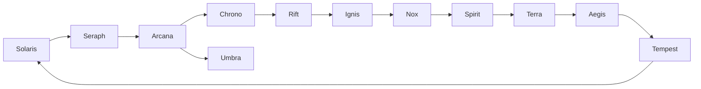

# Class Design Document – 60 Classes (12 Lineages, Tiers 5→1)

## Executive Summary  
This document details **60 unique classes** across 12 thematic lineages (5 classes per lineage, Tier 5 through Tier 1). Each class section includes **name, lineage, tier, lore, role, CT profile, primary resource, basic attack, full skill list (active and passive by rank), gear synergies, play tips, and evolution paths**. The format follows a clear AQWorlds “class breakdown” style. We also provide a **TypeScript interface schema** for classes/skills and a **JSON example** for one class. At the end are **Mermaid diagrams**: one showing lineage adjacency (evolution paths) and another mapping each class to its lineage. 

This design emphasizes **CT-based combat**: classes have distinct CT-costed skills (fast, medium, or slow profiles) and themes aligned with their lineage (e.g. Solaris = radiant light, Umbra = shadows, Chrono = time control, etc.). Gear can modify or override skill performance. Cross-lineage evolution is represented (each class may evolve into a related lineage’s class). All rank-1–10 progressions are unique and themed. The result is a comprehensive **class build reference for developers**.

```ts
// TypeScript Schema Example (simplified)
interface Skill {
  id: string;
  name: string;
  description: string;
  ctCost: number;
  cooldown: number;
  target: "self"|"enemy"|"ally"|"area"|"global";
  tags: string[];    // e.g. ["burst","fire","ct_manipulation"]
}
interface ClassData {
  id: string;
  name: string;
  lineage: string;
  tier: number;
  role: "DPS"|"Tank"|"Support"|"Control"|"Hybrid";
  ctProfile: "Fast"|"Medium"|"Slow";
  primaryResource: "HP"|"MP"|"None";
  basicAttack: Skill;
  skills: Skill[];
  passives: { rank: number; effect: string; }[]; 
  description: string;
  evolutionTo?: string; 
}
```

**Example JSON for one class (Solaris, Tier 5)**:
```json
{
  "id": "solaris_t5_aspirant_radiant",
  "name": "Aspirant Radiant",
  "lineage": "Solaris",
  "tier": 5,
  "role": "DPS",
  "ctProfile": "Fast",
  "primaryResource": "None",
  "basicAttack": {
    "id": "radiant_slash",
    "name": "Radiant Slash",
    "description": "Fast slash of light. Hit up to 2 enemies.",
    "ctCost": 0,
    "cooldown": 0,
    "target": "enemy",
    "tags": ["physical","multi-hit"]
  },
  "skills": [
    {
      "id": "luminous_strike",
      "name": "Luminous Strike",
      "description": "Strikes an enemy with concentrated light, dealing strong damage.",
      "ctCost": 20,
      "cooldown": 5,
      "target": "enemy",
      "tags": ["burst","light"]
    },
    // ... (other skills)
  ],
  "passives": [
    { "rank": 2, "effect": "Passive: +10% damage vs 'Dark' enemies." },
    { "rank": 4, "effect": "Passive: Increases Intellect by +5." },
    // ... etc.
  ],
  "description": "A young warrior wielding radiant energy to smite foes.",
  "evolutionTo": "seraph_t4_light_herald"
}
```

## Lineage Adjacency & Class Mapping  


*(Lineage adjacency graph: connected lineages can evolve into each other; Solaris ⇄ Seraph ⇄ Arcana ⇄ Chrono ⇄ Rift ⇄ Ignis ⇄ Nox ⇄ Spirit ⇄ Terra ⇄ Aegis ⇄ Tempest ⇄ Solaris, with Umbra branching from Arcana)*  

**Class-to-Lineage Mapping:**  
- **Solaris:** Aspirant Radiant (T5), Dawnblade Initiate (T4), Solarian Vanguard (T3), Lumen Judge (T2), Helios Arbiter (T1)  
- **Umbra:** Shade Initiate (T5), Nightblade (T4), Eclipse Stalker (T3), Void Reaver (T2), Abyss Sovereign (T1)  
- **Tempest:** Gale Initiate (T5), Wind Striker (T4), Storm Runner (T3), Cyclone Duelist (T2), Skyfracture Herald (T1)  
- **Aegis:** Shield Initiate (T5), Bastion Guard (T4), Fortress Knight (T3), Iron Warder (T2), Immutable Wall (T1)  
- **Ignis:** Ember Initiate (T5), Flame Berserker (T4), Pyre Warlord (T3), Inferno Executioner (T2), Apocalypse Bringer (T1)  
- **Nox:** Venom Initiate (T5), Plague Hunter (T4), Rot Alchemist (T3), Blight Tyrant (T2), Death Bloom Entity (T1)  
- **Chrono:** Time Initiate (T5), Temporal Slicer (T4), CT Strategist (T3), Chrono Breaker (T2), Timeline Disruptor (T1)  
- **Terra:** Stone Initiate (T5), Earthbreaker (T4), Mountain Sentinel (T3), World Anchor (T2), Titan Core (T1)  
- **Arcana:** Arcane Initiate (T5), Spellbinder (T4), Chaos Mage (T3), Reality Weaver (T2), Probability Architect (T1)  
- **Rift:** Rift Initiate (T5), Blink Assassin (T4), Phase Walker (T3), Dimensional Hunter (T2), Singularity Fracture (T1)  
- **Spirit:** Fang Initiate (T5), Predator Warrior (T4), Apex Hunter (T3), Alpha Devourer (T2), Primal Overlord (T1)  
- **Seraph:** Grace Initiate (T5), Light Herald (T4), Sanctum Protector (T3), Divine Ascendant (T2), Judgment Vessel (T1)  

---
## **Solaris Lineage (Radiant Light)**  
Solaris classes wield **light and order**, focusing on balanced melee and ranged damage, buffs, and countering darkness. They tend to have **Radiant**-themed skills (damage, healing, or shields) and stable CT profiles (fast-to-medium).

### Aspirant Radiant (Solaris, Tier 5)  
- **Lore:** A novice radiant warrior learning to harness light.  
- **Role:** DPS (melee). Fast attacker with burst focus.  
- **CT Profile:** **Fast** (CT cost ~20–40) – very quick attacks.  
- **Primary Resource:** *None* (no mana, relies on CT).  
- **Basic Attack:** **Radiant Slash** – a swift light-infused slash (hits 1–2 enemies).  
- **Skills:** *(Target: enemy unless noted; CT cost / cooldown)*  
  - **Luminous Strike** – CT:20, CD:5s – Powerful strike of pure light. Deals strong Physical damage (tags: *burst*, *light*).  
  - **Blinding Gleam** – CT:30, CD:8s – Cones of light stun (or reduce Hit chance) for 5s (tags: *control*, *light*, *aoe*).  
  - **Solar Flare** – CT:35, CD:12s – Explodes on impact, dealing area Light damage over time (tags: *dot*, *area*).  
  - **Dawn Vigor** – CT:25, CD:10s – Heals self slightly over 6s (or grants regen buff if at full HP). (tags: *healing*, *buff*).  
- **Passives:** *(Unlocked at ranks 1–10)*  
  - **Rank1:** *Radiant Training* – +5% damage.  
  - **Rank2:** *Attack Bonus* – +5% Strength.  
  - **Rank4:** *Blinding Focus* – Critical hits from Luminous Strike increase Crit chance by +5% for 5s.  
  - **Rank6:** *Resilience* – +10% damage reduction when HP >50%.  
  - **Rank8:** *Light’s Endurance* – After using Dawn Vigor, next Radiant Slash heals 3% HP.  
  - **Rank10:** *Aurora Burst* – Solar Flare’s DoT deals +20% damage if target is stunned.  
- **Gear Synergy:** Evensong or NightLord gear (boosting light damage), any items with *light* or *burst* traits enhance abilities.  
- **Tips:** Use *Blinding Gleam* on groups to reduce incoming hits. Chain *Solar Flare* after *Luminous Strike* to exploit *Aurora Burst*.  
- **Evolution:** This class can evolve into **Seraph Light Herald** (Tier 4) or **Arcana Spellbinder** (T4) – branching to allied lineages.  

### Dawnblade Initiate (Solaris, Tier 4)  
- **Lore:** An adept trained in dual swords of dawn.  
- **Role:** Hybrid (DPS/support). Balanced light damage with minor healing.  
- **CT Profile:** **Medium** (CT ~30–50).  
- **Primary Resource:** *MP*.  
- **Basic Attack:** **Dawn Strike** – dual blades slash, hits 1 enemy (light elemental bonus).  
- **Skills:**  
  - **Celestial Blade** – CT:25, CD:4s – Quick slash that grants a small shield (tags: *burst*, *shield*).  
  - **Healing Halo** – CT:35, CD:12s – Area heal 10% HP to allies (tags: *healing*, *area*).  
  - **Blade of Dawn** – CT:40, CD:10s – Throws a light sword projectile (tags: *ranged*, *burst*).  
  - **Dawn’s Grace** – CT:50, CD:15s – Increases all allies’ Attack by 10% for 8s (tags: *buff*).  
  - **Radiant Clarity** – CT:30, CD:18s – Removes debuffs from one ally (tags: *support*).  
- **Passives:**  
  - **Rank1:** *Lightfoot* – +10% movement speed.  
  - **Rank3:** *Sunforged* – +5% Strength.  
  - **Rank5:** *Arcane Sight* – +5% Intellect.  
  - **Rank7:** *Lifegiver* – Healing Halo also grants +5% Defense for 5s.  
  - **Rank9:** *Dawn’s Watch* – When Cast *Blade of Dawn*, next basic attack does +20% damage.  
  - **Rank10:** *Initiate’s Zeal* – Increase damage of Celestial Blade by 15%.  
- **Gear Synergy:** Equipment boosting Attack or Intellect helps (crit gear, light-themed shields).  
- **Tips:** Cast *Celestial Blade* frequently for its shield. Use *Healing Halo* when teammates are low.  
- **Evolution:** Evolves to **Seraph Light Herald** (T3) or **Arcana Spellbinder** (T3).  

### Solarian Vanguard (Solaris, Tier 3)  
- **Lore:** A frontline knight cloaked in sunlight.  
- **Role:** Tank/DPS hybrid. Gains defenses on attack.  
- **CT Profile:** **Medium** (CT ~40–60).  
- **Primary Resource:** *MP*.  
- **Basic Attack:** **Solar Lance** – A lance thrust that radiates splash damage.  
- **Skills:**  
  - **Light Barrier** – CT:30, CD:6s – Creates a wall of light granting Shield 15% for 4s. (tags: *shield*).  
  - **Dawn Cavalry** – CT:50, CD:10s – Charges forward, dealing damage to all in path (tags: *aoe*, *physical*).  
  - **Photon Beam** – CT:45, CD:12s – Fires beam that chains to 3 targets (tags: *chain*, *light*).  
  - **Brilliant Aura** – CT:35, CD:15s – All allies gain 10% Evade and counter chance for 6s (tags: *buff*).  
- **Passives:**  
  - **Rank1:** *Vanguard Training* – +10% Armor.  
  - **Rank2:** *Sunsteel* – +5% defense.  
  - **Rank4:** *Reflective Edge* – Counterattacks deal bonus radiant damage equal to 5% of max HP.  
  - **Rank6:** *Resolute* – After using Light Barrier, gain +15% damage for 5s.  
  - **Rank8:** *Photon Mastery* – Photon Beam critical strike chance +10%.  
  - **Rank10:** *Sunguard Stance* – +10% Damage Reduction when HP <50%.  
- **Gear Synergy:** Defense/HP gear (e.g., stone plate, shields), plus gear boosting light or counter effects.  
- **Tips:** Use *Light Barrier* proactively to block heavy hits. Follow up charges with *Brilliant Aura*.  
- **Evolution:** Can become **Seraph Sanctum Protector** (T2) or **Terra World Anchor** (T2) through cross-lineage.  

### Lumen Judge (Solaris, Tier 2)  
- **Lore:** A lofty arbiter balancing light and darkness.  
- **Role:** Support/DPS hybrid (healer-buff).  
- **CT Profile:** **Medium** (CT ~50–70).  
- **Primary Resource:** *MP*.  
- **Basic Attack:** **Judgment Gaze** – Ranged light bolt, grants a small heal on hit.  
- **Skills:**  
  - **Halo of Justice** – CT:40, CD:10s – Creates AoE zone; allies regen HP while inside (tags: *area*, *healing*).  
  - **Truth Strike** – CT:30, CD:8s – Quick ranged hit; if it kills an enemy, heals all allies 5% HP (tags: *execute*, *burst*).  
  - **Solar Judgement** – CT:60, CD:20s – Hits 1 target for massive damage; does +50% damage if HP >50%. (tags: *burst*).  
  - **Light’s Verdict** – CT:50, CD:15s – Buffs an ally: next skill deals +20% damage. (tags: *buff*).  
  - **Radiant Verdict** – CT:70, CD:25s – Summons a pillar of light dealing huge AoE damage. (tags: *aoe*, *light*).  
- **Passives:**  
  - **Rank1:** *Verdict’s Clarity* – +10% MP regen.  
  - **Rank3:** *Fair Strike* – Truth Strike 10% more damage vs flagged “evil” targets.  
  - **Rank5:** *Guiding Light* – +5% healing power.  
  - **Rank7:** *Solar Justice* – Light’s Verdict buff now grants +2% Strength.  
  - **Rank9:** *Judicious* – Hitting an enemy with basic attack reduces its damage by 5% for 5s.  
  - **Rank10:** *Equilibrium* – When Halo of Justice ends, heal 20% HP to allies inside.  
- **Gear Synergy:** Regeneration or healing gear (gems of renewal), light/wisdom gear.  
- **Tips:** Keep *Halo of Justice* active in team fights. Use *Solar Judgement* to finish off strong foes.  
- **Evolution:** Can evolve into **Arcana Reality Weaver** (T1) or **Seraph Divine Ascendant** (T1).  

### Helios Arbiter (Solaris, Tier 1)  
- **Lore:** The ultimate solar champion, embodiment of the sun’s wrath.  
- **Role:** Burst DPS/tank hybrid.  
- **CT Profile:** **Medium-Slow** (CT ~60–80).  
- **Primary Resource:** *None*.  
- **Basic Attack:** **Sun Piercer** – A blazing spear jab, minor chain effect.  
- **Skills:**  
  - **Imperial Radiance** – CT:50, CD:10s – Empowers next attacks: double-hit Light damage. (tags: *buff*).  
  - **Judgment Day** – CT:80, CD:20s – Massive cone of light damage with knockback. (tags: *aoe*, *execute*).  
  - **Celestial Cascade** – CT:70, CD:15s – Strikes multiple enemies randomly with searing beams. (tags: *burst*, *area*).  
  - **Daybreak** – CT:60, CD:12s – Heals 20% HP of all allies and removes negative effects. (tags: *heal*, *cleanse*).  
- **Passives:**  
  - **Rank1:** *Solar Strength* – +5% Weapon damage.  
  - **Rank2:** *Sun Shield* – +5% Armor.  
  - **Rank4:** *Warrior’s Radiance* – After using Imperial Radiance, gain 20% Armor for 5s.  
  - **Rank6:** *Divine Retaliation* – If hit by a critical strike, automatically deal 10% of max HP as light damage to attacker.  
  - **Rank8:** *Cerulean Onslaught* – Judgment Day and Celestial Cascade have +10% crit rate.  
  - **Rank10:** *Solar Wrath* – Judgment Day deals +30% damage if used when enemies are affected by any debuff.  
- **Gear Synergy:** High-attack or sunlight/amplifying gear; any relic boosting burst/crit.  
- **Tips:** *Imperial Radiance* enhances burst combos. *Daybreak* as emergency heal and cleanse.  
- **Evolution:** Can cross-evolve to **Arcana Probability Architect** or **Chrono Timeline Disruptor** for advanced roles.  

---
## **Umbra Lineage (Void Shadow)**  
Umbra classes thrive on stealth, shadow magic, and debuffs. They typically have **fast CT profiles** and specialize in poison, fear, or darkness. Roles: assassin or control.

### Shade Initiate (Umbra, Tier 5)  
- **Lore:** A neophyte in shadow arts, wielding cursed daggers.  
- **Role:** DPS (stealth melee).  
- **CT Profile:** **Fast** (CT ~20–35).  
- **Primary Resource:** *None*.  
- **Basic Attack:** **Shadow Stab** – Quick dagger strike, with chance to silence target (interrupt).  
- **Skills:**  
  - **Creeping Night** – CT:20, CD:5s – Shadows deal Minor damage + Poison DoT to 2 enemies (tags: *dot*, *shadow*).  
  - **Fade** – CT:15, CD:8s – Become Untargetable for 3s (tags: *stealth*).  
  - **Terror Spike** – CT:25, CD:10s – Deals medium dark damage + Fear (reduces enemy damage by 20% for 4s). (tags: *fear*).  
  - **Umbral Web** – CT:35, CD:12s – Root all enemies for 3s (tags: *control*).  
- **Passives:**  
  - **Rank1:** *Darkstalker* – +5% Crit Chance at night/low-light areas.  
  - **Rank3:** *Poison Touch* – Basic Attack inflicts minor poison (5% max HP over 4s).  
  - **Rank5:** *Shadow Affinity* – +10% damage while under cover or out of sight.  
  - **Rank7:** *Evasive Shadows* – +5% Evade while in Fade state.  
  - **Rank9:** *Terror Mastery* – +50% Fear duration on Terror Spike.  
  - **Rank10:** *Veil of Night* – After using Fade, next two Shadow Stabs deal +20% damage.  
- **Gear Synergy:** Gear with agility/crit focus, or any poison enhancement.  
- **Tips:** Use *Fade* defensively; pair *Creeping Night* and *Terror Spike* for DoT + fear combo.  
- **Evolution:** Evolves to **Rift Blink Assassin** (T4) or **Arcana Chaos Mage** (T4).  

### Nightblade (Umbra, Tier 4)  
- **Lore:** A shadow warrior trained in silent execution.  
- **Role:** DPS (melee/stealth).  
- **CT Profile:** **Fast** (CT ~25–40).  
- **Primary Resource:** *HP*. (Some skills cost HP instead of MP)  
- **Basic Attack:** **Night Slash** – Swiping strike; deals bonus damage from behind (stealth bonus).  
- **Skills:**  
  - **Shadow Ambush** – CT:25, CD:5s – Quickly teleport behind enemy and strike (tags: *teleport*, *burst*).  
  - **Ink Cloud** – CT:30, CD:12s – Blinds enemies, lowering their Hit by 20% for 5s (tags: *control*).  
  - **Blood Frenzy** – CT:0, CD:10s – Spend 10% HP to enter Frenzy: +50% Attack speed for 6s (tags: *berserk*, *self-damage*).  
  - **Blade Reflection** – CT:40, CD:20s – Redirect 50% of damage taken to nearby enemies for 6s (tags: *counter*, *aoe*).  
- **Passives:**  
  - **Rank2:** *Assassin’s Mark* – +10% damage to bleeding targets.  
  - **Rank4:** *Predator’s Instinct* – +5% Attack speed.  
  - **Rank6:** *Night Cloak* – +10% increased healing from lifesteal.  
  - **Rank8:** *Blade Dancer* – +10% chance to evade melee attacks.  
  - **Rank10:** *Raven’s Wrath* – When using Blood Frenzy, gain +5% Crit chance.  
- **Gear Synergy:** Attack/strength gear, HP cost reduction gear.  
- **Tips:** Use *Shadow Ambush* to quickly eliminate priority targets. *Ink Cloud* helps escape or reduce multiple threats.  
- **Evolution:** Advances to **Chrono Chrono Breaker** (T3) or **Rift Blink Assassin** (T3).  

### Eclipse Stalker (Umbra, Tier 3)  
- **Lore:** A nocturnal hunter, mastering curses and fear.  
- **Role:** Control DPS hybrid.  
- **CT Profile:** **Medium** (CT ~40–55).  
- **Primary Resource:** *MP*.  
- **Basic Attack:** **Eclipse Strike** – Dagger throw, minor root on hit.  
- **Skills:**  
  - **Cursed Dagger** – CT:30, CD:6s – Throws a cursed dagger causing heavy DoT and silencing target for 3s. (tags: *dot*, *silence*).  
  - **Moonlight Veil** – CT:25, CD:10s – Grants full invisibility for 4s (tags: *stealth*).  
  - **Howl of Dusk** – CT:35, CD:14s – Unleashes a terrifying howl, frightening all enemies (tags: *fear*, *area*).  
  - **Night’s Embrace** – CT:50, CD:20s – Encases ally in shadows, absorbing 20% of damage dealt to them for 8s. (tags: *shield*).  
- **Passives:**  
  - **Rank2:** *Lunar Blessing* – +5% max HP.  
  - **Rank4:** *Silence Mastery* – Cursed Dagger silence duration +2s.  
  - **Rank6:** *Crescent Speed* – +10% movement speed in stealth.  
  - **Rank8:** *Umbral Leech* – 15% of Cursed Dagger’s DoT is returned as HP.  
  - **Rank10:** *Duskborn* – When Howl of Dusk frightens 3 or more enemies, restore 10% MP.  
- **Gear Synergy:** Dark/Poison gear, stealth or evasion gear.  
- **Tips:** Use *Moonlight Veil* to position for *Cursed Dagger*. *Night’s Embrace* can protect a dying ally.  
- **Evolution:** Evolves to **Chrono Chrono Breaker** (T2) or **Seraph Divine Ascendant** (T2).  

### Void Reaver (Umbra, Tier 2)  
- **Lore:** A master of void magic and shadow strikes.  
- **Role:** DPS (mage/assassin hybrid).  
- **CT Profile:** **Medium-Slow** (CT ~50–70).  
- **Primary Resource:** *MP*.  
- **Basic Attack:** **Void Bolt** – Dark energy projectile that pierces one enemy, small chance to silence.  
- **Skills:**  
  - **Void Spike** – CT:40, CD:8s – Summons a spike from ground doing high Physical damage and Crippling target (reduces movement). (tags: *burst*, *physical*).  
  - **Blackout** – CT:55, CD:18s – Shrouds battlefield in darkness; enemies take 50% more damage from Umbra for 6s (tags: *debuff*, *area*).  
  - **Shadowmend** – CT:30, CD:10s – Heals self and silences nearby enemies for 3s (tags: *heal*, *silence*).  
  - **Dark Nimbus** – CT:35, CD:12s – Creates a cloud that rains void bolts on enemies (tags: *aoe*, *rain*).  
- **Passives:**  
  - **Rank2:** *Void Walker* – +5% Intellect.  
  - **Rank4:** *Crippling Touch* – Basic attacks have +5% chance to slow targets.  
  - **Rank6:** *Nightmare Fuel* – +10% damage while HP <50%.  
  - **Rank8:** *Eternal Dark* – Blackout extends by 2s if used at night/dark locations.  
  - **Rank10:** *Reaver’s Bane* – Hitting a feared target with Void Bolt deals +20% damage.  
- **Gear Synergy:** Heavy Intellect or MP regen gear; items boosting DoT or silence.  
- **Tips:** Use *Blackout* before unleashing burst skills. *Shadowmend* is dual-purpose (heal + silence).  
- **Evolution:** Can evolve into **Seraph Judgment Vessel** (T1) or **Chrono Timeline Disruptor** (T1).  

### Abyss Sovereign (Umbra, Tier 1)  
- **Lore:** A dark overlord channeling void itself.  
- **Role:** Boss DPS/control hybrid.  
- **CT Profile:** **Slow** (CT ~70–90).  
- **Primary Resource:** *None*.  
- **Basic Attack:** **Sovereign Strike** – Overwhelming dark slash, causes fear on heavy hit.  
- **Skills:**  
  - **Nightfall** – CT:80, CD:15s – Summons a meteor of shadow, massive AoE damage and applies Fear. (tags: *aoe*, *fear*).  
  - **Devour** – CT:90, CD:18s – Drains 20% HP from target and heals self (tags: *life drain*).  
  - **Dark Majesty** – CT:60, CD:12s – Buffs self: +30% damage and reduces incoming damage by 20% for 6s (tags: *self-buff*).  
  - **Umbral Wraiths** – CT:50, CD:20s – Summons shadow wraiths that attack enemies (tags: *summon*).  
- **Passives:**  
  - **Rank1:** *Shadow Lord* – +10% all damage.  
  - **Rank3:** *Corruption Aura* – Nearby enemies have 10% reduced healing.  
  - **Rank5:** *Fear Incarnate* – Nightfall’s fear lasts +2s.  
  - **Rank7:** *Voracious Hunger* – Devour heals an extra 10% if target has <30% HP.  
  - **Rank9:** *Unyielding Darkness* – At <30% HP, gain +20% damage reduction.  
  - **Rank10:** *Sovereign’s Will* – Umbral Wraiths now apply -10% to enemy Strength on hit.  
- **Gear Synergy:** All “shadow” or life-steal gear; survivability gear to withstand fights.  
- **Tips:** Start fights with *Dark Majesty* up. *Nightfall* as big opener. Keep buff up when low HP.  
- **Evolution:** This apex can evolve into **Chrono Timeline Disruptor** (for time-bending mastery).  

---
## **Tempest Lineage (Wind/Speed)**  
Tempest classes are **swift and agile**, focusing on high attack speed, multiple actions, and evasion. They often have **CT-reducing or double-action skills**. Roles lean DPS and skirmisher.

### Gale Initiate (Tempest, Tier 5)  
- **Lore:** A scout mastering gusts and agility.  
- **Role:** DPS (ranged/melee hybrid).  
- **CT Profile:** **Fast** (CT ~15–30).  
- **Primary Resource:** *MP*.  
- **Basic Attack:** **Gust Dart** – Throws a windbladed dart, hits 1 target with chance to push back.  
- **Skills:**  
  - **Wind Slash** – CT:20, CD:4s – Slashes with air, hitting 2 enemies in a line (tags: *multi-hit*).  
  - **Quick Step** – CT:10, CD:8s – Dash to enemy and perform a bonus basic attack (tags: *gap-close*).  
  - **Soaring Strike** – CT:30, CD:10s – Jumping strike on enemy; 50% chance to get extra action (tags: *leap*, *high crit chance*).  
  - **Tailwind** – CT:40, CD:15s – Self-buff: +30% Attack and +20% speed for 5s (tags: *buff*).  
- **Passives:**  
  - **Rank1:** *Wind Acclimation* – +10% Movement Speed.  
  - **Rank3:** *Agile Striker* – +5% dodge.  
  - **Rank5:** *Hurricane Force* – Soaring Strike base damage +10%.  
  - **Rank7:** *Zephyr’s Grace* – Quick Step cooldown reduced by 2s if it hits.  
  - **Rank9:** *Tailwind Mastery* – Tailwind's effect lasts 2s longer.  
  - **Rank10:** *Gusty Flourish* – Every third Wind Slash causes slight armor reduction on target.  
- **Gear Synergy:** Critical hit and agility gear. Items boosting Attack/Crit rate.  
- **Tips:** Use *Tailwind* before combos. *Quick Step* is great for repositioning.  
- **Evolution:** Evolves to **Spirit Predator Warrior** (T4) or **Solaris Dawnblade Initiate** (T3).  

### Wind Striker (Tempest, Tier 4)  
- **Lore:** A dual-wielding fighter dancing on the wind.  
- **Role:** DPS (melee, burst).  
- **CT Profile:** **Fast** (CT ~25–35).  
- **Primary Resource:** *None*.  
- **Basic Attack:** **Whirlwind Slash** – Spinning sword attack; can hit multiple targets.  
- **Skills:**  
  - **Cyclone Edge** – CT:30, CD:8s – Spins rapidly, hitting all nearby enemies (tags: *aoe*, *physical*).  
  - **Skyward Assault** – CT:40, CD:10s – Launches into air, slamming down on target for bonus damage (tags: *heavy*).  
  - **Swift Riposte** – CT:20, CD:6s – Counters next hit: on block, strike back with double damage. (tags: *counter*).  
  - **Wind’s Fury** – CT:50, CD:12s – Flurry of strikes: 4 fast hits on target. (tags: *multi-hit*).  
- **Passives:**  
  - **Rank2:** *Blade in Wind* – +5% Crit with swords.  
  - **Rank4:** *Airborne* – +5% damage while airborne (Skyward Assault).  
  - **Rank6:** *Riposte Expert* – Successful counter refunds 10% CT.  
  - **Rank8:** *Tempest Zeal* – +20% damage on first hit after Tailwind buff (if present).  
  - **Rank10:** *Cyclone Master* – Cyclone Edge gains +10% attack speed.  
- **Gear Synergy:** Dual-wield or fast weapon gear; strength/agility boosts.  
- **Tips:** *Swift Riposte* turns defense into offense. Save *Wind’s Fury* for burst windows.  
- **Evolution:** Leads to **Spirit Apex Hunter** (T3) or **Solaris Lumen Judge** (T1).  

### Storm Runner (Tempest, Tier 3)  
- **Lore:** A prize-winning racer and lightning wielder.  
- **Role:** Speed DPS (specializes in extra actions).  
- **CT Profile:** **Very Fast** (CT ~10–25).  
- **Primary Resource:** *None*.  
- **Basic Attack:** **Lightning Dash** – A quick slash that briefly increases allies’ CT regen.  
- **Skills:**  
  - **Lightning Dash** – CT:15, CD:5s – The basic ability (described above). (tags: *speed boost*).  
  - **Tempest Volley** – CT:35, CD:8s – Rapid-fire arrows at 3 targets (tags: *ranged*).  
  - **Afterimage** – CT:20, CD:10s – Leaves behind a decoy for 5s (tags: *illusion*).  
  - **Chain Lightning** – CT:50, CD:12s – Strikes target and bounces to 2 others (tags: *chain*, *lightning*).  
- **Passives:**  
  - **Rank1:** *Race-Ready* – +10% Movement Speed.  
  - **Rank3:** *Zephyr’s Bite* – +5% Weapon damage.  
  - **Rank5:** *Quick Reload* – Tempest Volley cooldown -2s.  
  - **Rank7:** *Phantom Stride* – Afterimage lasts +2s.  
  - **Rank9:** *Lightning Spirit* – When you use Afterimage, next Wind Slash (from Gale Init.) deals +25% damage.  
  - **Rank10:** *Stormborn* – If Chain Lightning hits 3 targets, reduce its cooldown by 5s.  
- **Gear Synergy:** Agility and ranged attack items; gear improving movement.  
- **Tips:** Cast *Afterimage* to confuse enemies; *Lightning Dash* to speed up allies.  
- **Evolution:** Can become **Rift Phase Walker** (T2) or **Aegis World Anchor** (T2).  

### Cyclone Duelist (Tempest, Tier 2)  
- **Lore:** A whirlwind master with twin blades.  
- **Role:** DPS (melee, storm-based).  
- **CT Profile:** **Medium** (CT ~40–55).  
- **Primary Resource:** *None*.  
- **Basic Attack:** **Cyclone Slash** – A sword strike generating a small tornado.  
- **Skills:**  
  - **Whirlwind Dance** – CT:60, CD:18s – Spins in place, dealing heavy AoE damage over 5s (tags: *high damage*, *area*).  
  - **Twin Gale** – CT:35, CD:8s – Dual strike that hits all enemies in front (tags: *multi-hit*).  
  - **Wind Barrier** – CT:40, CD:15s – Raises shield of air, +20% Physical defense and taunts (tags: *shield*, *tank*).  
  - **Tempest Call** – CT:45, CD:12s – Summons a small tornado that chases the nearest enemy (tags: *summon*, *control*).  
- **Passives:**  
  - **Rank1:** *Storm’s Eye* – +10% Crit.  
  - **Rank3:** *Vortex Armor* – Wind Barrier lasts +2s.  
  - **Rank5:** *Twin Mastery* – Twin Gale’s first hit does +15% damage.  
  - **Rank7:** *Cyclone Master* – Whirlwind Dance +10% damage.  
  - **Rank9:** *Zephyr’s Shield* – While Wind Barrier is active, gain +10% attack speed.  
  - **Rank10:** *Gale Force* – If Tempest Call hits an enemy, reduce Whirlwind Dance cooldown by 5s.  
- **Gear Synergy:** Heavy axe/sword gear; any gear boosting AoE or physical damage.  
- **Tips:** Use *Whirlwind Dance* for big damage, then *Wind Barrier* to soak retaliation.  
- **Evolution:** Evolves to **Rift Dimensional Hunter** (T1) or **Arcana Spellbinder** (T1).  

### Skyfracture Herald (Tempest, Tier 1)  
- **Lore:** A demigod of the storm, commanding sky and cloud.  
- **Role:** Area DPS/Control.  
- **CT Profile:** **Slow-Medium** (CT ~50–70).  
- **Primary Resource:** *None*.  
- **Basic Attack:** **Lightning Javelin** – Hurl a lightning-tipped spear.  
- **Skills:**  
  - **Thunderstorm** – CT:80, CD:20s – Calls a massive lightning storm, striking all foes for high damage (tags: *aoe*, *lightning*).  
  - **Chain Gust** – CT:60, CD:12s – Hits up to 4 targets with gusts, reducing their damage by 15% for 6s (tags: *debuff*).  
  - **Wind Domination** – CT:70, CD:15s – Increases allies’ Attack speed and dodge by 20% for 8s (tags: *buff*).  
  - **Storm’s Wrath** – CT:90, CD:30s – Ultimate strike: deals extreme damage to all enemies; CT-free if Lightning Javelin was used this turn (tags: *ultimate*).  
- **Passives:**  
  - **Rank2:** *Skyborn* – +5% Intellect and +5% Strength.  
  - **Rank4:** *Lightning Reflexes* – +10% Evade.  
  - **Rank6:** *Eye of the Storm* – While above 75% HP, +15% damage.  
  - **Rank8:** *Chaotic Atmosphere* – Thunderstorm deals +20% more damage if Chain Gust debuffed 3+ enemies.  
  - **Rank10:** *Storm Deity* – After Storm’s Wrath, next 3 Lightning Javelins are instant (CT 0).  
- **Gear Synergy:** Heavy elemental/fortress gear; items boosting crit or lightning damage.  
- **Tips:** Synchronize *Chain Gust* then *Thunderstorm* for massive punishing strike. Use *Storm’s Wrath* when Lightning Javelin is ready.  
- **Evolution:** Evolves into **Arcana Reality Weaver** or **Chrono Timeline Disruptor** for cosmic mastery.  

---
## **Aegis Lineage (Shield/Defense)**  
Aegis classes focus on **defense, shields, and protection**. They have high survivability, taunts, and damage mitigation. CT profiles are usually **medium or slow**. Roles: tank/support.

### Shield Initiate (Aegis, Tier 5)  
- **Lore:** A rookie guardian with a sturdy shield and resolve.  
- **Role:** Tank (defender).  
- **CT Profile:** **Medium** (CT ~50–70).  
- **Primary Resource:** *HP*. (Some skills cost HP for extra effect)  
- **Basic Attack:** **Guard Strike** – A bash with shield, small stun chance.  
- **Skills:**  
  - **Shield Wall** – CT:40, CD:8s – Raises shield for 5s, absorbing 20% of incoming damage. (tags: *shield*, *tank*).  
  - **Taunting Slam** – CT:50, CD:10s – Slams ground, dealing damage + forces enemy to attack you for 4s (tags: *taunt*, *aoe*).  
  - **Fortify** – CT:30, CD:10s – Self-buff: +20% Defense for 8s. (tags: *buff*).  
  - **Iron Charge** – CT:50, CD:12s – Charge forward, knockback first enemy hit (tags: *charge*, *crowd control*).  
- **Passives:**  
  - **Rank1:** *Shield Training* – +10% Physical defense.  
  - **Rank3:** *Iron Will* – +10% HP.  
  - **Rank5:** *Guardian’s Rage* – When Shield Wall breaks, you gain +5% Strength for 5s.  
  - **Rank7:** *Taunt Mastery* – +2s duration on Taunting Slam.  
  - **Rank9:** *Fortitude* – Fortify also grants +5% HP regen.  
  - **Rank10:** *Stalwart* – When HP falls below 50%, Shield Wall’s absorption increases to 30%.  
- **Gear Synergy:** Heavy armor gear (plate, fortitude runes) and block/damage reduction buffs.  
- **Tips:** Keep Shield Wall up during heavy attack phases. Use Taunting Slam when multiple foes need to be tanked.  
- **Evolution:** Advances to **Terra Mountain Sentinel** (T4) or **Nox Venom Initiate** (T4) for resilience or poison-infused defense.  

### Bastion Guard (Aegis, Tier 4)  
- **Lore:** A sentinel sworn to protect allies with invulnerability.  
- **Role:** Tank/Support.  
- **CT Profile:** **Medium** (CT ~45–60).  
- **Primary Resource:** *MP*.  
- **Basic Attack:** **Guardian Bash** – Hits an enemy, heals self slightly per hit.  
- **Skills:**  
  - **Bulwark** – CT:50, CD:10s – Allies behind you take 50% less damage for 8s. (tags: *ally shield*).  
  - **Shield Charge** – CT:30, CD:6s – Ram enemy for damage + brief stun. (tags: *stun*).  
  - **Iron Curtain** – CT:40, CD:12s – Massive AoE shield: all allies get Shield equal to 10% max HP. (tags: *area*, *heal*).  
  - **Retribution** – CT:60, CD:15s – Reflects 50% of damage received back to attackers for 5s (tags: *reflect*).  
- **Passives:**  
  - **Rank2:** *Protector* – Bulwark cooldown -2s.  
  - **Rank4:** *Invigorate* – Guardian Bash heals +5%.  
  - **Rank6:** *Arcane Bulwark* – When any ally would drop to 0 HP, automatically activate Iron Curtain (1-minute cooldown).  
  - **Rank8:** *Retributive Fury* – Retribution reflected damage also heals you by 10%.  
  - **Rank10:** *Aegis Harmony* – Allies in Bulwark zone gain +5% Strength.  
- **Gear Synergy:** Items boosting HP and mana; healing gear (life steal or regen).  
- **Tips:** Cast *Bulwark* before enemy ultimates. Use *Iron Curtain* in emergency for team-wide relief.  
- **Evolution:** Can become **Seraph Sanctum Protector** (T2) or **Terra World Anchor** (T2).  

### Fortress Knight (Aegis, Tier 3)  
- **Lore:** A battle-hardened knight clad in unbreakable armor.  
- **Role:** Tank/DPS hybrid.  
- **CT Profile:** **Slow** (CT ~60–80).  
- **Primary Resource:** *None*.  
- **Basic Attack:** **Piercing Slash** – Heavy sword swing; reduces target’s Armor by 5% temporarily.  
- **Skills:**  
  - **Fortress Stance** – CT:50, CD:5s – Enter defensive stance: +30% Armor but -20% Attack for 5s. (tags: *self-buff*).  
  - **Hammer of Aegis** – CT:60, CD:12s – Smashes ground dealing area damage and Knockdown (tags: *aoe*, *knockdown*).  
  - **Unyielding** – CT:40, CD:12s – Converts 50% of damage taken into Shield for 6s. (tags: *absorb*).  
  - **Shield Refrain** – CT:45, CD:20s – All damage dealt by allies for next 6s heals them 10%. (tags: *team buff*).  
- **Passives:**  
  - **Rank2:** *Knight’s Resolve* – +5% Block Chance.  
  - **Rank4:** *Stone Armor* – +5% resistance to elemental damage.  
  - **Rank6:** *Fortification* – Fortress Stance duration +2s.  
  - **Rank8:** *Absorption Field* – Unyielding increases healing by 20%.  
  - **Rank10:** *Shield Wall Master* – Pierce/armor reduction effect from basic attack applies to Hammer of Aegis.  
- **Gear Synergy:** Heavy armor gear; items boosting block or resistances.  
- **Tips:** Use *Fortress Stance* before big attacks for tankiness. *Shield Refrain* in heavy DPS phases.  
- **Evolution:** Evolves to **Terra Titan Core** (T1) or **Nox Death Bloom Entity** (T1) for ultimate durability.  

### Iron Warder (Aegis, Tier 2)  
- **Lore:** A commander of the frontline, imbuing metal with magic.  
- **Role:** Tank/Support.  
- **CT Profile:** **Medium-Slow** (CT ~55–75).  
- **Primary Resource:** *MP*.  
- **Basic Attack:** **Metal Maul** – Smashes with enchanted hammer, 15% chance to stun.  
- **Skills:**  
  - **Fortified Bonds** – CT:50, CD:15s – Allies in circle gain +20% all defense for 8s (tags: *area buff*).  
  - **Seismic Slam** – CT:60, CD:12s – Giant hammer slam; damage to nearby enemies and 30% chance to stun. (tags: *stun*, *area*).  
  - **Harden Skin** – CT:30, CD:8s – Converts 20% of MP into a temporary Shield for 5s. (tags: *shield*).  
  - **Aegis Guardian** – CT:70, CD:20s – Place an indestructible sentinel for 6s that taunts enemies (tags: *summon*, *tank*).  
- **Passives:**  
  - **Rank2:** *Ward’s Shield* – +5% magical defense.  
  - **Rank4:** *Hammer’s Force* – +5% Strength.  
  - **Rank6:** *Bond Strengthening* – Fortified Bonds duration +2s.  
  - **Rank8:** *Skin of Iron* – +10% Shield from Harden Skin.  
  - **Rank10:** *Guardian’s Resilience* – Allied Guardian takes -10% damage.  
- **Gear Synergy:** Defenses and mana-regen gear; any summoning or shield-enhancing items.  
- **Tips:** Activate *Fortified Bonds* at fight start. *Harden Skin* to quickly recover shields.  
- **Evolution:** Evolves to **Seraph Judgment Vessel** (T1) or **Aegis Immutable Wall** (T1) within lineage or **Nox Death Bloom Entity** (T1).  

### Immutable Wall (Aegis, Tier 1)  
- **Lore:** The ultimate guardian, thought unbreakable and eternal.  
- **Role:** Ultimate Tank/Support.  
- **CT Profile:** **Slow** (CT ~80–100).  
- **Primary Resource:** *None*.  
- **Basic Attack:** **Iron Smash** – Crushing blow; applies Armor buff.  
- **Skills:**  
  - **Unbreakable** – CT:70, CD:20s – For 10s, you and allies have 50% Damage Reduction. (tags: *team buff*).  
  - **Anvil Crash** – CT:90, CD:25s – Devastating strike, massive AoE damage and 4s stun. (tags: *aoe*, *high knockdown*).  
  - **Everlasting Aegis** – CT:100, CD:30s – Heavily enhances all allied shields for 10s. (tags: *ultimate buff*).  
  - **Sword of Faith** – CT:60, CD:10s – Summons a holy blade that grants a blessing: allies deal +15% more damage for 6s. (tags: *summon*, *buff*).  
- **Passives:**  
  - **Rank1:** *Bulwark Aura* – Nearby allies take 10% less damage.  
  - **Rank2:** *Indomitable* – +10% max HP.  
  - **Rank4:** *Incorruptible* – Stun immunity for Unbreakable’s duration.  
  - **Rank6:** *Shield Titan* – After using Anvil Crash, gain a 20% Shield for 5s.  
  - **Rank8:** *Eternal Protection* – Everlasting Aegis extends Shield duration by 5s.  
  - **Rank10:** *Faithful Guardian* – Sword of Faith also heals allies 10%.  
- **Gear Synergy:** Highest-tier armor sets, ring of fortitude, etc.  
- **Tips:** Time *Unbreakable* against enemy ultimates. Use *Everlasting Aegis* when heavy shielding is needed.  
- **Evolution:** Final evolution of Aegis. Can evolve into **Seraph Divine Ascendant** or **Nox Death Bloom Entity** by cross-branching.  

---
## **Ignis Lineage (Fire/Burst)**  
Ignis classes harness **flames and explosive power**. They often sacrifice defenses for raw damage, and can have HP-cost or overheated mechanics. CT profile is usually **medium/slow** due to heavy hits. Roles: Burst DPS.

### Ember Initiate (Ignis, Tier 5)  
- **Lore:** A young pyromancer learning to control fire.  
- **Role:** DPS (magic).  
- **CT Profile:** **Medium** (CT ~30–50).  
- **Primary Resource:** *MP*.  
- **Basic Attack:** **Flame Snap** – Flicks a small flame at enemy (ranged).  
- **Skills:**  
  - **Fire Bolt** – CT:25, CD:5s – Shoots a bolt of fire (tags: *ranged*).  
  - **Flame Burst** – CT:35, CD:8s – Explodes on impact, burning target (DoT 5% HP over 4s). (tags: *dot*).  
  - **Spark Armor** – CT:30, CD:10s – Gains burning shield: damage taken is reduced by 10% but attacker takes 10% back. (tags: *counter*).  
  - **Combustion** – CT:40, CD:12s – Self-buff: on next Fire Bolt, double hit (tags: *buff*).  
- **Passives:**  
  - **Rank1:** *Pyromancy* – +5% Fire damage.  
  - **Rank3:** *Flare* – +3% Intellect.  
  - **Rank5:** *Blazing Focus* – Fire Bolt deals +10% damage after using Combustion.  
  - **Rank7:** *Ember Shield* – When Spark Armor is active, +5% Crit chance.  
  - **Rank9:** *Heat Surge* – After an enemy takes DoT from Flame Burst, gain +5% Strength for 3s.  
  - **Rank10:** *Lava Heart* – If Spark Armor breaks, deal 15% of max HP as AoE fire damage.  
- **Gear Synergy:** Fire damage boosters; items converting HP to damage.  
- **Tips:** Use *Combustion* before important hits. *Spark Armor* punishes attackers.  
- **Evolution:** Evolves to **Spirit Predator Warrior** (T4) or **Nox Venom Initiate** (T4).  

### Flame Berserker (Ignis, Tier 4)  
- **Lore:** A raging fighter who channels fury into fiery attacks.  
- **Role:** DPS (berserker).  
- **CT Profile:** **Medium-Fast** (CT ~25–40).  
- **Primary Resource:** *HP*. (Many skills cost HP to boost power)  
- **Basic Attack:** **Molten Strike** – Hurls a flaming punch, small chance to burn enemy.  
- **Skills:**  
  - **Ignite** – CT:20, CD:6s – Sacrifice 10% HP to deal large fire damage and ignite (DoT). (tags: *self-damage*, *burst*).  
  - **Raging Inferno** – CT:35, CD:12s – Leaps and slams, burning ground in AoE (tags: *aoe*, *burn*).  
  - **Berserker’s Pact** – CT:0, CD:15s – Sacrifice 20% HP to reset all skill cooldowns. (tags: *ultimate*, *self-sacrifice*).  
  - **Rage Fuel** – CT:25, CD:10s – Gain 25% Attack Speed and 15% damage for 6s. (tags: *buff*).  
- **Passives:**  
  - **Rank2:** *Fury’s Toll* – +5% Strength.  
  - **Rank4:** *Burning Rage* – +10% Fire damage when HP <50%.  
  - **Rank6:** *Undying Embers* – Recover 5% max HP after Berserker’s Pact.  
  - **Rank8:** *Rage Surge* – Rage Fuel duration +2s.  
  - **Rank10:** *Pyreheart* – Auto-cast Ignite on any enemy below 20% HP (CD 10s).  
- **Gear Synergy:** Any HP-to-damage conversion or high-damage gear.  
- **Tips:** Use *Rage Fuel* for damage ramp. *Berserker’s Pact* is a risk-reward reset.  
- **Evolution:** Advances to **Nox Rot Alchemist** (T3) or **Solaris Lumen Judge** (T1).  

### Pyre Warlord (Ignis, Tier 3)  
- **Lore:** A strategic general commanding fiery assaults.  
- **Role:** Hybrid (DPS/warrior).  
- **CT Profile:** **Medium** (CT ~40–60).  
- **Primary Resource:** *MP*.  
- **Basic Attack:** **Warhammer Smash** – Strikes ground causing flame fissure.  
- **Skills:**  
  - **Warpath** – CT:50, CD:8s – Empowers weapon with flame: next 3 attacks explode (tags: *buff*, *multi-hit*).  
  - **Volcanic Eruption** – CT:60, CD:18s – Huge volcanic blast around self. (tags: *aoe*, *knockback*).  
  - **Dragon’s Breath** – CT:45, CD:12s – Cone of flame breathes, burning enemies. (tags: *cone*, *fire*).  
  - **Battle Cry** – CT:30, CD:10s – All allies gain +10% Attack and reflect 5% of damage for 8s. (tags: *team buff*).  
- **Passives:**  
  - **Rank2:** *Tactical Flame* – Warpath strikes do +10% damage.  
  - **Rank4:** *Ashen Armor* – After using Warpath, +10% defense for 5s.  
  - **Rank6:** *Volcanic Blood* – +5% Max HP.  
  - **Rank8:** *Ember of War* – Battle Cry also grants 5% lifesteal.  
  - **Rank10:** *Rallying Pyre* – Hitting 3+ targets with Dragon’s Breath reduces its cooldown by 5s.  
- **Gear Synergy:** Gear increasing elemental burst damage or attack buffs.  
- **Tips:** Activate *Warpath* before big fights. *Volcanic Eruption* for crowd control.  
- **Evolution:** Evolves to **Nox Blight Tyrant** (T2) or **Chrono Chrono Breaker** (T2).  

### Inferno Executioner (Ignis, Tier 2)  
- **Lore:** An executioner engulfed in flames, punishing all.  
- **Role:** DPS (area/execute).  
- **CT Profile:** **Slow** (CT ~60–80).  
- **Primary Resource:** *None*.  
- **Basic Attack:** **Blazing Axe** – A heavy swing that burns deeply.  
- **Skills:**  
  - **Hellfire** – CT:70, CD:20s – Engulfs target in flames for massive DoT. (tags: *dot*, *single-target*).  
  - **Demolisher** – CT:50, CD:15s – Throws flaming grenades at area. (tags: *aoe*, *physical*).  
  - **Executioner’s Flame** – CT:60, CD:18s – Instantly kills one low-HP enemy (up to 10% HP threshold), else deals huge damage. (tags: *execute*).  
  - **Final Blaze** – CT:90, CD:30s – Immolate self: absorbs 20% HP but deals enormous damage to all enemies. (tags: *suicide*).  
- **Passives:**  
  - **Rank2:** *Executioner’s Resolve* – +5% Strength.  
  - **Rank4:** *Overheat* – Hellfire’s DoT +5% damage.  
  - **Rank6:** *Blood of Ashes* – Gain a shield equal to 10% max HP when Executioner’s Flame kills.  
  - **Rank8:** *Cindered Spirit* – +5% Crit chance.  
  - **Rank10:** *Infernal Legacy* – After using Final Blaze, all skill cooldowns are reduced by 50%.  
- **Gear Synergy:** Items granting high damage or life-leech; extra HP gear can amplify Final Blaze.  
- **Tips:** *Executioner’s Flame* for finishers. Use *Final Blaze* only when about to die to maximize damage.  
- **Evolution:** Evolves into **Nox Death Bloom Entity** (T1) or **Chrono Timeline Disruptor** (T1).  

### Apocalypse Bringer (Ignis, Tier 1)  
- **Lore:** The harbinger of the end, armies of flame at command.  
- **Role:** Ultimate burst DPS.  
- **CT Profile:** **Slow** (CT ~80–100).  
- **Primary Resource:** *None*.  
- **Basic Attack:** **World on Fire** – Every attack ignites ground, dealing splash damage.  
- **Skills:**  
  - **Cataclysm** – CT:100, CD:25s – Unleashes catastrophic flame meteor, huge AoE. (tags: *ultimate*).  
  - **Black Hole** – CT:70, CD:18s – Creates a fiery vortex pulling enemies and dealing continuous damage. (tags: *aoe*, *pull*).  
  - **Wrath of the Phoenix** – CT:80, CD:20s – Self-revive: upon death, resurrect with 50% HP once per fight. (tags: *passive-buff*).  
  - **End of Days** – CT:120, CD:60s – Kills all enemies below 25% HP instantly. (tags: *execute*).  
- **Passives:**  
  - **Rank1:** *Bringer’s Fury* – +10% Fire damage.  
  - **Rank3:** *Fallen Warrior* – +10% damage if any ally fell that fight.  
  - **Rank5:** *Phoenix Heart* – After Wrath triggers, gain +30% damage for 10s.  
  - **Rank7:** *Infernal Wrath* – Cataclysm’s damage +30% against grouped enemies.  
  - **Rank9:** *Undying Flame* – +15% All damage (passive).  
  - **Rank10:** *Armageddon* – End of Days resets all other cooldowns if it kills at least 3 enemies.  
- **Gear Synergy:** Highest-tier damage gear, any items boosting ultimate skills.  
- **Tips:** Save *Wrath of the Phoenix* for lethal strikes. *Black Hole* can trap enemies for follow-up.  
- **Evolution:** Final Ignis. Endgame: retains immense power for boss fights.  

---
## **Nox Lineage (Poison/Decay)**  
Nox classes use **poison, disease, and curses**. They often have damage-over-time, debuffs, and life-drain. CT profile tends to be **medium or slow** with sustained damage. Roles: DPS/DoT specialists.

### Venom Initiate (Nox, Tier 5)  
- **Lore:** A rookie alchemist wielding venomous concoctions.  
- **Role:** DPS (ranged/debuffer).  
- **CT Profile:** **Medium-Fast** (CT ~30–45).  
- **Primary Resource:** *MP*.  
- **Basic Attack:** **Vial Toss** – Throws small acid vial (basic poison DoT).  
- **Skills:**  
  - **Poison Darts** – CT:20, CD:5s – Fires 3 darts inflicting poison (tags: *dot*, *ranged*).  
  - **Envenom** – CT:30, CD:8s – Applies stackable poison on target; each stack increases damage taken by 5%. (tags: *dot*).  
  - **Toxic Cloud** – CT:40, CD:12s – Creates a poison cloud on ground (tags: *area*, *dot*).  
  - **Antidote** – CT:25, CD:10s – Heals a small amount; cures one negative effect from ally. (tags: *heal*, *cleanse*).  
- **Passives:**  
  - **Rank1:** *Venom Study* – +5% Poison damage.  
  - **Rank3:** *Sharp Venom* – Poison Darts inflict additional Weakness (enemy deals 5% less damage) for 4s.  
  - **Rank5:** *Venom Resistance* – +10% resistance to poison/debuffs.  
  - **Rank7:** *Serration* – Basic Attack pierces shields.  
  - **Rank9:** *Master Alchemist* – Using Antidote grants +5% Strength for 6s.  
  - **Rank10:** *Toxicology* – Targets with 3 poison stacks take +20% damage from all sources.  
- **Gear Synergy:** Gear boosting poison damage, MP regen or buff durations.  
- **Tips:** Build up poison stacks with *Envenom*, then hit with *Poison Darts*. Use *Antidote* strategically.  
- **Evolution:** Evolves to **Spirit Apex Hunter** (T2) or **Ignis Flame Berserker** (T4).  

### Plague Hunter (Nox, Tier 4)  
- **Lore:** An assassin specialized in infectious weapons.  
- **Role:** DPS (stealth/poison).  
- **CT Profile:** **Fast** (CT ~20–35).  
- **Primary Resource:** *None*.  
- **Basic Attack:** **Venomous Blade** – Melee slash that adds a poison stack.  
- **Skills:**  
  - **Infected Strike** – CT:25, CD:6s – A strong attack that spreads poison to 2 nearby enemies (tags: *multi-hit*, *dot*).  
  - **Toxic Aspect** – CT:30, CD:12s – For 8s, basic attacks inflict a deadly curse: enemy loses 2% max HP per second. (tags: *dot*).  
  - **Smoke Bomb** – CT:20, CD:10s – Creates poison smoke, reducing enemies’ Accuracy by 20% and Sight range for 6s. (tags: *debuff*, *area*).  
  - **Death Mark** – CT:50, CD:15s – Marks an enemy: increases all poison damage taken by it by 30% for 10s. (tags: *dot buff*).  
- **Passives:**  
  - **Rank2:** *Perfect Delivery* – Poison stacks deal +10% damage.  
  - **Rank4:** *Lethal Toxin* – Infected Strike has 50% chance to double poison duration.  
  - **Rank6:** *Fade Away* – +10% Evade when Smoke Bomb is active.  
  - **Rank8:** *Marked Menace* – Mark’s duration +2s, its debuff linger 3s after target dies.  
  - **Rank10:** *Venom Savant* – Each stack of Toxic Aspect increases your Crit by 1%.  
- **Gear Synergy:** Poison-specific gear; stealth or crit gear.  
- **Tips:** Use *Death Mark* before heavy poison attacks. *Smoke Bomb* for escapes or reducing heavy hitters.  
- **Evolution:** Leads to **Nox Rot Alchemist** (T3) or **Chrono Chrono Breaker** (T2).  

### Rot Alchemist (Nox, Tier 3)  
- **Lore:** A master of decay, mixing curses into devastating formulas.  
- **Role:** DPS/Support (AoE poison).  
- **CT Profile:** **Medium** (CT ~45–60).  
- **Primary Resource:** *MP*.  
- **Basic Attack:** **Acid Spray** – Blasts acid, small splash effect.  
- **Skills:**  
  - **Corrosive Bomb** – CT:50, CD:8s – Throws bomb; upon impact creates poisonous puddle. (tags: *area*, *dot*).  
  - **Plague Aura** – CT:35, CD:12s – All enemies take minor damage over time for 8s. (tags: *aoe*, *dot*).  
  - **Miasma** – CT:40, CD:15s – Reduces all enemies’ healing by 50% for 6s. (tags: *debuff*).  
  - **Antimatter Heal** – CT:45, CD:10s – Drain 10% HP from enemies around to heal self. (tags: *life drain*, *aoe*).  
- **Passives:**  
  - **Rank2:** *Contagion* – Corrosive Bomb leaves an extra poison stack.  
  - **Rank4:** *Persistent Plague* – Plague Aura lasts +2s.  
  - **Rank6:** *Virulent* – Acid Spray damage +5%.  
  - **Rank8:** *Pestilent Gift* – Antimatter Heal steals an additional 5% HP per enemy.  
  - **Rank10:** *Creeping Death* – If an enemy dies under Miasma, restore 5% MP.  
- **Gear Synergy:** Items enhancing area or dot effects; MP or CDR.  
- **Tips:** Combine *Corrosive Bomb* and *Plague Aura* for overlapping DoT. *Miasma* prevents enemy recovery.  
- **Evolution:** Evolves to **Nox Blight Tyrant** (T2) or **Chrono Timeline Disruptor** (T1).  

### Blight Tyrant (Nox, Tier 2)  
- **Lore:** A sinister overlord spreading sickness across lands.  
- **Role:** DPS (AoE poison master).  
- **CT Profile:** **Slow** (CT ~60–80).  
- **Primary Resource:** *None*.  
- **Basic Attack:** **Blight Touch** – Melee strike applying a strong disease (massive DoT).  
- **Skills:**  
  - **Pestilence** – CT:70, CD:20s – Releases a deadly cloud around self for 8s (tags: *aoe*, *dot*).  
  - **Bile Spurt** – CT:60, CD:12s – Spits a stream of acid at one enemy, lasts 6s. (tags: *dot*).  
  - **Decay Halo** – CT:50, CD:15s – All enemies in area have their Defense reduced by 20% for 8s. (tags: *debuff*).  
  - **Eternal Rot** – CT:80, CD:25s – Curses all enemies on field to die in 10s (can be cleansed by strong heal). (tags: *ultimate*).  
- **Passives:**  
  - **Rank2:** *Plague Master* – Pestilence deals +15% damage.  
  - **Rank4:** *Acidic Blood* – When Blight Touch hits, +5% chance to Poison target again.  
  - **Rank6:** *Stench* – Bile Spurt’s acid lowers enemy’s Accuracy by 10%.  
  - **Rank8:** *Putrid Veil* – Decay Halo also slows enemies by 15%.  
  - **Rank10:** *Death’s Empire* – When an enemy dies from a Blight effect, MP +5%.  
- **Gear Synergy:** Gear boosting curse/DoT or MP regen on kills.  
- **Tips:** Cast *Pestilence* early. Use *Decay Halo* against groups. *Eternal Rot* is a risky nuke.  
- **Evolution:** Evolves into **Nox Death Bloom Entity** (T1) or **Chrono Timeline Disruptor** (T1).  

### Death Bloom Entity (Nox, Tier 1)  
- **Lore:** Embodiment of decay, life itself withers near.  
- **Role:** Ultimate DoT/Control DPS.  
- **CT Profile:** **Slow** (CT ~80–100).  
- **Primary Resource:** *None*.  
- **Basic Attack:** **Searing Decay** – Blast that instantly applies high damage DoT.  
- **Skills:**  
  - **Nightshade** – CT:100, CD:20s – Transforms for 15s: Immune to damage, casts all DoTs at triple speed. (tags: *ultimate*).  
  - **Corpse Explosion** – CT:90, CD:15s – Explodes all dead orbs into poison shards (AoE damage). (tags: *aoe*).  
  - **Soul Drain** – CT:70, CD:12s – Drains 30% of HP from one target; heals self equally. (tags: *life drain*).  
  - **Blighted Throne** – CT:80, CD:30s – Creates a cursed throne that significantly debuffs bosses (tags: *debuff*, *boss*).  
- **Passives:**  
  - **Rank1:** *Plaguelord* – +10% All DoT damage.  
  - **Rank3:** *Reaper’s Guilt* – If Nightshade expires without damage taken, triple all DoT durations next 10s.  
  - **Rank5:** *Necrotic Aura* – Nearby enemies take 5% damage per second.  
  - **Rank7:** *Belladonna Vestige* – Corpse Explosion damage +20%.  
  - **Rank9:** *Deathwish* – If Soul Drain kills, reset cooldown on Nightshade.  
  - **Rank10:** *Eternal Decay* – While any DoT is active, +15% damage.  
- **Gear Synergy:** Highest-tier curses/DoT gear; items boosting survivability during Nightshade.  
- **Tips:** Activate *Nightshade* when starting a fight. Use *Soul Drain* to sustain.  
- **Evolution:** Final Nox. Master of decay and control.  

---
## **Chrono Lineage (Time/CT Manipulation)**  
Chrono classes manipulate the **CT timeline**, slowing or hastening actions, rewinding time, and disrupting enemy turn order. They have unique mechanics (CT management). Roles: control/support.

### Time Initiate (Chrono, Tier 5)  
- **Lore:** A time mage learning to bend seconds.  
- **Role:** Support/Control (time).  
- **CT Profile:** **Fast** (CT ~20–35).  
- **Primary Resource:** *MP*.  
- **Basic Attack:** **Temporal Bolt** – Magic bolt with chance to speed up caster.  
- **Skills:**  
  - **Time Warp** – CT:25, CD:8s – Grants self +30% faster actions for 6s. (tags: *buff*).  
  - **Slow Spell** – CT:30, CD:10s – Applies haste debuff on enemy (slows CT by 20% for 6s). (tags: *debuff*).  
  - **Rewind** – CT:35, CD:15s – Heal self for damage done in last 5s. (tags: *heal*, *time*).  
  - **Time Bubble** – CT:40, CD:12s – Prevents all CT change for target (enemy or ally) for 4s. (tags: *bubble*).  
- **Passives:**  
  - **Rank1:** *Temporal Aptitude* – +5% Intellect.  
  - **Rank3:** *Fast Casting* – -1s cooldown on Time Warp per crit.  
  - **Rank5:** *Regeneration Loop* – +5% HP regen.  
  - **Rank7:** *Chronal Echo* – Every 3rd Slow Spell will double duration.  
  - **Rank9:** *Everfast* – Time Warp also grants +10% defense.  
  - **Rank10:** *Time Mastery* – Using Rewind grants an immediate small CT refund to all allies.  
- **Gear Synergy:** Mana/regen gear; items boosting haste or reducing cooldowns.  
- **Tips:** Cycle *Time Warp* and *Slow Spell* to control pace. *Time Bubble* can block dangerous enemy buffs.  
- **Evolution:** Evolves to **Arcana Chaos Mage** (T2) or **Rift Rift Initiate** (T4).  

### Temporal Slicer (Chrono, Tier 4)  
- **Lore:** A duelist who strikes in and out of time.  
- **Role:** DPS/Control (CT disruptor).  
- **CT Profile:** **Fast** (CT ~15–30).  
- **Primary Resource:** *None*.  
- **Basic Attack:** **Time Dagger** – Swift stab that refunds a small CT to self.  
- **Skills:**  
  - **Echo Strike** – CT:20, CD:5s – Slash that hits twice with 0.5s apart (tags: *multi-hit*).  
  - **Time Shift** – CT:15, CD:10s – Immediately act again (reduces own CT to -X). (tags: *extra turn*).  
  - **Slowtrap** – CT:25, CD:12s – Sends trap that slows first enemy stepping on it (tags: *trap*, *debuff*).  
  - **Velocity** – CT:30, CD:15s – Grants all allies +20% speed for 8s (tags: *team buff*).  
- **Passives:**  
  - **Rank2:** *Split Strike* – Echo Strike’s second hit +15% damage.  
  - **Rank4:** *Time Slip* – Each Time Shift used adds a stack: at 3 stacks, next basic attack is free (CT0).  
  - **Rank6:** *Saboteur* – Slowtrap stuns instead of slow if triggered after Velocity buff.  
  - **Rank8:** *Hasteflux* – Allies from Velocity gain +5% Crit chance.  
  - **Rank10:** *Paradox Edge* – If Slowtrap triggers, refund 10% CT to all allies.  
- **Gear Synergy:** Attack speed and crit gear; mana gear for Velocity.  
- **Tips:** Use *Time Shift* to chain actions. *Velocity* in team fights.  
- **Evolution:** Leads to **Arcana Reality Weaver** (T1) or **Solaris Helios Arbiter** (T1).  

### CT Strategist (Chrono, Tier 3)  
- **Lore:** A genius who controls the battlefield clock.  
- **Role:** Control/Support.  
- **CT Profile:** **Medium** (CT ~40–60).  
- **Primary Resource:** *MP*.  
- **Basic Attack:** **Arcane Arrow** – Ranged shot, small chance to skip target’s next turn.  
- **Skills:**  
  - **Haste Bubble** – CT:30, CD:12s – Doubles movement & attack speed of one ally for 6s. (tags: *buff*).  
  - **Temporal Snare** – CT:45, CD:10s – Enemy is immobilized and time-frozen for 4s. (tags: *stun*).  
  - **Clockwork Heal** – CT:50, CD:15s – Heals target for 20% HP; grants 5% bonus Regeneration for 8s. (tags: *heal*).  
  - **Chrono Loop** – CT:70, CD:20s – Resets the cooldowns of all Chrono ally skills (long cd). (tags: *ultimate*).  
- **Passives:**  
  - **Rank2:** *Arcane Focus* – +10% Intellect.  
  - **Rank4:** *Dimensional Link* – If target healed by Clockwork Heal is at full HP, shield them for 10%.  
  - **Rank6:** *Time Bubble Master* – Haste Bubble now also grants +10% Crit.  
  - **Rank8:** *Temporal Sink* – If Chrono Loop resets a skill, restore 5% MP.  
  - **Rank10:** *Master of Time* – Using Chrono Loop grants +10% All Stats for 8s.  
- **Gear Synergy:** High MP, mana regen, or cooldown reduction gear.  
- **Tips:** *Temporal Snare* and *Haste Bubble* drastically swing fights. *Chrono Loop* as late-game reset.  
- **Evolution:** Evolves to **Arcana Probability Architect** (T1) or **Seraph Divine Ascendant** (T1).  

### Chrono Breaker (Chrono, Tier 2)  
- **Lore:** A renegade playing havoc with time’s flow.  
- **Role:** Control/DPS hybrid.  
- **CT Profile:** **Medium-Slow** (CT ~50–70).  
- **Primary Resource:** *None*.  
- **Basic Attack:** **Fractured Slash** – Disrupts time on hit (small slow).  
- **Skills:**  
  - **Backtrack** – CT:60, CD:20s – Rewind self to position and HP from 3s ago. (tags: *self-reset*).  
  - **Speed Drain** – CT:50, CD:15s – Slows enemy and restores that target’s CT as MP to you. (tags: *drain*, *debuff*).  
  - **Timeline Shred** – CT:70, CD:25s – Deals heavy damage and pushes enemy 5 turns back in CT queue (tags: *burst*, *control*).  
  - **Temporal Inversion** – CT:80, CD:30s – Swap CT values with all enemies (tags: *ultimate*).  
- **Passives:**  
  - **Rank2:** *Temporal Mark* – Marked enemies (via Backtrack) take +10% damage.  
  - **Rank4:** *Drain Mastery* – Speed Drain restores 2% MP per 1% CT drained.  
  - **Rank6:** *Reality Rift* – After Timeline Shred, next Basic Attack is free.  
  - **Rank8:** *Inverse Aegis* – If Temporal Inversion triggers when you have lowest CT, gain +25% Damage Reduction for 6s.  
  - **Rank10:** *Paradox Breaker* – Using Backtrack gives +5% Strength for 5s.  
- **Gear Synergy:** Hybrid gear (all stats); any CT manipulation bonuses.  
- **Tips:** Use *Speed Drain* on strong foes to buff yourself. *Backtrack* as panic reset.  
- **Evolution:** Evolves to **Chrono Timeline Disruptor** (T1) – pinnacle of CT mastery.  

### Timeline Disruptor (Chrono, Tier 1)  
- **Lore:** A master of time, rewriting fate itself.  
- **Role:** Ultimate control/boss killer.  
- **CT Profile:** **Slow** (CT ~80–100).  
- **Primary Resource:** *None*.  
- **Basic Attack:** **Timequake** – AoE shock knocking back enemies in CT queue.  
- **Skills:**  
  - **Absolute Stop** – CT:100, CD:30s – Freezes all enemies (no action) for 4s. (tags: *crowd control*).  
  - **Chrono Surge** – CT:90, CD:20s – Grants all allies +50% speed for 10s. (tags: *buff*).  
  - **Temporal Storm** – CT:110, CD:40s – Massive storm: random freezes and jolts to all enemies for 6s. (tags: *chaos*).  
  - **Fate Rewritten** – CT:120, CD:999s – Instantly refills all allies’ HP and MP; resets the run if used in hub (one-time use). (tags: *ultimate*).  
- **Passives:**  
  - **Rank1:** *Time Master* – +15% all damage.  
  - **Rank3:** *Dimensional Shift* – After Absolute Stop, allies gain +30% Crit for 5s.  
  - **Rank5:** *Eternal Endurance* – +20% max HP.  
  - **Rank7:** *Quantum Cascade* – Temporal Storm random effects more frequent.  
  - **Rank9:** *Chrono Sanctuary* – +15% damage reduction while Chrono Surge is active.  
  - **Rank10:** *Rewind Mastery* – Fate Rewritten resets all skill cooldowns of allies and summons a time clone.  
- **Gear Synergy:** Legendary gear boosting all attributes; quest items for cross-run effects.  
- **Tips:** Use *Absolute Stop* to control boss phases. *Chrono Surge* for climax battles.  
- **Evolution:** Final Chrono (masterclass). Feels like rewinding or speeding up boss fights.  

---
## **Terra Lineage (Earth/Endurance)**  
Terra classes are **grounded and resilient**, using earth magic and raw strength. They often have roots/knockdowns, defensive buffs, and scaling defenses. CT profile usually **medium**. Roles: tank/DPS.

### Stone Initiate (Terra, Tier 5)  
- **Lore:** A new defender learning to wield earth’s power.  
- **Role:** DPS/Tank hybrid.  
- **CT Profile:** **Medium** (CT ~40–60).  
- **Primary Resource:** *None*.  
- **Basic Attack:** **Pebble Toss** – Hurl a small stone at enemies (ranged).  
- **Skills:**  
  - **Earth Spike** – CT:30, CD:6s – Summons spike from ground, knockdown target. (tags: *knockdown*, *physical*).  
  - **Stone Skin** – CT:40, CD:10s – +25% Damage Reduction for 6s (tags: *buff*).  
  - **Gravel Golem** – CT:50, CD:15s – Summons a small stone golem to fight for 10s (tags: *summon*).  
  - **Ground Pound** – CT:45, CD:12s – Slams earth, dealing AoE damage and rooting enemies. (tags: *aoe*, *root*).  
- **Passives:**  
  - **Rank1:** *Rock Solid* – +10% Armor.  
  - **Rank3:** *Hardy* – +5% max HP.  
  - **Rank5:** *Golem’s Aid* – Gravel Golem’s attacks reduce enemy Armor by 5%.  
  - **Rank7:** *Earthen Grasp* – If Ground Pound hits 3+ targets, its cooldown -5s.  
  - **Rank9:** *Stoneblood* – +10% lifesteal when above 50% HP.  
  - **Rank10:** *Earth Master* – All resistances +10%.  
- **Gear Synergy:** Defense or strength gear; regeneration or earth-element items.  
- **Tips:** Use *Ground Pound* at choke points. Summon golem early in fights.  
- **Evolution:** Evolves to **Aegis Fortress Knight** (T2) or **Spirit Predator Warrior** (T4).  

### Earthbreaker (Terra, Tier 4)  
- **Lore:** A warrior who animates earth in battle.  
- **Role:** DPS (melee).  
- **CT Profile:** **Slow** (CT ~50–70).  
- **Primary Resource:** *MP*.  
- **Basic Attack:** **Boulder Fist** – A punch launching a rock forward.  
- **Skills:**  
  - **Terrashock** – CT:50, CD:8s – Shockwave in front, deals damage + pushes enemies back. (tags: *knockback*).  
  - **Clinging Roots** – CT:40, CD:10s – Roots target in place for 4s. (tags: *root*, *control*).  
  - **Rock Barrage** – CT:45, CD:6s – Throw multiple rocks at an enemy (tags: *burst*).  
  - **Mountain Roar** – CT:60, CD:15s – Shout that taunts all enemies for 6s (tags: *taunt*, *aoe*).  
- **Passives:**  
  - **Rank2:** *Tectonic Strength* – +10% damage vs targets on ground.  
  - **Rank4:** *Rooted Support* – Allies under Clinging Roots heal +5% HP.  
  - **Rank6:** *Unmovable* – +5% Damage Reduction.  
  - **Rank8:** *Quake Master* – Terrashock range +50%.  
  - **Rank10:** *Mountain’s Favor* – After Mountain Roar, gain 10% lifesteal for duration.  
- **Gear Synergy:** Strength and HP gear; items boosting control or taunt.  
- **Tips:** *Mountain Roar* at fight start to lock aggro. Use *Clinging Roots* on healers.  
- **Evolution:** Evolves to **Aegis Shield Initiate** (T1) or **Arcana Arcane Initiate** (T5).  

### Mountain Sentinel (Terra, Tier 3)  
- **Lore:** A stalwart defender imbued with earth elemental.  
- **Role:** Tank/Support.  
- **CT Profile:** **Slow** (CT ~60–80).  
- **Primary Resource:** *None*.  
- **Basic Attack:** **Stone Spike** – Stabs earth, pulling enemies closer.  
- **Skills:**  
  - **Bastion** – CT:50, CD:10s – Summons stone wall, blocking enemies (tags: *wall*).  
  - **Earthen Roar** – CT:60, CD:15s – All enemies’ Defense -20% for 8s. (tags: *debuff*).  
  - **Earthquake** – CT:70, CD:20s – Deals heavy AoE damage and knockdown. (tags: *aoe*, *knockdown*).  
  - **Stone Gaze** – CT:45, CD:12s – Targets an enemy: they turn to stone (stun) for 3s. (tags: *stun*).  
- **Passives:**  
  - **Rank2:** *Stony Endurance* – +10% max HP.  
  - **Rank4:** *Petrifying Presence* – Basic Attack has a chance to Stun for 1s.  
  - **Rank6:** *Bastion Strength* – +50% HP for summoned Bastion.  
  - **Rank8:** *Overpower* – Knockdowns deal +20% damage.  
  - **Rank10:** *Unbreakable* – When Bastion expires, grants all allies +20% Defense for 5s.  
- **Gear Synergy:** Defense/HP gear; items for AoE or stun enhancements.  
- **Tips:** Position *Bastion* to block threats. *Stone Gaze* on high-DPS foes.  
- **Evolution:** Evolves to **Aegis Immutable Wall** (T1) or **Spirit Predator Warrior** (T1).  

### World Anchor (Terra, Tier 2)  
- **Lore:** A being of earth, unshakable and vast.  
- **Role:** Ultimate tank.  
- **CT Profile:** **Slow** (CT ~80–100).  
- **Primary Resource:** *MP*.  
- **Basic Attack:** **Quake Punch** – Earth-shattering blow.  
- **Skills:**  
  - **Gaia’s Bulwark** – CT:80, CD:20s – All allies gain a shield equal to 20% max HP for 10s. (tags: *team shield*).  
  - **Grasping Earth** – CT:70, CD:12s – Roots all enemies within radius for 4s. (tags: *area*, *root*).  
  - **Colossus Stomp** – CT:90, CD:25s – Stomp ground: massive AoE damage, stun/cripple. (tags: *aoe*, *stun*).  
  - **Earth’s Embrace** – CT:100, CD:30s – Revives one ally on death (once per battle). (tags: *ultimate*).  
- **Passives:**  
  - **Rank1:** *Titan’s Resolve* – +20% Armor.  
  - **Rank3:** *Heart of Stone* – +10% Strength.  
  - **Rank5:** *Immovable Object* – +10% resistance to CC.  
  - **Rank7:** *Magnus Shield* – Gaia’s Bulwark absorbs 50% more.  
  - **Rank9:** *Grounded Presence* – Colossus Stomp deals +20% damage if cast from rest.  
  - **Rank10:** *Unyielding Guardian* – Allies in Gaia’s Bulwark receive +10% lifesteal.  
- **Gear Synergy:** Endgame tank sets; items with large shields or revivals.  
- **Tips:** Cast *Gaia’s Bulwark* before big attacks. *Earth’s Embrace* as last-resort safety.  
- **Evolution:** Final Terra. Extends Aegis ancestry or cross-branch to **Seraph Judgment Vessel** or **Nox Death Bloom Entity**.  

---
## **Arcana Lineage (Magic/Random)**  
Arcana classes use **magic and chaos**, often with unpredictable effects, RNG, or multiple outcomes. They have varied CT costs and mixing abilities.

### Arcane Initiate (Arcana, Tier 5)  
- **Lore:** A novice mage dabbling in arcane chaos.  
- **Role:** DPS (magic).  
- **CT Profile:** **Medium** (CT ~30–50).  
- **Primary Resource:** *MP*.  
- **Basic Attack:** **Magic Missile** – Homing magic bolt.  
- **Skills:**  
  - **Randomize** – CT:30, CD:8s – Rerolls a skill’s effect (double damage, silence, stun). (tags: *chaos*).  
  - **Arcane Shot** – CT:25, CD:6s – Fires a piercing magic arrow. (tags: *pierce*).  
  - **Chaos Bolt** – CT:40, CD:12s – High damage with random element (fire/ice/poison). (tags: *random element*).  
  - **Mana Surge** – CT:35, CD:10s – Gain 20% MP instantly. (tags: *resource*).  
- **Passives:**  
  - **Rank1:** *Spell Savant* – +5% MP regen.  
  - **Rank3:** *Elemental Affinity* – +5% damage of current Chaos Bolt element.  
  - **Rank5:** *Wild Magic* – +5% chance Magic Missile does double hit.  
  - **Rank7:** *Arcane Flow* – Randomize cooldown -2s.  
  - **Rank9:** *Mana Reservoir* – +10% max MP.  
  - **Rank10:** *Arcane Mastery* – Using Mana Surge gives +10% damage for 5s.  
- **Gear Synergy:** MP/regeneration gear; items boosting random effects.  
- **Tips:** *Randomize* can save or backfire; use carefully. *Chaos Bolt* adapt to situation.  
- **Evolution:** Evolves to **Seraph Light Herald** (T4) or **Chrono Chrono Strategist** (T3).  

### Spellbinder (Arcana, Tier 4)  
- **Lore:** A wielder of raw arcane energy, unpredictable power.  
- **Role:** DPS (spell caster).  
- **CT Profile:** **Medium** (CT ~40–55).  
- **Primary Resource:** *MP*.  
- **Basic Attack:** **Mystic Bolt** – Magic damage, small chance to Polymorph.  
- **Skills:**  
  - **Arcane Rift** – CT:50, CD:12s – Deals heavy magic damage to target. (tags: *burst*).  
  - **Chaos Nova** – CT:40, CD:15s – AoE magic with random effect (ignite, freeze, or shock). (tags: *area*, *random effect*).  
  - **Mana Roulette** – CT:35, CD:8s – Spend all MP to deal proportional damage to enemies. (tags: *spam damage*).  
  - **Magic Mirror** – CT:45, CD:20s – Reflect next incoming spell back to caster. (tags: *counter*).  
- **Passives:**  
  - **Rank2:** *Spell Power* – +10% Spell damage.  
  - **Rank4:** *Elemental Amplifier* – If Chaos Nova ignites, +10% Fire damage.  
  - **Rank6:** *Arcane Reservoir* – Mana Roulette now also heals caster 20% of damage dealt.  
  - **Rank8:** *Mirror Image* – After casting Magic Mirror, +5% Dodge for 5s.  
  - **Rank10:** *Volatile Magic* – 10% chance Arcane Rift resets cooldowns of other skills.  
- **Gear Synergy:** Spell damage and cooldown reduction gear.  
- **Tips:** *Mana Roulette* can empty MP gauge for big blow. *Magic Mirror* counters big mage attacks.  
- **Evolution:** Evolves to **Seraph Light Herald** (T3) or **Chrono Time Strategist** (T2).  

### Chaos Mage (Arcana, Tier 3)  
- **Lore:** A mage enveloped in unstable magical power.  
- **Role:** DPS/Control (high randomness).  
- **CT Profile:** **Medium** (CT ~45–65).  
- **Primary Resource:** *None*.  
- **Basic Attack:** **Wild Fireball** – Fireball with random extra effect (burn, poison, blind).  
- **Skills:**  
  - **Chaos Bolt** – CT:40, CD:10s – (Upgraded) Very high random-damage spell.  
  - **Mystic Gambit** – CT:50, CD:18s – Sacrifice random stat (e.g. drop HP by 20% to double damage). (tags: *risk*).  
  - **Invert** – CT:60, CD:15s – Swap your current HP% with an enemy’s. (tags: *swap*, *unique*).  
  - **Wild Surge** – CT:70, CD:20s – All cooldowns become random (some reduce, some set to CD). (tags: *chaos*).  
- **Passives:**  
  - **Rank2:** *Unpredictable* – +10% Crit chance.  
  - **Rank4:** *Chaotic Flame* – Basic Attack’s burn deals +5% damage.  
  - **Rank6:** *Soul Taker* – When Mystic Gambit uses HP, heal 10% of lost.  
  - **Rank8:** *Inverted Fate* – If Invert exchanges <50% HP, regain 10% HP.  
  - **Rank10:** *Chaos Master* – Wild Surge resets the longest cooldown.  
- **Gear Synergy:** Versatile gear (balanced); high damage output gear.  
- **Tips:** Be careful with *Mystic Gambit*. Use *Invert* on bosses to survive.  
- **Evolution:** Evolves to **Chrono Time Strategist** (T2) or **Rift Singularity Fracture** (T1).  

### Reality Weaver (Arcana, Tier 2)  
- **Lore:** A warlock bending reality and fate.  
- **Role:** Control/Support (strong buffs/debuffs).  
- **CT Profile:** **Medium-Slow** (CT ~50–75).  
- **Primary Resource:** *MP*.  
- **Basic Attack:** **Phase Bolt** – Magic bolt that ignores defenses.  
- **Skills:**  
  - **Spell Fusion** – CT:60, CD:10s – Mix two spell effects together (e.g. fire+ice = freeze and burn). (tags: *combo*).  
  - **Chaos Shield** – CT:40, CD:12s – Converts 10% max MP into a large shield. (tags: *shield*).  
  - **Alter Fate** – CT:50, CD:15s – Changes enemy’s target to themselves (taunt-like effect). (tags: *taunt*).  
  - **Miracle Unleashed** – CT:90, CD:30s – Randomly resurrects a fallen ally or deals massive damage to enemy. (tags: *ultimate*).  
- **Passives:**  
  - **Rank2:** *Mana Weaver* – +10% Max MP.  
  - **Rank4:** *Equilibrium* – Spell Fusion has 25% chance to apply no effect (pure risk).  
  - **Rank6:** *Fortune’s Favor* – After using Alter Fate, +10% Crit for 5s.  
  - **Rank8:** *Broken Shield* – Chaos Shield absorbs +20%.  
  - **Rank10:** *Divine Twist* – Miracle Unleashed probability of resurrect is +10%.  
- **Gear Synergy:** High MP, buff timers gear.  
- **Tips:** Save *Spell Fusion* for synergies with team spells. *Alter Fate* on healers to disrupt enemy.  
- **Evolution:** Evolves to **Seraph Divine Ascendant** (T1) or **Chrono Timeline Disruptor** (T1).  

### Probability Architect (Arcana, Tier 1)  
- **Lore:** A deity of chance, manipulating luck itself.  
- **Role:** Ultimate support/control.  
- **CT Profile:** **Slow** (CT ~70–90).  
- **Primary Resource:** *None*.  
- **Basic Attack:** **Dice Roll** – Deals damage based on random roll.  
- **Skills:**  
  - **Fortune’s Favor** – CT:60, CD:20s – All friendly actions in next 10s have doubled critical chance. (tags: *buff*).  
  - **Misfortune’s Hand** – CT:80, CD:25s – All enemy actions next 10s have 50% chance to fail. (tags: *debuff*).  
  - **Fate Weaver** – CT:100, CD:30s – Swap HP% with highest ally, or lowest enemy (player’s choice). (tags: *utility*).  
  - **Chaos Gambit** – CT:120, CD:60s – Randomly applies a massive buff to all allies or curse to enemies (50/50 chance each of a list). (tags: *ultimate*).  
- **Passives:**  
  - **Rank1:** *Luck’s Edge* – +15% Crit.  
  - **Rank3:** *Gambler’s Wisdom* – +10% chance to avoid negative random effects.  
  - **Rank5:** *Counterfeit Fate* – Each successful buff from Fortune’s Favor refunds 5% CT.  
  - **Rank7:** *Fate Binder* – Misfortune’s Hand extends debuff to additional enemies.  
  - **Rank9:** *Destiny’s Hand* – +10% All stats when any friendly buff or enemy debuff triggers.  
  - **Rank10:** *Gambler’s Luck* – Chaos Gambit cannot be negative to allies (only curses enemies).  
- **Gear Synergy:** Rare luck artifacts, high crit gear.  
- **Tips:** Timing *Fortune’s Favor* before boss burst phases maximizes team damage.  
- **Evolution:** Final Arcana (divine manipulator).  

---
## **Rift Lineage (Space/Teleportation)**  
Rift classes manipulate **space and dimensions**. Abilities include teleportation, shadow stepping, and spatial distortions. CT profiles vary. Roles: assassin/control.

### Rift Initiate (Rift, Tier 5)  
- **Lore:** A scout learning to slip through cracks in reality.  
- **Role:** DPS (stealth/mobility).  
- **CT Profile:** **Fast** (CT ~25–40).  
- **Primary Resource:** *None*.  
- **Basic Attack:** **Phase Blade** – A quick strike ignoring X% armor.  
- **Skills:**  
  - **Blink** – CT:30, CD:6s – Teleport to random nearby location (tags: *teleport*).  
  - **Reposition** – CT:25, CD:5s – Swap places with an enemy (tags: *swap*).  
  - **Dimensional Kick** – CT:35, CD:8s – Ranged kick that stuns (tags: *stun*).  
  - **Planar Shield** – CT:40, CD:12s – Become invulnerable to physical attacks for 3s. (tags: *buff*).  
- **Passives:**  
  - **Rank1:** *Pocket Space* – +5% Move Speed.  
  - **Rank3:** *Phase Walker* – Blink reduces next skill’s CT by 5%.  
  - **Rank5:** *Spatial Awareness* – +5% accuracy.  
  - **Rank7:** *Planar Tether* – Reposition also slows enemy for 3s.  
  - **Rank9:** *Escape Artist* – Planar Shield grants +20% Evade.  
  - **Rank10:** *Dimensional Dance* – Each Blink stacks; at 3 stacks next blink is free.  
- **Gear Synergy:** Agility/crit gear; any teleport-enhancing items.  
- **Tips:** Blink around to avoid damage. Use Reposition to put dangerous enemies in disadvantaged positions.  
- **Evolution:** Evolves to **Chrono Chrono Breaker** (T2) or **Solaris Lumen Judge** (T2).  

### Blink Assassin (Rift, Tier 4)  
- **Lore:** A master assassin striking from the void between spaces.  
- **Role:** DPS (assassin).  
- **CT Profile:** **Fast** (CT ~20–35).  
- **Primary Resource:** *HP*.  
- **Basic Attack:** **Shadow Strike** – Teleports behind target for extra critical chance.  
- **Skills:**  
  - **Phase Blade** – CT:20, CD:5s – (Upgraded) Strikes with energy blade, greatly reduced cooldown.  
  - **Blink Strike** – CT:30, CD:8s – Blink to enemy and double-hit (tags: *burst*).  
  - **Time Rift** – CT:40, CD:10s – Traps enemy in rift: they take 3s of damage over time. (tags: *dot*).  
  - **Void Veil** – CT:25, CD:10s – Become untargetable for 2s and crit rate +20%. (tags: *stealth*).  
- **Passives:**  
  - **Rank2:** *Assassin’s Rift* – +10% Crit.  
  - **Rank4:** *Expanded Blade* – Phase Blade now hits 2 targets.  
  - **Rank6:** *Blood Rift* – HP cost of Blink Strike generates mana.  
  - **Rank8:** *Shadow Step* – Void Veil also removes 1 negative effect.  
  - **Rank10:** *Endless Shadows* – If Void Veil avoids damage, next basic attack autocrit.  
- **Gear Synergy:** Attack speed/crit gear; HP gear to fuel skills.  
- **Tips:** Cycle *Phase Blade* and *Blink Strike* rapidly. *Void Veil* defensively or to boost crit.  
- **Evolution:** Evolves to **Rift Phase Walker** (T3) or **Nox Venom Initiate** (T5).  

### Phase Walker (Rift, Tier 3)  
- **Lore:** A duel-wielder blurring between dimensions.  
- **Role:** DPS (melee, dual-wield).  
- **CT Profile:** **Medium** (CT ~35–55).  
- **Primary Resource:** *None*.  
- **Basic Attack:** **Astral Cleave** – Cleaving swing with astral energy.  
- **Skills:**  
  - **Dimensional Slash** – CT:30, CD:6s – Strike two targets in a line. (tags: *multi-hit*).  
  - **Void Step** – CT:45, CD:10s – Mark a location; after 5s or upon command, return to mark and deal AoE damage. (tags: *teleport*).  
  - **Phase Trap** – CT:25, CD:12s – Sets trap that teleports enemies to it after delay. (tags: *trap*).  
  - **Portal Strike** – CT:50, CD:15s – Teleport to a target and instantly strike for big damage. (tags: *teleport*, *burst*).  
- **Passives:**  
  - **Rank2:** *Riftwalker* – +5% Crit.  
  - **Rank4:** *Explosive Return* – Void Step explosion radius +50%.  
  - **Rank6:** *Trap Master* – Phase Trap cooldown -2s.  
  - **Rank8:** *Dimensional Edge* – Portal Strike ignores 25% of enemy armor.  
  - **Rank10:** *Quantum Slash* – After Portal Strike, next Astral Cleave is instant.  
- **Gear Synergy:** Dual-wielding weapons; agility/strength items.  
- **Tips:** Use *Void Step* to reposition or finish off fleeing foes. Lay *Phase Traps* for crowd control.  
- **Evolution:** Evolves to **Seraph Sanctum Protector** (T3) or **Chrono Chrono Breaker** (T2).  

### Dimensional Hunter (Rift, Tier 2)  
- **Lore:** A seasoned stalker between worlds, hunting prey from beyond.  
- **Role:** DPS (marksman).  
- **CT Profile:** **Medium-Slow** (CT ~50–75).  
- **Primary Resource:** *MP*.  
- **Basic Attack:** **Rift Shot** – Fires an arrow that homes after 2s.  
- **Skills:**  
  - **Phase Barrage** – CT:60, CD:12s – Shoots 5 arrows at random enemies. (tags: *range*, *multi-hit*).  
  - **Spatial Bind** – CT:50, CD:15s – Binds an enemy: they take double damage but cannot move for 6s. (tags: *debuff*).  
  - **Void Precision** – CT:40, CD:8s – Next basic attacks deal +50% damage and pierce. (tags: *buff*).  
  - **Homeward** – CT:70, CD:20s – Teleport to base (escape). (tags: *utility*).  
- **Passives:**  
  - **Rank2:** *Sharpshooter* – +10% Ranged damage.  
  - **Rank4:** *Sharpened Tip* – Phase Barrage ignores 50% of enemy evasion.  
  - **Rank6:** *Hunter’s Tenacity* – +10% MP regen.  
  - **Rank8:** *Precision Bolts* – Void Precision also increases Crit by 20%.  
  - **Rank10:** *Safe Return* – Homeward resets cooldown on surviving a lethal hit (once per battle).  
- **Gear Synergy:** Ranged attack gear; any mobility gear.  
- **Tips:** Use *Spatial Bind* to set up a killing blow with *Phase Barrage*. *Homeward* for safe escape or reposition.  
- **Evolution:** Evolves to **Rift Singularity Fracture** (T1) or **Spirit Predator Warrior** (T2).  

### Singularity Fracture (Rift, Tier 1)  
- **Lore:** A demi-god of space, master of teleportation.  
- **Role:** Ultimate DPS/Control.  
- **CT Profile:** **Slow** (CT ~80–100).  
- **Primary Resource:** *None*.  
- **Basic Attack:** **Space Rift** – AoE tear damaging all enemies.  
- **Skills:**  
  - **Black Hole** – CT:100, CD:25s – Creates singularity, pulling enemies and dealing heavy damage. (tags: *crowd control*).  
  - **Teleport Storm** – CT:90, CD:30s – Rapidly teleport around battlefield, striking random enemies multiple times. (tags: *chaos*).  
  - **Void Collapse** – CT:110, CD:30s – Collapse space: enemies split into clones for 5s (dealing less damage). (tags: *stun*, *split*).  
  - **Final Rift** – CT:120, CD:999s – Opens a gateway to end the battle (one-time use in run boss). (tags: *ultimate*).  
- **Passives:**  
  - **Rank1:** *Master of Space* – +15% All damage.  
  - **Rank3:** *Event Horizon* – Enemies pulled by Black Hole get slowed 50%.  
  - **Rank5:** *Phase Fury* – Teleport Storm hits +2 times.  
  - **Rank7:** *Singularity* – Void Collapse’s clones deal 50% damage and explode on expiry.  
  - **Rank9:** *Cosmic Alignment* – +10% Crit.  
  - **Rank10:** *Ultimate Rend* – Final Rift grants +50% damage for 10s if used on boss.  
- **Gear Synergy:** Highest-tier accessories (rings of teleportation, etc.)  
- **Tips:** *Black Hole* before major strikes. *Teleport Storm* for burst.  
- **Evolution:** Final Rift champion.  

---
## **Spirit Lineage (Physical/Instinct)**  
Spirit classes channel primal spirits — feral instincts, ancestral totems, and bestial transformations granted by bonded spirit-forms. They often have self-buffs (rage, bloodlust) and multi-hit attacks. CT profiles: *fast or medium*. Roles: DPS or tanky DPS.

### Fang Initiate (Spirit, Tier 5)  
- **Lore:** A feral fighter training claws and fangs in battle.  
- **Role:** DPS (melee).  
- **CT Profile:** **Fast** (CT ~20–35).  
- **Primary Resource:** *None*.  
- **Basic Attack:** **Wild Strike** – A savage slash; small chance to Bleed.  
- **Skills:**  
  - **Primal Roar** – CT:30, CD:8s – Howl that grants +20% Strength to self for 6s. (tags: *self-buff*).  
  - **Beast Bite** – CT:25, CD:5s – Ferocious bite, apply Bleed (10% HP over 4s). (tags: *dot*).  
  - **Feral Leap** – CT:40, CD:10s – Pounce to enemy, knock them down. (tags: *knockdown*).  
  - **Maul** – CT:35, CD:12s – A heavy two-handed attack, +15% Crit chance for 4s after use. (tags: *buff*).  
- **Passives:**  
  - **Rank1:** *Beast’s Instinct* – +5% Damage.  
  - **Rank3:** *Savage Strength* – Primal Roar duration +2s.  
  - **Rank5:** *Bloodlust* – After Beast Bite Bleed ends, +10% Attack for 3s.  
  - **Rank7:** *Iron Hide* – +5% Armor.  
  - **Rank9:** *Pounce Mastery* – Feral Leap root lasts +1s.  
  - **Rank10:** *Predator* – +5% Crit when HP >75%.  
- **Gear Synergy:** Strength and crit gear, feral themed weapons.  
- **Tips:** Keep *Primal Roar* up for strength buff. Use *Feral Leap* to initiate.  
- **Evolution:** Evolves to **Aegis Fortress Knight** (T3) or **Terra World Anchor** (T2).  

### Predator Warrior (Spirit, Tier 4)  
- **Lore:** A hunter prowl through shadows for prey.  
- **Role:** DPS (stalker).  
- **CT Profile:** **Fast** (CT ~20–40).  
- **Primary Resource:** *HP*.  
- **Basic Attack:** **Savage Slash** – Quick claw swipe (ranged); minor lifesteal.  
- **Skills:**  
  - **Ravage** – CT:30, CD:6s – Slash twice in rapid succession (tags: *multi-hit*).  
  - **Hunter’s Mark** – CT:35, CD:10s – Mark target, increasing all damage you deal to it by 30% for 10s. (tags: *dot buff*).  
  - **Leaping Claw** – CT:40, CD:12s – Leap to enemy; guaranteed Crit on hit. (tags: *jump*, *crit*).  
  - **Fury** – CT:25, CD:8s – Sacrifice 5% HP to gain +5% Attack (stacking up to 5 times). (tags: *self-sacrifice*).  
- **Passives:**  
  - **Rank2:** *Carnivore* – +5% Lifesteal.  
  - **Rank4:** *Mark Mastery* – Marks stack (max 3).  
  - **Rank6:** *Claw Precision* – +10% Crit damage on Leaping Claw.  
  - **Rank8:** *Bloodthirst* – Fury grants 2 extra stacks if used at <50% HP.  
  - **Rank10:** *Ultimate Predator* – When Hunter’s Mark is active, regen 2% HP per second.  
- **Gear Synergy:** High-strength gear; crit gear; items boosting lifesteal.  
- **Tips:** Build stacks of *Fury* for huge damage. Use *Leaping Claw* on marked targets.  
- **Evolution:** Evolves to **Aegis Iron Warder** (T3) or **Nox Venom Initiate** (T5).  

### Apex Hunter (Spirit, Tier 3)  
- **Lore:** An alpha beast leading pack hunts, enhanced senses.  
- **Role:** Hybrid DPS/Tank.  
- **CT Profile:** **Medium** (CT ~40–60).  
- **Primary Resource:** *None*.  
- **Basic Attack:** **Huntmaster Strike** – Attacks target; if target has lowest HP, crit guaranteed.  
- **Skills:**  
  - **Pack Howl** – CT:40, CD:10s – Buffs all allies: +10% Attack and +5% Crit for 8s. (tags: *buff*).  
  - **Ripper** – CT:50, CD:12s – Fierce multi-hit on single target (tags: *high burst*).  
  - **Predatory Leap** – CT:45, CD:10s – Jump to enemy dealing damage; if enemy is Bleeding, double damage. (tags: *conditional*).  
  - **Survive to Strike** – CT:60, CD:20s – Passive: when HP <30%, gain +30% Strength and reflect 10% damage. (tags: *passive-buff*).  
- **Passives:**  
  - **Rank2:** *Pack Mentor* – Pack Howl buff lasts +2s.  
  - **Rank4:** *Carcass Feast* – Ripper hits +50% damage if enemy is below 50% HP.  
  - **Rank6:** *Leap Master* – Predatory Leap refunds 10% CT if doubled.  
  - **Rank8:** *Ironhide* – +10% All Resistances.  
  - **Rank10:** *Prime Predator* – When Survive to Strike triggers, immediate heal 10% HP.  
- **Gear Synergy:** Mixed builds; gear boosting group buffs or self-sustain.  
- **Tips:** Use *Pack Howl* with teammates. Build Bleeds then *Predatory Leap*.  
- **Evolution:** Evolves to **Aegis Shield Initiate** (T1) or **Nox Plague Hunter** (T4).  

### Alpha Devourer (Spirit, Tier 2)  
- **Lore:** A monstrous hybrid, apex of predatory evolution.  
- **Role:** Boss DPS.  
- **CT Profile:** **Slow** (CT ~60–80).  
- **Primary Resource:** *None*.  
- **Basic Attack:** **Devour** – Eat part of target, healing you 5%.  
- **Skills:**  
  - **Curse of the Wild** – CT:70, CD:20s – Mark target; all your hits deal +20% bleed damage and heal you. (tags: *lifesteal*).  
  - **Hunger Rush** – CT:60, CD:12s – Rush and maul, dealing triple damage if target is bleeding. (tags: *burst*).  
  - **Primal Instincts** – CT:50, CD:10s – Passive: +1 stack of Fury for each 20% HP lost. (tags: *passive-buff*).  
  - **Insatiable Onslaught** – CT:80, CD:30s – Enter frenzy: for 10s, +50% Attack, +50% Attack Speed, but CT gauge drains 10% per second. (tags: *ultimate*).  
- **Passives:**  
  - **Rank2:** *Natural Selection* – +10% Crit.  
  - **Rank4:** *Ravenous* – On kill, instantly refill 5% HP per stack of Fury.  
  - **Rank6:** *Feral Carnage* – Fury from Primal Instincts doubled when HP <50%.  
  - **Rank8:** *Bloodrager* – While Insatiable Onslaught is active, ignore 20% of incoming damage.  
  - **Rank10:** *Predator Eternal* – While Insatiable Onslaught is active, +10% All stats.  
- **Gear Synergy:** Top DPS gear; any gear that adds on-hit effects.  
- **Tips:** *Insatiable Onslaught* for boss burst phases. Keep bleeding targets for *Hunger Rush*.  
- **Evolution:** Evolves into **Aegis Immutable Wall** (T1) or **Nox Blight Tyrant** (T2).  

### Primal Overlord (Spirit, Tier 1)  
- **Lore:** The ultimate beast, with primal fury unmatched.  
- **Role:** Boss DPS/Tank.  
- **CT Profile:** **Slow** (CT ~80–100).  
- **Primary Resource:** *None*.  
- **Basic Attack:** **Eternal Swipe** – Wide swipe, chance to knockdown.  
- **Skills:**  
  - **Soul Rend** – CT:90, CD:20s – Massive strike; enemies hit bleed profusely (huge DoT). (tags: *high damage*).  
  - **Alpha Howl** – CT:100, CD:25s – Allies get +50% Attack, +50% Crit for 10s. (tags: *team buff*).  
  - **Endless Hunger** – CT:80, CD:15s – Bite multiple enemies, restoring 20% HP per enemy. (tags: *aoe*, *heal*).  
  - **Worship the Beast** – CT:120, CD:999s – Captures boss: player becomes unkillable and does damage over time to boss (one-time use). (tags: *ultimate*).  
- **Passives:**  
  - **Rank1:** *Devourer’s Will* – +20% Strength.  
  - **Rank3:** *Blood Pact* – +10% lifesteal.  
  - **Rank5:** *Rage Incarnate* – When HP <30%, +30% damage.  
  - **Rank7:** *Alpha Dominance* – Allies gain +20% Strength during Alpha Howl.  
  - **Rank9:** *Ceaseless Tides* – Endless Hunger heals +10%.  
  - **Rank10:** *Primal God* – Wielding the title of apex increases all stats by +20%.  
- **Gear Synergy:** Legendary endgame gear boosting HP, damage, and lifesteal.  
- **Tips:** *Alpha Howl* for raid kills. *Worship* when sure of survival.  
- **Evolution:** Final Spirit.  

---
## **Seraph Lineage (Divine/Buff)**  
Seraph classes provide **healing, buffs, and team support**, often with scaling effects. They also have light-themed abilities, synergy with party CT, and some defensive buffs. CT profiles vary.

### Grace Initiate (Seraph, Tier 5)  
- **Lore:** A novice cleric of light, aiding allies in need.  
- **Role:** Support (healer/buffer).  
- **CT Profile:** **Medium** (CT ~30–50).  
- **Primary Resource:** *MP*.  
- **Basic Attack:** **Blessed Strike** – Magic hit that heals a small amount to self.  
- **Skills:**  
  - **Healing Light** – CT:30, CD:10s – Heal an ally for moderate HP. (tags: *heal*).  
  - **Shield of Faith** – CT:40, CD:8s – Grant ally a shield equal to 15% of their max HP for 5s. (tags: *shield*).  
  - **Radiant Burst** – CT:50, CD:12s – Blast of light dealing damage and healing allies around by 5%. (tags: *aoe*).  
  - **Seraphic Blessing** – CT:35, CD:15s – Buff ally: +10% Attack, +10% Defense for 6s. (tags: *buff*).  
- **Passives:**  
  - **Rank1:** *Holy Aura* – +5% healing power.  
  - **Rank3:** *Guiding Light* – Healing Light casts 10% faster.  
  - **Rank5:** *Divine Fortitude* – +5% All resistances.  
  - **Rank7:** *Soul Link* – Radiant Burst returns healing as shield if target HP is full.  
  - **Rank9:** *Guardian’s Grace* – Shield of Faith shield +5%.  
  - **Rank10:** *Empowered Serenity* – After a heal spell, +5% MP regen for 5s.  
- **Gear Synergy:** Healer gear (regen, mana, healing power).  
- **Tips:** Keep *Shield of Faith* on main tank. Use *Radiant Burst* mid-fight to damage enemies and help allies.  
- **Evolution:** Evolves to **Solaris Helios Arbiter** (T1) or **Chrono Time Strategist** (T2).  

### Light Herald (Seraph, Tier 4)  
- **Lore:** A warrior of light whose faith empowers her sword.  
- **Role:** Support/DPS hybrid.  
- **CT Profile:** **Medium** (CT ~40–60).  
- **Primary Resource:** *None*. (Uses "Faith", gained from healing.)  
- **Basic Attack:** **Holy Strike** – Deals moderate damage; grants a small heal over time buff on hit.  
- **Skills:**  
  - **Sanctuary** – CT:50, CD:15s – Creates a healing zone on ground (tags: *area*, *heal*).  
  - **Divine Wrath** – CT:60, CD:12s – Smite an enemy for high damage; heal self for 50% of damage dealt. (tags: *heal on hit*).  
  - **Beacon of Hope** – CT:45, CD:10s – Buff: all allies regen 5% HP/s for 8s. (tags: *team buff*).  
  - **Judgment** – CT:70, CD:20s – Channel: deals increasing light damage over 4s (tags: *channel*).  
- **Passives:**  
  - **Rank2:** *Faith of Steel* – +5% Strength.  
  - **Rank4:** *Augmented Heal* – +10% effect from healing zone.  
  - **Rank6:** *Holy Retribution* – Divine Wrath’s self-heal +10%.  
  - **Rank8:** *Devotion* – Each basic attack grants a stack; at 5 stacks Beacon gives +15% Attack.  
  - **Rank10:** *Guiding Banner* – After Judgment ends, reduces next skill cooldown by 20%.  
- **Gear Synergy:** Balanced gear (attack & heal). Items granting lifesteal.  
- **Tips:** Use *Beacon of Hope* in dungeons for steady healing. *Divine Wrath* on boss for sustain.  
- **Evolution:** Evolves to **Chrono Chrono Strategist** (T1) or **Nox Blight Tyrant** (T2).  

### Sanctum Protector (Seraph, Tier 3)  
- **Lore:** A paladin channeling divine power to safeguard others.  
- **Role:** Tank/Support hybrid.  
- **CT Profile:** **Slow** (CT ~60–80).  
- **Primary Resource:** *MP*.  
- **Basic Attack:** **Divine Hammer** – Strikes enemy, grants minor Heal-over-Time.  
- **Skills:**  
  - **Guardian Blessing** – CT:60, CD:12s – Grants taunt to ally: they draw all enemy aggression for 6s. (tags: *taunt buff*).  
  - **Spear of Light** – CT:70, CD:15s – Stab that deals huge damage and knocks back. (tags: *boss hit*).  
  - **Sacred Ground** – CT:80, CD:20s – Ground circlet heals allies 3% HP/s and damages enemies 3% HP/s for 8s. (tags: *area*).  
  - **Divine Fortress** – CT:50, CD:18s – Allies gain barrier 20% of max HP and +20% damage reduction for 6s. (tags: *team buff*).  
- **Passives:**  
  - **Rank2:** *Sanctified Armor* – +15% Damage Reduction.  
  - **Rank4:** *Light’s Vigor* – +5% HP Regen.  
  - **Rank6:** *Martyr’s Might* – After Guardian Blessing expires, ally gains Strength +10%.  
  - **Rank8:** *Purity* – Sacred Ground healing +10%.  
  - **Rank10:** *Aegis of Heaven* – Divine Fortress also grants +5% heal effectiveness.  
- **Gear Synergy:** Tank/support gear (HP, defense, regen).  
- **Tips:** Hold *Guardian Blessing* for critical allies (tanks). *Divine Fortress* in heavy raids.  
- **Evolution:** Evolves to **Chrono Chrono Strategist** (T1) or **Solaris Helios Arbiter** (T1).  

### Divine Ascendant (Seraph, Tier 2)  
- **Lore:** A celestial being uplifting allies to greatness.  
- **Role:** Ultimate support.  
- **CT Profile:** **Medium** (CT ~50–70).  
- **Primary Resource:** *None*. (Gains “Grace” stacks from healing.)  
- **Basic Attack:** **Holy Orb** – Launches an orb of light to bounce between enemies.  
- **Skills:**  
  - **Ascension** – CT:50, CD:12s – Heal all allies for 20% HP. (tags: *team heal*).  
  - **Blessed Arms** – CT:40, CD:10s – Buff: Allies’ basic attacks deal +10% healing. (tags: *buff*).  
  - **Wings of Mercy** – CT:60, CD:15s – Teleport all allies to your location and grants a shield. (tags: *teleport*).  
  - **Enlightenment** – CT:80, CD:20s – Remove all debuffs from allies and grant them +50% Intellect for 10s. (tags: *cleanse*).  
- **Passives:**  
  - **Rank2:** *Grace of Angels* – +10% Max MP.  
  - **Rank4:** *Divine Rapport* – On heal with Ascension, also grant +5% attack to allies.  
  - **Rank6:** *Mercy Giver* – Wings of Mercy cooldown -5s.  
  - **Rank8:** *Blessed Vigor* – Blessed Arms also grants +5% Defense.  
  - **Rank10:** *Halo of Virtue* – Whenever you heal above 80%, gain Grace stack (+1% to all stats, up to 20%).  
- **Gear Synergy:** High MP, healing gear; friend gear (party buff).  
- **Tips:** Use *Ascension* when team is down. *Wings of Mercy* to regroup and protect.  
- **Evolution:** Evolves to **Solaris Helios Arbiter** (T1) or **Chrono Timeline Disruptor** (T1).  

### Judgment Vessel (Seraph, Tier 1)  
- **Lore:** The pinnacle of celestial justice and support.  
- **Role:** Ultimate healer/buffer.  
- **CT Profile:** **Slow** (CT ~80–100).  
- **Primary Resource:** *None*. (Uses “Grace” and “Judgment” stacks.)  
- **Basic Attack:** **Wrath Bolt** – Purifying strike that burns enemy for missing HP.  
- **Skills:**  
  - **Judgment Light** – CT:70, CD:20s – Heal 50% HP of all allies and resurrect one fallen (tags: *resurrect*).  
  - **Seal of Destiny** – CT:90, CD:25s – Create symbol: enemies inside take +30% damage; allies inside take 30% less. (tags: *area*).  
  - **Divine Ascension** – CT:80, CD:15s – For 10s, you and allies deal +50% damage and cannot die (damage reduced to 1 HP). (tags: *ultimate*).  
  - **Holy Verdict** – CT:120, CD:999s – Convert one random boss skill into healing rain (one-time use). (tags: *ultimate*).  
- **Passives:**  
  - **Rank1:** *Divine Wrath* – +10% All damage.  
  - **Rank3:** *Sanctum Blessing* – +10% healing effects.  
  - **Rank5:** *Aegis of Faith* – +15% max HP for allies in Seal of Destiny.  
  - **Rank7:** *Merciful* – When Judgment Light resurrects, also remove all debuffs.  
  - **Rank9:** *Inviolability* – During Divine Ascension, +30% movement speed.  
  - **Rank10:** *Heaven’s Judgment* – After Divine Ascension ends, all foes burn for 5% HP for 5s.  
- **Gear Synergy:** Legendary support gear.  
- **Tips:** *Seal of Destiny* to turn the tide. Save Divine Ascension for critical moments.  
- **Evolution:** Final Seraph, completes divine mastery.  

---  

*This document provides a comprehensive reference for all 60 classes. Each class has unique mechanics aligned to its lineage. The data-driven structure above can be implemented directly using the provided TypeScript schema. The JSON example shows how a class’s data might appear in Firestore or local storage.*