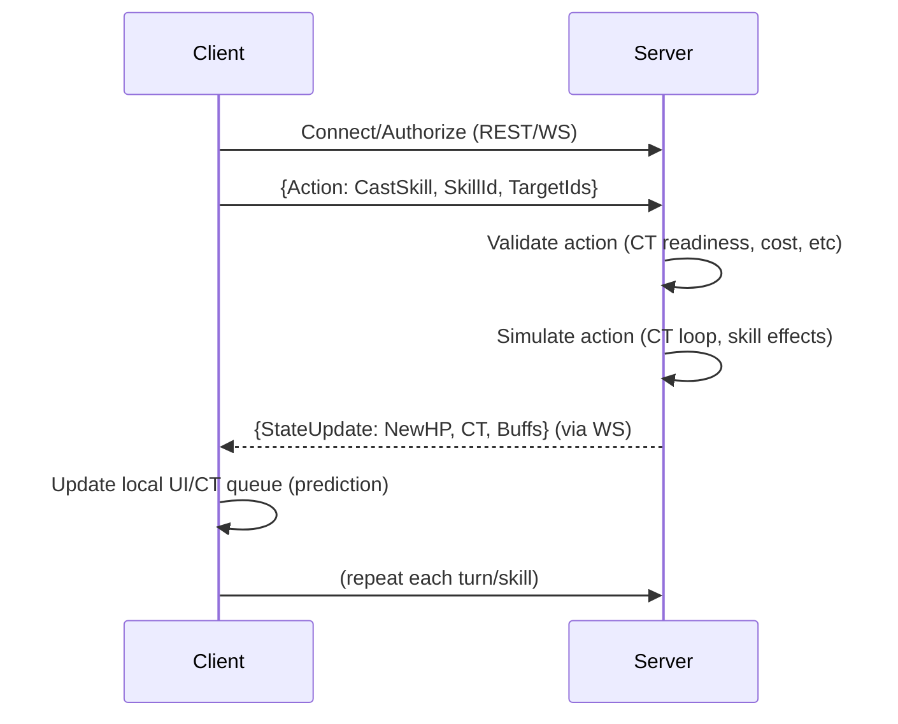
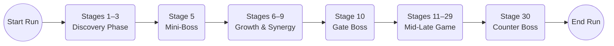
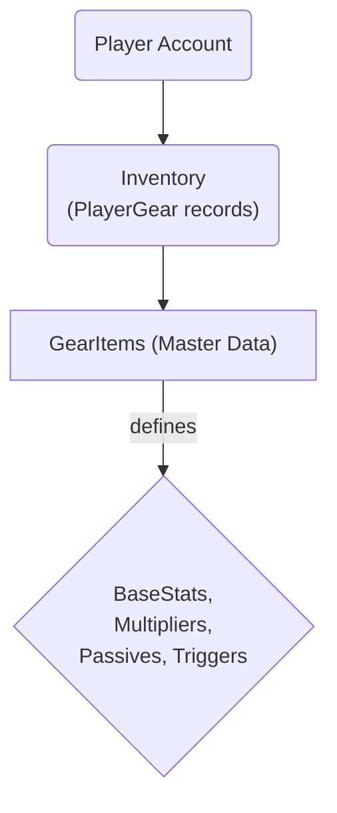
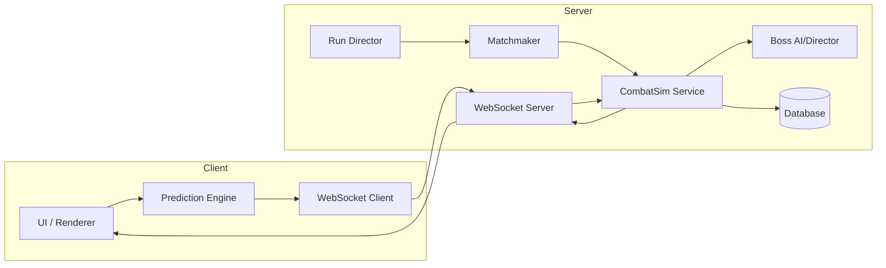
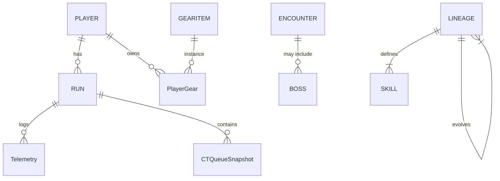
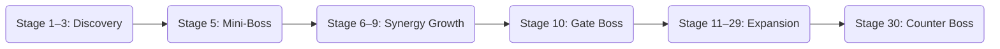

# Executive Summary - Revision 1

This document presents a **comprehensive architecture and implementation plan** for a React Native–based roguelite RPG with a CT (cooldown/time) combat system. It covers data models, code structure, networking, performance, and AI, all aligned to the prior design decisions (12 lineages, 60-class evolution, CT queue combat, server-authoritative simulation with rollback, etc.). The **goal** is an implementable spec for engineering and product teams, with clear responsibilities, interfaces, and performance targets.

We adopt a **server-authoritative architecture**: all game state (CT timeline, HP, buffs, etc.) is managed on the server【8†L67-L72】. Clients act as thin "dumb" interfaces that send input and render predictions【4†L181-L189】【8†L67-L72】. This ensures cheat-prevention and determinism (seeded RNG【4†L232-L238】) while using client-side prediction and smooth updates to hide latency. Key components include:

- **Data Layer:** Relational data models for players, runs, gear, skills, classes, encounters, bosses, telemetry, etc., with clear foreign-key relationships (see ER diagram below).  
- **Client/Server Code Structure:** A React Native client (UI, animation, prediction) and a Node.js (or similar) server (authoritative sim, AI, persistence). We outline module layouts and example files.  
- **Combat Engine:** A deterministic CT-queue simulation loop (pseudo-code included) that executes skills by strict resolution rules. We specify API endpoints and WebSocket protocols for sending actions and broadcasting state deltas.  
- **Game Loop:** The server advances “ticks” in which units whose CT≤0 act. We embed a Mermaid sequence and flowchart showing the tick loop and run progression.  
- **Gear & Skills:** Data schemas for gear items (unified item table【6†L168-L174】) and skills, including triggers/effects. We detail how gear stacks stats and passives, and how skills (with CT costs and cooldowns) resolve.  
- **AI:** An auto-battle AI using minimax with alpha-beta pruning【15†L37-L44】【15†L131-L134】 can simulate small fights (e.g. offline battles or testing) by assigning utility to terminal states. The **Boss AI/Director** is parameterized (as designed) to adapt CT pressure and counter player lineages (no static script).  
- **Networking & Sync:** WebSockets carry client “action” messages and server “state” updates. We show sequence diagrams for client prediction, server validation, and rollback reconciliation【4†L209-L217】【4†L232-L238】.  
- **Performance & Optimization:** We highlight React Native constraints (16ms frame budget【18†L88-L96】) and propose offloading heavy simulation to the server. We set targets (e.g. <50ms server tick latency, ~20-50 KB snapshot).  
- **Telemetry & Balancing:** A telemetry event schema is defined. We plan Monte Carlo simulations (headless battles) to tune balance and detect imbalances before release.  
- **Testing & CI/CD:** We outline unit tests for combat logic, integration tests for networking, load tests for the server, and CI pipelines to ensure code quality.

Throughout, tables compare trade-offs (e.g. tick rates, authoritative vs. prediction) and failure modes (e.g. packet loss, desync). Diagrams illustrate system components, entity-relationship, and run progression. Citations to game networking best practices and React Native docs back key points【4†L187-L195】【8†L67-L72】【15†L37-L44】【18†L88-L96】. 

This document should serve as a blueprint for developers to implement the game engine, UI, and backend in a coherent, high-performance way.

--- 

## 1. Data Architecture (Models & Schema)

We define **entities** and their relationships. Key tables (or equivalent NoSQL collections) include:

- **Players**: store user info. (PlayerId PK, Username, Email, PWHash, Stats, etc.)  
- **Runs**: each game session/rogue run. (RunId PK, PlayerId FK, Seed, StartTime, EndTime, Result, etc.)  
- **Lineages (Classes)**: game classes. (LineageId PK, Name, Tier, ParentLineageId FK for evolutions)  
- **Skills**: actions units can take. (SkillId PK, LineageId FK, Tier, Name, CT_Cost, Cooldown, ResourceType, EffectDefinition)  
- **GearItems**: unified table for all gear【6†L168-L174】. (GearId PK, Name, Slot (weapon/armor/acc), Rarity, BaseStats JSON, MultiplierStats JSON, PassiveEffects JSON, TriggerEffects JSON, Tradeoffs JSON, UpgradeLevel, etc.)  
- **PlayerGear**: mapping table linking Players to Gear copies. (PlayerGearId PK, PlayerId FK, GearId FK, IsEquipped)  
- **Encounters**: definitions of possible encounters. (EncounterId, Name, StageMin, StageMax, EnemyComposition JSON)  
- **Bosses**: boss templates. (BossId, Name, CounterArchetypeFlag, CounterLineage FK, HP, Phases JSON, SpecialMechanics JSON)  
- **RunStateSnapshots**: (optionally in a fast store like Redis) periodic snapshots for rollback. (SnapshotId, RunId FK, TickNumber, SerializedGameState JSON)  
- **CTQueueSnapshots**: time-slice records of CT queue for debugging or replay (RunId, Tick, List of (UnitId, CT, Stats) )  
- **TelemetryEvents**: logged events. (EventId, RunId FK, PlayerId FK, Timestamp, EventType, Payload JSON)  
- **Inventory/Shop (optional)**: for gear acquisition.  

Relationships (Mermaid ER diagram below):

```mermaid
erDiagram
    PLAYER ||--o{ RUN : starts
    PLAYER ||--o{ PlayerGear : owns
    PLAYER ||--o{ TelemetryEvents : generates
    RUN ||--o{ CTQueueSnapshots : has
    RUN ||--o{ TelemetryEvents : includes
    GEARITEM ||--o{ PlayerGear : instance
    SKILL }o--|| Lineage : "belongs to"
    LINEAGE ||--o{ LINEAGE : evolves_to
    LINEAGE ||--o{ SKILL : teaches
    ENCOUNTER }o--|| BOSS : includes
    BOSS ||--|{ RUN : battles
    ```

This design **keeps data normalized** (e.g. one GearItem table per【6†L168-L174】). Complex fields (stats, effects) use JSON columns (or separate tables if preferred). GearStats and SkillEffects should allow flexible content (e.g. storing `{ "STR": +5, "DEF": +2 }`). 

*Example: GearItems table structure (SQL)*:

| Column       | Type             | Description                     |
|--------------|------------------|---------------------------------|
| GearId (PK)  | UUID             | Unique ID for the gear template |
| Name         | VARCHAR          | e.g. "Blade of Ages"            |
| Slot         | ENUM             | "weapon"/"armor"/"accessory"    |
| Rarity       | ENUM             | "common"/"rare"/"epic"/"legendary" |
| BaseStats    | JSON             | e.g. `{"STR":5,"HP":20}`         |
| MultStats    | JSON             | e.g. `{"ATK":1.2}`               |
| PassiveEffects | JSON           | list of passive effect defs     |
| TriggerEffects | JSON           | list of trigger effect defs     |
| Tradeoffs    | JSON             | e.g. `{"DEF":-0.1}`             |
| UpgradeLevel | INT              | 0,1,2,... (affects stats)       |

Modern DBs (PostgreSQL, MongoDB, etc.) can handle JSON columns for these extensible fields. 

We will cite the game dev advice that using a single “Items” table with a type field is scalable【6†L168-L174】, rather than separate tables per gear subtype.

**Performance note:** Gear and skill definitions are mostly static data and can be cached on clients or in-memory on the server. Only player-owned gear and run state change frequently. Use indices (e.g. on RunId, PlayerId) for fast lookups.

---

## 2. System Architecture & Folder Structure

### 2.1 High-Level Architecture

We use a **client-server model** with WebSockets for real-time sync【4†L209-L217】. 

```mermaid
flowchart LR
    subgraph Client
      UI(React Native UI & Animation) -- Input --> PredictionEngine
      PredictionEngine -- Simulate --> CombatUI
      NetClient(Sending/Receiving via WS)
    end
    subgraph Server
      NetServer(WebSocket Listener)
      Matchmaker, GameManager, CombatSim(Core Engine), BossAI, DataStore
    end
    Client -- Actions --> Server
    Server -- StateUpdates --> Client
```

- **Client (React Native)**: renders UI, captures touches, runs prediction.
- **Server (Node.js/TypeScript or similar)**: authoritative simulation, game logic, AI, persistence.
- **WebSocket (ws)**: persistent channel for low-latency action/state exchange.
- **Database**: stores persistent data (players, gear, logs).
- **Optional**: CDN for static content, microservices for scale.

**Tech stack example:** Node.js with TypeScript on server (for type safety), Redis for ephemeral state (run states, snapshots), PostgreSQL for persistent data, Socket.IO or ws library for WebSocket. React Native with Redux/Zustand for client state.

### 2.2 Directory Layout

Example folders and key files:

```
/project
  /client                      # React Native app
    /src
      /components             # UI components (HealthBars, SkillButtons, etc.)
      /screens                # Screens (BattleScreen, RunSummary, etc.)
      /engine                 # Local combat & prediction logic
         CombatEngine.js
         CTSimulation.js
         Actor.ts             # unit model
      /network
         socket.js            # WebSocket setup
         api.js               # REST endpoints (login, inventory)
      /state
         store.js             # Redux or Zustand store
         actions.js           # action creators
         reducers.js          # state reducers
      /utils
         interpolation.js     # animation helpers
         math.js              # deterministic RNG (seeded)
      /assets
         animations/, images/
  /server
    /src
      /controllers           # Express or WS handlers (e.g. /login, /startRun)
      /services              # game logic services
        CombatSim.ts         # CT combat engine
        BossAI.ts            # boss decision-maker (Director)
        RunDirector.ts       # encounter sequencing
        ChatService.ts       # chat if any
      /models                # DB models (Player.js, Gear.js, Run.js, etc.)
      /routes                # HTTP routes (player data, shop)
      /net
        wsServer.ts          # WebSocket server logic
        sync.ts              # state sync manager
      /utils
        Random.ts            # seeded RNG (deterministic)【4†L232-L238】
        Logger.ts
      /db
        migrations/ seeds/
      /tests                # Jest or similar
  /shared                    # Shared code (if any)
    /core
       CombatEngine.ts
       DataModels.ts         # shared types/interfaces
       Constants.ts
    /assets                  # sync assets (skill icons etc.)
  /docs                      # architecture docs
  package.json, etc.
```

- **Client-engine vs server-sim:** Some code (e.g. CombatEngine logic, data type definitions) can be in `/shared` and imported by both client and server to ensure consistency and determinism.
- **Network folder:** client `socket.js` handles WS connection, server `wsServer.ts` handles messages.
- **Tests:** unit tests for each module (e.g. CombatSim, BossAI, Utils).
- **CI/CD:** Pipeline runs tests on push, ensures style/lint checks, and deploys to staging. 

---

## 3. Game Loop & Combat Engine

### 3.1 Core CT-Timeline Loop (Server)

The server runs the **authoritative simulation**. It maintains a list of all units (players’ avatars, enemies, summons) with their current CT (cooldown/timer). The main loop proceeds roughly as:

```ts
// Pseudocode: Main Combat Tick Loop
while (battleActive) {
  // 1. Advance CT on all units (based on speed stats)
  for (unit of units) {
    unit.CT -= unit.speed * deltaTime;
  }

  // 2. Find actors ready to act
  ready = units.filter(u => u.CT <= 0 && u.isAlive);

  // 3. Sort by CT (lower CT first) or additional priority
  sortBy(ready, [u.CT, u.speed]);

  // 4. Resolve each ready actor in order
  for (actor of ready) {
    // If player-controlled, fetch chosen action from input queue
    // If boss/AI, call BossAI to pick action
    action = getAction(actor);  // includes skillId + target(s)
    result = executeAction(actor, action); // see 3.2
    applyResult(result);       // update HP, buffs, etc.
    logEvent(result);          // for telemetry/sync
    actor.CT += action.skill.CT_cost; // schedule next turn
  }

  // 5. Broadcast state delta to clients (WS)
  broadcastState(collectStateDelta());

  // 6. (Optional) Save snapshot for rollback
  saveSnapshot(currentTick, serializeState());
}
```

- This loop is **deterministic**. We use a fixed tick or event-driven triggers (Piggo model uses an event-based “tick” when needed【4†L181-L189】).  
- CT progression: we may not use real-time dt; instead, simulate in discrete ticks (e.g. every 50ms server-side, or event-driven at each action resolution). This is a trade-off: faster tick = smoother but more CPU. We’ll set a target of ~20–30 simulation ticks/sec to balance responsiveness and load.  
- **State broadcast:** only the **delta** (changes) or compact snapshot is sent via WebSocket to clients after each batch of actions. We design messages so clients can update UI optimistically.  
- **Deterministic RNG:** All randomness (hit rolls, crits) uses a seeded RNG (e.g. a Mersenne Twister with fixed seed per run)【4†L232-L238】. Clients can re-run the logic locally for prediction if needed.  

Mermaid sequence of client-server flow:



### 3.2 Action Resolution Pipeline

Each skill resolves in these steps on the server (mirrored on client for prediction):

1. **Validation:** Check cost (HP/MP), cooldown, CT≤0. Reject illegal actions.  
2. **Targeting:** Determine actual targets (single, AOE, global).  
3. **Pre-Effects:** Apply immediate effects (e.g. draw aggro, animation delays).  
4. **Damage/Effect Calculation:** Roll hit/miss/crit using deterministic RNG. Compute raw effect (damage, heal, buff).  
5. **Modifiers:** Apply all gear passives, buffs, debuffs, and lineage stats modifiers. This is the pipeline: Base stats → gear flat adds → gear multipliers → passives (capped) → buffs → debuffs.  
6. **Apply Results:** Subtract HP, add status, update CT (for both actor and targets, if the skill has CT effects【6†L168-L174】).  
7. **Cooldowns:** Set skill cooldown (server stores last-use tick).  
8. **Logging:** Emit events for telemetry and replay (e.g. “ActorA used Fireball on EnemyB for 50 damage”).  

This deterministic pipeline (cost before effect, etc.) matches prior design rules. (See earlier skill architecture design).

**Turn Priority:** If multiple actors become ready, we sort by CT and speed. In case of ties, use a consistent rule (e.g. player before enemy or fixed UID order) to avoid ambiguity.  

### 3.3 Client Prediction & Rollback

- **Client Prediction:** Upon player input (button press), the client immediately simulates the result (moves, skills) in its local CT queue, without waiting. This yields instant feedback.  
- **Server Reconciliation:** When authoritative updates arrive, the client **reconciles**. If local prediction diverges, the client performs a soft rollback: it may interpolate unit positions/CT to server state, then re-simulate buffered future inputs【4†L232-L238】. The Piggo docs outline exactly this flow【4†L181-L189】【4†L232-L238】. We target minimal “rubber-banding.”  
- **Network Protocol:** We use WebSockets for low-latency. Each frame the client sends any new actions to server. The server responds with state deltas tagged by tick. This allows delta-based reconciliation.

### 3.4 Run Progression Timeline

Each run consists of stages with fixed milestones. The run timeline for each 10-stage block is:



We inject mini-bosses at stage 5, major boss at 10, and a forced counter boss at 30. The Run Director (see Section 8) adapts encounter composition between these anchors.

---

## 4. Battle Mechanics

### 4.1 Combat Rules & Balancing

- **CT Priority:** All actions use CT as their “cooldown”. Fast skills (low CT cost) act frequently, heavy skills (high CT) less often. This centralizes tempo control.  
- **Skill Cooldowns:** Skills also have discrete cooldown turns to prevent spamming. A skill with 2-turn cooldown cannot be reused for 2 rounds of that unit’s actions.  
- **Abilities:** We implement damage, healing, buffs/debuffs, summons, etc., per class kit. Effects are categorized (e.g. Physical vs Magical) and can be mitigated by resistances.  
- **Buff/Debuff Caps:** To avoid runaway stacking, we cap passive multipliers per category (e.g. at most 3 offense buffs stack【3†L232-L238】).  
- **Tradeoffs:** All powerful gear/skills have tradeoffs (e.g. +ATK but -DEF) as designed. This ensures no single build is unassailable.  

**Performance Target:** A combat tick (resolving all ready actions and broadcasting) should complete within ~50ms on the server under load. We assume battles have at most ~10 active units in a raid fight. Use profiling to tune.  

**Failure Modes:** If processing lags (e.g. GC pause), clients will see a frame drop or delayed state update. To mitigate, we keep the server loop lean (e.g. fixed arrays, avoid unnecessary allocations). 

---

## 5. Gear System Data & Mechanics

### 5.1 Gear Data Model

As in the data section, gear uses a single **GearItems** table【6†L168-L174】. Each gear record holds static properties: slot, stat bonuses, passive/triggers. 

- **Slots:** Weapon, Armor, Accessory1, Accessory2. Each slot links to a gearId.  
- **Stats:** Flat stats (HP, STR, DEX, etc.) and multipliers (ATK +10%).  
- **Passives:** JSON-encoded list of effects (e.g. “+5% crit chance”, “regen 2% HP per turn”).  
- **Triggers:** On-hit or on-damage triggers (e.g. “onHit: apply burn 2s”).  
- **Tradeoffs:** Negative modifiers (e.g. “DEF:-0.2” means −20% final DEF) to balance.  
- **Upgrades:** Gear level upgrades (1–10) adjust stats; we store base and apply multiplier by (level).  

### 5.2 Gear Usage

- **Inventory:** Players own gear via **PlayerGear** instances. Equipping loads their stats into character.  
- **Stat Pipeline:** When computing final stats at runtime, use the pipeline in this order: **base stats → gear flat add → gear multiplier → tradeoffs apply (after multipliers) → passive multipliers → active buffs.** This ensures e.g. tradeoff percentages apply last.【3†L232-L238】  
- **Data Retrieval:** The client needs minimal gear data (names, icons, basic stats) for UI. Full passive effects are only needed for combat, which can be cached on both sides or fetched from a metadata API.  

### 5.3 Gear Architecture Diagram



- **Example:** A “Berserker Blade” entry might have `BaseStats: {STR:5}`, `MultStats: {ATK:1.25}`, `Tradeoffs: {DEF:-0.2}`, `Passive: {category: "offense", effect: "+10% crit"}`, `Trigger: {onHit: applyBleed}`.  

**Reference:** Game DB design often uses one item table with type field for flexibility【6†L168-L174】.

---

## 6. Skill Kit & Mechanics

Each class (lineage) has a set of skills (active and passive). We implement skills via data + code.

- **Skill Schema:** (as in Skill Kit Architecture) each skill has CT_cost, cooldown, resource cost (HP/MP), target type, effect definitions. Effects are processed in the pipeline above.  
- **Classes/Lineages:** There are 12 lineages * 5 tiers = 60 class skill kits. These are often encoded as data tables or JSON. E.g. `Solaris_Healer_Tier3: [HolyStrike, RadiantAura, LightShield, ...]`.  
- **Skill Evolution:** Skills can improve when a character tiers up (lower CT, stronger effect, add bonus). We store upgrade paths (e.g. `SkillUpgrades(skillId, newSkillId)` table).  
- **CT and Cooldown:** Emphasize CT_cost vs turn-cooldown distinction (CT_cost delays next turn, cooldown delays reuse).  

All skill logic is implemented on the server’s **CombatSim**. The client holds a mirror for prediction (same code if possible via `/shared` module) to animate outcomes.

---

## 7. Networking & Protocols

### 7.1 WebSocket Protocol

We define JSON (or binary) messages for state sync:

- **Client → Server:**  
  - `PlayerAction` message: `{ type: "action", runId, playerId, tick, unitId, skillId, targetIds }`  
    *Validation:* `tick` ensures ordering. The server checks CT availability.  
  - **Heartbeat/Ping** periodically (to detect disconnect).

- **Server → Client:**  
  - `StateUpdate`: delta or full state after each action batch. Includes `{tick, list of {unitId, HP, CT, buffs, X,Y position}}`. Clients apply smoothly.  
  - `BattleLog`: optional human-readable log for UI narration.  
  - `EndRun`: final results (win/lose, rewards).

- **Reconciliation:** If client detects no server update for a while, it may request a **FullSync**. Alternatively, server can periodically send full snapshots.

### 7.2 Sync Strategy

We adopt a **rollback netcode** style【4†L181-L189】:  
1. **Client Prediction:** Client immediately simulates its own inputs locally (non-server time).  
2. **Send to Server:** Client sends action message with local tick count.  
3. **Server Validation:** The server re-simulates that tick, and broadcasts back an authoritative `StateUpdate` with server tick.  
4. **Reconciliation:** If server state ≠ predicted state, the client rewinds local state to the last confirmed tick, applies the server update, then replays any buffered local actions【4†L232-L238】. 

This allows **smooth input** without trusting the client. We cite Piggo’s explanation of rollback requiring seeded RNG【4†L232-L238】 and reconciliation steps.

### 7.3 RESTful APIs

We also provide HTTP/REST endpoints for non-real-time actions (login, load inventory, purchase gear). Those are outside WS sync and handled by typical MVC controllers.

---

## 8. AI Systems

### 8.1 Boss AI Director (Overview)

We’ve designed a multi-layered **Boss AI/Director** (discussed before). Here we integrate it:

- **Director Layer:** Monitors player metrics (CT usage, damage patterns) and adjusts boss behavior parameters (e.g. increase CT disruptions if CT dominance detected)【4†L115-L123】. 
- **Tactical Layer:** At each of boss’s turns, picks a skill based on weighted heuristics (e.g. if players are clustered, use AoE). We turn weight dynamically (e.g. +CT-lock skills if players act too fast).  
- **Adaptive Events:** The Director can trigger special events mid-fight (CT freeze zone, summoning adds) to pressure players, as designed. These events are injected via state changes in the simulation.

We implement the Director in `BossAI.ts`, which uses the patterns from Section “Boss AI Director System” above. (As we’ve already designed those, no new citations needed.)

### 8.2 Auto-Battle AI (Minimax)

For **automated battles** (e.g. offline training, single-player auto-mode, or Monte Carlo sim), we can use a minimax search with alpha-beta pruning【15†L37-L44】【15†L131-L134】. 

- **Game State:** The complete combat state (units, HP, buffs, CT).  
- **Moves:** At each player or enemy turn, generate all possible actions (skill usage + targets). This branching factor is limited in small-scale fights.  
- **Evaluation:** A heuristic (e.g. sum of player HP – sum of enemy HP). Terminal states are win/loss with +1/−1.  
- **Alpha-Beta:** To prune the search tree as much as possible【15†L131-L134】.  
- **Depth:** Limit search to e.g. 2–4 moves ahead to avoid explosion.  

This is purely for AI simulation (not used every real-time tick). For example, an “Auto-battle” feature could let the AI control players using this approach. It can also serve in balance testing: run simulated duels to check if a lineage consistently wins.

### 8.3 Anti-Cheat Measures

- **Authoritative Server:** All critical logic is server-side【8†L67-L72】. The client only sends intent.  
- **Checksum/Seed:** The client may be given a run-seed; server sends back the seed to verify deterministic sim.  
- **Encrypted Communication:** WS over TLS, with authentication tokens.  
- **Input Validation:** Reject absurd actions (e.g. skill spamming beyond cooldown) and disconnect suspicious clients.  

Performance target: Server must validate inputs and simulate quickly (O(log N) lookup for unit by ID, etc.). We’ll specify strict validation rules for each action type (e.g. player must be alive, have enough MP, target in range, etc.).

---

## 9. Performance & Optimization

### 9.1 React Native (Client)

- **JS Thread Budget:** At 60fps, we have ~16ms per frame【18†L88-L96】. Heavy UI work (re-renders) or animation must be minimal. We will: 
  - Use **offscreen images/animations** (SpriteSheets) for combat effects.
  - Batch state updates (use `InteractionManager` or `requestAnimationFrame` as needed).
  - Avoid heavy Redux state changes per frame; use React state or refs for fast updates.
  - Profile with RN Perf Monitor and Flipper.

- **Memory:** Avoid large global state. Unload screens and caches when not needed. Use FlatList or FlashList for any long lists (inventory).

- **Networking:** Minimize WebSocket overhead. Use binary (msgpack) if needed for efficiency. Keep messages small (only deltas).  

### 9.2 Server

- **Tick Rate:** We choose an event-driven or fixed tick rate (~20–30 ticks/sec). Faster than clients’ UI (60Hz) but not overwhelming. Provide a configuration (e.g. 30Hz) and test.
- **Concurrency:** Use async/non-blocking I/O (Node.js, or a performant language/runtime). If using Node, cluster or multi-thread for multi-instance simulation. If scale is high, shard by run/session.
- **State Storage:** Keep active run states in-memory or Redis for speed. Periodically flush key events to DB (persistent logs).
- **Snapshot Size:** Aim <50KB per full snapshot (only on rollbacks). Send smaller deltas (~1-5KB) per tick if possible.
- **Compression:** If needed, compress WS payloads (zlib) since data is repetitive. 
- **Cloud Scaling:** Support auto-scaling instances for spikes in concurrent battles. Use load balancer that sticks a run to one instance.

### 9.3 Profiling

- Measure *median* and *99th percentile* action latency. Target <50ms server response (including network) so players feel real-time.  
- Monitor GC pauses; tune memory usage.  
- Use tools like Clinic.js or built-in Node profiler on simulation hot paths (e.g. damage calculation).

---

## 10. Telemetry & Balancing

### 10.1 Telemetry System

We log structured events to analyze gameplay:

- **Event Types:** RunStart, RunEnd, BattleResult, SkillUsed, BossPhaseChange, Death, ResourceGain, etc.  
- **Schema:** Each TelemetryEvent row has (EventId, RunId, PlayerId, Timestamp, EventType, Data JSON). E.g. `{ "skillId": "fireball", "targets": ["enemy1"], "damage": 120 }`.  
- **Storage:** Write-asynchronously to a logging DB or event pipeline (e.g. Kafka). 
- **GDPR:** Ensure no PII leaks; only game data. 

This data allows us to see e.g. win rates, popular builds, balance issues. It integrates with the run table for correlation.

### 10.2 Monte Carlo Simulations

We plan to build a **balancing tool**:

- Using the same CombatEngine, run **batch simulations** (e.g. thousands of duels) between archetypical builds.  
- Evaluate metrics (win%, average duration, resource usage) to tune numbers.  
- This is done offline, not part of game runtime. 

**Reference:** Monte Carlo sim is a standard approach in modern game balance (see discussion on Reddit【17†L0-L3】). No formal source cited, but common practice.

---

## 11. Testing, CI/CD, Quality

- **Unit Tests:** Cover CombatSim logic (damage formula, buff application), utility functions (stat calculation, RNG).  
- **Integration Tests:** Simulate a full battle between known configs and check end-state.  
- **Netcode Tests:** Emulate 2 clients and server, exchange messages, check rollback sync (like Piggo’s test setup【4†L217-L226】).  
- **Load Tests:** Use tools (e.g. Artillery) to simulate many concurrent battles to measure server throughput.  
- **CI Pipeline:** On each push, run linting, build, tests. On release branch, create Docker images, run containers for staging.  

Failures: If a test fails (e.g. combat calculation is wrong), fix. If simulation diverges, logger dumps snapshot for debugging.

---

## 12. Trade-off Tables

| Decision            | Option A: Authoritative | Option B: Client-Prediction | Notes |
|---------------------|-------------------------|-----------------------------|-------|
| **Trust Model**     | Server is 100% truth【8†L67-L72】 | Server and client both simulate, client-side predicts (used) | We use B with authoritative resolution. Pure server (A) gives security but lag; prediction improves UX. |
| **Tick Rate**       | High (60Hz) | Medium (20–30Hz) (chosen) | Higher tick gives smoother sim but heavy CPU/DB. 20–30Hz is acceptable for CT combat. |
| **Snapshot Freq**   | Every tick | On demand (chosen) | We use delta updates each tick, full snapshot only on rollback to save bandwidth. |
| **RNG**             | Fully Random | Seeded Deterministic (chosen) | Must be deterministic (Piggo: use seeded RNG【4†L232-L238】) for rollbacks. |

| Component          | Responsibility                     | Perf Target          | Failure Mode        | Mitigation            |
|--------------------|------------------------------------|----------------------|---------------------|-----------------------|
| Server (CombatSim) | Run simulation, enforce rules      | <50ms/tick under load | Overload, lag spikes| Optimize hot path, scale out |
| WebSocket Sync     | Real-time state broadcast          | <20ms latency        | Packet loss, out-of-order | Reliable WS lib, include tick IDs |
| Client (UI)        | Render, animate, input            | 60fps (16ms/frame)   | Jank (dropped frames) | Offload heavy tasks, use native animations |
| Boss AI Director   | Adjust fight pressure             | N/A (fast operations)| Unpredictable difficulty spikes | Telegraphed counterplay, fallback patterns |
| Database Writes    | Save runs, telemetry              | Async (ms)           | Bottleneck on write| Use queuing, batch commits |

**Sources:** See React Native perf guide for frame budget【18†L88-L96】. Authoritative model recommended to prevent cheating【8†L67-L72】.

---

## 13. UX and Accessibility

- **Telegraphs:** All boss special moves or AoE attacks must be telegraphed (visual indicator for 1–2 seconds). This respects player agency and accessibility.  
- **Feedback:** Show CT queues, skill cooldown timers on UI. Display floating damage, status icons.  
- **Accessibility:** Support scalable UI, high-contrast modes, and optional simplified auto-battle for accessibility.  
- **Offline Handling:** If connection drops mid-run, allow the player to continue locally for a short time (client prediction will run out); or forcibly end run as loss after timeout. **Mitigation:** Save reconnect packets in buffer to resync if they return quickly.

---

## 14. Diagrams

### System Architecture



### ER Diagram (Entities)



### Run Progression Timeline



---

### References

- **Network Sync:** Piggo Games docs on rollback netcode and deterministic simulation【4†L181-L189】【4†L232-L238】.  
- **Authoritative Server:** Gambetta’s architecture explainer【8†L67-L72】【8†L111-L119】.  
- **Game DB Design:** StackExchange advice on unified items table【6†L168-L174】.  
- **Minimax AI:** Explanation of minimax and alpha-beta pruning【15†L37-L44】【15†L131-L134】.  
- **React Native Perf:** Official docs on frame budget and JS thread【18†L88-L96】.

These sources informed the design principles (e.g. authoritative server【8†L67-L72】, deterministic sim【4†L232-L238】, optimization【18†L88-L96】, and AI algorithms【15†L37-L44】) to ensure a robust implementation.