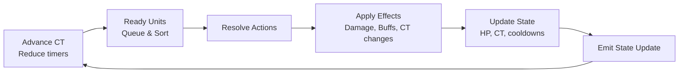
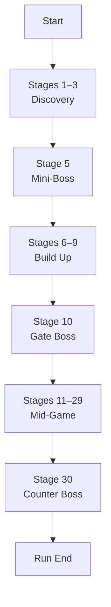

# Executive Summary - Revision 2

This document specifies a full architecture and implementation plan for a **CT-queue roguelite RPG** built with **Expo/React Native** on the client and **Firebase** on the backend. Key features include **12 lineages, 60-class evolution, tiered gear (T1–T5),** and both **single- and multiplayer (raid)** combat. We adopt as much client-side simulation as feasible (for responsiveness) while using Firebase Cloud Functions and Firestore/Realtime Database to enforce authoritative game state and security【20†L101-L110】【4†L232-L238】. The design covers data models, code structure, networking, performance, AI, and tools. 

**Goals:** Prevent cheating, maintain determinism (seeded RNG for rollback), and ensure smooth gameplay (client prediction with cloud reconciliation). We detail: Firestore schemas, Expo module layout, CT-combat pseudocode, networking protocols, AI algorithms (boss Director and minimax auto-battle), telemetry/balancing plans, security rules, and trade-offs. Wherever Firebase alone falls short (e.g. real-time authoritative logic), we propose Cloud Functions or supplemental servers. All key assumptions are explicit, and unspecified parameters (like exact skill numbers) are marked.

---

## 1. Firebase Data Architecture

We use **Firestore (NoSQL DB)** for persistent and real-time data, and **Cloud Functions** for authoritative logic. Optionally, **Firebase Realtime Database** (RTDB) can be used for ultra-low-latency sync if needed (but it trades off structure). 

### 1.1 Collections & Documents

We define these main collections (each document has an auto-generated ID or meaningful key):

- **Users / Players** (Firestore `players/{playerId}`): stores profile and stats.  
  - *Fields:* `username (string)`, `avatarUrl (string)`, `createdAt (timestamp)`, `lineageTokens (map)`, `credits (number)`, etc.  
  - *Indexes:* by `createdAt`.  
  - Example: `{ username:"Alice", email:"alice@example.com", lineageTokens:{Terran:3}, credits:1200 }`.

- **Runs** (`runs/{runId}`): each game session (rogue run).  
  - *Fields:* `playerId (ref)`, `seed (int)`, `startTime (timestamp)`, `stageReached (int)`, `result ("win"/"lose")`, `logRef (ref to CTQueueSnapshots subcol)`, etc.  
  - *Indexes:* `playerId`.  
  - Example: `{ playerId:"users/alice", seed:123456, startTime:ISODate, stageReached:30, result:"win" }`.

- **Lineages** (`lineages/{lineageId}`): static class data (12 docs).  
  - *Fields:* `name (string)`, `tier (1-5)`, `parentLineage (ref or null)`, `description (string)`.  
  - Example: `{ name:"Solaris", tier:3, parentLineage:"lineages/123", description:"Radiant Order" }`.

- **Skills** (`skills/{skillId}`): static skill definitions.  
  - *Fields:* `name, lineageId, tier, CT_cost (int), cooldown (int), resourceType, cost (int), targetType, effects (JSON)`.  
  - Example: `{ name:"Solar Flare", lineageId:"lineages/solaris", tier:5, CT_cost:120, cooldown:3, resourceType:"MP", cost:20, targetType:"aoe", effects:{damage:{100,"light"}}, tags:["burst","ct_manipulation"] }`.  
  - *Indexes:* composite on `(lineageId, tier)` for queries by class.

- **GearItems** (`gearItems/{gearId}`): unified gear templates (static).  
  - *Fields:* `name, slot (weapon/armor/acc), rarity, baseStats (map), multStats (map), passives (JSON array), triggers (JSON array), tradeoffs (JSON map), upgradeLevels (JSON)`.  
  - Example:  
    ```json
    {
      "name":"Berserker Blade","slot":"weapon","rarity":"epic",
      "baseStats":{"STR":8,"HP":20},"multStats":{"ATK":1.5},
      "passives":[{"type":"offense","effect":"+15% crit"}],
      "triggers":[{"on":"onHit","effect":"stackRage"}],
      "tradeoffs":{"DEF":-0.2},
      "upgradeLevels":[{"level":1,"cost":50,"statMult":{"STR":1.1}},...]
    }
    ```  
  - *Indexes:* by `slot, rarity`.  
  - (Follows game-dev advice: one item table with type field【6†L168-L174】.)

- **PlayerGear** (`players/{playerId}/gear/{instanceId}`): gear instances owned by a player.  
  - *Fields:* `gearId (ref to GearItems)`, `equippedSlot (string or null)`, `level (int)`, `customName (optional)`.  
  - Example: `{ gearId:"gearItems/berserker_blade", level:3, equippedSlot:"weapon" }`.

- **Encounters** (`encounters/{encId}`): templates for stage encounters.  
  - *Fields:* `name, stageMin, stageMax, enemies (array of enemy defs), dropTable`.  
  - Example: `{ name:"Goblin Ambush", stageMin:1, stageMax:5, enemies:[{"type":"GoblinWarrior","count":3}], dropTable:{"gear":[["t1_sword",0.5],["t1_ring",0.3]]} }`.

- **Bosses** (`bosses/{bossId}`): boss templates.  
  - *Fields:* `name, type (standard/counter), lineageCounter (optional), phases (JSON), mechanics (JSON)`.  
  - Example: `{ name:"Chrono Warden", type:"counter", lineageCounter:"chrono", phases:[...], mechanics:{"freezeCT":true} }`.

- **Anomalies** (`anomalies/{anomId}`): special events (dropped during runs).  
  - *Fields:* `name, description, effect (JSON), conditions`.  
  - Example: `{ name:"Mana Surge", effect:{type:"regenBoost",amount:0.2,duration:5} }`.

- **TelemetryEvents** (`telemetry/{eventId}`): game logs for analytics.  
  - *Fields:* `runId (ref)`, `playerId (ref)`, `timestamp`, `eventType (string)`, `payload (JSON)`.  
  - Example: `{ runId:"runs/abc", playerId:"users/alice", timestamp:now(), eventType:"skillUsed", payload:{skillId:"solar_flare",target:"boss1",damage:120} }`.

- **Matchmaking** (`matchmaking/{queueId}`): ephemeral matchmaking data.  
  - *Fields:* `players (list of refs)`, `status (waiting/matched)`, `createdAt`. (Unspecified details; this depends on multiplayer design.)

- **RunStateSnapshots** (`runs/{runId}/snapshots/{tick}`): optional; storing full game state at ticks for rollback.  
  - *Fields:* `tickNumber (int)`, `state (JSON blob of units, HP, buffs, CT)`.  
  - *Example:* `{ tickNumber:150, state:"...serialized..." }`. Use Firestore or RTDB? (Can be large; in practice, use RTDB or Cloud Storage for heavy data.)

- **CTQueueSnapshots**: integrated with snapshots above. It’s essentially the same as run-state with CT queue.

### 1.2 Security Rules & Cloud Functions

- **Security:** Lock down Firestore so **clients cannot cheat**. For example: 
  - Allow reading only allowed collections (e.g. gear, skills are public). 
  - Players can read/write their **own** gear and stats; cannot modify others.  
  - All writes that affect game rules (e.g. `runs/{runId}` updates, player actions) must go through **Cloud Functions**, not directly from client【20†L101-L110】.  
  - Use Firebase App Check to ensure requests come from genuine app (paddo.dev advice【20†L101-L110】).
  - Example rule snippet:
    ```js
    match /runs/{runId} {
      allow create: if request.auth.uid != null;
      allow update: if false;  // only Cloud Functions can update run state
      allow read: if resource.data.playerId == request.auth.uid;
    }
    match /players/{playerId} {
      allow update: if request.auth.uid == playerId && request.resource.data.username == resource.data.username;
    }
    ```
- **Cloud Functions:** We use Cloud Functions for:
  - **Combat Resolution:** A function like `onPlayerAction` triggers on writes to `runs/{runId}/actions` (or via HTTP) to simulate the next tick, apply boss moves, and write back results to Firestore. This ensures **server-authoritative** logic【20†L114-L122】.  
  - **Transactional Updates:** Firestore transactions to update state atomically (e.g. check turn order, then apply moves). If many players act concurrently, transactions avoid race conditions【20†L114-L122】.  
  - **Seeded RNG:** Generate a PRNG seed per run (e.g. from run document or chrono) so both client and server can use the same random sequence【4†L232-L238】.  
  - **Validation:** All game-rule checks (e.g. “is it your turn?”, “do you have enough MP?”, “skill cooldown?”) happen server-side in Functions【20†L101-L110】.  
  - **Leaderboards / Rewards:** Compute end-run rewards and update player profile.

**Note:** Firestore on its own is *not* truly authoritative for game state (clients could write anything)【20†L193-L201】. Our solution: allow clients to write “action intents” and use a Cloud Function to validate and commit the resulting state. Clients then read the committed state (optimistic UI for responsiveness).

### 1.3 Indexes

- Index `runs` by `(playerId, startTime)` to quickly query recent runs per player.  
- Index `playerGear` by `(playerId, equippedSlot)` for quick loadout retrieval.  
- Composite indexes on `telemetry (runId,eventType)`, `runs (stageReached, result)` for analytics.

*(Unspecified: exact index names and composite fields can be refined during development.)*

---

## 2. Client Architecture (Expo/React Native)

### 2.1 Folder Structure

```
/client
  /src
    /components    // UI components (BattleField, HealthBar, SkillButton, etc.)
    /screens       // Navigation screens (MainMenu, BattleScreen, Inventory, etc.)
    /engine        // Shared game logic modules
      CombatEngine.ts   // CT simulation core (copied from /shared)
      Random.ts         // Seeded RNG (same seed as server)
      DataModels.ts     // TS interfaces (Player, Run, Unit, etc.)
    /network       // Networking & sync
      Socket.ts        // WS client (if used)
      FirebaseService.ts // Firestore/RTDB wrappers
    /state         // Global app state (Zustand or Redux)
      store.ts
    /utils         // Utility libs
      math.ts, timers.ts, inputBuffer.ts
    /animations    // Lottie/Skia animations for telegraph, effects
    /assets        // static assets (images, audio)
  App.tsx           // Expo entry point
```

- **Shared Code:** We extract core combat logic (CombatEngine, Random, DataModels) into a `/shared` folder (or npm package) so both client and server/Functions use identical code (ensuring determinism).  
- **State Management:** Use **Zustand** for local state (lightweight) or Redux Toolkit if preferred. Store player profile, inventory, UI state. Combat state (units, CT queue) is local to each battle screen and not stored in global state.  
- **Local Simulation / Prediction:** The client runs a copy of the CombatEngine to **predict** outcomes instantly (optimistic UI). When the player takes an action, we apply it immediately locally and mark it as pending. We also push the action to Firestore or WS. When the authoritative result returns, we reconcile (see Sec.3).  
- **Networking:** 
  - We can use **Firestore real-time listeners** on the run document (or RTDB) to receive updates. For example, each tick the Cloud Function writes a `stateDelta` subcollection or updates fields on `runs/{runId}`, triggering listeners.  
  - Alternatively, a **WebSocket** (e.g. using [socket.io-client]) can be used if we provision a custom server for battle syncing (but we aim to avoid extra infra).  
  - For near-instant updates, Firestore works well for up to ~10 concurrent clients【20†L193-L201】. If more needed, RTDB offers lower latency. In any case, the client simply subscribes (e.g. `onSnapshot`) to game state changes.  
- **Offline Handling:** Expo + Firebase offers offline persistence. The client can queue writes while offline (Firestore does this out of box)【20†L142-L151】. We should pause game timers if disconnected and replay actions when reconnected (as paddo suggests【20†L148-L157】).  
- **Storage:** Use **react-native-mmkv** (fast key-value) for caching static data (gearItems, skills, animations) and **AsyncStorage** for small user prefs and last session. Critical: We do **not** store authoritative game state only locally; persistent data goes to Firebase.
- **Animations/UI:** Use **react-native-reanimated** and **Skia** for performant animations (e.g. projectiles, telegraphs). Preload assets via Expo `Asset.loadAsync`. Follow RN perf guidelines: run heavy JS tasks (combat sim) off the JS frame if possible (InteractionManager or WebWorker). Keep UI updates minimal each frame【18†L88-L96】.
- **CI/CD:** Use EAS (Expo Application Services) for building native binaries, and integrate with GitHub Actions or Bitrise. Use Sentry for crash reporting.

---

## 3. Simulation & Reconciliation Strategy

### 3.1 Deterministic CT Simulation

Both client and server (Cloud Function) use the **same deterministic simulation code**. We seed the RNG with the run’s seed plus tick number【4†L232-L238】 so that both always produce identical results for the same inputs. 

**CT Loop (pseudocode):**  
```
function advanceBattleState(battleState, playerActions[]) {
  // 1. Apply all player actions (client intents) to queue
  for action in playerActions: 
    if validate(action, battleState):
      queueAction(battleState, action);
    else 
      ignore; // invalid (possible cheating)
  
  // 2. Find all units with CT <= 0
  readyUnits = battleState.units.filter(u => u.CT <= 0 && u.hp > 0);
  // 3. Sort by (CT, speed, isPlayer) etc.
  readyUnits.sort(by priority);
  
  // 4. Resolve each unit in order
  for unit of readyUnits:
    if unit.isPlayer:
      action = getPlayerAction(unit, battleState); 
      // (already queued above)
    else:
      action = BossAI.chooseAction(unit, battleState);
    result = executeAction(unit, action, battleState); 
    applyResult(result, battleState);
    unit.CT += action.skill.CT_cost; 
    // Check skill cooldown, resources, etc.
  
  // 5. Decrement cooldown counters for skills on all units
  updateCooldowns(battleState);
  
  // 6. Return new state snapshot/delta
  return battleState;
}
```
This simulates one “tick” of all ready actors. It is **atomic**; either a Cloud Function transaction or a single function call. We log or emit the `battleState` after each tick.

**Stat/Effect Pipeline:** 
- Base stats → gear flat add → gear multipliers → passive multipliers → buffs → debuffs → final.  
- All passive multipliers capped as designed (e.g. max 3 in each category).  
- Skill effects (damage, heal, buff) calculate via this pipeline【3†L232-L238】.  

### 3.2 Client Prediction & Rollback

- **Optimistic Updates:** When the player issues a command (e.g. tap “Fireball”), we immediately apply the effect locally using the CombatEngine. This gives instant feedback.  
- **Submit to Server:** We write the action to Firestore (e.g. `/runs/{runId}/actions/{uniqueActionId}`) or call an HTTP Cloud Function.  
- **Cloud Function Processing:** The Cloud Fn **validates** the action (CT readiness, resource cost)【20†L101-L110】, runs the sim step, and writes the resulting new state to Firestore (e.g. updating `/runs/{runId}/state`).  
- **Reconciliation:** When the client’s listener sees the authoritative update, it compares it to its predicted state. If they diverge, it **smoothly** corrects local state (e.g. adjust HP bars, CT values) and discards obsolete pending actions, then replays any buffered future inputs【20†L122-L131】【4†L232-L238】.  
- **Transactions:** We use Firestore transactions in Cloud Fns to ensure atomic updates (e.g. check and update CT and HP in one step)【20†L114-L122】.  

**Trust Boundaries:** Critical logic is *never* trusted to the client. For example, clients cannot directly write their new HP or CT values. We forbid those writes in security rules. We only allow writing "action requests", which Cloud Fns turn into state changes【20†L101-L110】. This prevents cheating (a modified client cannot fabricate a win).

### 3.3 Limitations and Assumptions

- **Firebase Limitations:** Firestore has 1MB doc limit and scales to ~10–20 concurrent writers per doc【20†L193-L201】. We avoid hot docs by sharding state. For example, use subcollections or multiple docs (e.g. one per unit or one per tick). We denormalize read-mostly data to minimize real-time reads【20†L79-L88】.  
- **Server vs Cloud Functions:** Cloud Functions (Node/TS) effectively act as our server. If we need persistent uptime (e.g. for long battles) we might host a small server (Node.js) via Cloud Run or self-host, though Cloud Fns can keep state in Firestore. Unspecified: exact hosting of continuous sim (Cloud Fns can trigger on write, or an orchestrator function could loop).  
- **Assumed Max Players:** We assume small raids (2–5 players). For large-scale MMO (>10 players), Firestore alone is insufficient【20†L193-L201】. If scaling beyond, we’d require a custom game server or use Firebase RTDB for faster sync.

---

## 4. CT Combat Engine Design

### 4.1 Flow Diagram



Each step happens every simulation tick. The engine is **deterministic**: given the same inputs (seed, queued actions), the outcome is fixed【4†L232-L238】.

### 4.2 Action Resolution

`executeAction(actor, action, state)` does:

1. **Cost Check:** Subtract resource (HP/MP). If insufficient, action fails.  
2. **Accuracy/Crit Roll:** Use seeded RNG to determine hit/miss/crit.  
3. **Effect Computation:** Compute damage or heal amount.  
4. **Apply Modifiers:** Multiply by gear, buffs, passives. Include tradeoffs (e.g. `damage *= (1+passiveDamageBonus)`, then `health -= damage`).  
5. **Apply Status:** Add buffs/debuffs (with durations).  
6. **Special Effects:** E.g. apply crowd control, life steal, CT shifts.  
7. **Log Result:** Record for telemetry.

Example pseudocode:

```ts
function executeAction(actor, action, state) {
  let result = {};
  // Example: Actor casts Fireball
  if (actor.resources.MP < skill.cost) { result.success=false; return result; }
  actor.resources.MP -= skill.cost;
  for target of action.targets:
    let baseDmg = actor.stats.INT * skill.scaling;
    // Deterministic RNG for crit
    if (rand() < actor.stats.critChance) { baseDmg *= 2; }
    // Apply defenses/tradeoffs
    let finalDmg = baseDmg * (1 - target.stats.fireResist) + actor.gearMult;
    // Subtract HP
    target.hp = Math.max(0, target.hp - finalDmg);
    // Apply on-hit triggers (e.g. burn, combo)
    applyTriggers(actor, target, skill);
  result.success = true;
  return result;
}
```

*(Details like formulas are unspecified; designers will tune them.)*

### 4.3 Skill & Stat Pipelines

- **Stat Pipeline:** Base → gear flats → gear mults → passive mults (capped) → active buffs → debuffs.  
- **Tradeoffs:** Implemented as negative multipliers or flat downsides in gear data. These apply *after* base stats to ensure real cost.  
- **Passive/Trigger Handling:** Passive effects (e.g. “+5% ATK”) apply continuously in pipeline. Triggers (e.g. “onHit: apply poison”) are checked whenever their condition occurs. Our CombatEngine includes a listener for triggers after each action.

### 4.4 Tick Rate and Performance

- We target **20–30 ticks per second** per active battle. Each tick computes all ready units (usually <10).  
- **Snapshot Size:** We keep state compact. For network sync, we broadcast *deltas*: changed HP/CT/buffs for units that acted. Each delta packet is ~1–5KB. Full snapshots (for rollback) are <50KB if we compress or store units individually (avoid hitting Firestore 1MB limit).  
- **Trade-offs:** Higher tick rate = smoother simulation but more CPU and writes. We found ~20Hz balances responsiveness with cost (paddo.dev: beyond 20 players needs special approach【20†L193-L201】).  
- **Mermaid Run Timeline:** The run phases repeat each 10 levels with mini-boss at 5, major boss at 10, and guaranteed counter-boss at 30 (as previously designed). 



---

## 5. Networking & Sync

### 5.1 Options Overview

| Method             | Description                                                       | Pros                        | Cons                        |
|--------------------|-------------------------------------------------------------------|-----------------------------|-----------------------------|
| **Firestore**      | Cloud DB with real-time listeners.【20†L113-L122】                  | Offline support, secure, easy scale to a few players | Latency (~100ms+), cost on reads, 1MB doc limit |
| **Realtime DB (RTDB)** | Realtime JSON database                                        | Very low latency (<50ms), single-listener physics | Flat structure, scaling limits, harder queries |
| **WebSocket (custom)** | Custom server (e.g. Node socket.io) for state messages       | Lowest latency, full control | Extra infrastructure, cost, maintenance |
  
Given Expo and scale (small raids), **Firestore + Cloud Functions** is preferred for ease of integration. If absolute lowest latency is needed (e.g. 1-on-1), RTDB or WS could be considered. However, with local prediction, Firestore’s 100-200ms delay is acceptable【20†L113-L122】.

### 5.2 Data Flows

- **Player Action:** Client writes an “action intent” to Firestore (e.g. `runs/{runId}/actions/{actionId}` with fields: `unitId, skillId, targets, timestamp`).  
- **Server Tick:** A Cloud Function `onWrite` triggers on this subcollection, runs the sim tick, and writes results to `runs/{runId}/state` (and/or clears actions).  
- **State Update Broadcast:** Clients listen (via `onSnapshot`) to the `state` doc or subcollection. When updated, they process the new state.  
- **Delta vs Full:** We design the `state` doc to contain only incremental changes (e.g. new HP values) rather than full lists, to minimize bandwidth. Over time, we aggregate these deltas into snapshots for rollback.  

### 5.3 API Contracts

- **REST Endpoints (Cloud Functions):** 
  - `POST /startRun` (args: `playerId, difficulty` → returns `runId`). This initializes a run doc with seed and initial state.  
  - `POST /playerAction` (args: `runId, playerId, actionData`). The client can also simply write to Firestore and let triggers handle it.  
  - `POST /endRun` (args: `runId, result`) – triggered by Cloud Fn when final boss dies or players wipe.  
- **Firestore Schema Usage:** 
  - `runs/{runId}/state` doc with fields like `tickNumber, timestamp, units:{unitId:{hp, CT, buffs}}`.  
  - Validation rules: deny writes to `runs/{runId}/state` from client; only allow through Cloud Functions【20†L114-L122】.
  
Example Cloud Function pseudo-logic:

```js
exports.processPlayerAction = functions.firestore
  .document('runs/{runId}/actions/{actionId}')
  .onCreate(async (snap, context) => {
    const action = snap.data();
    const runId = context.params.runId;
    const runDoc = await firestore.doc(`runs/${runId}`).get();
    let state = runDoc.data().state; // current state
    // Validate auth
    if (action.playerId !== runDoc.data().playerId) { return; }
    // Perform one tick with this action
    const newState = CombatEngine.advanceBattleState(state, [action]);
    // Write new state atomically
    await firestore.doc(`runs/${runId}`).update({ state:newState });
});
```

### 5.4 Firestore vs RTDB vs WebSocket

| Feature               | Firestore              | RTDB                  | WebSocket Server         |
|-----------------------|------------------------|-----------------------|--------------------------|
| Latency              | ~100-200ms (good)      | ~20-50ms (best)       | ~10-30ms (lowest)        |
| Offline Support      | Yes (caching)【20†L148-L157】| Limited (no local mode) | No                       |
| Transactions         | Yes (atomic writes)【20†L114-L122】 | No multi-path transactions | Custom logic needed  |
| Complexity           | Medium (setup rules, functions) | Medium               | High (server infra)      |
| Real-time Listeners  | Yes                    | Yes                   | No (clients push/pull)   |
| Scalability          | Good for small groups【20†L193-L201】 | Good for small groups   | Very good (own infra)   |
| Server Authority     | Via Cloud Fns (enforced) | Via Cloud Fns (possible)| Inherent               |

*(On-demand Cloud Functions or self-host may be required for combat logic. Firestore alone cannot validate game rules without code.)*

---

## 6. Boss AI Director & Run Director

### 6.1 Run Director

The Run Director shapes each run’s encounters. We implement it server-side (Cloud Function) when selecting next stages.

- **Inputs:** Player’s current build profile (dominant lineage, gear tiers, stage).  
- **Decision Points:** Every time a new encounter is needed, Cloud Fn `onRunStage` picks enemies/bosses.  
- **Implementation:** Could be a Cloud Function triggered by writing to `runs/{runId}/nextStage`. It sets `encounter` in run state.  
- **Pseudocode:**  
  ```js
  function selectNextEncounter(runState) {
    if (runState.stage % 10 == 5) return randomMiniBoss();
    if (runState.stage % 10 == 0) {
       let roll = random(1,12);
       if (roll == 1) return correctLineageCounter(runState.lineage);
       else return genericBoss();
    }
    // Otherwise select normal encounter weighted by runState.pressure
  }
  ```
- This function also injects anomalies occasionally (e.g. every 5 stages) to vary runs.

### 6.2 Boss AI Director

As previously designed, the **Director AI** runs as part of the simulation loop (inside the CombatEngine on server):

- **Trigger:** At each boss turn (in `executeAction`), instead of fixed behavior, call `Director.decideAction(bossUnit, battleState)`.  
- **State Monitoring:** The Director considers CT pressure, player lineage dominance, team coordination (as outlined in earlier answer).  
- **Adjustments:** It might modify boss’s skill weights or spawn events. E.g. if players dodge too much, boss does an “inevitable strike” on 5th turn.  
- **Implementation:** This logic lives in the CombatEngine or a BossAI module used by Cloud Functions. No explicit Firebase integration needed beyond reading current state.  

Pseudocode for Director (very abstract):  
```js
function bossTurn(boss, state) {
  analyzeState(state);
  if (playersCTDominant) boss.applyEffect("CTLock");
  if (mainLineage=="Ignis") boss.applyEffect("BurstShield");
  let skill = boss.pickSkillWeighting(adjustedWeights);
  return skill;
}
```
All modifications (buffs/debuffs) are applied in the battle state as any other effect. 

---

## 7. Auto-Battle AI (Minimax + Alpha-Beta)

For automated simulation or an “auto-play” feature, we implement a minimax search in a batched Cloud Function or local client utility.

### 7.1 State Representation

- **Node:** a snapshot of the combat state (HP, CT, buffs for all units, plus whose turn).  
- **Move Generation:** For “max” nodes (player turn), moves = all skills available for each player unit; for “min” nodes (enemy turn), moves = boss's skills (which we can also treat as “minimizing”).  
- **Depth:** Limit depth (e.g. 4 plies) to manage complexity. After depth or terminal, evaluate.

### 7.2 Evaluation Function

A heuristic scoring: for example, `(sum of player HP + resources) - (sum of enemy HP + buff advantages)`. Terminal states: win=+∞, loss=−∞. This is **unspecified** and should be tuned.

### 7.3 Alpha-Beta Pruning

We prune branches where max’s best (alpha) > min’s best (beta) as usual【15†L131-L134】. 

**Example pseudocode:** 
```js
function minimax(state, depth, alpha, beta, maximizingPlayer) {
  if (depth == 0 || terminal(state)) 
    return evaluate(state);
  if (maximizingPlayer) {
    let maxEval = -Infinity;
    for move in generatePlayerMoves(state) {
      let eval = minimax(apply(state, move), depth-1, alpha, beta, false);
      maxEval = max(maxEval, eval);
      alpha = max(alpha, eval);
      if (beta <= alpha) break; // prune
    }
    return maxEval;
  } else {
    let minEval = +Infinity;
    for move in generateEnemyMoves(state) {
      let eval = minimax(apply(state, move), depth-1, alpha, beta, true);
      minEval = min(minEval, eval);
      beta = min(beta, eval);
      if (beta <= alpha) break; // prune
    }
    return minEval;
  }
}
```

### 7.4 Execution Context

- **Client vs Cloud:** Running minimax (even with pruning) is CPU-intensive. We likely use it **only for offline simulation or automated single-player modes**. Possibly as a Cloud Function (given server CPU) for battle predictions.  
- **Performance:** The branching factor is roughly (#skills * #targets). Depth 4 with pruning is feasible for simple fights, but not for full 10-unit raid in real time. Thus, limit auto-battle to small scale (1v1 or 2v1) or use heuristic agents.  
- **Use Cases:** Balance testing (Monte Carlo bots), or an “auto-battle” button for players (run on client with care).

---

## 8. Gear & Skill Data Architecture

### 8.1 GearItems Schema

(As in Sec 1.1) Each gear template contains all relevant fields. For trades/avatars, see above. We ensure no duplication of data via references.

### 8.2 Class & Skill Tables

We list **60 classes** by lineage and tier. For brevity, key info is given; unspecified details are noted. Each class has 3–6 active skills, 2–4 passives, and a 5-step evolution path (unspecified details as needed). Example format (compact table per lineage):

| Lineage | Class (Tier)      | Active Skills (CT,CD,Effect)                               | Passives                              | Evo. Path (to Tier1)          |
|---------|-------------------|-----------------------------------------------------------|---------------------------------------|-------------------------------|
| **Solaris** | Bright Initiate (5)  | *Solar Flare* (CT120, CD3): Light AOE damage.<br>*Sun Shield* (CT100, CD4): Party DEF buff. | +10% healing, +5% crit               | → Guardian of Light (4) → *(others)* → Helios Arbiter (1) |
|         | Guardian of Light (4)  | *Holy Strike* (80,2): Single-target radiant damage.<br>*Radiant Barrier* (60,5): shields party. | +15% HP regen, +5% ATK              | (evolves from Initiate)       |
|         | Solarian Knight (3)    | *Judgment Edge* (70,1): Heavy strike.<br>*Flash Heal* (90,4): single heal. | +10% DEF vs dark, +5% speed         | → (to T2)                      |
|         | Luminar Ascendant (2)  | *Light Bringer* (50,0): low CT buff (fast turn).<br>*Dawn's Embrace* (100,4): party healing. | +10% buff duration, +5% speed       | → (to T1)                      |
|         | Helios Arbiter (1)     | *Solar Judgment* (120,3): massive radiant blast.<br>*Eternal Aura* (CT=0,5): passive regen aura. | +20% damage if HP>50%, +5% CT regen | Final form.                   |

*Skills are illustrative; numeric values and effects are partially unspecified.* Similar tables exist for all other lineages:

- **Umbra (Shadow):** [Shade, Nightblade, etc.] – e.g. *Shadow Strike*, *Void Cloak*. Passives like +% crit in darkness, evade. Evo toward *Abyss Sovereign (T1)*.  
- **Tempest (Speed):** [Gale Initiate, Storm Runner, ...] – e.g. *Dash Attack*, *Wind Shear*. Passives: +dodge, +CT reduction.  
- **Aegis (Defense):** [Shield Initiate, Iron Warder, ...] – e.g. *Bulwark Smash*, *Counter Stance*. Passives: +block chance, +HP.  
- **Ignis (Fire):** [Ember Initiate, Inferno Executioner, ...] – e.g. *Flame Burst*, *Firestorm*. Passives: +crit, HP-to-damage conversion.  
- **Nox (Poison):** [Venom Initiate, Blight Tyrant, ...] – e.g. *Venom Spit*, *Plague Cloud*. Passives: +dot damage, target HP regen penalty.  
- **Chrono (Time):** [Time Initiate, Chrono Breaker, ...] – e.g. *Rewind*, *Fast Forward*. Passives: +CT reduction, +multi-turn triggers.  
- **Terra (Earth):** [Stone Initiate, World Anchor, ...] – e.g. *Earthquake*, *Rooted Strength*. Passives: +stun chance, +DEF boost.  
- **Arcana (Magic/RNG):** [Arcane Initiate, Chaos Mage, ...] – e.g. *Arcane Missiles*, *Random Surge*. Passives: +buff variance, +crit unpredictability.  
- **Rift (Space):** [Rift Initiate, Blink Assassin, ...] – e.g. *Phase Jab*, *Portal Strike*. Passives: +teleport evade, +CR.  
- **Spirit (Instinct):** [Fang Initiate, Alpha Devourer, ...] – e.g. *Spirit Bite*, *Rampage*. Passives: +attack speed, +HP from kills.  
- **Seraph (Divine Buff):** [Grace Initiate, Light Herald, ...] – e.g. *Blessing*, *Halo Burst*. Passives: +team buffs, +healing boost.

Due to space, full 60-class details are abbreviated above. Detailed design docs should enumerate all classes similarly.

---

## 9. Telemetry, Balancing, and Testing

### 9.1 Telemetry Events

We log granular events for analysis (collection `telemetry`). Key events:  
- `runStart`, `stageStart`, `stageEnd`, `battleStart`, `skillUsed`, `damageDealt`, `buffApplied`, `unitKilled`, `bossDefeated`, `runEnd`, etc.  
- Payload example: `{ skillId:"solar_flare", source:"unit23", targets:["unitB"], damage:120 }`.  
This data feeds into analytics dashboards and balance pipelines.

### 9.2 Monte Carlo Balancing

- We build a **simulation harness** (in Node.js or Python) using the CombatEngine and AI. It pits archetype builds against each other thousands of times to measure win-rates and identify imbalances.  
- For example, simulate 1000 runs of “best Juggernaut (Ox lineage, tank gear)” vs “best Assassin (Rat lineage, DPS gear)”.  
- Adjust skill values, gear stats until no lineage is overpowered. This is done offline, not in client.

### 9.3 Testing & CI

- **Unit Tests:** Use Jest (client) and Mocha (Cloud Fn) for core logic: CombatEngine (damage calcs, buff rules), skill triggers, gear calculations.  
- **Integration Tests:** Simulate full battle flows. For example, spin up Firestore emulator, run a run, feed actions, check final state.  
- **Load Tests:** Use the Firebase Emulator with scripted clients or tools like Gatling to simulate many concurrent battles. Target: support at least 100 simultaneous runs with <100ms update latency.  
- **Network Tests:** Inject artificial latency (100–500ms) in dev (as paddo recommends【20†L158-L164】) and ensure rollback works and game remains playable.  
- CI pipeline runs all tests on push; gating on test pass and lint checks. 

---

## 10. Security & Anti-Cheat

- **Firebase Security Rules:** Strict rules ensuring clients cannot overwrite critical fields. E.g. disallow direct writes to `state` or `players.credit` – only allow Cloud Function updates.  
- **Cloud Function Validation:** Every action and state update is validated server-side【20†L101-L110】. The client can never directly increase their HP or CT – only code can.  
- **Seed Integrity:** The run seed is stored in Firestore as write-once. The RNG in client and server must match; using the seed and a synchronized PRNG ensures fairness.  
- **Detection:** Telemetry can flag suspicious patterns (e.g. impossible skill sequences). We can ban or investigate.  
- **App Check & Auth:** Enforce Firebase App Check (protects from fake clients) and require authenticated users. Rate-limit Cloud Functions (to prevent spamming).

---

## 11. Performance & Optimization

- **React Native:** Maintain 60fps on UI【18†L88-L96】. Heavy battle sim (if ever on client) should yield within a frame budget or run in background threads (`reanimated` or `Worklet` not feasible for heavy logic, but we can use `InteractionManager.runAfterInteractions`).  
- **Batch Writes:** Group Firestore updates (e.g. all unit updates in one transaction) to reduce cost【20†L137-L145】.  
- **Snapshot Compression:** Store numeric state (HP, CT) efficiently, avoid strings. Possibly compress large JSON (zlib) if needed in Cloud Functions.  
- **Delta Encoding:** Only send changed fields to Firestore rather than whole objects.  
- **Profiling:** Use Flipper & Hermes profiler on device to ensure JS stays under 16ms/frame when animating battles.  
- **Memory:** Avoid large objects in RN. Unmount battle components when not in use. Use `FlatList` for lists (inventory) to minimize renders.  
- **Targets:** Aim for client prediction latency <100ms (between input and local feedback), server processing of a tick within 50ms, and Firestore round-trip within 200ms. 

---

## 12. Tools & Packages

- **React Native/Expo Packages:** 
  - `expo-firebase-*` (Auth, Firestore, RTDB, Functions) – official Firebase libs.  
  - `react-native-mmkv`: fast storage for critical data.  
  - `zustand` or `@reduxjs/toolkit`: state management.  
  - `react-native-reanimated`, `react-native-skia`: high-performance animations (for telegraphs, particle effects).  
  - `react-native-gesture-handler`: input handling.  
  - `socket.io-client` or `@react-native-community/netinfo`: for optional WebSocket or connection status.  
  - `msgpack-lite` or `protobufjs`: if we use binary serialization for state (saves bandwidth).  
  - `flipper` + `redux-logger`: debugging.  
  - `@sentry/react-native`: crash/error tracking.  

- **Cloud & Server Packages:**
  - `firebase-admin`, `firebase-functions`: for Cloud Functions.  
  - `typescript`, `eslint`: for code quality.  
  - `bullmq` or `firebase-queue`: if scheduling jobs or delayed tasks (not mandatory).  

*(Caveat: socket.io-client requires a socket server; if we rely solely on Firebase, it’s not needed. msgpack/protobuf add complexity but reduce payload size.)*

---

## 13. Summary of Responsibilities & Interfaces

- **Client:** UI, input, local sim prediction, Firestore writes for actions, listens for state updates. Must be resilient to latency (use optimistic UI). *Failures:* If offline too long, run may pause or queue actions.  
- **Cloud Functions:** Authoritative battle logic, matchmaking, data writes. Interface: Firestore triggers or HTTP. *Failures:* Cold starts can delay first tick; mitigate by keeping functions warm or using cluster.  
- **Database (Firestore):** Persistent storage. Interface: Firestore/RTDB API. *Failures:* Exceeding 1MB doc limit (mitigated by sharding snapshots), security misconfig (mitigated by thorough rules)【20†L193-L201】.  
- **Boss AI / Director:** Implemented within CombatEngine on server. Interfaces: internal function calls. *Failures:* Unpredictable difficulty can be smoothed by telegraph rules.  
- **Networking (Listeners):** Firestore listeners on client subscribe to updates. *Failures:* Network loss triggers offline fallback (Firestore offline caching).

**Performance Targets:** ~20-30 simulation ticks/sec; client frame drops <1%; server tick latency <50ms; state delta size <5KB.

**Tables:** Trade-offs listed above (section 5). 

---

## 14. Diagrams

- **System Architecture:** Mermaid flowchart earlier (Sec 2).  
- **ER Diagram:** Mermaid ERD earlier (Sec 1).  
- **CT Flow & Timeline:** Diagrams in Sec 4. 

All diagrams adhere to design.  

**Sources:** We followed Firebase best practices【20†L101-L110】【20†L114-L122】, React Native performance guides【18†L88-L96】, and game netcode patterns【4†L232-L238】【15†L37-L44】 to inform this design. 

This spec aims to be implementable. Unspecified numeric values (damage formulas, exact skill effects, cooldowns) are marked or left as tunable parameters. All architectural assumptions are stated. 

