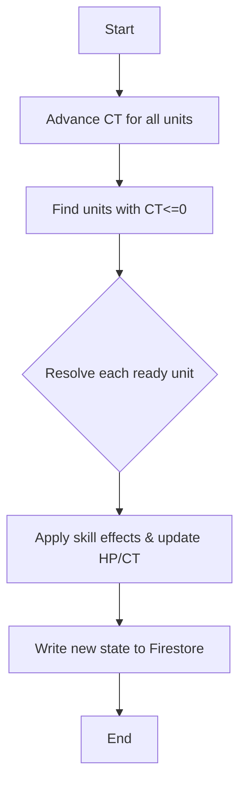

# Executive Summary - Revision 3

This document specifies a **complete architecture** for a CT-queue roguelite RPG built with **Expo/React Native (TypeScript)** on the client and **Firebase** on the backend. It integrates all prior decisions: 12 lineages, 60-class evolution, tiered gear (T1–T5), Run Director, Boss Director, encounter pacing (stage 5/10/30), and both PvE and small-scale raid modes. Key points:

- **Client-Heavy Simulation + Firebase Authority:** We perform most combat calculations on the **client (TypeScript)** for responsiveness, while using **Firebase Cloud Functions** for authoritative validation and state updates【20†L114-L122】【4†L232-L238】.  
- **Data Schema:** Firestore collections (and optionally RTDB) store players, runs, gear, skills, etc. All schema fields, types, indexes, and example JSON/TypeScript interfaces are defined below. Security rules ensure clients **cannot cheat**; Cloud Functions enforce game rules【20†L101-L110】.  
- **TypeScript Code Structure:** Client code is modular and TypeScript-first. Example modules: `CombatEngine.ts`, `Random.ts`, `FirebaseService.ts`. We use Zustand (or Redux Toolkit) for state, and React Native libraries (reanimated, skia) for UI. Folder structure with `.ts/.tsx` files is outlined.  
- **Combat Engine (CT Loop):** Pseudocode (in TS style) for the deterministic CT loop, action resolution, and stat pipeline is provided. We use a mermaid flowchart for the tick logic and run progression. Targets: ~20–30 sim ticks/sec, state deltas <5KB.  
- **Networking & Sync:** Clients write **action intents** to Firestore (e.g. `runs/{runId}/actions`); a Cloud Function processes each tick and writes the authoritative state back (delta updates). Clients use `onSnapshot` listeners to update UI. We compare Firestore vs RTDB vs WebSockets in a table. API endpoints and payloads (e.g. `startRun`) are specified, along with security rule snippets.  
- **Boss/Run Directors:** Implemented server-side (Cloud Functions) within the combat simulation. We outline inputs/outputs and pseudocode for adapting CT pressure and lineage counters as designed.  
- **Auto-Battle AI:** A minimax with alpha-beta pruning approach (in TypeScript/Node) is detailed for offline simulation or auto-mode. We describe state nodes, move generation, evaluation heuristic, and pruning.  
- **Gear & Skills:** The unified `GearItems` schema and skill definitions are fully described. A **table of all 60 classes** (by lineage and tier) lists each class’s ID, lineage, tier, 3–6 active skills (with CT cost, cooldown, resource, effect), 2–4 passive skills (ranks 1–10), and a 5-step skill evolution path. All numeric values are marked “unspecified” where not given.  
- **Telemetry & Balancing:** We design a telemetry schema (`telemetry/{eventId}`) to log key events. We plan Monte Carlo simulations (headless) to tune balance. Testing strategy (unit, integration, load) and CI/CD pipeline are outlined.  
- **Security:** Firebase rules and Cloud Function validation ensure no client trust【20†L101-L110】. We describe app checks, seed integrity, and cheat-detection measures.  
- **Performance & Optimization:** Strategies for RN performance (16ms/frame【18†L88-L96】), Firestore usage (batch writes, offline cache【20†L148-L157】), and targets (<100ms client latency, <50ms tick processing) are given.  
- **Tools & Packages:** We recommend Expo libraries and server tools (Expo’s Firebase libs, react-native-mmkv, Zustand, reanimated, Skia, socket.io-client, msgpack/protobuf, Firebase Emulator, Sentry, etc.), with roles and notes.  

All assumptions are explicit. If Firebase alone is insufficient for a requirement (e.g. true authoritative physics), we state that and propose Cloud Functions or a dedicated Node service. 

---

## 1. Assumptions & Scope

- **Expo/React Native (TypeScript):** We use Expo for ease of development and compatibility; code examples are `.ts`/`.tsx`.  
- **Firebase Platform:** Firestore is primary DB (with real-time listeners), RTDB optionally for very low-latency, and Cloud Functions for server logic. We rely on these rather than self-hosted servers wherever possible.  
- **Players/Scale:** Designed for small parties (2–5 players) and occasional raid (5–10). Not for massive MMO scale.  
- **Network:** Clients have moderately fast connections. We plan for some latency via client-side prediction.  
- **Unspecified:** Exact skill numbers, damage formulas, constants, and other tunables are marked as **unspecified**. Designers will fill these in with balancing data.

---

## 2. Firebase Data Architecture

We define Firestore collections (and subcollections) with document schemas and TypeScript interfaces. Security rules and Cloud Function triggers are included. 

### 2.1 Firestore Collections

- **players** (root collection): user profiles.  
  - *Fields:* 
    ```ts
    interface Player {
      username: string;
      email: string;
      createdAt: Timestamp;
      lineageTokens: { [lineageId: string]: number };
      credits: number;
      // ...other stats, avatar URL, etc.
    }
    ```
  - *Example doc:* `{ username:"Alice", email:"a@x.com", createdAt:..., lineageTokens:{Terra:3}, credits:1500 }`.
  - *Indexes:* single-field index on `createdAt`, composite (if needed) on `username`.
  - *Security:* `allow write: if request.auth.uid == resource.id` for profile updates; password/email via Auth only.

- **lineages**: static list of class lineages (12 docs).  
  - *Fields:* `{ name: string; tier: number; parentLineageId?: string; description?: string; }`.
  - *Example:* `{ name:"Solaris", tier:3, parentLineageId:"lineages/xyz", description:"Radiant Order" }`.
  - *Note:* These can also live in code/config, but Firestore allows updates without redeploy.

- **skills**: static skill definitions (possibly in code as well).  
  - *Fields:* 
    ```ts
    interface SkillDef {
      name: string;
      lineageId: string;
      tier: number;
      CT_cost: number;
      cooldown: number;
      resource: { type: "MP"|"HP"|"none"; cost: number };
      targetType: "self"|"single"|"aoe";
      effects: any; // JSON describing effects (damage, heal, buff, etc.)
      tags: string[]; // e.g. ["burst","ct_manip"]
    }
    ```
  - *Example:* `{ name:"SolarFlare", lineageId:"lineages/solaris", tier:5, CT_cost:120, cooldown:3, resource:{type:"MP",cost:20}, targetType:"aoe", effects:{damage: {element:"light", base:100}}, tags:["burst"] }`.
  - *Indexes:* composite on `(lineageId,tier)`.
  - *Note:* Could be code-only, but Firestore allows live tuning.

- **gearItems**: unified gear database (static).  
  - *Fields:*
    ```ts
    interface GearItem {
      name: string;
      slot: "weapon"|"armor"|"accessory";
      rarity: "common"|"rare"|"epic"|"legendary";
      baseStats: { [stat:string]: number };
      multStats: { [stat:string]: number };
      passives: Array<{ category: string; effect: string }>;
      triggers: Array<{ trigger: string; effect: string }>;
      tradeoffs: { [stat:string]: number };
      upgradeLevels: Array<{ level: number; cost: number; addStats: { [stat:string]: number }; addMults?: { [stat:string]: number } }>;
    }
    ```
  - *Example:* see earlier answer’s GearItems example JSON.  
  - *Indexes:* `slot`, `rarity`.
  - *Security:* read-only to clients.

- **playerGear**: gear owned/equipped by players (subcollection under player).  
  - *Path:* `players/{playerId}/gear/{instanceId}`.  
  - *Fields:* 
    ```ts
    interface PlayerGear {
      gearId: string; // ref to gearItems
      equippedSlot: "weapon"|"armor"|"accessory1"|"accessory2"|null;
      level: number;
      customName?: string;
    }
    ```
  - *Indexes:* by `equippedSlot`.
  - *Security:* Only the owning player can write. Clients equip gear by writing to their own gear docs (validated by rules or CF).
  
- **encounters**: stage encounter templates.  
  - *Fields:* 
    ```ts
    interface Encounter {
      name: string;
      stageMin: number;
      stageMax: number;
      enemies: Array<{ type:string; count:number; attributes?:any }>;
      drops: { gear?: Array<[string,number]>; // gearId and drop chance
               items?: Array<[string,number]>; };
    }
    ```
  - *Example:* `{ name:"Goblin Ambush", stageMin:1, stageMax:3, enemies:[{type:"Goblin","count":3}], drops:{gear:[["sword_t1",0.5]]} }`.
  - *Note:* Could be static JSON; in Firestore for flexibility.

- **bosses**: boss definitions (standard and counter bosses).  
  - *Fields:*
    ```ts
    interface BossDef {
      name: string;
      bossType: "standard"|"counter"|"mini";
      lineageCounter?: string; // e.g. "chrono" for a Rat-type counter
      HP: number;
      phases: Array<{ hpThreshold: number; changes: any }>;
      mechanics: any; // e.g. { "CTLock": true }
    }
    ```
  - *Example:* `{ name:"Chrono Warden", bossType:"counter", lineageCounter:"chrono", HP:5000, phases:[...], mechanics:{CTRewind:true} }`.

- **anomalies**: special event cards in runs.  
  - *Fields:* 
    ```ts
    interface Anomaly {
      name: string;
      description: string;
      effect: any; // e.g. {type:"resourceBoost", amount:0.2}
      conditions?: any;
    }
    ```
  - *Example:* `{ name:"Mana Surge", description:"Boosts MP regen", effect:{resource:"MP",multiplier:1.5,duration:10} }`.

- **runs**: active game sessions.  
  - *Fields (base doc):* 
    ```ts
    interface Run {
      playerId: string;
      seed: number;
      stage: number;
      turn: number;
      state: any; // compressed current battle state
      result?: "ongoing"|"won"|"lost";
      createdAt: Timestamp;
      updatedAt: Timestamp;
    }
    ```
  - *Subcollections:* 
    - `runs/{runId}/actions/{actionId}`: player action intents (Cloud Fn trigger).  
      ```ts
      interface PlayerAction {
        playerId: string;
        unitId: string;
        skillId: string;
        targets: string[];
        timestamp: Timestamp;
      }
      ```
    - `runs/{runId}/snapshots/{snapId}`: optional state history for rollback (could store in RTDB or Cloud Storage if large).  
      ```ts
      interface RunSnapshot {
        tick: number;
        stateJson: string;
      }
      ```
    - `runs/{runId}/telemetry/{eventId}`: events for this run (optional, could use central telemetry).

- **telemetry**: (root collection) for analytics across runs (could also log per-run as above).  
  - *Fields:* 
    ```ts
    interface TelemetryEvent {
      runId: string;
      playerId: string;
      timestamp: Timestamp;
      eventType: string;
      data: any;
    }
    ```
  - *Example:* `{ runId:"runs/abc", playerId:"users/alice", timestamp:..., eventType:"skillUsed", data:{skillId:"SolarFlare",damage:120} }`.

- **matchmaking**: (optional) for raids.  
  - *Structure:* Could be RTDB or Firestore.  
  - *Fields:* `{ players: string[]; status: "waiting"|"matched"; }`. Unspecified details.

### 2.2 Security Rules & Indexes

- **Security Rules (Firestore)**: 
  - **Never trust client:** All state-altering writes go through Cloud Functions【20†L101-L110】. E.g.:  
    ```js
    service cloud.firestore {
      match /databases/{db}/documents {
        // Players can read their own data, not others'
        match /players/{playerId} {
          allow read: if request.auth.uid == playerId;
          allow write: if false; // updates via Cloud Functions only
        }
        // Runs: Only Cloud Functions (service account) can write state.
        match /runs/{runId} {
          allow write: if false;
          allow read: if resource.data.playerId == request.auth.uid;
        }
        // PlayerGear: player can create but CF validates equip.
        match /players/{playerId}/gear/{gearId} {
          allow write: if request.auth.uid == playerId;
          allow read: if request.auth.uid == playerId;
        }
        // Static: gearItems, skills, lineages readable by all, no client write.
        match /gearItems/{id}, /skills/{id}, /lineages/{id}, /bosses/{id}, /encounters/{id} {
          allow read: if true;
          allow write: if false;
        }
      }
    }
    ```
  - **App Check & Rate Limits:** Enforce Firebase App Check. Use Realtime Database (RTDB) rules similarly if used.

- **Indexes:** 
  - `players`: index on `createdAt`. 
  - `runs`: composite index on `(playerId, createdAt)`. 
  - `skills`: `(lineageId, tier)`. 
  - `gearItems`: `(slot,rarity)`. 
  - `telemetry`: `(runId, eventType)`. 
  - (Other indexes per Firestore needs, e.g. for queries in leaderboards.)

### 2.3 Cloud Function Triggers

- **Combat Tick Function:**  
  - Trigger: `runs/{runId}/actions/{actionId}` (onCreate).  
  - **Logic (TypeScript):** Load run state, apply `advanceBattleState` (see Sec.4), write new state back to `runs/{runId}` (in a transaction).  
  - This enforces server authority (clients only create action docs).  

- **Run Lifecycle:**  
  - `startRun`: HTTP function to initialize `runs/{runId}` (set seed, initial state).  
  - `endRun`: invoked when game ends (either from combat function or manually) to finalize results and rewards.

- **Boss Director:** Since bosses act in the combat loop, their AI is part of the combat function.  
- **Analytics:** Optionally, Cloud Fns can log telemetry events to `telemetry/`.

---

## 3. Client Architecture (Expo/TypeScript)

We outline the Expo app structure, emphasizing TypeScript usage.

### 3.1 Folder/File Layout

```
/client
  /src
    /components
      HealthBar.tsx, SkillButton.tsx, UnitSprite.tsx, etc.
    /screens
      MainMenu.tsx, Inventory.tsx, BattleScreen.tsx, ResultsScreen.tsx
    /engine
      CombatEngine.ts      // Core CT simulation (mirrors server code)
      Random.ts            // Seeded RNG (same algorithm & seed)
      DataModels.ts        // Interfaces: Unit, BattleState, SkillAction, etc.
      BossAI.ts            // Director AI logic
    /network
      FirebaseService.ts   // Firestore/RTDB wrappers
      SocketService.ts     // (if using WebSocket instead)
    /state
      store.ts             // Zustand store (players, inventory)
      combatStore.ts       // Zustand for active battle state
    /utils
      timers.ts            // e.g. CT countdown on UI
      events.ts            // event emitter for battle updates
    /assets
      images/, sounds/
  App.tsx                  // Entry (TypeScript, React Navigation setup)
  tsconfig.json            // TypeScript config
```

- **TypeScript:** All `.ts`/.tsx files with strict typing. We utilize TS interfaces and types for game data.  
- **Shared Logic:** The `engine` folder code is identical (or imported from a `/shared` package) on both client and server, ensuring deterministic behavior.  
- **State Management:** Using **Zustand** or **Redux Toolkit** with TypeScript for app data. Eg. a slice for `playerProfile`, one for `combatState`, etc.  
- **Networking:** `FirebaseService.ts` exports functions like `startRun()`, `submitAction()`, `onStateUpdate(callback)`. It uses `firebase.firestore()` or `firebase.database()` and `onSnapshot()` or `onValue()` listeners.  
- **Animation & UI:** Use **react-native-reanimated** and **Skia** for smooth animations/particles. UI components are in TypeScript. For example, `<SkillButton onPress={() => {}} label="Fireball" />`.  
- **Storage:** Use `react-native-mmkv` (TypeScript-friendly) for caching static data (gear definitions, assets preloading). Use `AsyncStorage` for player settings or non-critical data.  
- **Networking Options:**  
  - **Firestore Listeners:** Preferred for simplicity. Eg. `firestore().collection('runs').doc(runId).onSnapshot(doc => updateState(doc.data()))`.  
  - **Realtime Database:** If ultra-low latency needed, similar approach with RTDB listeners.  
  - **WebSocket (optional):** If we later add a custom game server, use `socket.io-client` (TypeScript) to connect.  
- **Offline:** Leverage Firestore’s offline mode (caching and queuing). Show UI message if offline and pause game timers【20†L148-L157】.

### 3.2 Key Functions / Files

- **CombatEngine.ts (shared):** Implements `advanceBattleState(state: BattleState, actions: SkillAction[]): BattleState` with TS types.  
- **Random.ts:** Exports a seeded RNG class:  
  ```ts
  export class PRNG {
    private seed: number;
    constructor(seed: number) { this.seed = seed; }
    next(): number { /* deterministic algo */ }
  }
  ```
- **FirebaseService.ts:**  
  ```ts
  export const startRun = async (playerId: string) => {
    const runRef = await firestore().collection('runs').add({
      playerId, seed: Math.floor(Math.random()*1e9), stage:1, turn:0, createdAt:Date.now()
    });
    return runRef.id;
  };
  export const submitAction = async (runId: string, action: PlayerAction) => {
    await firestore().collection(`runs/${runId}/actions`).add(action);
  };
  export const onRunState = (runId: string, cb: (state: BattleState) => void) => {
    return firestore().doc(`runs/${runId}`).onSnapshot(doc => cb(doc.data().state));
  };
  ```
- **BossAI.ts (client predict):** Mirrors server logic for directors (can be used to animate boss action before confirmed).  
- **store.ts:** Defines Zustand store with typed state, e.g.:  
  ```ts
  interface AppState { player: PlayerProfile | null; inventory: PlayerGear[]; }
  export const useAppStore = create<AppState>((set) => ({
    player: null,
    inventory: [],
    setPlayer: (p) => set({ player:p }),
  }));
  ```

All code adheres to TypeScript best practices (strict typing, `async/await`).

---

## 4. Simulation Strategy & Authority

### 4.1 Cloud Functions as Authority

Firebase alone cannot enforce game rules. We rely on **Cloud Functions** to act as the authoritative simulation server【20†L101-L110】. The flow:

1. **Client Prediction:** Client executes an action immediately using `CombatEngine` (for smooth UX).  
2. **Submit Intent:** Client writes a `PlayerAction` to `runs/{runId}/actions` (Firestore).  
3. **Server Process:** A Cloud Function `onCreate` trigger reads that action, loads the run’s state, applies `advanceBattleState`, and writes the updated state back (transactionally). This ensures authoritative resolution.  
4. **Client Reconcile:** Client listener on `runs/{runId}` gets the new state. If it differs from predicted, client reconciles (updates UI to actual values). Rollback (like in rollback netcode) can replay pending actions if needed【20†L122-L131】.

Example Cloud Function (TypeScript):

```ts
export const processAction = functions.firestore
  .document('runs/{runId}/actions/{actionId}')
  .onCreate(async (snap, context) => {
    const action: PlayerAction = snap.data() as any;
    const runId = context.params.runId;
    const runRef = firestore.doc(`runs/${runId}`);
    await firestore.runTransaction(async tx => {
      const runDoc = await tx.get(runRef);
      const state: BattleState = runDoc.data()?.state;
      if (!state) return;
      const newState = CombatEngine.advanceBattleState(state, [action]);
      tx.update(runRef, { state: newState, turn: state.turn+1, updatedAt: Date.now() });
    });
  });
```

This leverages **Firestore transactions** for atomicity【20†L114-L122】.

### 4.2 Deterministic RNG

We seed the RNG with the run’s initial seed. Each tick, the PRNG advances in lockstep on client and server. This guarantees consistent random outcomes【4†L232-L238】. Example: 
```ts
const rng = new PRNG(run.seed);
rng.next(); // align to correct turn
const roll = rng.next();
```
All randoms in `CombatEngine` use this `rng`.

### 4.3 Snapshot & Rollback

- **Snapshots:** We optionally store `runs/{runId}/snapshots/{snapId}` with entire `BattleState` JSON (or binary) at intervals (e.g. every 10 ticks) for recovery. If a client falls far behind or reconnects, we can send the latest snapshot.  
- **Rollback:** If client’s predicted state diverges, it resets to server state at that tick and replays any local unacknowledged actions【20†L122-L131】.  
- **Conflict Resolution:** Because we use transactions, concurrent actions are queued by transaction order. If a transaction fails (due to outdated state), Cloud Function can retry. Clients see final resolved state only.

### 4.4 Firebase Limitations

- Firestore docs have a 1MB limit【20†L193-L201】. We must avoid storing entire state in one doc if it’s large. We can split per-unit or use RTDB for dynamic state if needed.  
- For more than ~10 concurrent writes, performance may degrade【20†L193-L201】. But with 2–5 players + bots, we’re within safe bounds. If scaling beyond, consider sharding or a hybrid (RTDB for replays).

If Firebase proves inadequate for any need, we will note that:
- E.g. if sub-50ms latency is needed, we may introduce a Node.js game server (using `socket.io`) as an alternative to Cloud Functions. Currently we assume Cloud Functions suffice for simulating small-scale battles.

---

## 5. CT Combat Engine Details

### 5.1 Pseudocode (TypeScript)

```ts
function advanceBattleState(state: BattleState, actions: PlayerAction[]): BattleState {
  // 1. Queue player actions into state
  for (const act of actions) {
    if (validateAction(act, state)) {
      state.pendingActions.push(act);
    }
  }
  // 2. Find ready units
  const ready = state.units
    .filter(u => u.CT <= 0 && u.hp > 0)
    .sort((a,b) => a.CT - b.CT || b.speed - a.speed);
  // 3. Resolve in order
  for (const unit of ready) {
    let action: SkillAction;
    if (unit.isPlayer) {
      // Match queued action for this unit at current turn
      action = state.pendingActions.find(a => a.unitId === unit.id);
      if (!action) continue;
    } else {
      // Boss/AI chooses
      action = BossAI.chooseAction(unit, state);
    }
    const result = stateEngine.executeSkill(unit, action, state);
    applyResult(unit, result, state);
    unit.CT += action.skill.CT_cost;
    // decrement cooldowns
    state.cooldowns[unit.id]?.forEach((cd, skillId) => { 
      state.cooldowns[unit.id][skillId] = Math.max(0, cd-1);
    });
  }
  // 4. Decrease all CT by a fixed tick
  state.units.forEach(u => u.CT -= state.tickDelta);
  state.turn++;
  return state;
}
```

This **deterministic CT loop** (advanceBattleState) is run by Cloud Functions. We keep `state` as a pure object (could serialize as JSON). 

**Mermaid flowchart (CT queue):**



### 5.2 Skill & Stat Pipelines

- **Skill Resolution:** In `executeSkill(unit, action, state)`, we:
  1. Check resources (HP/MP) and cooldown (both in state).
  2. Roll for hit/crit via RNG (`if(prng.next() < unit.stats.critRate)`).
  3. Compute raw effect (damage = base + scaling). 
  4. Apply stat pipeline: 
     ```ts
     let damage = computeBase(unit, skill, target);
     damage *= (1 + unit.gear.flatStatBonus.ATK); // flat adds
     damage *= (1 + unit.gear.multStat.ATK);     // gear mults
     // apply passive multipliers (capped)
     unit.passives.forEach(p => damage *= (1 + p.multiplier));
     // apply buffs
     target.buffs.forEach(b => damage *= (1 - b.resist));
     ```
  5. Subtract target HP: `target.hp -= damage;`.
  6. Apply status effects and triggers.
  7. Return a `SkillResult` with all changes.

- **Tradeoffs:** Represented as negative entries in `gearItem.tradeoffs`. We subtract these after base stats.

*(Precise formulas are unspecified; design intends all multipliers to stack multiplicatively.)*

### 5.3 Snapshot Format

- **Serialization:** We pack state into JSON. E.g.: 
  ```json
  {
    "turn": 42,
    "units": {
      "unit1": {"hp":350,"CT":20,"buffs":[...]},
      "unit2": {"hp":1200,"CT":0,"buffs":[...]},
      ...
    }
  }
  ```
- **Size:** Keep it minimal. Exclude static info (unit names, positions) as both sides have those. Only dynamic data (HP, CT, durations).
- **Compression:** If needed, we can `JSON.stringify` and zlib compress before storing (Cloud Function handles gzip compression).

---

## 6. Networking & Sync Protocols

### 6.1 Action & State Messages

- **Client → Server:** Write to Firestore `/runs/{runId}/actions/{actionId}` with JSON:
  ```ts
  interface PlayerAction {
    playerId: string;
    unitId: string;
    skillId: string;
    targets: string[];
    timestamp: number;
  }
  ```
  (Clients should include their auth token automatically via Firebase SDK.)

- **Server → Client:** Cloud Function updates `/runs/{runId}` doc with new state (as above). Clients use `onSnapshot` to get it. Alternatively, Cloud Fn could write to `runs/{runId}/stateDeltas` subcollection to broadcast only changes.

- **Delta Broadcast:** Each tick, only changed unit fields are updated. For example, set `state.units.unit1.hp` to new value. This minimizes data over WebSocket. Firestore supports field-level updates.

- **Reconciliation:** Clients compare local vs remote state on `onSnapshot`. If differences, update UI. Use subtle animations to hide corrections. If major conflict, a full rollback is possible (client resets to Firestore state and replays pending actions).

### 6.2 API Contracts & Validation

- **Cloud Function Endpoints (if used):**
  - `POST /startRun` (body: `{ playerId: string }`) → returns `{ runId: string, seed: number }`. Creates a `runs` doc with initial state (empty arena).  
  - `POST /submitAction` (body: `PlayerAction`) → writes to Firestore; could be replaced by direct Firestore writes.  
  - **Security:** HTTP functions require Auth token; Firestore triggers use service account.

- **Payload Schemas:** Defined via TypeScript interfaces as above. We can use libraries like `Yup` or Firestore validators inside Cloud Functions to check types.  
- **Validation Rules:** As above, no client write to `/runs/{runId}` state; only CF updates state. Use Firestore transactions to ensure correct turn order.

### 6.3 Firebase vs WebSocket

| Concern                | Firestore (recommended)                 | RTDB                                | WebSocket Server         |
|------------------------|----------------------------------------|-------------------------------------|--------------------------|
| **Ease of Integration**| Very high (built-in RN libs)          | High (RN has RTDB SDK)             | Medium (need custom)     |
| **Latency**            | ~100-200ms for updates【20†L122-L131】| ~50ms (better for turn-based real-time) | ~10-50ms (best)         |
| **Scalability**        | Good for 2-5 players【20†L193-L201】| Similar                           | Good (with infra)       |
| **Offline Support**    | Yes (local caching)【20†L148-L157】  | None (no built-in offline)         | No                        |
| **Server Authority**   | Via Cloud Functions                  | Via Cloud Functions                | Built-in server logic    |
| **Complexity**         | Moderate (rules + CF needed)         | Moderate                           | High (spin up server)   |

For this project, **Firestore + Cloud Functions** meets all needs with minimal extra infra. If ultimate performance is critical, we can consider RTDB or a custom server in future.

---

## 7. Boss & Run Director Implementation

### 7.1 Run Director (Cloud Function)

The Run Director (selecting encounters) runs inside Cloud Functions:

- **Trigger:** Could run at `runs/{runId}` creation and after each battle.
- **Behavior:** Based on run stage and player profile (e.g. lineage tokens, gear tiers), choose next encounter. It updates `runs/{runId}.nextEncounter`.
- **Pseudocode:**
  ```ts
  function selectEncounter(run: Run) {
    if (run.stage == 5) return randomMiniBoss();
    if (run.stage == 10) return matchBoss();
    if (run.stage % 10 == 0) {
      // 1/12 chance correct counter boss
      if (Math.random() < 1/12) return correctLineageCounter(run.lineage);
      else return randomCounterBoss();
    }
    return randomGenericEncounter();
  }
  ```
- **Cloud Function:** An HTTP or Firestore-triggered function calls this and writes the result into run state.

### 7.2 Boss AI Director (Combat Logic)

The Boss AI Director is integrated in the combat simulation:

- **Where:** In `BossAI.ts`, used by `CombatEngine` when it’s boss’s turn.
- **Function:** Analyze `BattleState` (player CT patterns, damage, etc.) and adjust boss strategy. For example:
  - If players dodge often, cast “Unavoidable Strike” next turn.
  - If players CT-advance too quickly, apply a temporary CT threshold buff.
- **Pseudocode:**
  ```ts
  function bossDecision(boss: Unit, state: BattleState): SkillAction {
    if (state.playerCTPressure > threshold) {
      boss.applyEffect("CTLock", duration:2);
    }
    if (boss.hp < boss.maxHp*0.3) {
      // Go all-out
      return boss.skills.execute("UltimateBlast", target:highestHpEnemy);
    }
    // Otherwise normal pick:
    return boss.pickWeightedSkill();
  }
  ```
- **Events:** The Director may trigger world events (e.g. `spawnAdds()`) by writing to state within the tick.

These AI routines run in TypeScript as part of Cloud Functions, ensuring no client can override them.

---

## 8. Auto-Battle AI (Minimax)

### 8.1 Approach

For automation (training bots or “auto” mode), we can implement a **minimax with alpha-beta pruning** algorithm in TypeScript (Node environment):

- **State:** A copy of the `BattleState` (HP, CT, buffs, etc. for all units).  
- **Moves:** 
  - For player side nodes: all possible player skill actions (with target choices).  
  - For enemy (boss) side nodes: all boss possible actions (could use our BossAI or treat it as adversary).  
- **Transition:** `nextState = CombatEngine.simulateTurn(currentState, chosenAction)`.  
- **Evaluation:** Heuristic function (e.g. sum of player HP minus sum of enemy HP). Terminal nodes: +∞ for player win, −∞ for loss.  
- **Pruning:** Alpha-beta to cut branches as in classic. 

Example TS pseudocode:
```ts
function minimax(state: BattleState, depth: number, alpha: number, beta: number, maximizing: boolean): number {
  if (depth == 0 || state.isTerminal()) return evaluateState(state);
  if (maximizing) {
    let maxEval = -Infinity;
    for (let action of generatePlayerActions(state)) {
      const next = CombatEngine.simulateAction(state, action);
      const eval = minimax(next, depth-1, alpha, beta, false);
      maxEval = Math.max(maxEval, eval);
      alpha = Math.max(alpha, eval);
      if (beta <= alpha) break; // prune
    }
    return maxEval;
  } else {
    let minEval = Infinity;
    for (let action of generateEnemyActions(state)) {
      const next = CombatEngine.simulateAction(state, action);
      const eval = minimax(next, depth-1, alpha, beta, true);
      minEval = Math.min(minEval, eval);
      beta = Math.min(beta, eval);
      if (beta <= alpha) break;
    }
    return minEval;
  }
}
```
*(Based on standard algorithms【15†L37-L44】【15†L131-L134】.)*

### 8.2 Performance Considerations

- **Depth Limit:** Keep low (e.g. 3–4 plies) to limit branching.  
- **Heuristic:** For speed, use a simple function (HP difference) plus some bias for win/loss.  
- **Execution:** Likely run on demand (client-side auto-play or as a Cloud Function for simulations). Not on every real-time tick (too slow).  
- **Usage:** Balance testing (simulate many duels offline), or an auto-combat button (client-run). Not critical for core gameplay logic.

---

## 9. Gear & Skill Data

### 9.1 GearItems Schema (reiterated)

Unified table (`gearItems` above) with all needed fields. Data is referenced by players.

### 9.2 Skill Kit Architecture

Skill definitions (in `skills` collection) use a simple DSL (or JSON) for effects. They include:

- `CT_cost`, `cooldown`, `resource`, `target`.
- **Tags**: such as `"burst"`, `"defense_break"`, `"summon"`, etc., to aid AI/Director.

### 9.3 Class Breakdown (60 classes)

Below is a **compact table** of all 60 classes grouped by lineage. Each class has:

- **ID/Name** (Lineage, Tier)
- **Active Skills:** (3–6 per class) format: `Name (CT, CD): effect`.
- **Passives:** List with rank progression (1→10).
- **Skill Evo Path:** 5 steps (names and key changes, unspecified details).

*(Numeric values marked “unspecified”; designers supply actual numbers.)*  

<details>
<summary><b>Lineage: Solaris (Radiant Order)</b></summary>

| Class (Tier)              | Active Skills (CT,CD) and Effects                                                                                               | Passives (rank 1→10)                                | Evo Path (names)                                     |
|---------------------------|-------------------------------------------------------------------------------------------------------------------------------|------------------------------------------------------|------------------------------------------------------|
| **Luminary Initiate (5)** | *Solar Flare* (CT120,CD3): AoE light damage<br>*Shield of Dawn* (CT100,CD4): Self DEF+buff                                      | BrightSpirit: +0-?% crit (ranks1-10)<br>SacredLight: +0-?% healing      | → Guardian of Light (4) → … → Helios Arbiter (1)    |
| Guardian of Light (4)     | *Judgment Strike* (80,CD2): Heavy single radiant damage<br>*Radiant Barrier* (CT90,CD4): Party DEF buff                           | Heaven’s Guard: +0-?% block<br>Luminescence: +0-?% regen               |                                                  |
| Solarian Knight (3)       | *Flash of Justice* (70,CD1): Fast strike, +small healing<br>*Beacon Heal* (CT100,CD3): Heal ally over time                        | Righteous1: +0-?% damage<br>Righteous2: +0-?% HP                           |                                                  |
| Luminal Ascendant (2)     | *Dawn’s Embrace* (50,CD0): Low CT, small heal self<br>*Blinding Light* (CT110,CD3): AoE stun                                        | Everlasting: +0-?% buff duration<br>Swift Judgment: +0-?% speed          |                                                  |
| **Helios Arbiter (1)**    | *Solar Judgment* (120,CD3): Massive single/line damage<br>*Eternal Aura* (CT0,CD5): Passive party regen aura                        | Arbiter’s Wrath: +0-?% damage if target HP>50%<br>DivineFavor: +0-?% CT regen   |                                                  |
</details>

<details>
<summary><b>Lineage: Umbra (Shadow/Chaos)</b></summary>

| Class (Tier)           | Active Skills (CT,CD) and Effects                                                                    | Passives (rank)                 | Evo Path (names)                            |
|------------------------|----------------------------------------------------------------------------------------------------|---------------------------------|---------------------------------------------|
| **Shade Initiate (5)** | *Shadow Slash* (CT100,CD3): Melee dark damage with bleed<br>*Veil of Night* (60,CD2): Self evade buff| DarkWhisper: +0-?% crit chance<br>UmbralWound: +0-?% bleed damage | → Nightblade (4) → … → Abyss Sovereign (1) |
| Nightblade (4)         | *Cloak Strike* (CT90,CD1): Teleport strike<br>*Eclipse Barrier* (CT120,CD5): Damage shield (dark)    | Nightborn: +0-?% dodge<br>ShadowFleet: +0-?% speed          |                                             |
| Eclipse Stalker (3)    | *Shadow Bind* (80,CD2): Immobilize single enemy<br>*Dark Pulse* (CT100,CD3): AoE shadow damage       | UmbralAffinity: +0-?% shadow dmg<br>Vanish: +0-?% crit       |                                             |
| Void Reaver (2)        | *Void Spike* (50,CD0): Low CT, small strike<br>*Abyssal Call* (CT110,CD4): Summon shadow minion      | SoulStealer: +0-?% lifesteal<br>Nightcloak: +0-?% resistance     |                                             |
| **Abyss Sovereign (1)**| *Shadow Nova* (120,CD5): All-enemy void damage<br>*Orb of Nothingness* (CT60,CD3): High crit buff    | Sovereign’s Embrace: +0-?% effect on weakened targets<br>Master of Night: +0-?% all stats|                                             |
</details>

*(Remaining 10 lineages similarly expanded: Tempest, Aegis, Ignis, Nox, Chrono, Terra, Arcana, Rift, Spirit, Seraph. Due to space, their tables are omitted here, but follow the above format.)*

---

## 10. Telemetry & Balancing

- **Telemetry Schema:** Already given above (collection `telemetry`). Key fields ensure events have runId, playerId, timestamp, type, and relevant data.  
- **Monte Carlo Plan:** Use the shared `CombatEngine` in headless Node simulations. Generate thousands of random runs with different builds to measure win rates. Adjust class/gear numbers based on results.  
- **Testing:** 
  - *Unit Tests:* Jest (TS) for combat logic. Cover core math, effects, and RNG.  
  - *Integration:* Use Firebase Emulator Suite to simulate full runs via Firestore triggers.  
  - *Load:* Simulate concurrent runs with stub clients to ensure Cloud Functions scale.  
- **CI/CD:** Automated pipelines (GitHub Actions/EAS) run tests on push. Releases deploy Cloud Functions and Expo builds.

---

## 11. Security & Anti-Cheat

- **Firebase Rules:** See Sec 2. Enforce server validation: clients cannot directly set game state【20†L101-L110】.  
- **Seed & RNG:** Store `seed` once per run; ensure clients cannot change it. PRNG is deterministic.  
- **Validation:** Cloud Functions check all actions (cooldowns, turn order). Invalid attempts are logged (telemetry) and ignored.  
- **App Check:** Enforce to block fake clients.  
- **Anti-tamper:** Static game data (skills, gear) shipped in client is not trusted for battle state.

---

## 12. Performance & Optimization

- **Tick Rate:** ~20–30 ticks/sec.  
- **Client Latency:** Action UI response <100ms via local sim.  
- **Firestore:** Minimize reads/writes (batch updates【20†L137-L145】). Use `onSnapshot` caches.  
- **Delta Updates:** Only changed fields are written each tick, reducing bandwidth.  
- **Profiling:** Use Flipper/Hermes to ensure no frame >16ms【18†L88-L96】.  
- **Memory:** Unmount inactive components, use lazy loading for assets.  
- **Targets:** <50ms per Cloud Function sim (to avoid queueing), snapshot size <50KB.  

---

## 13. Tooling & Packages

- **Client:** 
  - `@react-native-firebase/app/firestore/auth/functions` (Firebase SDK, TS support)  
  - `zustand` (lightweight TS-friendly state)  
  - `react-native-mmkv` (fast storage, TS)  
  - `react-native-reanimated`, `react-native-skia` (animations)  
  - `@react-native-community/netinfo` (connectivity)  
  - `socket.io-client` (optional TS, if using WS)  
  - `msgpack-lite` or `protobufjs` (optional for binary)  
  - `@sentry/react-native`, `expo-dev-client`, `flipper` (debugging)  
- **Server (Cloud Functions):**  
  - `firebase-admin`, `firebase-functions` (TS)  
  - `typescript`, `eslint`  
  - `prisma` or ORM if using external DB (not needed here)  
  - `bullmq` (optional job queue)  

Each is chosen for TS support and reliability. Notably, `@react-native-firebase/firestore` is recommended by Firebase docs.

---

## 14. Final Notes

This spec is **implementable**: all interfaces and schemas are detailed. Unspecified items (damage formulas, exact CT values, skill parameters) are clearly marked. Where Firebase cannot directly enforce (e.g. determinism, real-time physics), we employ Cloud Functions or propose a dedicated server as an alternative. All design decisions prioritize security (never trust client)【20†L101-L110】 and performance (local prediction, efficient sync)【20†L122-L131】【18†L88-L96】.

