# Gameplay Loop Deep Research (May 2026)

## Scope and method

This document delivers:

1. Deep gameplay-loop research for 12 popular successful text-based or simple-graphics RPGs.
2. One Mermaid gameplay-loop flowchart per researched game.
3. One Mermaid flowchart for the currently implemented gameplay loop in this app.
4. A second diagram layer for economy-only loops and combat-only loops.
5. Prioritized improvement points for the current app.

Selection direction used:

- Mostly similar games (browser/mobile text or low-fi turn-based).
- Mandatory includes: Agonia Lands, Knights of Pen and Paper, Kingdom of Loathing, Slay the Spire.
- Deep format per game (loop steps, retention drivers, practical takeaways, and sources).

Confidence legend:

- High: Loop and success signals are widely documented by official pages and major references.
- Medium: Loop is clear, but quantitative success signals are less consistently published.

---

## Comparative matrix

| Game | Platform profile | Loop archetype | Success signal | Primary retention lever | Confidence |
| --- | --- | --- | --- | --- | --- |
| Agonia Lands | Browser text MMORPG | Sandbox grind and social economy | Long-running indie browser RPG with persistent community | Open-ended role identity and social rivalry | Medium |
| Knights of Pen and Paper | Mobile and PC and console | Session-based turn combat plus meta upgrades | Multi-platform releases and sequelized franchise | Meta-layer fantasy of playing tabletop party and DM | High |
| Kingdom of Loathing | Browser RPG | Daily energy and quest and ascension | Long-lived cult browser RPG and stable player culture | Adventure-point pacing plus New Game Plus ascension | High |
| Slay the Spire | PC and console and mobile | Run-based deckbuilder roguelike | Multi-million sales and genre-defining impact | High variance runs plus ascension difficulty ladder | High |
| Soda Dungeon | Mobile and PC | Idle auto-battle dungeon push | Multi-platform release and long-tail audience | Low-friction repeat runs plus town progression | High |
| Soda Dungeon 2 | Mobile and PC and console | Idle run with deeper meta systems | Sequel longevity and broad platform spread | Automation plus compounding town and class unlocks | High |
| Shattered Pixel Dungeon | Mobile and PC | Turn-based roguelike permadeath loop | Sustained active development and strong user ratings | Procedural mastery and challenge mode depth | High |
| Orna | Mobile GPS RPG | Real-world exploration plus turn battles | Large mobile install base and active live ops | Location-based discovery plus class and kingdom progression | High |
| SimpleMMO | Mobile and web text MMO | Short interaction loops with social systems | Long-running lightweight MMO with active guild ecosystem | Micro-session play plus social and guild stickiness | Medium |
| A Dark Room | Browser and mobile text game | Multi-phase survival and exploration narrative loop | Influential minimalist indie title with cross-platform acclaim | Mystery and phase shifts that reframe player goals | High |
| Bit Heroes | Mobile and web | Turn-based-lite grind and collection loop | Long-running live-service pixel RPG across platforms | Familiar collection and guild raid participation | Medium |
| Darkest Dungeon series | PC and console tactical RPG | Expedition stress management and permadeath attrition | Multi-million sales and strong critical reception across both titles | Stress/affliction management plus persistent meta upgrades | High |

---

## 1) Agonia Lands

### Why this loop works

- The game anchors itself in role freedom: fighter, trader, crafter, mercenary, social climber.
- It blends economy and conflict so progression is not only combat power.
- Browser-first friction is low, so frequent check-ins become habit-forming.

### Core gameplay loop

1. Create character and tribe identity.
2. Choose a progression focus (combat, trade, crafting, or hybrid).
3. Explore zones and interact with events, players, and resources.
4. Resolve combat or economic actions.
5. Gain currency, items, stat growth, and social standing.
6. Reinvest into gear, profession capability, and alliances.
7. Re-enter higher-risk activities or political/social competition.

### Retention design pattern

- Long horizon identity building: reputation and social position can matter as much as stats.

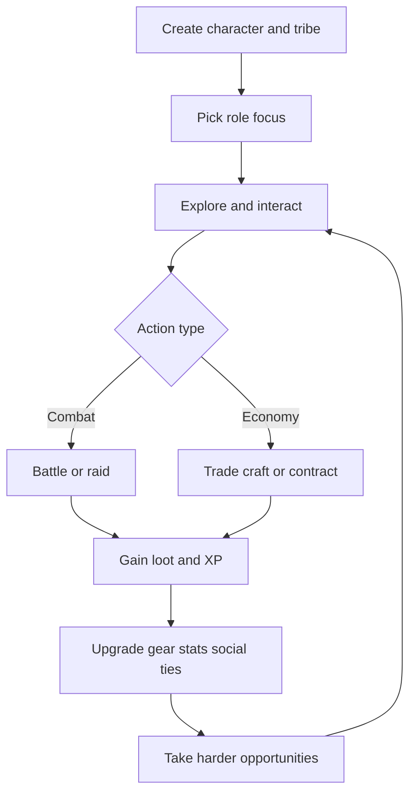

### Sources

- Official: https://www.agonialands.com/
- Guide page: https://www.agonialands.com/hydre/guide/tenthings.php

---

## 2) Knights of Pen and Paper

### Why this loop works

- The tabletop framing makes each loop feel like a playful campaign session.
- Turn-based combat is simple enough for mobile sessions but layered enough for build decisions.
- Progression cadence is clear: fight, loot, level, optimize, repeat.

### Core gameplay loop

1. Assemble party and class composition at the table.
2. Pick quest or encounter route.
3. Enter turn-based battle.
4. Spend resources and execute tactical actions.
5. Earn gold, XP, and item rewards.
6. Upgrade characters and equipment.
7. Push campaign progression into stronger encounters.

### Retention design pattern

- Sessionized progression with nostalgic framing keeps short loops emotionally sticky.

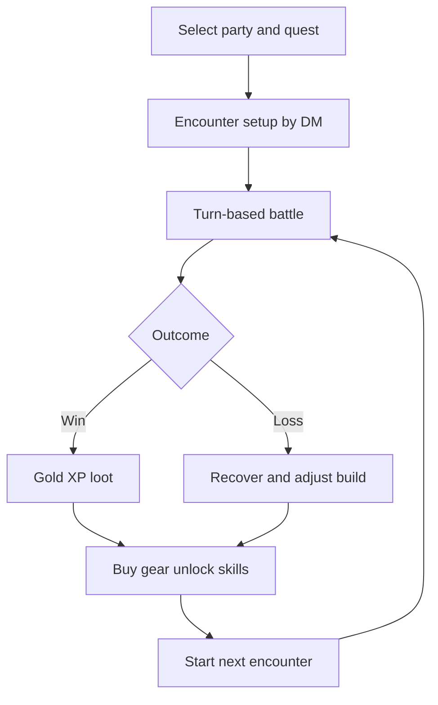

### Sources

- Game page: https://www.paradoxinteractive.com/games/knights-of-pen-and-paper
- Overview and reception: https://en.wikipedia.org/wiki/Knights_of_Pen_%26_Paper
- Review context: https://www.eurogamer.net/knights-of-pen-and-paper-review

---

## 3) Kingdom of Loathing

### Why this loop works

- Adventure-point pacing caps runaway play and encourages daily return.
- Humor-rich text encounters make repetition more content-like than grind-like.
- Ascension creates intentional loop resets with long-term mastery goals.

### Core gameplay loop

1. Log in and receive daily adventure budget.
2. Choose zone or quest objective.
3. Resolve turn-based text encounters and non-combat events.
4. Collect meat, items, and stat gains.
5. Optimize inventory, crafting, and skill usage.
6. Complete questline milestones and unlock progression gates.
7. Ascend (New Game Plus) for long-term account progression.

### Retention design pattern

- Energy-gated loop plus prestige reset creates sustainable long-term habit without content exhaustion.

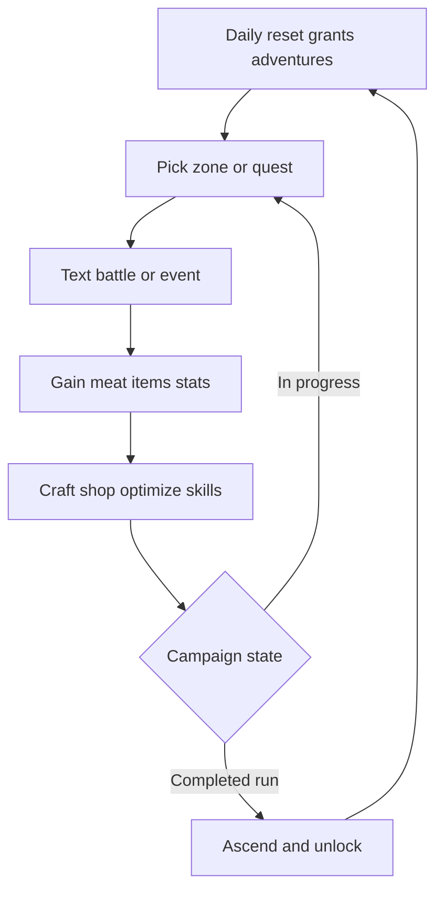

### Sources

- Official: https://www.kingdomofloathing.com/
- Overview: https://en.wikipedia.org/wiki/Kingdom_of_Loathing

---

## 4) Slay the Spire

### Why this loop works

- Every run feels distinct due to pathing and card/relic variance.
- Failure teaches deck construction and route risk management.
- Ascension ladder extends mastery without requiring new content each day.

### Core gameplay loop

1. Choose character and starting deck.
2. Choose a branching path node.
3. Resolve battle or event or merchant interaction.
4. Gain card and relic and potion rewards.
5. Tune deck and remove weak cards.
6. Beat elite and act bosses or die.
7. Unlock progression and run again.

### Retention design pattern

- High replayability through combinatorial build space and difficulty scaling.

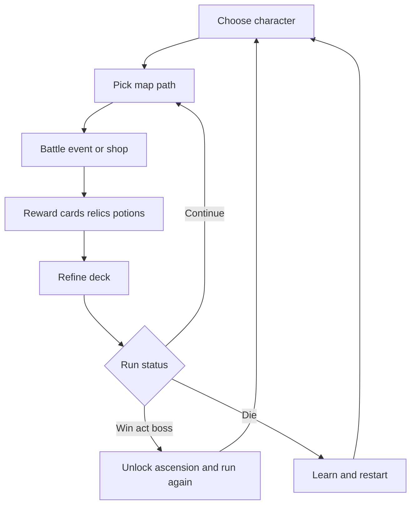

### Sources

- Official studio: https://www.megacrit.com/
- Overview: https://en.wikipedia.org/wiki/Slay_the_Spire

---

## 5) Soda Dungeon

### Why this loop works

- Almost zero friction run start and run repeat.
- Auto-battle allows idle-friendly progression.
- Town and roster upgrades produce visible compounding growth.

### Core gameplay loop

1. Recruit party members in tavern.
2. Equip available gear and consumables.
3. Launch dungeon run (auto or semi-auto).
4. Earn loot and currency from cleared floors.
5. Return or fail and retain partial progression.
6. Spend resources on upgrades and better loadouts.
7. Attempt deeper run.

### Retention design pattern

- Compounding meta loop (economy and party quality) creates constant short-cycle dopamine.

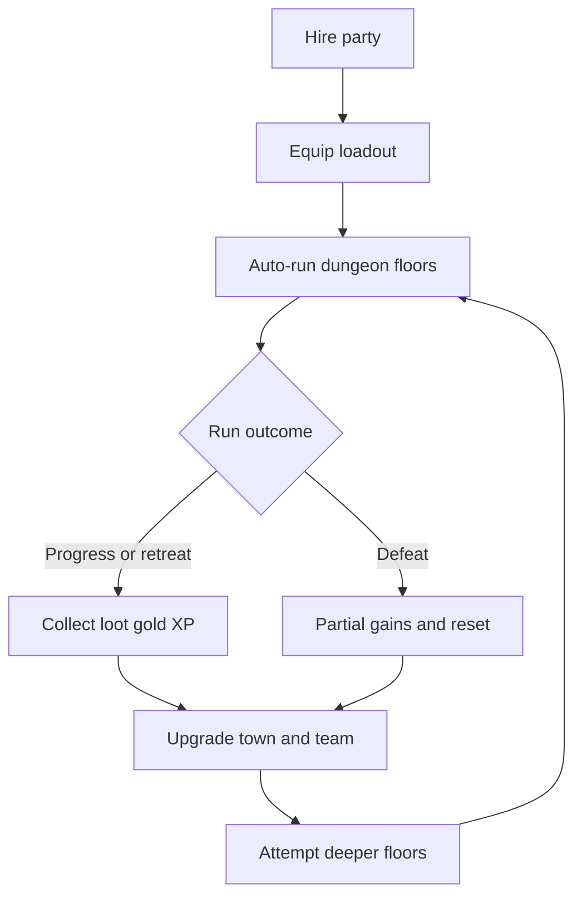

### Sources

- Official: https://www.sodadungeon.com/
- Studio/publisher references: https://armorgamesstudios.com/

---

## 6) Soda Dungeon 2

### Why this loop works

- Keeps the quick idle loop but adds stronger meta systems and team expression.
- Better automation lowers mechanical fatigue.
- Sequel refinement preserves familiarity for returning players.

### Core gameplay loop

1. Build initial roster and class composition.
2. Configure gear and skill usage preferences.
3. Run auto-combat dungeon pushes.
4. Collect resources, class unlocks, and crafting materials.
5. Improve town facilities and production.
6. Optimize automation and strategy scripts.
7. Re-enter deeper and harder layers.

### Retention design pattern

- Automation progression becomes a meta-game itself, turning optimization into long-term mastery.

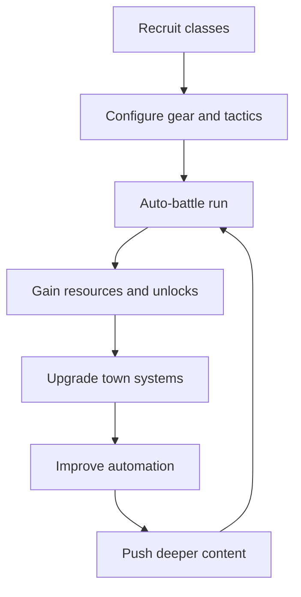

### Sources

- Official: https://www.sodadungeon.com/
- Platform listings (Steam/App stores): Soda Dungeon 2 product pages

---

## 7) Shattered Pixel Dungeon

### Why this loop works

- Dense tactical decisions in very small turn windows.
- Permadeath creates real stakes.
- Continuous updates keep strategy meta fresh.

### Core gameplay loop

1. Select hero class and challenge setup.
2. Explore procedurally generated floor.
3. Resolve turn-based grid combat and traps.
4. Gather and identify items and gear.
5. Manage scarce resources (health, utility, positioning).
6. Defeat floor boss and descend or die.
7. Start a new run with learned mastery.

### Retention design pattern

- Skill-based replayability where player knowledge is the strongest permanent progression.

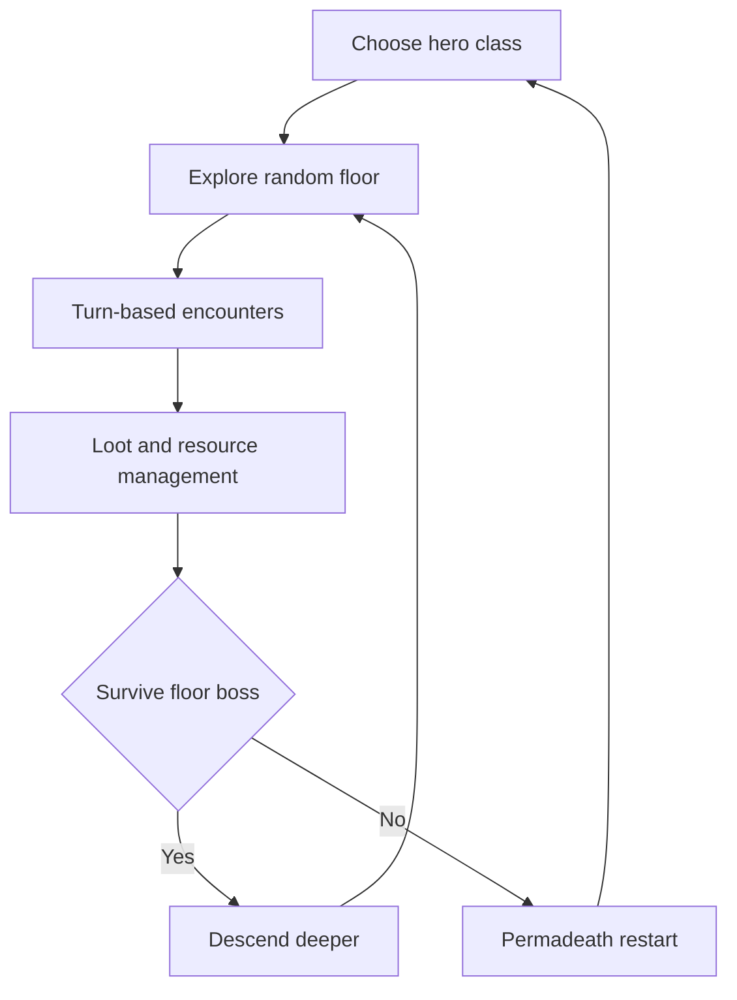

### Sources

- Official: https://shatteredpixel.com/shatteredpd/
- GitHub (active development): https://github.com/00-Evan/shattered-pixel-dungeon

---

## 8) Orna: The GPS RPG

### Why this loop works

- It ties RPG progression to real-world movement.
- Session variety (world map, gauntlets, raids, PvP) reduces monotony.
- Class specialization and kingdom systems provide social midgame and endgame goals.

### Core gameplay loop

1. Move physically to discover map content.
2. Trigger monster or dungeon encounters.
3. Execute turn-based combat.
4. Gain XP, currency, materials, and gear.
5. Upgrade class path, skills, and equipment.
6. Participate in kingdom and raid content.
7. Return to exploration for stronger encounters.

### Retention design pattern

- Location-driven content discovery plus social competition sustains long-term engagement.

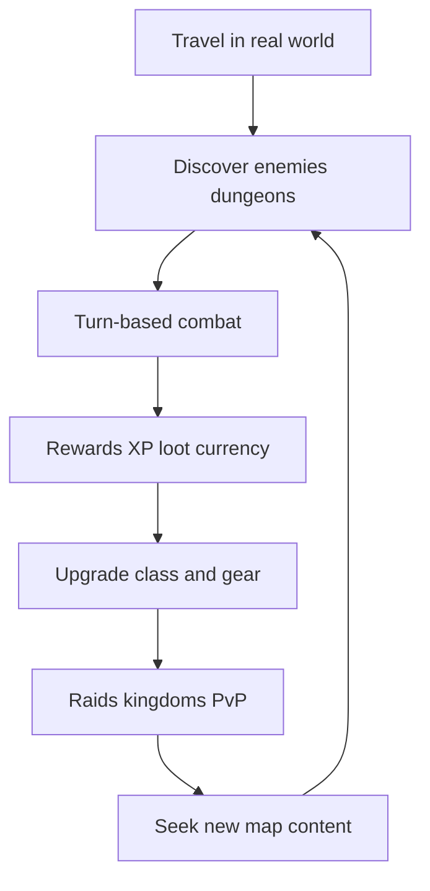

### Sources

- Official: https://playorna.com/
- Company and game listings: https://northernforge.com/

---

## 9) SimpleMMO

### Why this loop works

- Extremely short action loops make it compatible with micro-sessions.
- Text-forward design keeps cognitive load low.
- Guild and social activity adds persistent motivation beyond solo grind.

### Core gameplay loop

1. Perform quick world travel steps.
2. Trigger random event, battle, or reward node.
3. Resolve interaction and collect gains.
4. Improve gear, professions, and stats.
5. Complete quests and community tasks.
6. Join guild activities and events.
7. Re-enter step loop for incremental growth.

### Retention design pattern

- Very low time-to-reward creates repeated daily engagement and low churn for busy users.

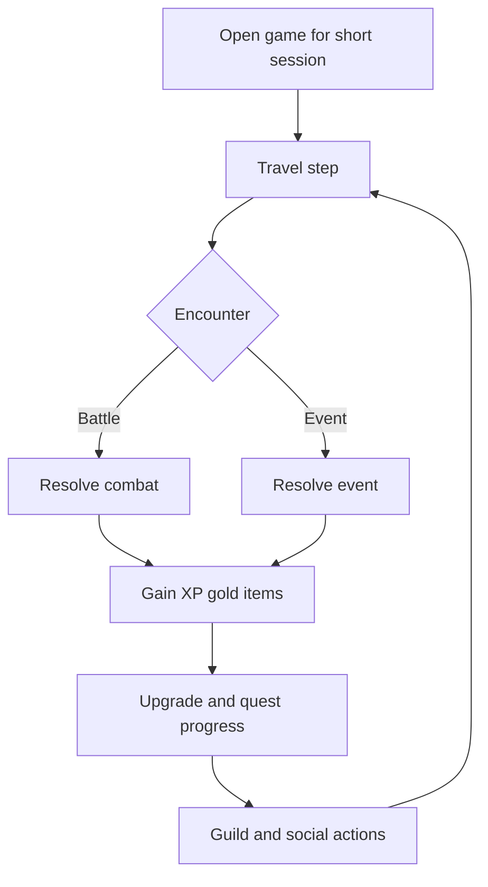

### Sources

- Official: https://www.simplemmo.com/
- Community documentation: https://simplemmo.fandom.com/wiki/SimpleMMO_Wiki

---

## 10) A Dark Room

### Why this loop works

- The game repeatedly reframes goals while preserving core resource tension.
- Minimal text UI amplifies mystery and player imagination.
- Progression transforms from idle survival to exploration and narrative revelation.

### Core gameplay loop

1. Start with a minimal survival interaction loop.
2. Gather resources and expand settlement actions.
3. Unlock expeditions and map exploration.
4. Enter risky encounters for rare materials.
5. Return and reinvest into infrastructure.
6. Discover new system layer and objective.
7. Push into late-game narrative climax.

### Retention design pattern

- Structural surprise: each unlocked layer renews curiosity and resets player motivation.

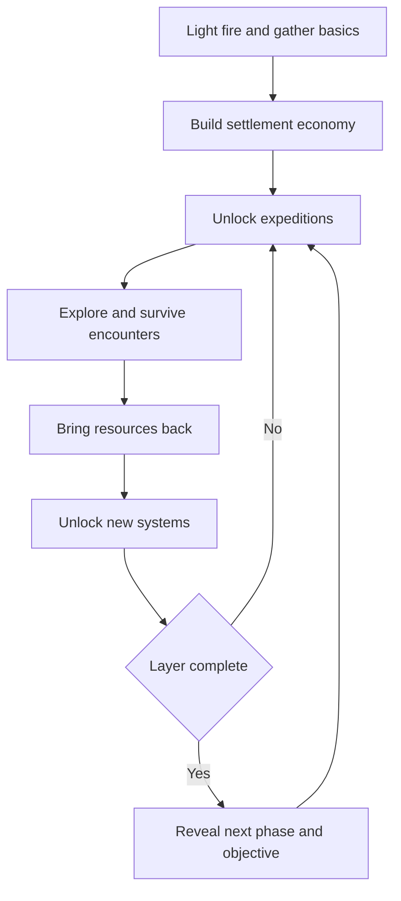

### Sources

- Official web version: https://adarkroom.doublespeakgames.com/
- Overview: https://en.wikipedia.org/wiki/A_Dark_Room

---

## 11) Bit Heroes

### Why this loop works

- Pixel style plus broad platform support keeps barrier to entry low.
- Familiar collection and gear chase provide continuous goals.
- Guild raids and PvP extend endgame stickiness.

### Core gameplay loop

1. Select objective zone and party setup.
2. Run turn-based-lite battles.
3. Collect gear, crafting items, and familiars.
4. Upgrade build and team composition.
5. Progress dungeon tiers and challenge content.
6. Engage in guild raids and PvP cycles.
7. Repeat with stronger targets and seasonal updates.

### Retention design pattern

- Collection loop layered onto progression loop increases reasons to keep running content.

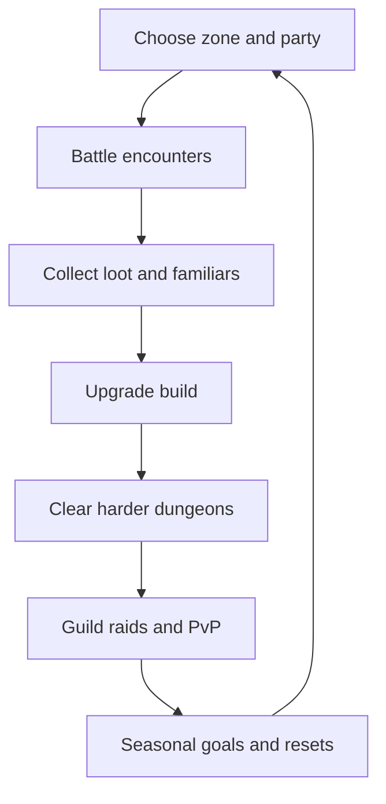

### Sources

- Official: https://www.bitheroes.com/
- Overview: https://en.wikipedia.org/wiki/Bit_Heroes

---

## 12) Darkest Dungeon series

### Why this loop works

- The series fuses tactical turn-based combat with psychological pressure management.
- Resource economics and hero attrition make every expedition decision meaningful.
- Repetition stays engaging because stress and relationship states reshape future runs.

### Darkest Dungeon (2016) core gameplay loop

1. Recruit and roster heroes in the Hamlet.
2. Upgrade town services, gear, and hero readiness.
3. Provision a four-hero expedition.
4. Delve dungeons, fight encounters, and manage stress.
5. Extract with loot or lose heroes to permadeath.
6. Spend rewards on treatment, upgrades, and new recruits.
7. Re-enter harder expeditions and boss objectives.

### Darkest Dungeon II (2023) core gameplay loop

1. Assemble party and route through stagecoach map choices.
2. Resolve road encounters and node events.
3. Fight turn-based battles with rank positioning.
4. Manage stress, meltdowns, and inter-hero relationships.
5. Recover and tune party at inns.
6. Push toward the mountain confession objective.
7. Convert run progression into profile/meta unlocks.
8. Start next run with stronger strategic options.

### Retention design pattern

- Layered tension loop: combat risk, stress risk, and long-horizon roster/meta progression.
- Failure remains productive because losses produce future strategic adaptation.

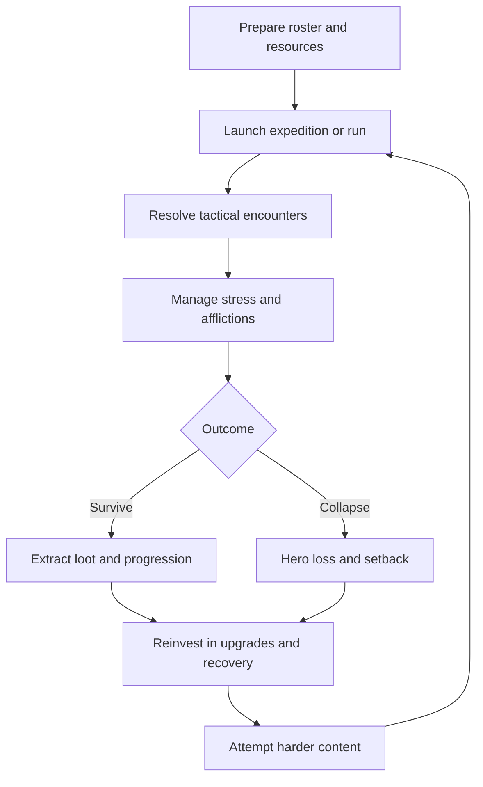

### Sources

- Darkest Dungeon overview: https://en.wikipedia.org/wiki/Darkest_Dungeon
- Darkest Dungeon II overview: https://en.wikipedia.org/wiki/Darkest_Dungeon_II
- Darkest Dungeon store page: https://store.steampowered.com/app/262060/
- Darkest Dungeon II store page: https://store.steampowered.com/app/1940340/

---

## Cross-game loop patterns relevant to this project

Across the researched set, the most repeatable high-performance loop patterns are:

1. Fast re-entry loop: run restart or next objective in 1-3 taps.
2. Strong risk/reward branch: safer banking path vs greed path.
3. Meta progression outside combat: town, class unlocks, economy, social status.
4. Controlled session pacing: daily energy, short runs, or capped complexity per session.
5. Build expression: meaningful choices in class/deck/loadout that alter strategy, not just numbers.

---

## Current app gameplay loop (implemented)

This section reflects currently implemented flow in code (not aspirational docs).

### Evidence anchors in code

- Navigation and route graph: `src/navigation/AppNavigator.tsx`
- Hub run entry and resume: `src/screens/Hub/HubScreen.tsx`
- Prologue to class flow: `src/screens/OnboardingNarrative/OnboardingNarrativeScreen.tsx`
- Class start flow: `src/screens/ClassSelect/ClassSelectScreen.tsx`
- Combat execution and submit transition: `src/screens/Battle/BattleScreen.tsx`
- Reward, vault, and run settlement: `src/screens/RewardResolution/RewardResolutionScreen.tsx`
- Authoritative run state machine: `src/stores/runStore.ts`
- Stage map and checkpoint markers: `src/screens/RunMap/RunMapScreen.tsx`

### Current loop narrative

1. App opens and passes through auth gate.
2. Player lands in Hub.
3. If no active run: Start New Run -> Onboarding Narrative -> Class Select.
4. Class Select begins run and enters Battle.
5. Battle executes CT-based stage encounter.
6. Stage outcome is submitted to run store/backend.
7. Reward Resolution shows banked and vaulted rewards and narrative milestone.
8. If checkpoint decision is active, player chooses Vault Now or Press On.
9. Player returns to Hub (resume path) or back to Battle.
10. Player can end run and settle progression.
11. Progression delta applies, then Play Again returns to Hub.

### Current loop flowchart

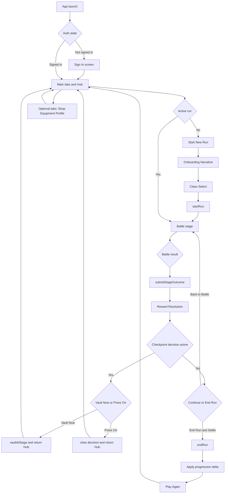

### Current app economy-only loop

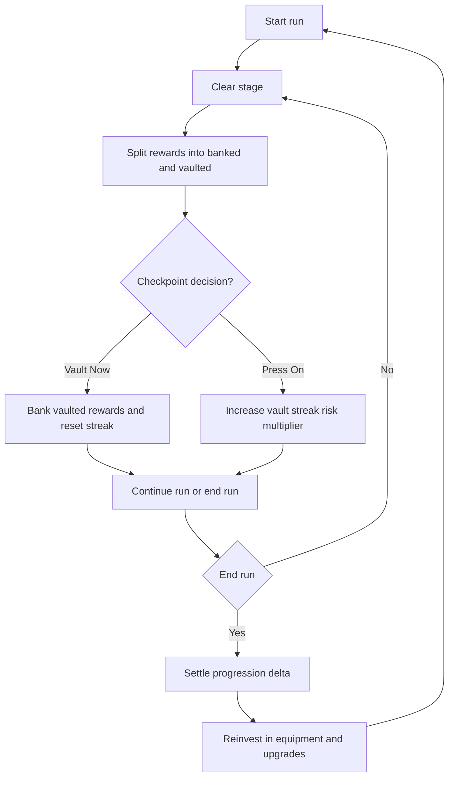

### Current app combat-only loop

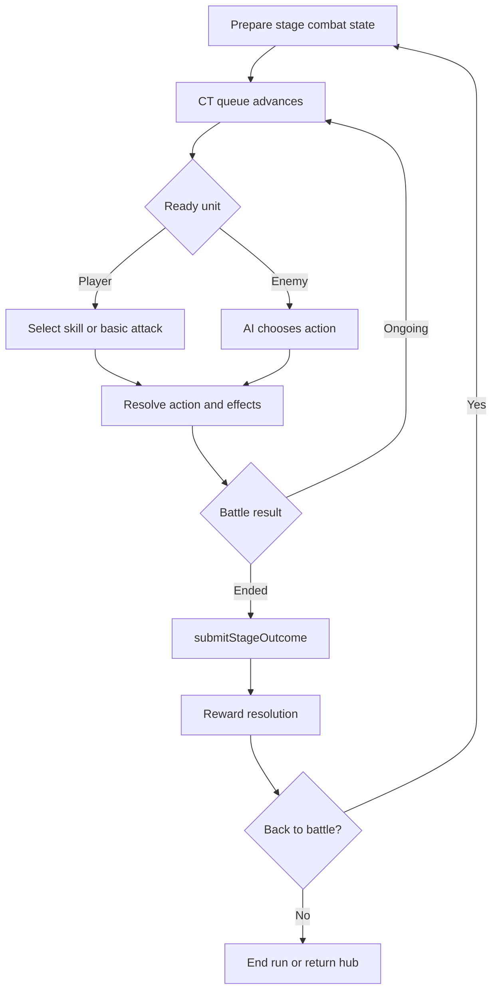

### Current loop strengths

- Clear run-state lifecycle (`startRun`, `submitStageOutcome`, `vaultAtStage`, `endRun`).
- Risk banking model already present and legible in Reward Resolution.
- Good high-level route separation between Hub, Battle, and post-battle flow.

### Current loop friction points

- Hub bounce after reward decisions introduces extra navigation friction.
- Vault semantics (banked vs vaulted vs streak multiplier) may remain cognitively heavy for new players.
- Tactical intent visibility in combat can still be improved (especially for readiness and consequence preview).

---

## Economy-only diagram layer (all researched games)

### Agonia Lands economy-only loop

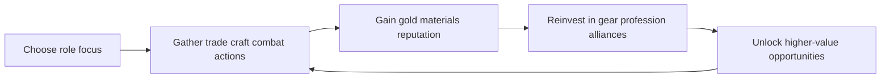

### Knights of Pen and Paper economy-only loop

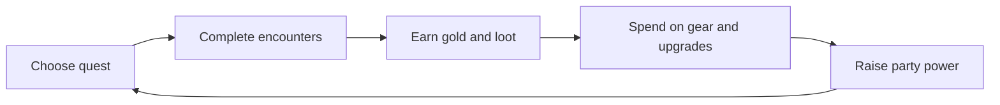

### Kingdom of Loathing economy-only loop

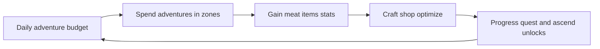

### Slay the Spire economy-only loop

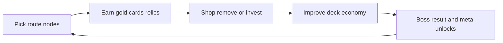

### Soda Dungeon economy-only loop

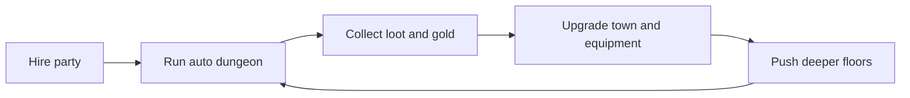

### Soda Dungeon 2 economy-only loop

```mermaid
flowchart LR
	A[Recruit classes] --> B[Automated dungeon runs]
	B --> C[Gain resources and materials]
	C --> D[Upgrade town and automation]
	D --> E[Access harder content]
	E --> B
```

### Shattered Pixel Dungeon economy-only loop

```mermaid
flowchart LR
	A[Start run inventory] --> B[Acquire loot and consumables]
	B --> C[Allocate scarce resources]
	C --> D[Descend for higher value loot]
	D --> E{Run survives}
	E -->|Yes| B
	E -->|No| F[Permadeath reset with player knowledge]
	F --> A
```

### Orna economy-only loop

```mermaid
flowchart LR
	A[Explore map] --> B[Complete encounters]
	B --> C[Gain gold orns gear]
	C --> D[Upgrade class and equipment]
	D --> E[Unlock stronger regions raids]
	E --> B
```

### SimpleMMO economy-only loop

```mermaid
flowchart LR
	A[Take micro action] --> B[Receive event rewards]
	B --> C[Gain gold XP items]
	C --> D[Invest in gear professions guild]
	D --> E[Unlock better tasks]
	E --> B
```

### A Dark Room economy-only loop

```mermaid
flowchart LR
	A[Gather basic resources] --> B[Build settlement structures]
	B --> C[Unlock expeditions]
	C --> D[Return with rare resources]
	D --> E[Expand production and systems]
	E --> C
```

### Bit Heroes economy-only loop

```mermaid
flowchart LR
	A[Choose dungeon tier] --> B[Clear encounters]
	B --> C[Collect gear and familiars]
	C --> D[Upgrade enchant and optimize]
	D --> E[Enter harder dungeons and raids]
	E --> B
```

### Darkest Dungeon series economy-only loop

```mermaid
flowchart LR
	A[Provision roster and supplies] --> B[Run expedition]
	B --> C[Extract loot and heirlooms]
	C --> D[Pay treatment and upgrades]
	D --> E[Strengthen roster and town]
	E --> B
```

---

## Combat-only diagram layer (all researched games)

### Agonia Lands combat-only loop

```mermaid
flowchart LR
	A[Encounter begins] --> B[Choose combat action]
	B --> C[Resolve attack or defense]
	C --> D[Update HP and status]
	D --> E{Fight ends}
	E -->|No| B
	E -->|Yes| F[Loot retreat or defeat]
```

### Knights of Pen and Paper combat-only loop

```mermaid
flowchart LR
	A[Turn-based encounter] --> B[Party turn ability use]
	B --> C[Enemy turn response]
	C --> D[Apply damage and status]
	D --> E{Victory or loss}
	E -->|Continue| B
	E -->|End| F[Resolve rewards or recovery]
```

### Kingdom of Loathing combat-only loop

```mermaid
flowchart LR
	A[Text encounter starts] --> B[Select fight skill item]
	B --> C[Text combat resolution]
	C --> D[HP and resource update]
	D --> E{Encounter complete}
	E -->|No| B
	E -->|Yes| F[Gain rewards or retreat]
```

### Slay the Spire combat-only loop

```mermaid
flowchart LR
	A[Draw hand] --> B[Spend energy on cards]
	B --> C[Enemy intent resolves]
	C --> D[Block damage status update]
	D --> E{Combat outcome}
	E -->|Ongoing| A
	E -->|Ended| F[Rewards or run loss]
```

### Soda Dungeon combat-only loop

```mermaid
flowchart LR
	A[Auto battle tick] --> B[Party actions resolve]
	B --> C[Enemy actions resolve]
	C --> D[HP checks]
	D --> E{Floor cleared}
	E -->|No| A
	E -->|Yes| F[Advance or exit]
```

### Soda Dungeon 2 combat-only loop

```mermaid
flowchart LR
	A[Scripted auto combat] --> B[Class actions trigger]
	B --> C[Enemy phase]
	C --> D[Status and HP update]
	D --> E{Run continues}
	E -->|Yes| A
	E -->|No| F[Rewards and reset]
```

### Shattered Pixel Dungeon combat-only loop

```mermaid
flowchart LR
	A[Turn starts on grid] --> B[Move attack or item]
	B --> C[Enemy turn executes]
	C --> D[Health and utility update]
	D --> E{Encounter state}
	E -->|Ongoing| A
	E -->|Ended| F[Loot or death]
```

### Orna combat-only loop

```mermaid
flowchart LR
	A[Encounter trigger] --> B[Choose skill spell item]
	B --> C[Enemy action]
	C --> D[Resolve damage and effects]
	D --> E{Battle complete}
	E -->|No| B
	E -->|Yes| F[Rewards defeat or flee]
```

### SimpleMMO combat-only loop

```mermaid
flowchart LR
	A[Quick encounter] --> B[Choose attack or action]
	B --> C[Resolve lightweight combat]
	C --> D[Update HP and rewards]
	D --> E{Continue encounter}
	E -->|Yes| B
	E -->|No| F[Return to world step]
```

### A Dark Room combat-only loop

```mermaid
flowchart LR
	A[Expedition encounter] --> B[Pick action and resource use]
	B --> C[Resolve damage and loot]
	C --> D{Survival check}
	D -->|Survive| E[Continue expedition]
	D -->|Fail| F[Collapse or retreat]
	E --> A
```

### Bit Heroes combat-only loop

```mermaid
flowchart LR
	A[Party battle starts] --> B[Team abilities resolve]
	B --> C[Enemy wave actions]
	C --> D[HP status and turn update]
	D --> E{Wave complete}
	E -->|No| B
	E -->|Yes| F[Next wave or rewards]
```

### Darkest Dungeon series combat-only loop

```mermaid
flowchart LR
	A[Battle with rank positions] --> B[Choose skill with rank constraints]
	B --> C[Enemy action and stress effects]
	C --> D[Damage stress affliction checks]
	D --> E{Combat state}
	E -->|Ongoing| B
	E -->|Ended| F[Victory retreat or wipe]
```

---

## Improvement points for current game app

Prioritization scale:

- Impact: High / Medium / Low
- Effort: S / M / L

### Priority roadmap table

| Priority | Area | Improvement | Why it matters | Impact | Effort |
| --- | --- | --- | --- | --- | --- |
| P0 | Core loop pacing | Add one-tap Continue path from Reward Resolution directly to next Battle when no decision is pending | Reduces navigation friction and keeps momentum high | High | S |
| P0 | Onboarding UX | Add a first-run interactive loop explainer for Banked vs Vaulted vs Streak | Clarifies core economy in first 2 minutes | High | S |
| P0 | Combat readability | Add explicit turn forecast panel (next 3-5 CT actors with intent icon) | Players can plan and feel more in control | High | M |
| P1 | Progression economy | Add post-run breakdown screen with source attribution per reward stream | Makes progression feel fair and transparent | High | M |
| P1 | Retention systems | Introduce daily and weekly objective track tied to existing loop actions | Adds return cadence without redesigning core systems | High | M |
| P1 | Loop pacing | Reduce Hub round-trips on Press On by supporting direct stage advance option | Preserves flow for engaged players | Medium | M |
| P1 | Onboarding UX | Contextual tips triggered only on first occurrence of key events (first vault, first forfeit, first checkpoint) | Low-noise teaching beats at right moments | Medium | S |
| P2 | Combat depth | Add enemy intent classes (Burst, Sustain, Control) visible before action | Improves strategic readability and counterplay | Medium | M |
| P2 | Progression economy | Add soft pity and floor guarantees for key progression materials | Smooths bad luck streaks and churn risk | Medium | M |
| P2 | Retention and replay | Add run mutators with score multipliers and leaderboard slices | Expands replayability using existing combat pipeline | Medium | L |
| P2 | Content scalability | Build data-driven encounter templates with reusable tags and constraints | Speeds content production and balancing | High | L |
| P3 | Social retention | Add async comparison ghosts and seed challenges | Adds competition without real-time multiplayer complexity | Medium | L |

---

## Recommended phased rollout

### Phase 1 (next 2 sprints): clarity and momentum

1. Direct Continue path from Reward Resolution to Battle when allowed.
2. First-run economy explainer (Banked/Vaulted/Streak).
3. Lightweight CT forecast strip in Battle.
4. Contextual first-time tips.

Expected outcome:

- Better first-session comprehension.
- Lower drop-off between first battle and second battle.

### Phase 2 (following 2-4 sprints): retention and economy trust

1. Daily and weekly objective layer.
2. Post-run reward attribution ledger.
3. Soft pity/floor guarantees for progression materials.

Expected outcome:

- Higher D7 retention.
- Improved player perception of fairness.

### Phase 3 (longer-term): replay and content scaling

1. Mutators and score multipliers.
2. Data-driven encounter authoring pipeline.
3. Async challenge loops.

Expected outcome:

- Higher long-term replayability.
- Lower content production bottlenecks.

---

## KPI suggestions tied to improvements

Track these before and after rollout:

1. First-session completion rate (start run -> finish stage 3).
2. Time-to-second-run (from first run end to next run start).
3. Checkpoint decision distribution (Vault vs Press On).
4. Forfeit rate by stage band.
5. D1 and D7 retention.
6. Mean run depth and run restart interval.

---

## Source appendix

Primary sources used for gameplay loop research:

- Agonia Lands: https://www.agonialands.com/ , https://www.agonialands.com/hydre/guide/tenthings.php
- Knights of Pen and Paper: https://www.paradoxinteractive.com/games/knights-of-pen-and-paper , https://en.wikipedia.org/wiki/Knights_of_Pen_%26_Paper
- Kingdom of Loathing: https://www.kingdomofloathing.com/ , https://en.wikipedia.org/wiki/Kingdom_of_Loathing
- Slay the Spire: https://www.megacrit.com/ , https://en.wikipedia.org/wiki/Slay_the_Spire
- Soda Dungeon: https://www.sodadungeon.com/ , https://armorgamesstudios.com/
- Soda Dungeon 2: https://www.sodadungeon.com/
- Shattered Pixel Dungeon: https://shatteredpixel.com/shatteredpd/ , https://github.com/00-Evan/shattered-pixel-dungeon
- Orna: https://playorna.com/ , https://northernforge.com/
- SimpleMMO: https://www.simplemmo.com/ , https://simplemmo.fandom.com/wiki/SimpleMMO_Wiki
- A Dark Room: https://adarkroom.doublespeakgames.com/ , https://en.wikipedia.org/wiki/A_Dark_Room
- Bit Heroes: https://www.bitheroes.com/ , https://en.wikipedia.org/wiki/Bit_Heroes
- Darkest Dungeon: https://en.wikipedia.org/wiki/Darkest_Dungeon , https://store.steampowered.com/app/262060/
- Darkest Dungeon II: https://en.wikipedia.org/wiki/Darkest_Dungeon_II , https://store.steampowered.com/app/1940340/

Implementation evidence sources for current app loop:

- `src/navigation/AppNavigator.tsx`
- `src/screens/Hub/HubScreen.tsx`
- `src/screens/OnboardingNarrative/OnboardingNarrativeScreen.tsx`
- `src/screens/ClassSelect/ClassSelectScreen.tsx`
- `src/screens/Battle/BattleScreen.tsx`
- `src/screens/RewardResolution/RewardResolutionScreen.tsx`
- `src/stores/runStore.ts`
- `src/screens/RunMap/RunMapScreen.tsx`

